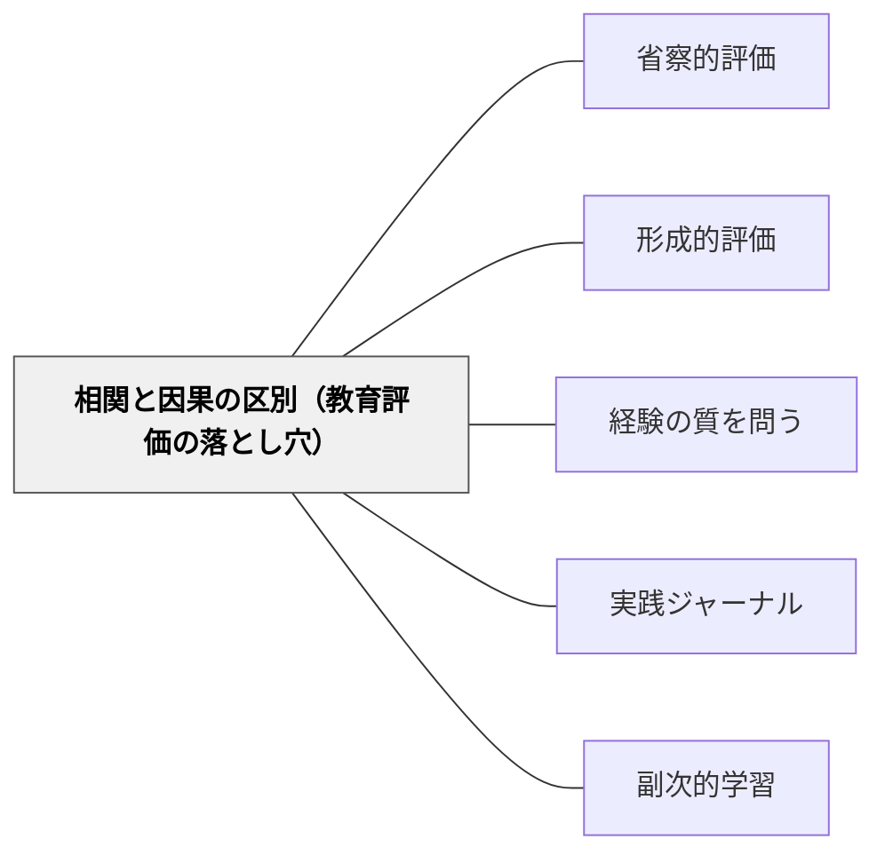

# 相関と因果の区別（教育評価の落とし穴）

> 「介入した子が伸びた」は因果ではなく相関かもしれない——そして、その区別を意識することから、より誠実な実践の評価が始まる。

## [Pattern Connection]

### 林岳彦（2023）——統計的因果推論：教育実践評価の哲学的根拠

ヴァルター・ベンヤミンが「語り得る経験（Erfahrung）」と「断片的体験（Erlebnis）」を区別したように、統計的因果推論は「本当の効果（因果）」と「一緒に起きただけ（相関）」を根本的に区別する。

**相関と因果の構造的な違い：**

> 「相関には方向性がなく、因果には方向性がある」——林岳彦（2023）

| 次元 | 相関 | 因果 |
|---|---|---|
| 方向性 | なし（双方向） | あり（AがBを引き起こす） |
| 第三因子 | 交絡変数により擬似相関が生じる | 介入による特定効果 |
| 教育での問い | 「A児の読解力と算数成績は相関している」 | 「読解力の向上が算数成績を上げたのか」 |

**因果推論の根本問題（The Fundamental Problem of Causal Inference）：**

> 「同一個体について『処置T=なし』と『処置T=あり』のデータは同時には観測できないので、個体の因果効果は算出できない」——林岳彦（2023）

これは哲学的な問題でなく実践的な限界：
- 「A児に個別指導を行った結果」と「行わなかった結果」を同時に比較できない
- 観測されない側が「反事実（counterfactual）」——A児についての因果効果は原理的に直接測定できない

**選択バイアス——教師が特に注意すべき構造：**

教育現場の典型的な選択バイアス：

| 介入の選び方 | 生じるバイアスの方向 |
|---|---|
| 「伸びやすそうな子」に多く介入 | 介入の効果を過大評価する |
| 「最も困っている子」に多く介入 | 介入の効果を過小評価する（底打ち効果混入） |
| 「関係の良い子」に多く介入 | 効果が関係性の質に帰属できず歪む |

同じ理由が、「うまくいった授業では○○の方法を使っていた」という観察からも生じる——うまくいく素地があったからその方法を使えたのかもしれない。

- **既存パタンとの関連**：[[メタパタン/反事実（因果推論）]] が「もしなかったら？」という問いを示すのに対し、本パタンは「なぜ一緒に起きただけでは因果とは言えないか」の構造的な説明を提供する
- **補強された点**：[[メタパタン/反事実（因果推論）]] がパールの「因果のはしご」を軸にするのに対し、本パタンはルービンの「潜在結果モデル」と「根本問題」を追加し、教育実践評価における選択バイアスの具体的な構造を示す
- **他のパタンへの波及**：[[パタン/省察的評価]] — 「本当に効果があったか」を因果的に問う省察の深化；[[パタン/形成的評価]] — 形成的フィードバックの効果を問うときの謙虚さ

---

## 背景（Context）

教師は日々「この指導が効いた」「あの実践が成果を出した」という判断をしている。しかしその判断の多くは、相関（一緒に起きた）を因果（それが原因）と混同している可能性がある。

因果推論の観点から言えば、教育実践の評価は本質的に困難だ。「介入した子が伸びた」という観察には、少なくとも三つの可能性が混在している：

1. 介入が本当に伸びを引き起こした（因果）
2. 伸びやすい子に介入したから、そもそも伸びた（選択バイアス）
3. 介入のタイミングがたまたま「自然に伸びる時期」と重なった（時系列混同）

この三つを区別せずに「介入が効いた」と結論づけることは、実践知を積み上げるうえで誤った方向に進む危険がある。

## 問題（Problem）

相関を因果と混同した実践評価を積み重ねると、「本当に効果のある指導」と「たまたま成功しただけの指導」を区別できなくなる。

- 「うまくいった授業」の成功要因を誤って特定し、それを繰り返す
- 効果のない介入を「効果がある」と信じ続ける
- 「伸びた」理由が子どもの側にある（発達・家庭・時期）のに教師の側に帰属する
- パタンの検証が「感触」のみに留まり、精度が上がらない

## 力のかたち（Forces）

- 教師は比較対象を持ちにくい——同じ子に「介入しない」を同時に試せない
- 選択バイアスは自然に発生する——教師が介入を選ぶ時点でバイアスが生まれる
- 「伸びた」という印象が強いほど、因果帰属のエラーが起きやすい
- 反事実を意識しすぎると無力感・過剰な慎重さが生まれる危険がある
- 個別事例での深い観察（ドメイン知識）は、かえって因果関係の錯覚を強化することがある

## 解決（Solution）

**「一緒に起きた」と「引き起こした」を意識的に区別し、評価に謙虚さの余白を持つ。同時に、その謙虚さがドメイン知識（教師の実践的知識）の価値を下げるのではなく、むしろ質的な観察力を研ぎ澄ます動機にする。**

---

**ステップ1：「反事実の問い」を習慣化する**

介入の後に「もしこの介入をしなかったら、この子はどうなっていただろう？」と問う。答えは出ないが、この問い自体が「伸びの原因はどこにあるか」を冷静に検討する姿勢を作る。

- 「A児はこの個別指導で伸びた」→「A児はこの時期、指導なしでも伸びていた可能性はあるか？」
- 「この授業法でクラスの平均が上がった」→「別の授業法でも上がっていた可能性は？」

**ステップ2：「似た子同士で比べる」層別化の視点**

自分のクラスの中でも、「この子と似た特性の子」に同じ介入をしたかどうかを振り返る。

- 「読書が好きな子とそうでない子で、この実践の効果は同じだったか」
- 「家庭のサポートが手厚い子とそうでない子で分けて見ると、効果の見え方は変わるか」

層別化は完璧な比較ではないが、「均質な比較を作ろうとする意識」自体が評価の精度を上げる。

**ステップ3：「平均」と「個人」を区別する**

集団全体の平均効果（ATE）と、特定の子への効果は別物だと意識する。

- 「クラス全体で効果があった（ATE）」≠「A児にも効果があった」
- 逆に「集団研究では効果なし（ATE≈0）」≠「A児には効果なし」
- 「この子はどの種類の子どもか」を考えながら集団レベルの知見を個別に応用する

**ステップ4：ドメイン知識を「因果仮説の土台」として使う**

統計的手法は「どのバックドアパスを仮定するか」という質的知見によって初めて機能する。教師の実践的観察力——「この子はなぜ今伸びているか」という長期的な観察——は、因果ダイアグラムの構造を支える不可欠な知識だ。

> 「現場の人間にしか見えないような想定外の落とし穴がしばしば存在する」——林岳彦（2023）

---

**具体例1：個別指導の評価**

A児に算数の個別指導を週2回行ったところ、1か月後に定期テストが10点上がった。「個別指導が効いた」と言えるか？

反事実の問い：
- A児はこの時期、家庭でも自主的に練習していなかったか？
- 単元が「かけ算→わり算」という個人差が出やすい時期に入ったか？
- 「個別指導を受けた」という自信が得点に影響したのではないか？

これらの可能性を排除できなければ、「個別指導の効果」という因果帰属は留保する必要がある。

**具体例2：新しい授業法の評価**

先学期まではドリル中心、今学期から問題解決型にしたところクラス平均が上がった。「問題解決型授業が効いた」か？

交絡の可能性：
- 先生自身も問題解決型に慣れてきて授業全体の質が上がったかもしれない
- クラスの人間関係が先学期より良くなり、学習への雰囲気が変わったかもしれない
- そのクラスは学年が上がる時期に当たり、認知的に成熟した

「授業法の変更」という処置と「その他の変化」が交絡している。

**具体例3：特別支援での介入評価**

B児に感覚調整の支援を入れたところ、着席時間が伸びた。因果か？

反事実の問い：
- B児はこの時期、環境（座席・隣の子・担任との関係）が同時に変化していないか？
- 着席時間が伸びた原因が「慣れ（習慣化）」か「感覚調整の効果」か区別できるか？

**具体例4：自己教育（数学デイリー）への適用**

岩井自身の数学デイリー実践：「毎日続けたら数学的思考が深まった」は因果か？

- 「続けることと上達の相関」は確認できる
- しかし「続けなくても、週3回でも同じ効果が出たか」という反事実は問えない
- 「毎日やることが効いた」のか「数学に向き合う総時間が増えた」のかを区別するには、比較が必要

この謙虚さは「続ける意味がない」ではなく、「何が本当に効いているかを観察し続ける姿勢」として活かせる。

## 結果（Consequences）

- 「うまくいった」という感触をそのまま「自分の指導が原因」と帰属せず、謙虚に問い直す習慣が育つ
- 「何が本当に効いているか」への問いが実践記録を豊かにし、パタンの質が上がる
- 反面、「何も言えなくなる」過剰な謙虚さに陥る危険がある——実践は進めながら問い続けることが大切
- 「エビデンスを使う」ときも「この研究の文脈は自分のクラスと似ているか（ターゲット妥当性）」を確認する癖がつく
- ドメイン知識（長期観察・文脈理解）が統計的推論の「前提条件」として価値づけられる

## 関連パタン

- [[メタパタン/反事実（因果推論）]] — 「もしなかったら？」という問いがこのパタンの核心操作；Rubin潜在結果モデル・根本問題
- [[メタパタン/アブダクション（仮説形成）]] — 因果仮説を立てる（アブダクション）→反事実で問い直す（因果推論）の循環
- [[パタン/省察的評価]] — 省察に「因果的問い」を加えることで評価の精度が上がる
- [[パタン/形成的評価]] — フィードバックの効果を「本当に効いたか」と因果的に問う
- [[パタン/経験の質を問う]] — 経験の質を問う＋因果的に問うの組み合わせ
- [[パタン/実践ジャーナル]] — 反事実の問いを記録し検証サイクルを回す素材
- [[パタン/副次的学習]] — 意図した因果効果の外側にある副次的な学習効果
- [[文献/はじめての統計的因果推論（林岳彦）]] — 本パタンの主要出典

## クラスター図

## Actionable Insight

- 「A児が伸びた」と感じたとき、「この子はこの介入がなくてもそう伸びたかもしれない——何が伸びの本当の原因か」と3秒間問うことを習慣にする。答えが出なくてよい。問う姿勢が評価の誠実さを支える
- 新しい授業法を試して「うまくいった」と感じたら、「先学期の自分なら同じことを言っただろうか」と比較対象を探してみる——時期・クラスの状態・自分自身の変化という交絡因子が見えてくる
- 集団研究（「この指導法は平均的に効果がある」）の知見を特定の子に使うときは、「この子はその研究の対象と似ているか」を問う一行を実践記録に加えてみる

## 出典

林岳彦（2023）『はじめての統計的因果推論』岩波書店.
→ [[文献/はじめての統計的因果推論（林岳彦）]]

> 「統計解析手法は、あくまで私たちが使うものであって、私たちが使われるものではありません」——林岳彦（2023）

> 「法則性の世界で推定された平均的な傾向が、特定の個体には必ずしも当てはまらないことは普通にありうる」——林岳彦（2023）
