# 省察

> 答えを与えるのではなく、自分自身の経験に問い返す場をつくれ——学習者はすでに知っている、それに気づくだけでいい。

## [Pattern Connection]

Bergin et al.（2012）の *Pedagogical Patterns* における「Reflection」パタンは、成人学習者の自律性と経験知を尊重し、教師を「知識を与える者」から「発見を促す者」へと再定義する。

- **補強点**：[[パタン/メタ認知的モニタリング]] の「自分の理解を観察する」という内的プロセスを、本パタンは「教師のリダイレクト」という外側からのきっかけで引き出す実践として補強する。モニタリングを起こすための教師の言語的・構造的介入を具体的に示している
- **拡張点**：「成人は有能さに基づいて学ぶ（competency-based learner）」という成人学習論（アンドラゴジー）の観点を加える。子どもにも通じる「自分の経験から引き出す」学習観として、教師の役割観を根底から問い直す
- **他のパタンへの波及**：[[パタン/非可視の教師]] への接続——教師がいなくなる（問いを学習者自身に返す）ことの正当性を根拠づける。[[パタン/能動的関与]] における「内省する」という最も深い能動的関与の形

### ヘルバルト（1806）教育学綱要統合——「教師もまた絶えず学び続ける」という省察の定式化

ヘルバルトは評価論の章（§117）で、省察を教師の核心的徳として明示した。

> 「教師もまた絶えず学び続けねばならない。児童の反応や成長の様態を注意深く観察し、教授方法や教材内容を不断に改善していく謙虚さと柔軟さこそが、真の教育者の核心である。」（§117）

- **省察の認識論的根拠**：ヘルバルトは教授の評価基準を「知識量の測定ではなく、精神活動の深さ・広がり・統合の度合い」（§113）とした。この評価基準の設定が、教師の省察の方向性を決める——「何を観察し、何を問い返すか」の基準である。
- **「観察力」としての省察**：ヘルバルトは教授においても「独立した観察を養えば、児童は自己と他者の報告を照合し誤りを正すようになる」（§84）と述べた。教師の省察も同じ構造——「自分の教授が何をもたらしたか」を観察し、事実から評価する。
- **牧口の「認識先行の省察」との接続**：牧口が示した「評価作用を先行させず認識を先に引き出す」（省察の技法）は、ヘルバルトの「教師は児童の反応を注意深く観察する」という定式と同じ方向を指す。評価（良し悪し）より事実の観察が先に来る。
- **波及するパタン**：[[パタン/省察的評価]] — 省察と評価の統合；[[文献/教育学綱要（ヘルバルト）]] — 本統合の出典

---

### プラトン『メノン』（前387年頃）——ソクラテスの省察：「知らないことを知る」という自己認識の実践

プラトン『メノン』は、省察の最も古い実演を含む。ソクラテス自身の「無知の知」と、少年の問答における「アポリア→自己発見」の構造が、省察の二層を示している。

**ソクラテスの「知らないことを知る」省察（71a〜e）：**
ソクラテスはメノンに「徳とは何か」を問われたとき、「徳がどんなものかを知らないでいる」と答える。これは謙遜でなく、問いを真剣に扱うために先行する省察——「自分は何を知っていると思っているか、それは本当か」の問い返し。

> 「わたしはそもそも、徳がどんなものかをまったく知らないでいる……それ自身が何であるかを知らないなら、そのことについてどうあるかを知るのはむずかしい。」（71b）

これは牧口が指摘した「認識先行の省察」（評価を保留して事実を先に見る）と同じ構造——答えを決めた上で省察するのでなく、「自分がわかっていないこと」を先に認識する。

**少年の問答における省察の三段階（82a〜86b）：**
1. 「知っているつもり」の状態（偽の自信）——省察なし
2. アポリア「わからない」——「自分の知識の限界」への気づき（省察の始まり）
3. 問い続けた後の自己発見——真の省察が知識（エピステーメー）を生む

**補強点**：既存のBergin et al.（2012）・ヘルバルト（1806）・牧口（1930）・カント（1788）の省察論に、ソクラテスの「知らないことを知る」という自己認識の実践という哲学的原点が加わる。「評価を保留して認識から入る」（牧口）と「まず自分が何を知らないかを問う」（ソクラテス）は同じ省察の向きを持つ。

**波及するパタン**：[[パタン/無知の知]] — ソクラテスの省察実践の起点；[[パタン/アポリアの設計]] — 少年の問答がアポリアを通じた省察の実演；[[文献/メノン（プラトン）]] — 本統合の出典

---

### プラトン『テアイテトス』（前369年頃）——吟味（バサニゼイン）：思考の真偽を問い返す省察の技術（150b〜c）

『テアイテトス』は、産婆術の核心として「吟味（バサニゼイン）」を位置づける。これは省察の技術を外側（教師が学習者を吟味する）と内側（自分自身の思考を吟味する）の両方で読める。

> 「わたしがおこなっている助産の技術には……最大の特徴として……若者の思考がみかけだけのもので虚偽を生み出しているのか、それとも、実質のある真正なものを生み出しているのかを、あらゆる仕方で吟味することができる。」（150b〜c）

**吟味（バサニゼイン）の省察的構造：**

| 吟味の方向 | 内容 |
|---|---|
| 教師が学習者を吟味する | 「あなたの考えは本物か偽物か」を問い返す——省察を引き出す外側の力 |
| 学習者が自分を吟味する | 「自分の考えは見かけだけではないか」を問い返す——省察の内側への転化 |

**牧口の「認識先行の省察」との接続：**
牧口が「評価作用を先行させず認識を先に行う」と言うとき、その「認識を先に行う」対象は「自分の思考が本物かどうか」の見極めである——これは吟味（バサニゼイン）と同じ方向を指す。「良かった・悪かった」という評価の前に「これは本当のことか」という吟味が先に来る。

**補強点**：省察パタンに「吟味（バサニゼイン）」という操作的概念が加わる——省察は「経験を振り返る」という一般的な活動だが、吟味は「自分の考えが真正か虚偽かを判別する」という具体的な精神操作として定義できる。

**波及するパタン**：[[パタン/産婆役としての教師]] — 吟味は産婆役の中核技術；[[パタン/エピステーメーとドクサ（知識と正しい考え）]] — 吟味するのは「ドクサ」か「エピステーメー」かの境界；[[パタン/タウマゼイン（驚きから始まる探究）]] — タウマゼインの後に来る「本当にそうか？」という吟味が省察の始まり；[[文献/テアイテトス（プラトン）]] — 本統合の出典

---

### 牧口常三郎（1930）——認識先行としての省察：評価作用の抑制

牧口は *創価教育学体系 第4巻*（教育技術論）において、研究・観察・省察において評価作用が認識作用に先立つことの弊害を論じた。これは省察（Reflection）の実践において見落とされがちな具体的障害を特定したものである。

**「評価先行」が省察を歪める**

省察の本来の目的は「何が起きたかを正確に把握し（認識）、その意味を問う（評価）」という順序にある。しかし日常では「良かった・悪かった」「あの子はやる気がない・あの授業はうまくいった」という評価が先行し、事実の観察（認識）が歪められる。

牧口が示した省察の条件：

> 「あせりがちの評価作用を意力的に抑圧しておいて、飽くまで冷静着実なる科学的態度を以て臨み...一つ一つの因果関係を見出すことに邁進しなければならぬ。」

これは省察の手順として：
1. 評価（好き嫌い・良悪）を意識的に保留する
2. 事実（何が起きたか・どんな発言があったか）を先に記録する
3. 事実の記録が終わった後で評価・解釈に移る

**「真砂の中から宝玉を拾い出す」**

牧口は授業観察について：

> 「平凡の頭脳には看過されるであろう真砂の中から宝玉を拾い出すことこそ、科学者の尊ぶべき任務である。」

評価先行の省察では「予期した通りのもの（評価を確認するもの）」しか見えない。評価を保留した認識先行の省察では、見落としていた「宝玉」を見つけられる。

**補強点**：省察を「過去の経験に問い返す」という一般的な定義を超えて、「評価作用を先行させず認識を先に行う」という具体的な実践技法として深化させる。

- **他のパタンへの波及**：[[パタン/認識と評価の区別]]（このパタンが省察の技法的前提を提供する）・[[パタン/メタ認知的モニタリング]]（「今どのくらいわかっているか」の問いに評価先行を入れない精度）

**実践理性批判１（中山元訳）統合：**

- **行動原理（Maxime）の省察**：カントの実践理性批判は省察の最も深い形式を与える——「自分は今この状況でどのような行動原理（Maxime）で動いているか」を内側に問い返すことが道徳的省察の出発点。感情・結果・評価（良かった・悪かった）でなく、動機そのもの（「なぜそうしたか」「どんな原理から行動したか」）を問い返す
- **Maxime → 普遍化テストの省察サイクル**：①自分の行動原理を言語化する（「私はこの状況で〇〇する」）→ ②それが普遍的法則として妥当しうるか問う（「全員がこれをしたらどうなるか」）——この二段階が省察と道徳的自律をつなぐ実践的プロセス。牧口の「認識先行」の省察と一致する——評価（良し悪し）を先行させず、まず「自分はどんな原理で動いていたか」という認識を先に引き出す
- **「なすべきだからなしうる（Sollen→Können）」の省察への適用**：「自分はこの場面でどうすべきだったか（Sollen）」を問う省察は、同時に「自分にはそれができる能力があった（Können）」という自由の確認になる——過去の行動を裁くのでなく、自分の可能性（自由）を確かめる省察へ
- **補強するパタン**：[[パタン/道徳的自律]] — 行動原理の省察が道徳的自律の実践的形態。[[文献/実践理性批判１（カント、中山元訳）]] — 本統合の主出典

---

## 背景（Context）

学習者（特に成人）は、すでに豊かな経験・知識・能力を持っている。しかし「授業とは教師から知識を受け取る場だ」という思い込みが強いと、学習者は自分の経験を学習リソースとして使うことをしない。教師が答えを与え続けることで、学習者は「自分には答える力がない」という前提を内面化してしまう。

## 問題（Problem）

学習者は教師がすべての問題を解決してくれると期待する。自分の考えや経験を持ち込まず、受動的に答えを待つ姿勢が強化される。教師が「答えを出す人」であり続けると、学習者は自分の内側にある知性や経験への信頼を失い、「先生が来るまで動けない」状態が固定化される。成人学習者であっても、学習の文化が変わらない限りこの依存は続く。

## 力のかたち（Forces）

- 学習者は教師が知識を届けるものだという文化的期待を持っている
- 経験からの学びは、情報の受容より深い理解と長期的な定着を生む
- 答えを得るより、自分で答えに辿り着く過程が自己効力感を育てる
- 成人は実用的な場面での問題解決を通じて最もよく学ぶ（有能さ基底の学習）
- 教師が問いを返すことは、初期には「教えてくれない」と感じる不満を生むこともある

## 解決（Solution）

**学習者が自分の経験・知性を使って問題を解決できる環境をつくる。教師は答えを与えるのではなく、学習者が自分の中にある答えを引き出す問いを返す。**

「自分で答えを引き出す」仕組みを構造として設計する。

---

**具体例1：問いを学習者に返す**

学習者が「どうすればいいですか？」と聞いてきたとき、教師はすぐに答えずに問いを返す。「あなたが答えを出せるくらい鋭い問いをしているなら、あなたは答えも出せるはずだ（If they're clever enough to ask, they're clever enough to answer）」という姿勢で、自分の考えを先に言語化させてから対話する。

**具体例2：OOPSLA '96 の事例**

1996年のOOPSLAカンファレンスでのワークショップで、チームが見知らぬC++コードのレビューを依頼された。チームはC++の詳細な技術知識がなくても、「良いコードを読んだ経験」「設計の問題に気づく経験」「エンジニアとして蓄積してきた判断力」を使って、そのコードの問題点を見事に指摘した。専門的な技術知識よりも、経験に根ざした省察が力を発揮した事例として本パタンに引用されている。

**具体例3：「今日何を学んだか」を明示的に尋ねる**

授業の終わりに「今日あなたが学んだことは何ですか」「それをどう使いますか」と問う。学習が起きたことを学習者自身が言語化することで、「自分は学んでいる」という実感が生まれ、次の省察への意欲が高まる。学習が目に見えるようになることが、学習者の自信を育てる。

**具体例4：未知への遭遇を経験に繋ぐ**

教師が答えられない問いに直面したとき、「それは私にもわかりません。あなたはどう思いますか？」と返す。知らないことを正直に認め、学習者の経験・推論へと橋を渡す。教師の「知らない」が、学習者の「自分で考えてみる」を生む。

## 結果（Consequences）

- 学習者が自分の経験・知性への信頼を取り戻し、自律的な学習者として育つ
- 教師への依存が減り、学習者が自分で問題に向き合う習慣が育まれる
- メタ認知的な自己観察——「自分は何を学んでいるか」「自分はどう理解しているか」——が活性化する
- 初期には「答えをくれない教師」への不満が出ることもあるが、時間とともに自律性への転換が起きる
- 成人学習者の場合、「自分の学びが成熟した」という実感が学習への動機をさらに高める

## 関連パタン
- [[パタン/アナムネーシス（想起としての学び）]]
- [[パタン/ミソロゴス（言論嫌い）]]
- [[パタン/美の梯子（エロスの道）]]
- [[パタン/コラケイア（おべっか）]]
- [[パタン/計量術（メトレーティケー）]]
- [[パタン/エピステーメーとドクサ（知識と正しい考え）]]
- [[パタン/タウマゼイン（驚きから始まる探究）]] — タウマゼインの後に来る「本当にそうか？」という吟味が省察の始まり
- [[パタン/明瞭化・連合・体系化・方法（四段階教授過程）]]
- [[パタン/善意志（義務に基づいた行動）]]
- [[パタン/啓蒙（自分の理性を使う勇気）]]
- [[パタン/ア・プリオリな枠組み]]
- [[パタン/道徳的自律]]
- [[実践/学習する学校をつくる]]
- [[実践/文学討論グループの設計]]
- [[パタン/チャレンジ理解]]
- [[パタン/ラウンドロビン]]
- [[パタン/教師の三方面修養]]
- [[パタン/自己テスト]]
- [[パタン/自分で探求する]]
- [[パタン/自分の言葉で]]
- [[パタン/誰も完璧ではない]]
- [[パタン/認識と評価の区別]]
- [[パタン/副次的学習]]

- [[パタン/メタ認知的モニタリング]] — 省察はメタ認知の実践的な形
- [[パタン/非可視の教師]] — 学習者自身に問いを返すことが非可視性を実現する
- [[パタン/能動的関与]] — 内省することは最も深い能動的関与の一形態
- [[パタン/不思議を育てる]] — 自分の中の問いと疑念を育てる探究の土壌
- [[パタン/自分に投げかける問い]] — 省察を引き出す問いの設計
- [[パタン/タクト（教育的機転）]] — タクトを磨くのは省察である。経験が省察なしに反復されてもタクトは育たない

## クラスター図

```mermaid
flowchart LR
    ne79c81e5af9f["省察"]
    ne382a2e3838ae383a0e3838de383bce382b7e382b9efbc88e683b3e8b5b7e381a8e38197e381a6e381aee5ada6e381b3efbc89["アナムネーシス（想起としての学び）"]
    ne3839fe382bde383ade382b4e382b9efbc88e8a880e8ab96e5ab8ce38184efbc89["ミソロゴス（言論嫌い）"]
    ne7be8ee381aee6a2afe5ad90efbc88e382a8e383ade382b9e381aee98193efbc89["美の梯子（エロスの道）"]
    ne382b3e383a9e382b1e382a4e382a2efbc88e3818ae381b9e381a3e3818befbc89["コラケイア（おべっか）"]
    ne8a888e9878fe8a193efbc88e383a1e38388e383ace383bce38386e382a3e382b1e383bcefbc89["計量術（メトレーティケー）"]
    ne382a8e38394e382b9e38386e383bce383a1e383bce381a8e38389e382afe382b5efbc88e79fa5e8ad98e381a8e6ada3e38197e38184e88083e38188efbc89["エピステーメーとドクサ（知識と正しい考え）"]
    ne382bfe382a6e3839ee382bce382a4e383b3efbc88e9a99ae3818de3818be38289e5a78be381bee3828be68ea2e7a9b6efbc89["タウマゼイン（驚きから始まる探究）"]
    ne6988ee79eade58c96e383bbe980a3e59088e383bbe4bd93e7b3bbe58c96e383bbe696b9e6b395efbc88e59b9be6aeb5e99a8ee69599e68e88e9818ee7a88befbc89["明瞭化・連合・体系化・方法（四段階教授過程）"]
    ne59684e6848fe5bf97efbc88e7bea9e58b99e381abe59fbae381a5e38184e3819fe8a18ce58b95efbc89["善意志（義務に基づいた行動）"]
    ne59593e89299efbc88e887aae58886e381aee79086e680a7e38292e4bdbfe38186e58b87e6b097efbc89["啓蒙（自分の理性を使う勇気）"]
    ne382a2e383bbe38397e383aae382aae383aae381aae69ea0e7b584e381bf["ア・プリオリな枠組み"]
    ne98193e5beb3e79a84e887aae5be8b["道徳的自律"]
    ne38381e383a3e383ace383b3e382b8e79086e8a7a3["チャレンジ理解"]
    ne383a9e382a6e383b3e38389e383ade38393e383b3["ラウンドロビン"]

    ne79c81e5af9f --- ne382a2e3838ae383a0e3838de383bce382b7e382b9efbc88e683b3e8b5b7e381a8e38197e381a6e381aee5ada6e381b3efbc89
    ne79c81e5af9f --- ne3839fe382bde383ade382b4e382b9efbc88e8a880e8ab96e5ab8ce38184efbc89
    ne79c81e5af9f --- ne7be8ee381aee6a2afe5ad90efbc88e382a8e383ade382b9e381aee98193efbc89
    ne79c81e5af9f --- ne382b3e383a9e382b1e382a4e382a2efbc88e3818ae381b9e381a3e3818befbc89
    ne79c81e5af9f --- ne8a888e9878fe8a193efbc88e383a1e38388e383ace383bce38386e382a3e382b1e383bcefbc89
    ne79c81e5af9f --- ne382a8e38394e382b9e38386e383bce383a1e383bce381a8e38389e382afe382b5efbc88e79fa5e8ad98e381a8e6ada3e38197e38184e88083e38188efbc89
    ne79c81e5af9f --- ne382bfe382a6e3839ee382bce382a4e383b3efbc88e9a99ae3818de3818be38289e5a78be381bee3828be68ea2e7a9b6efbc89
    ne79c81e5af9f --- ne6988ee79eade58c96e383bbe980a3e59088e383bbe4bd93e7b3bbe58c96e383bbe696b9e6b395efbc88e59b9be6aeb5e99a8ee69599e68e88e9818ee7a88befbc89
    ne79c81e5af9f --- ne59684e6848fe5bf97efbc88e7bea9e58b99e381abe59fbae381a5e38184e3819fe8a18ce58b95efbc89
    ne79c81e5af9f --- ne59593e89299efbc88e887aae58886e381aee79086e680a7e38292e4bdbfe38186e58b87e6b097efbc89
    ne79c81e5af9f --- ne382a2e383bbe38397e383aae382aae383aae381aae69ea0e7b584e381bf
    ne79c81e5af9f --- ne98193e5beb3e79a84e887aae5be8b
    ne79c81e5af9f --- ne38381e383a3e383ace383b3e382b8e79086e8a7a3
    ne79c81e5af9f --- ne383a9e382a6e383b3e38389e383ade38393e383b3

    classDef hub fill:#f0f0f0,stroke:#555,color:#000,font-weight:bold
    class ne79c81e5af9f hub
```

## Actionable Insight

- 学習者から「わかりません」と言われたとき、すぐに説明する前に「あなたはどう思いますか？」と一度返してみる——1週間続けると、学習者が「聞く前に自分で考える」習慣の芽が育ち始める
- 授業の最後の3分間に「今日学んだことを一言で書く」時間を設ける——学習の言語化が省察の最初のステップであり、教師にとっても学習者の理解を知る手がかりになる
- 単元の終わりに「この学習を日常生活のどこで使えそうですか？」と問う——成人・子どもを問わず、学びを実用的な場面に接続することが省察の深さと動機を生む
- 教師自身が授業の後「自分は今日どんな問いを学習者に返せたか」を振り返るメモを書く——教師の省察が学習者の省察文化の土台になる

## 出典

Bergin, J., Eckstein, J., Manns, M. L., Sharp, H., & Voelter, M. (2012). *Pedagogical Patterns: Advice For Educators*. Joseph Bergin Software Tools. (CC BY-SA 3.0)
Herbart, J. F. (1806). *Allgemeine Pädagogik* §113, §117. → [[文献/教育学綱要（ヘルバルト）]]
プラトン（渡辺邦夫訳）（2022）『メノン——徳について』光文社古典新訳文庫, pp.71a–e, 82a–86b. → [[文献/メノン（プラトン）]]
プラトン（渡辺邦夫・立花幸司訳）（2022）『テアイテトス』光文社古典新訳文庫（Bフ 2-5）, pp.150b–c. → [[文献/テアイテトス（プラトン）]]

> "Provide an environment that allows discovery and not one that is limited to answering questions. Let the students uncover solutions for complex problems by drawing on their own experience."——Bergin et al.（2012）

> "If a student comes up with a question you cannot answer, challenge them: if they're clever enough to ask, they're clever enough to answer."——Bergin et al.（2012）
