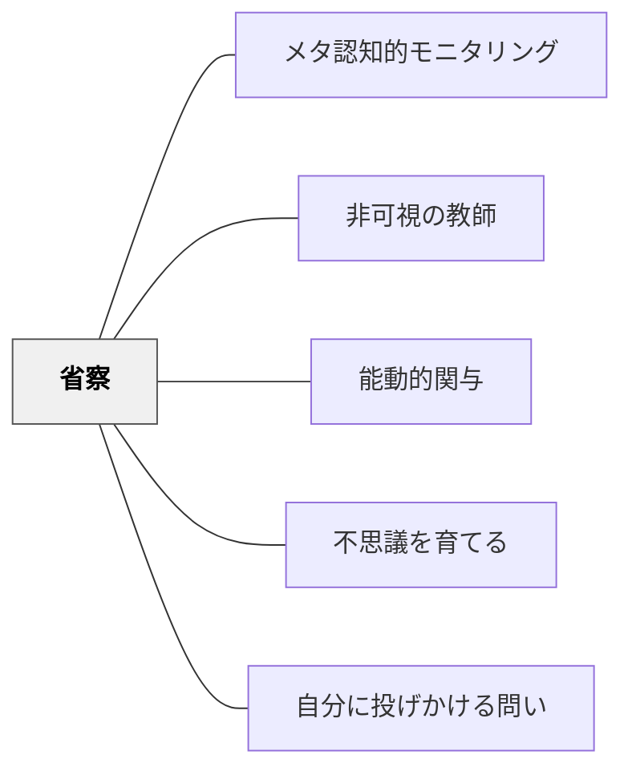

# 省察

> 答えを与えるのではなく、自分自身の経験に問い返す場をつくれ——学習者はすでに知っている、それに気づくだけでいい。

## [Pattern Connection]

Bergin et al.（2012）の *Pedagogical Patterns* における「Reflection」パタンは、成人学習者の自律性と経験知を尊重し、教師を「知識を与える者」から「発見を促す者」へと再定義する。

- **補強点**：[[パタン/メタ認知的モニタリング]] の「自分の理解を観察する」という内的プロセスを、本パタンは「教師のリダイレクト」という外側からのきっかけで引き出す実践として補強する。モニタリングを起こすための教師の言語的・構造的介入を具体的に示している
- **拡張点**：「成人は有能さに基づいて学ぶ（competency-based learner）」という成人学習論（アンドラゴジー）の観点を加える。子どもにも通じる「自分の経験から引き出す」学習観として、教師の役割観を根底から問い直す
- **他のパタンへの波及**：[[パタン/非可視の教師]] への接続——教師がいなくなる（問いを学習者自身に返す）ことの正当性を根拠づける。[[パタン/能動的関与]] における「内省する」という最も深い能動的関与の形

### 牧口常三郎（1930）——認識先行としての省察：評価作用の抑制

牧口は *創価教育学体系 第4巻*（教育技術論）において、研究・観察・省察において評価作用が認識作用に先立つことの弊害を論じた。これは省察（Reflection）の実践において見落とされがちな具体的障害を特定したものである。

**「評価先行」が省察を歪める**

省察の本来の目的は「何が起きたかを正確に把握し（認識）、その意味を問う（評価）」という順序にある。しかし日常では「良かった・悪かった」「あの子はやる気がない・あの授業はうまくいった」という評価が先行し、事実の観察（認識）が歪められる。

牧口が示した省察の条件：

> 「あせりがちの評価作用を意力的に抑圧しておいて、飽くまで冷静着実なる科学的態度を以て臨み...一つ一つの因果関係を見出すことに邁進しなければならぬ。」

これは省察の手順として：
1. 評価（好き嫌い・良悪）を意識的に保留する
2. 事実（何が起きたか・どんな発言があったか）を先に記録する
3. 事実の記録が終わった後で評価・解釈に移る

**「真砂の中から宝玉を拾い出す」**

牧口は授業観察について：

> 「平凡の頭脳には看過されるであろう真砂の中から宝玉を拾い出すことこそ、科学者の尊ぶべき任務である。」

評価先行の省察では「予期した通りのもの（評価を確認するもの）」しか見えない。評価を保留した認識先行の省察では、見落としていた「宝玉」を見つけられる。

**補強点**：省察を「過去の経験に問い返す」という一般的な定義を超えて、「評価作用を先行させず認識を先に行う」という具体的な実践技法として深化させる。

- **他のパタンへの波及**：[[パタン/認識と評価の区別]]（このパタンが省察の技法的前提を提供する）・[[パタン/メタ認知的モニタリング]]（「今どのくらいわかっているか」の問いに評価先行を入れない精度）

---

## 背景（Context）

学習者（特に成人）は、すでに豊かな経験・知識・能力を持っている。しかし「授業とは教師から知識を受け取る場だ」という思い込みが強いと、学習者は自分の経験を学習リソースとして使うことをしない。教師が答えを与え続けることで、学習者は「自分には答える力がない」という前提を内面化してしまう。

## 問題（Problem）

学習者は教師がすべての問題を解決してくれると期待する。自分の考えや経験を持ち込まず、受動的に答えを待つ姿勢が強化される。教師が「答えを出す人」であり続けると、学習者は自分の内側にある知性や経験への信頼を失い、「先生が来るまで動けない」状態が固定化される。成人学習者であっても、学習の文化が変わらない限りこの依存は続く。

## 力のかたち（Forces）

- 学習者は教師が知識を届けるものだという文化的期待を持っている
- 経験からの学びは、情報の受容より深い理解と長期的な定着を生む
- 答えを得るより、自分で答えに辿り着く過程が自己効力感を育てる
- 成人は実用的な場面での問題解決を通じて最もよく学ぶ（有能さ基底の学習）
- 教師が問いを返すことは、初期には「教えてくれない」と感じる不満を生むこともある

## 解決（Solution）

**学習者が自分の経験・知性を使って問題を解決できる環境をつくる。教師は答えを与えるのではなく、学習者が自分の中にある答えを引き出す問いを返す。**

「自分で答えを引き出す」仕組みを構造として設計する。

---

**具体例1：問いを学習者に返す**

学習者が「どうすればいいですか？」と聞いてきたとき、教師はすぐに答えずに問いを返す。「あなたが答えを出せるくらい鋭い問いをしているなら、あなたは答えも出せるはずだ（If they're clever enough to ask, they're clever enough to answer）」という姿勢で、自分の考えを先に言語化させてから対話する。

**具体例2：OOPSLA '96 の事例**

1996年のOOPSLAカンファレンスでのワークショップで、チームが見知らぬC++コードのレビューを依頼された。チームはC++の詳細な技術知識がなくても、「良いコードを読んだ経験」「設計の問題に気づく経験」「エンジニアとして蓄積してきた判断力」を使って、そのコードの問題点を見事に指摘した。専門的な技術知識よりも、経験に根ざした省察が力を発揮した事例として本パタンに引用されている。

**具体例3：「今日何を学んだか」を明示的に尋ねる**

授業の終わりに「今日あなたが学んだことは何ですか」「それをどう使いますか」と問う。学習が起きたことを学習者自身が言語化することで、「自分は学んでいる」という実感が生まれ、次の省察への意欲が高まる。学習が目に見えるようになることが、学習者の自信を育てる。

**具体例4：未知への遭遇を経験に繋ぐ**

教師が答えられない問いに直面したとき、「それは私にもわかりません。あなたはどう思いますか？」と返す。知らないことを正直に認め、学習者の経験・推論へと橋を渡す。教師の「知らない」が、学習者の「自分で考えてみる」を生む。

## 結果（Consequences）

- 学習者が自分の経験・知性への信頼を取り戻し、自律的な学習者として育つ
- 教師への依存が減り、学習者が自分で問題に向き合う習慣が育まれる
- メタ認知的な自己観察——「自分は何を学んでいるか」「自分はどう理解しているか」——が活性化する
- 初期には「答えをくれない教師」への不満が出ることもあるが、時間とともに自律性への転換が起きる
- 成人学習者の場合、「自分の学びが成熟した」という実感が学習への動機をさらに高める

## 関連パタン

- [[パタン/メタ認知的モニタリング]] — 省察はメタ認知の実践的な形
- [[パタン/非可視の教師]] — 学習者自身に問いを返すことが非可視性を実現する
- [[パタン/能動的関与]] — 内省することは最も深い能動的関与の一形態
- [[パタン/不思議を育てる]] — 自分の中の問いと疑念を育てる探究の土壌
- [[パタン/自分に投げかける問い]] — 省察を引き出す問いの設計

## クラスター図

## Actionable Insight

- 学習者から「わかりません」と言われたとき、すぐに説明する前に「あなたはどう思いますか？」と一度返してみる——1週間続けると、学習者が「聞く前に自分で考える」習慣の芽が育ち始める
- 授業の最後の3分間に「今日学んだことを一言で書く」時間を設ける——学習の言語化が省察の最初のステップであり、教師にとっても学習者の理解を知る手がかりになる
- 単元の終わりに「この学習を日常生活のどこで使えそうですか？」と問う——成人・子どもを問わず、学びを実用的な場面に接続することが省察の深さと動機を生む
- 教師自身が授業の後「自分は今日どんな問いを学習者に返せたか」を振り返るメモを書く——教師の省察が学習者の省察文化の土台になる

## 出典

Bergin, J., Eckstein, J., Manns, M. L., Sharp, H., & Voelter, M. (2012). *Pedagogical Patterns: Advice For Educators*. Joseph Bergin Software Tools. (CC BY-SA 3.0)

> "Provide an environment that allows discovery and not one that is limited to answering questions. Let the students uncover solutions for complex problems by drawing on their own experience."——Bergin et al.（2012）

> "If a student comes up with a question you cannot answer, challenge them: if they're clever enough to ask, they're clever enough to answer."——Bergin et al.（2012）
