# 省察的評価

> 評価は学習の後に来るものではなく、学習の一部だ——テストで知識を「確認」するより、振り返りで思考を「育てる」評価を設計する。

---

## Pattern Connection

**出典**: Daniels, H., & Bizar, M.（2005）*Teaching the Best Practice Way: Methods That Matter, K-12*. Stenhouse Publishers.

- **既存パタンとの関連**: [[パタン/形成的評価]] が「学習中のフィードバック」に焦点を当てるのに対して、省察的評価は「生徒自身が自分の成長を語る」というより広い評価文化を指す。[[パタン/ルーブリック]] が評価基準の明確化を扱うのに対して、省察的評価はそのルーブリックを「誰が作り・誰が使うか」という問いを立てる——生徒が共同作成することで「評価基準の内面化」が起きる
- **補強された点**: [[パタン/メタ認知的モニタリング]] の「自分の理解状態を監視する」に、「それを外に出す（ポートフォリオ・自己評価）」という行為のデザインが加わった。[[パタン/フィードバック]] にポートフォリオ・カンファリング・発達的記録という具体的な形式が加わる
- **修正・拡張された点**: 標準化テストに「対立するもの」として省察的評価を位置づけるのではなく、「補完するもの」として設計する——省察的評価が育てるメタ認知力は、標準化テストの結果をも向上させる
- **他のパタンへの波及**: [[パタン/1対1の面談]] — カンファリングが省察的評価の中心的な実践。[[パタン/ドキュメンテーション]] — 評価記録（逸話的記録・写真・学習ログ）が省察的評価の素材。[[パタン/自己選択自己決定]] — ポートフォリオに何を入れるかの選択が、自己評価力を育てる

### Milewski（2023）——自然変換（Natural Transformation）との接続

Milewski（2023, Ch.10）は圏論の3層の階層を示す：対象→関手（1-射）→自然変換（2-射）。**自然変換**は「関手間の射」——異なる関手的アプローチを系統的に比較・移行する変換である。

> 「一段高い抽象レベルで行為だったものが、次のレベルでは対象になる」——Milewski, Ch.10

省察的評価はこの自然変換の構造に対応する：

- パタンを「適用する」（関手として動く）ときは、ある文脈でそのパタンがどう機能するかを見ている
- 省察的評価では「複数のパタン適用を比較し、どちらがより効果的か・どう切り替えるか」を問う——これが自然変換のレベルの思考
- 「今日の授業でのフィードバックのやり方（関手F）と昨日のやり方（関手G）を比較する」という省察は、自然変換 η: F → G を構成する作業に対応する

[[概念/圏論と教育]] — 2圏の階層構造と省察の接続
[[文献/Category Theory for Programmers（Milewski）]] — 自然変換の教育的意義の出典

### ショーペンハウアー（1851/2013）——Selbstdenken との接続

ショーペンハウアーの「自分の頭で考える（Selbstdenken）」は、省察的評価の根底にある問いを哲学的に基礎づける。

- **既存パタンとの関連**：本パタンのカンファリング（「今やっていることを教えて」「なぜその方法を選んだの？」）は、ショーペンハウアーの言う Selbstdenken を引き出す問い構造を持つ。「他人の評価基準で答えを探す」のでなく「自分の頭で考え直す」場として機能する
- **補強された点**：省察が「他人の評価基準で振り返る」（他者の言葉を借りた省察）でなく「自分の頭で考え直す」（Selbstdenken としての省察）ことを意味するという区別が明確になる。Alan が「あ、分かった！」と自分で気づく瞬間は、ショーペンハウアーの「思索の火が燃え上がる」瞬間と同型である
- **他のパタンへの波及**：[[パタン/自分の頭で考える（Selbstdenken）]] — 省察的評価のカンファリングが Selbstdenken を引き出す最良の場になる

### Milewski（2023）——モナド（Monad）との接続

自然変換が「パタン適用の比較・切り替え」を記述するとすれば、**モナド**は「そもそも授業が純粋な変換ではない」という事実を形式化する。

授業は `f: A → B` ではなく `f: A → T(B)` である——T(B) の中には意図した学習だけでなく、**偶発的な発見・感情の動き・仲間との会話から生まれた気づき・意図しなかったつながり**が入っている。モナドの3つの操作はそれぞれ省察的評価の実践に対応する：

| モナドの操作 | 省察的評価での対応 |
|---|---|
| **return/unit（η: A → T(A)）** | 指導案（純粋な意図）を実際の教室に埋め込む——ここから授業の「文脈付き体験」が始まる |
| **bind（>>=）** | ある授業の「文脈付き結果 T(result)」を次の授業に引き渡す。ポートフォリオは bind の連鎖の記録 |
| **join（μ: T∘T → T）** | 積み重なった体験 T(T(…)) を「学習の軌跡 T(成長)」として統合する。これがカンファリングと振り返りの機能 |

**Alanのエピソードとモナド**：Alan が「LK: じゃあ誰が答えたの？ A: 僕かな… LK: そうね。」に至る場面は、T(A) の中に入っていた偶発的な理解——「自分で考えられる」という気づき——が、カンファリングという bind 操作によって surface される瞬間である。教師が答えを与えず問い返すことは、文脈 T の中身を「開封」する操作だ。

**モナド則と省察の一貫性（および留保）**：モナド則（左単位・右単位・結合律）は「文脈付き計算が一貫して連鎖できる」ことを保証する。授業ごとのクイックライト（bind の連鎖）と学期末のポートフォリオ整理（join）が、どちらも同じ学習の軌跡に到達できるという一貫性——これが「省察はいつやっても意味がある」という直感の数学的根拠の**候補**である。ただし、結合律が教育実践で厳密に成立するかは問いとして留保が必要だ（→ [[概念/圏論と教育]] のモナド則の問いを参照）。

さらに踏み込めば、省察的評価は**アソシエータ**（弱2圏における同型射 α: (h∘g)∘f ≅ h∘(g∘f)）の実践形態でもある。結合の「ズレ」を消去するのではなく、ズレを意識化・言語化することで、異なる順序・区切りで実施した授業を「同じ単元の目的地に向かう等価な経路」として架け橋する——これがアソシエータとしての省察だ（→ [[概念/圏論と教育]] の「非結合律性と弱い圏」節）。

[[概念/圏論と教育]] — モナドと学習の文脈性・非結合律性と弱い圏
[[文献/Category Theory for Programmers（Milewski）]] — モナドの理論的背景（Ch.20）

### 井庭崇（2025）

井庭（2025）のパターン・マイニングにおける**マイニング・インタビュー**（What/Why/How の三問によって実践者の暗黙知を言語化する対話法）は、本パタンのカンファリングと同型の問い構造を持つ。

- **既存パタンとの関連**：本パタンのカンファリングが「子どもが自分の思考を語ることで思考が育つ」ことを目指すのに対し、マイニング・インタビューは「実践者が自分の実践を語ることで実践の本質が言語化される」ことを目指す。ともに「言語化されていない知（暗黙知）を、対話を通じて表に出す」という同一の目標を持つ。
- **補強された点**：なぜカンファリングの問いが有効かという理論的根拠が加わる。この問い構造は「実践の本質を取り出すための普遍的な問いの形」として位置づけられる。

**マイニング・インタビューとカンファリングの問い構造の対応**

| 問いの型 | マイニング・インタビュー（井庭） | カンファリング（本パタン） |
|---|---|---|
| **What**（何をしているか） | 「よい○○実践において、何をすることが大切ですか？」 | 「今、何をやっていますか？」 |
| **Why**（なぜ重要か） | 「なぜそれが大切だと思いますか？」 | 「なぜその方法を選んだの？」 |
| **How**（どうやるか） | 「具体的にどのようにしていますか？」 | 「どうやって進めているの？」 |

カンファリングは教師が子どもに行う「実践学的なインタビュー」とも言える。Alan のエピソード（「あ、分かった！」と自分で気づく瞬間）は、対話によって暗黙知が顕在化する瞬間の典型である。

- **他のパタンへの波及**：[[パタン/話し合う文化]]（間主観的還元のための対話設計）・[[メタパタン/経験から出発する]]（実践者の語りから本質を取り出すプロセス）・[[文献/質的研究法としてのパターン・ランゲージ（井庭崇）]]

### カント（1787）補足

カントの「物自体（Ding an sich）は認識できず、現象のみが認識対象になる」という洞察は、省察的評価の対話中心性を哲学的に基礎づける。教師は学習者の「理解そのもの（物自体）」に直接アクセスできない——見えるのは常にポートフォリオ・口頭説明・作品という「現象」に過ぎない。省察的評価の対話（カンファリング）は、単一の現象（テストの点）では届けない学習者の物自体に、複数の現象を重ねて少しずつ近づこうとする実践である。

→ 出典：[[文献/純粋理性批判 1（カント、中山元訳）]]

### 林岳彦（2023）——統計的因果推論：「省察の問いを因果的に立てる」

統計的因果推論は、省察的評価の問いの**精度と謙虚さ**を同時に高める視点を提供する。

**省察が「相関の観察」に留まる危険：**

省察的評価のカンファリングで「どうしてここで行き詰まったの？」と問い、子どもが答える場面を想像する。その答えから「この子は○○が理解できていない」「このタスクが難しすぎた」という結論に至ることがある。しかしその結論は**観察された相関**であって、**因果**ではない可能性がある。

- 「行き詰まった」という現象には複数の原因が混在している（疲れ・隣の子との関係・問題形式への不慣れ・概念の未習得）
- カンファリングで子ども自身が語る「理由」も、本当の原因の一側面かもしれない

**「反事実を含む省察」の問いへ：**

| 通常の省察の問い | 反事実を含む省察の問い |
|---|---|
| 「何が分からなかった？」 | 「もし○○の条件が違ったら、同じところで詰まったと思う？」 |
| 「どのやり方を選んだ？」 | 「別のやり方を選んでいたら、どうなっていたと思う？」 |
| 「この方法でうまくいった？」 | 「うまくいったのは方法のおかげか、たまたまうまくいく場面だったからか？」 |

**「法則性と固有性の往復」——教師の省察への示唆：**

> 「法則性の世界で推定された平均的な傾向が、特定の個体には必ずしも当てはまらないことは普通にありうる」——林岳彦（2023）

省察的評価は本来この往復を行う実践だ：
- カンファリングを重ねて**固有性**（この子の今のパターン）を観察する
- 複数の子どものカンファリング記録から**法則性**（この種の子にはこの足場が機能する）を見出す
- しかしその法則性を次の子に適用するとき、再び**固有性**に立ち返る

**ドメイン知識の再評価——省察的評価の根拠：**

> 「現場の人間にしか見えないような想定外の落とし穴がしばしば存在する」——林岳彦（2023）

省察的評価を積み重ねた教師は「この子の文脈」という深いドメイン知識を持つ。これは統計的手法では置き換えられない——因果ダイアグラムの構造を支える質的な知識として機能する。

- **既存パタンとの関連**：カンファリングの「今、何をやっているか・なぜその方法か・どうやっているか」という三問が、因果推論でいう「処置・共変量・結果」の観察に対応する
- **補強された点**：「省察は成長を確認するもの」から「省察は因果的仮説を精錬するもの」へと深化する。「うまくいった」の省察に常に「本当に自分の指導が原因か」という謙虚さが加わる
- **他のパタンへの波及**：[[パタン/相関と因果の区別（教育評価の落とし穴）]] — 省察の問いを因果的に立てる具体的方法；[[文献/はじめての統計的因果推論（林岳彦）]] — 本統合の出典

---

### フロイト（1914）——徹底操作（Durcharbeiten）との接続

フロイトの「想起、反復、徹底操作」（1914年論文）は、省察的評価の「繰り返し向き合う」という核心を精神分析的に基礎づける。

> 「そのような徹底操作が頂点に達したときにはじめて、わたしたちは被分析者との協力作業によって、抑圧された欲動の動きを発見することができるのである」——フロイト（1914年論文）

- **既存パタンとの関連**：本パタンが「省察が学習の一部だ」と言うとき、その根拠はDaniels & Bizarの実践的証拠にある。フロイトの徹底操作は、より深い理論的根拠を与える——「理解しただけでは変化しない。繰り返しの向き合いが必要」という原理
- **「教えれば変わる」の失望への答え**：省察的評価でのカンファリングが「一回やれば十分」と思われたとき、それは徹底操作の原理を無視している。Alan（積極的・衝動的・依存的な生徒）の事例——「自分はかつて思っていたより考えられることが分かった」という変容は、一学期間の繰り返しの対話によって生まれた。これが徹底操作としての省察的評価の実践形態
- **言語化の機能**：「言葉にする」ことは単なるアウトプットではない。フロイトによれば「事物表象を言語表象と結びつける」ことで、無意識の内容が前意識・意識に引き上げられる。カンファリングで「そのとき何を考えていた？」と問うとき、事物表象（感覚・直観・体験）に言語表象が接合され、認識の変容が起きる
- **補強された点**：ショーペンハウアーの「Selbstdenken（自分の頭で考える）」（既統合）との接続が強化される——Selbstdenkenとしての省察は、フロイトの徹底操作の構造を持つ。一度の「分かった」で終わるのではなく、繰り返しの中で抵抗と向き合いながら変容する
- **波及するパタン**：[[パタン/行為化を読む（転移と反復強迫）]] — 変化が起きない深層構造の理解；[[概念/無意識と教育]] — 徹底操作の理論的文脈；[[文献/フロイト、無意識について語る（中山元訳）]] — 本統合の出典

---

### ルソー（1755）人間不平等起源論——être vs paraître：実態と外見の分離と省察

ルソーは文明社会の根本的問題を「あること（être）と見えること（paraître）がまったく別のものになった」と診断した：

> 「あることとみえること、すなわち実態と外見がまったく別のものになったのである。そしてこの区別から、他人を威圧するような威厳、人々を欺く悪賢さ、これに伴うすべての悪徳が生まれたのである」——第二部

**学校での être vs paraître の構造：**

学校は意図せずして、この分離を日常的に生産する場になりやすい：
- 「学んだように見せること」（答えを書く・発表する・テストで点を取る）= paraître
- 「実際に学ぶこと」（概念を自分のものにする・問いを持ち続ける）= être

特に評価場面では、「高い評価をもらうこと（paraître）」が「実際にできるようになること（être）」を上書きしやすい。

**省察的評価との接続：**

省察的評価のカンファリング・ポートフォリオ・自己評価は、être と paraître を近づけるための実践として読める：
- ポートフォリオの「なぜこれを選んだか」を問うことは、外見（選んだ作品）ではなく実態（どう学んだか）に迫る
- カンファリングで「何が分からなかったか」を問うことは、理解の外見ではなく実態を引き出す
- 「うまくいったように見える答え」と「実際に理解している状態」のギャップを省察が可視化する

> ✏️ *AI支援で整理した考察（そら子）：* 「分かったふり」をしなくていい場の設計が、省察の前提になる——être を安全に語れる心理的安全性が、paraître への逃げを防ぐ。

- **補強された点**：省察的評価の「なぜ評価の文化を変えるべきか」の哲学的根拠が加わる。Daniels & Bizarの実践的証拠に対して、ルソーは「評価が paraître を強化し être を隠す構造そのもの」の歴史的・哲学的な診断を提供する。
- **林岳彦（2023）との接続**（既統合）：「みえる成果（paraître）」と「実際の学び（être）」の区別は、統計的因果推論の「観察できる結果と実際の因果効果の区別」と対応する——paraître は観察可能な結果、être は潜在結果（観察不可能な真の学び）。
- **波及するパタン**：[[パタン/利己愛の罠（比較が内発的動機を壊す）]] — être vs paraître の分離をもたらす評価文化の根本的診断；[[パタン/明証性と判明性（自分で確かめる知の習慣）]] — être に迫る認識論的実践；[[文献/人間不平等起源論（ルソー）]] — 本統合の出典

---

## 背景（Context）

Daniels & Bizar（2005）はベスト・プラクティスの7つの構造の一つとして「省察的評価（Reflective Assessment）」を位置づけた。

従来型の評価——一回性のテスト、教師による一方向的な採点——は、「今この瞬間の正解/不正解」を測るが、「子どもがどう成長しているか」「どんな思考プロセスを使っているか」を捉えられない。特に思考力・表現力・協同する力のような複雑なスキルは、紙の上の選択肢では見えない。

省察的評価の核心は：**評価が学習の一部になる**——自分の作品を選ぶ・自分の成長を語る・目標を設定するという評価行為が、メタ認知力を直接育てる。

## 問題（Problem）

標準化テスト中心の評価体制では：

- 「分かったこと」より「正解できたこと」だけが記録される
- 学習のプロセス・思考の変化が見えない
- 生徒は「評価される」存在であり、「評価する」主体にならない
- メタ認知（自分の学びを見る力）が育たない
- 一回の失敗が「自分はできない」という固定されたラベルになる

逆に省察的評価を「テストの代わり」として安易に使うと：
- 記録が曖昧になり、指導判断の根拠が失われる
- 生徒の自己評価が表面的な「よかった・うまくできた」に留まる

## 力のかたち（Forces）

- 生徒は「自分が成長した」と感じるとき、学習への動機が高まる
- 成長が「見える」ためには、過去の作品・思考との比較が必要
- 教師が子どもの思考プロセスを知るためには、作品だけでなく「その作品についての子どもの言葉」が必要
- 評価基準を生徒と共同開発すると、基準が内面化され自己調整が生まれる
- 評価の多様な形式（観察・対話・作品・自己申告）を組み合わせることで、一側面では見えない学力が立体的に見える

## 解決（Solution）

**ポートフォリオ・カンファリング・自己評価・パフォーマンス評価を組み合わせ、生徒が自分の成長を語る「評価の文化」を作る。**

---

### 逸話的記録と観察（Anecdotal Records）

教師が子どもを観察しながらリアルタイムでメモを残す：

- **何を記録するか**：学習行動（「グループで誰かの意見を聞いて自分の考えを変えた」「分からなくなったとき本に戻った」）、思考のサイン（「なぜ？」と聞いた、図を描いた）
- **形式**：付箋・クリップボード・タブレット。後でポートフォリオやカンファリングの素材にする
- **「問題行動」より「思考行動」を記録する**：Daniels & Bizar の強調点——「席を立った」より「自分でもう一度読んで問題を解いた」を記録する

---

### ポートフォリオ

作品集だが、単なる「上手な作品を集めたもの」ではない——**学習の軌跡**を示すもの：

**種類（本書から）**：

| ポートフォリオの種類 | 目的 | 時期 |
|---|---|---|
| **Meポートフォリオ** | 自分が大切にしているもの・自分について語るもの。最初の信頼関係構築に使う | 年度初め |
| **学習ポートフォリオ** | 選択した作品 + 「なぜこれを選んだか」の自己評価コメント | 学期ごと |
| **スキル・デモンストレーション** | 特定のスキルを示す作品を意図的に集める。達成の証拠として機能 | 随時 |
| **卒業ポートフォリオ** | 学校で学んだことの総集編。高校では受験・就職先への提出物になることも | 卒業時 |

**ポートフォリオの核心**：選択と反省——「どの作品を入れるか」と「なぜそれを選んだか」を生徒が自分で決め、説明する。この行為が評価者としての生徒を育てる。

---

### 教師・生徒カンファリング（Teacher-Student Conferences）

1対1の対話——評価の最も深い形式：

**カンファリングの種類**：

| 種類 | 目的 | 典型的な問い |
|---|---|---|
| **内容カンファリング** | 何を書いている/読んでいるかを確認 | 「今の作品で一番伝えたいことは？」 |
| **プロセスカンファリング** | どうやって学んでいるかを確認 | 「詰まったとき、どうしましたか？」 |
| **評価カンファリング** | 成果の質を教師と生徒で共同評価 | 「これはうまくできましたか？なぜ？」 |
| **読み聞かせカンファリング** | 生徒が教師に読み聞かせをして、読み方を評価 | 「この部分で何を考えていましたか？」 |
| **対話ジャーナル・カンファリング** | 書いた日記についての対話 | 「この経験について、もっと聞かせて」 |
| **生徒選択カンファリング** | 生徒がテーマを決める | 「今日は何について話したいですか？」 |

**カンファリングで大切なこと**：
- 「正解を教える」場ではなく「考えを引き出す」場
- 「評価シート」より「ノート」——記録は後で生徒に返す素材
- 週に数人、継続的に。全員を毎週する必要はない

---

### 生徒自己評価

生徒が自分の学びを評価するために：

**形式**：
- 3択・4択の定期的なチェックシート（「この単元で学んだことを自信を持って説明できる」1〜4）
- 「うまくいったこと」「難しかったこと」「次の目標」の3問
- ポートフォリオへのコメント（「この作品を選んだのは〜だから」）
- クラス全体の振り返り（What? So What? Now What?）

**生徒自己評価を育てるプロセス**：
最初は「上手にできた」「できなかった」という2択的な評価しかできない。具体的な証拠を指し示す練習（「どこでそれが分かりますか？」）を繰り返すことで、徐々に精緻になる。

---

### パフォーマンス評価（算数の事例）

本物の文脈での思考を評価する——手続きではなく概念を問う：

**Colors in a Jar（Pamela Hyde, 3年生）**
- 3色（18個白・14個青・13個赤）のキューブが入った瓶を用意
- 生徒は：(1)目で見て全体数を推定 (2)最も多い色・少ない色を特定 (3)箱に開けて数を確認 (4)筆算で合計を求め、説明を書く
- 評価で見えること：数の全体像の把握（加算構造）・場所値の理解・繰り上がりの概念的理解
- 低位の反応：「I cownted.」（数えた）だけ。数の組み合わせが見えていない
- 高位の反応：「18 + 14 + 13 = 45。まず白を数え、次に青、次に赤。それから足した。」構造的理解がある

**Perimeter（周囲長・同3年生）**
- 教室内の実物（黒板・ヒーター・部屋全体）を実際に測り、周囲長を求める
- 4〜5人のグループで実施。メートル尺・巻き尺・定規を使い分ける
- 評価で見えること：周囲長の概念理解（全体の外側の合計）・測定工具の使い方・センチとメートルの区別・大きな数を扱う加算
- 教師の発見：概念を手続きに置き換えている生徒（答えは出るが周囲長を理解していない）が、活動中に可視化される

---

### メタ認知の発達プロセス

Luanne Kowalke（4年生）の1年間の事例から：

**Jan（几帳面・内省が苦手な生徒）**
- Q1振り返り：「協力しようとしている。聴けている」と表面的
- Q2振り返り：「協力が改善した。指示を聴けた。次の目標：紙類を整理する」と具体的に
- Q3振り返り：「創造的になりたい。歴史・地理への関心が生まれた。読み聞かせが想像力と思考力を育てた」と接続的に

**Alan（積極的・衝動的・依存的な生徒）**
- 4月当初：1日17〜20回「分からない」で教師に質問。どんな問いにも答えてもらおうとする
- 教師の対応：質問の内容を分類（「自分で答えられる」「仲間に聞く」「一緒に考える」の3種類）
- 対話の転換：「LK: それはどういうことだろう？ A: (声に出して読む) あ、分かった！ LK: じゃあ誰が答えたの？ A: 僕かな… LK: そうね。」
- Q3振り返り：「自分はかつて思っていたより考えられることが分かった。脳の仕組みを知りたい」

---

## 結果（Consequences）

- 生徒が「自分はどんな学習者か」という自己像を、証拠に基づいて持てる
- 教師が子どもの思考プロセスの変化を、作品と対話を通じて長期的に追跡できる
- 保護者面談・次の担任への引き継ぎに「点数」以上の情報が提供できる
- 生徒の自己評価力が高まると、カンファリング・ポートフォリオ整理の質が上がり、さらに自己評価力が伸びるという正のフィードバックが生まれる
- ただし、省察的評価だけでは「達成水準の外部比較」ができない——外部評価（テスト・ルーブリック）との組み合わせが必要

## 関連パタン
- [[パタン/概念の芯をつかむ（地力の学び方）]]
- [[パタン/行為化を読む（転移と反復強迫）]]
- [[パタン/修復の原理（まち直し）]]
- [[パタン/漸進主義（時と地の読み）]]
- [[パタン/能力としての知識（知ることはできることだ）]]
- [[パタン/欲望の倫理]]
- [[パタン/合成による問題解決]]
- [[パタン/フロネーシス（実践的知恵）]]
- [[パタン/メソン（中庸）]]
- [[パタン/批判的評価]]
- [[学級経営/学級経営で使えるパタン]]
- [[実践/ノート指導（読み書きハンドブック・ノート検定）]]
- [[パタン/終末の指示（行動の終わりまで示す）]]
- [[パタン/正の罰]]
- [[パタン/被教育者からのフィードバックを利用して教育改善をする]]
- [[パタン/被教育者からフィードバックを得る]]
- [[パタン/負の強化]]
- [[パタン/負の罰]]
- [[パタン/過去を問う]]
- [[パタン/自分の言葉で]]
- [[パタン/達成レベルの役割]]
- [[パタン/非確証フィードバック]]
- [[パタン/コミットメント]]
- [[パタン/帰属志向性]]
- [[パタン/熟慮的動機づけ]] — 補完: 評価で見えた成長や意味づけが、次の学びへの動機を支える
- [[パタン/技術やスキルの実演を分析する]]
- [[パタン/相関と因果の区別（教育評価の落とし穴）]] — 「介入が効いた」という省察に「本当に因果か」という反事実の問いを加える
- [[パタン/宣言]]
- [[パタン/脱文脈化された達成規準]]
- [[パタン/予測差分（期待値差分）の調整]]
- [[パタン/テストを作成する]]
- [[パタン/一つ又はそれ以上の成功規準に焦点化し最も良い学習物を探し改善案を示す]]
- [[パタン/確証フィードバック]]
- [[パタン/教材を改善する]]
- [[パタン/現在を問う]]
- [[パタン/仕組み化]]
- [[パタン/自分の学習物が学級で批評される]]
- [[パタン/手順分析]]
- [[パタン/授業中に学習パートナーが協働して成功を確認し改善案を示す]]
- [[パタン/総括的評価]]
- [[パタン/未来を問う]]
- [[パタン/クラスター分析]]
- [[パタン/フィッシュボウル（金魚鉢）]]
- [[パタン/教材をイメージする]]
- [[パタン/言語という符号の組み立てを以ってする表現法]]
- [[パタン/主要概念で評価する]]
- [[パタン/出入り口を明確にする（目標設定）]]
- [[パタン/婉曲法（問い）]]
- [[実践/学習する学校をつくる]]
- [[パタン/反復検討]]
- [[パタン/意識的計画的生活への指導]]
- [[パタン/人間形成の様式]]
- [[パタン/統合単元]]
- [[パタン/民主的教育]]

- [[パタン/形成的評価]] — 省察的評価の学習中フィードバック側面
- [[パタン/1対1の面談]] — カンファリングの設計と運用
- [[パタン/ルーブリック]] — 評価基準の共同構築
- [[パタン/ポートフォリオファイル]] — ポートフォリオの管理・整理の実践
- [[パタン/メタ認知的モニタリング]] — 自己評価の認知科学的根拠
- [[パタン/ドキュメンテーション]] — 学習記録の蓄積と活用
- [[パタン/フィードバック]] — 評価情報の使い方の上位パタン
- [[パタン/段階的手放し]] — 評価を通じて生徒の自律を育てるGRR
- [[パタン/自己内フィードバック]] — 省察が生み出す内的フィードバックループ
- [[パタン/自分の頭で考える（Selbstdenken）]] — カンファリングが Selbstdenken を引き出す場になる
- [[パタン/利己愛の罠（比較が内発的動機を壊す）]] — être vs paraître の分離を生む評価文化の哲学的診断
- [[パタン/再提出を許す（リトライ・サイクル）]] — 再提出時の「どこをどう変えたか・なぜ変えたか」が省察の実践になる
- [[文献/人間不平等起源論（ルソー）]] — 実態と外見の分離（être vs paraître）の歴史的・哲学的根拠（1755）
- [[パタン/つまずきを構造で記録する（診断の粒度設計）]] — 省察的評価の観察記録・逸話的記録（「どこで手が止まったか」）と、それを変化種別という軸で構造化する記録設計（本パタン）の連携——省察と構造化記録を組み合わせることで教師のドメイン知識が蓄積する
- [[概念/証拠不足と不成立の区別]] — 記録を三値（言える・言えない・まだ分からない）で読み直す概念的基礎。証拠不足を低評価へ変換しない

---

- [[概念/自我関与と課題関与（フィードバックが向ける先）]] — 振り返りの問いを「結果」ではなく「何が効いたか」に置く根拠
- [[パタン/聴き方を変える（評価的・解釈的・解釈学的）]] — 省察の対象を「自分の聴き方」に特定し、授業記録という実行形式を与えたもの
- [[パタン/見取ったあとの手を決めておく（データ利用のルール化）]] — 単元末に閾値を検証し改訂する工程を担う。ルールが仮説であることを保つ
- [[パタン/進歩の傾きを見る（水準ではなく変化率）]] — 描いた線を読んで指導の効き方を振り返る
- [[パタン/一回できたことと続いていることを分ける（記録の列）]] — 振り返る対象が一件か列かで、言えることが変わる。主語は列であって子どもではない
- [[パタン/検査質問を一つだけ持って教室に入る]] — 省察を引き出す具体的な問いの束。一度に一つだけ持つという作法つき

## クラスター図

```mermaid
flowchart LR
    ne79c81e5af9fe79a84e8a995e4bea1["省察的評価"]
    ne6a682e5bfb5e381aee88aafe38292e381a4e3818be38280efbc88e59cb0e58a9be381aee5ada6e381b3e696b9efbc89["概念の芯をつかむ（地力の学び方）"]
    ne8a18ce782bae58c96e38292e8aaade38280efbc88e8bba2e7a7bbe381a8e58f8de5bea9e5bcb7e8bfabefbc89["行為化を読む（転移と反復強迫）"]
    ne4bfaee5bea9e381aee58e9fe79086efbc88e381bee381a1e79bb4e38197efbc89["修復の原理（まち直し）"]
    ne6bcb8e980b2e4b8bbe7bea9efbc88e69982e381a8e59cb0e381aee8aaade381bfefbc89["漸進主義（時と地の読み）"]
    ne883bde58a9be381a8e38197e381a6e381aee79fa5e8ad98efbc88e79fa5e3828be38193e381a8e381afe381a7e3818de3828be38193e381a8e381a0efbc89["能力としての知識（知ることはできることだ）"]
    ne6acb2e69c9be381aee580abe79086["欲望の倫理"]
    ne59088e68890e381abe38288e3828be5958fe9a18ce8a7a3e6b1ba["合成による問題解決"]
    ne38395e383ade3838de383bce382b7e382b9efbc88e5ae9fe8b7b5e79a84e79fa5e681b5efbc89["フロネーシス（実践的知恵）"]
    ne383a1e382bde383b3efbc88e4b8ade5bab8efbc89["メソン（中庸）"]
    ne689b9e588a4e79a84e8a995e4bea1["批判的評価"]
    ne7b582e69cabe381aee68c87e7a4baefbc88e8a18ce58b95e381aee7b582e3828fe3828ae381bee381a7e7a4bae38199efbc89["終末の指示（行動の終わりまで示す）"]
    ne6ada3e381aee7bdb0["正の罰"]
    ne8a2abe69599e882b2e88085e3818be38289e381aee38395e382a3e383bce38389e38390e38383e382afe38292e588a9e794a8e38197e381a6e69599e882b2e694b9e59684e38292e38199e3828b["被教育者からのフィードバックを利用して教育改善をする"]
    ne8a2abe69599e882b2e88085e3818be38289e38395e382a3e383bce38389e38390e38383e382afe38292e5be97e3828b["被教育者からフィードバックを得る"]

    ne79c81e5af9fe79a84e8a995e4bea1 --- ne6a682e5bfb5e381aee88aafe38292e381a4e3818be38280efbc88e59cb0e58a9be381aee5ada6e381b3e696b9efbc89
    ne79c81e5af9fe79a84e8a995e4bea1 --- ne8a18ce782bae58c96e38292e8aaade38280efbc88e8bba2e7a7bbe381a8e58f8de5bea9e5bcb7e8bfabefbc89
    ne79c81e5af9fe79a84e8a995e4bea1 --- ne4bfaee5bea9e381aee58e9fe79086efbc88e381bee381a1e79bb4e38197efbc89
    ne79c81e5af9fe79a84e8a995e4bea1 --- ne6bcb8e980b2e4b8bbe7bea9efbc88e69982e381a8e59cb0e381aee8aaade381bfefbc89
    ne79c81e5af9fe79a84e8a995e4bea1 --- ne883bde58a9be381a8e38197e381a6e381aee79fa5e8ad98efbc88e79fa5e3828be38193e381a8e381afe381a7e3818de3828be38193e381a8e381a0efbc89
    ne79c81e5af9fe79a84e8a995e4bea1 --- ne6acb2e69c9be381aee580abe79086
    ne79c81e5af9fe79a84e8a995e4bea1 --- ne59088e68890e381abe38288e3828be5958fe9a18ce8a7a3e6b1ba
    ne79c81e5af9fe79a84e8a995e4bea1 --- ne38395e383ade3838de383bce382b7e382b9efbc88e5ae9fe8b7b5e79a84e79fa5e681b5efbc89
    ne79c81e5af9fe79a84e8a995e4bea1 --- ne383a1e382bde383b3efbc88e4b8ade5bab8efbc89
    ne79c81e5af9fe79a84e8a995e4bea1 --- ne689b9e588a4e79a84e8a995e4bea1
    ne79c81e5af9fe79a84e8a995e4bea1 --- ne7b582e69cabe381aee68c87e7a4baefbc88e8a18ce58b95e381aee7b582e3828fe3828ae381bee381a7e7a4bae38199efbc89
    ne79c81e5af9fe79a84e8a995e4bea1 --- ne6ada3e381aee7bdb0
    ne79c81e5af9fe79a84e8a995e4bea1 --- ne8a2abe69599e882b2e88085e3818be38289e381aee38395e382a3e383bce38389e38390e38383e382afe38292e588a9e794a8e38197e381a6e69599e882b2e694b9e59684e38292e38199e3828b
    ne79c81e5af9fe79a84e8a995e4bea1 --- ne8a2abe69599e882b2e88085e3818be38289e38395e382a3e383bce38389e38390e38383e382afe38292e5be97e3828b

    classDef hub fill:#f0f0f0,stroke:#555,color:#000,font-weight:bold
    class ne79c81e5af9fe79a84e8a995e4bea1 hub
```

## Actionable Insight

- 今週の単元の終わりに「今日の学びを3文で書く」クイックライトを試す——「何を学んだか」「どこが難しかったか」「次に試したいこと」の3点で。採点しない
- カンファリングを1回試す：「今やっていることを教えて」だけで始め、答えを言わずに「それはどういうこと？」を2回繰り返す——Alan のエピソードのように、自分で答えに辿り着く瞬間を待つ
- ポートフォリオに「なぜこれを選んだか」のコメントを1枚だけ書かせる——最初は「上手にできたから」しか書けなくても、それが出発点だ
- 記録や所見を読み直すとき「言える・言えない・まだ分からない」の三値で仕分けてみる——「まだ分からない」と書くことは敗北ではなく、明日への申し送りである。検査質問：**このつながりを結んだのは、私の手か、それとも、この子の中でか**（[[概念/証拠不足と不成立の区別]]）

---

## 出典

- [[文献/圏論的教育記述の公理化ノート 第1巻（岩井）]] — 記録の三値判定（言える・言えない・まだ分からない）の理論的出典（第4・7章）

Daniels, H., & Bizar, M. (2005). *Teaching the Best Practice Way: Methods That Matter, K-12*. Stenhouse Publishers.

> 「評価は学習のあとに来るものではない。省察すること、選択すること、目標を立てること——これらすべてが、評価であり、同時に学習だ。」——Daniels & Bizar（2005）
