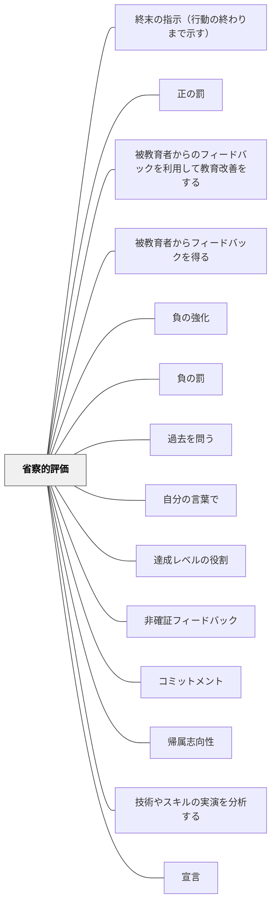

# 省察的評価

> 評価は学習の後に来るものではなく、学習の一部だ——テストで知識を「確認」するより、振り返りで思考を「育てる」評価を設計する。

---

## Pattern Connection

**出典**: Daniels, H., & Bizar, M.（2005）*Teaching the Best Practice Way: Methods That Matter, K-12*. Stenhouse Publishers.

- **既存パタンとの関連**: [[パタン/形成的評価]] が「学習中のフィードバック」に焦点を当てるのに対して、省察的評価は「生徒自身が自分の成長を語る」というより広い評価文化を指す。[[パタン/ルーブリック]] が評価基準の明確化を扱うのに対して、省察的評価はそのルーブリックを「誰が作り・誰が使うか」という問いを立てる——生徒が共同作成することで「評価基準の内面化」が起きる
- **補強された点**: [[パタン/メタ認知的モニタリング]] の「自分の理解状態を監視する」に、「それを外に出す（ポートフォリオ・自己評価）」という行為のデザインが加わった。[[パタン/フィードバック]] にポートフォリオ・カンファリング・発達的記録という具体的な形式が加わる
- **修正・拡張された点**: 標準化テストに「対立するもの」として省察的評価を位置づけるのではなく、「補完するもの」として設計する——省察的評価が育てるメタ認知力は、標準化テストの結果をも向上させる
- **他のパタンへの波及**: [[パタン/1対1の面談]] — カンファリングが省察的評価の中心的な実践。[[パタン/ドキュメンテーション]] — 評価記録（逸話的記録・写真・学習ログ）が省察的評価の素材。[[パタン/自己選択自己決定]] — ポートフォリオに何を入れるかの選択が、自己評価力を育てる

### 井庭崇（2025）

井庭（2025）のパターン・マイニングにおける**マイニング・インタビュー**（What/Why/How の三問によって実践者の暗黙知を言語化する対話法）は、本パタンのカンファリングと同型の問い構造を持つ。

- **既存パタンとの関連**：本パタンのカンファリングが「子どもが自分の思考を語ることで思考が育つ」ことを目指すのに対し、マイニング・インタビューは「実践者が自分の実践を語ることで実践の本質が言語化される」ことを目指す。ともに「言語化されていない知（暗黙知）を、対話を通じて表に出す」という同一の目標を持つ。
- **補強された点**：なぜカンファリングの問いが有効かという理論的根拠が加わる。この問い構造は「実践の本質を取り出すための普遍的な問いの形」として位置づけられる。

**マイニング・インタビューとカンファリングの問い構造の対応**

| 問いの型 | マイニング・インタビュー（井庭） | カンファリング（本パタン） |
|---|---|---|
| **What**（何をしているか） | 「よい○○実践において、何をすることが大切ですか？」 | 「今、何をやっていますか？」 |
| **Why**（なぜ重要か） | 「なぜそれが大切だと思いますか？」 | 「なぜその方法を選んだの？」 |
| **How**（どうやるか） | 「具体的にどのようにしていますか？」 | 「どうやって進めているの？」 |

カンファリングは教師が子どもに行う「実践学的なインタビュー」とも言える。Alan のエピソード（「あ、分かった！」と自分で気づく瞬間）は、対話によって暗黙知が顕在化する瞬間の典型である。

- **他のパタンへの波及**：[[パタン/話し合う文化]]（間主観的還元のための対話設計）・[[メタパタン/経験から出発する]]（実践者の語りから本質を取り出すプロセス）・[[文献/質的研究法としてのパターン・ランゲージ（井庭崇）]]

### カント（1787）補足

カントの「物自体（Ding an sich）は認識できず、現象のみが認識対象になる」という洞察は、省察的評価の対話中心性を哲学的に基礎づける。教師は学習者の「理解そのもの（物自体）」に直接アクセスできない——見えるのは常にポートフォリオ・口頭説明・作品という「現象」に過ぎない。省察的評価の対話（カンファリング）は、単一の現象（テストの点）では届けない学習者の物自体に、複数の現象を重ねて少しずつ近づこうとする実践である。

→ 出典：[[文献/純粋理性批判 1（カント、中山元訳）]]

---

## 背景（Context）

Daniels & Bizar（2005）はベスト・プラクティスの7つの構造の一つとして「省察的評価（Reflective Assessment）」を位置づけた。

従来型の評価——一回性のテスト、教師による一方向的な採点——は、「今この瞬間の正解/不正解」を測るが、「子どもがどう成長しているか」「どんな思考プロセスを使っているか」を捉えられない。特に思考力・表現力・協同する力のような複雑なスキルは、紙の上の選択肢では見えない。

省察的評価の核心は：**評価が学習の一部になる**——自分の作品を選ぶ・自分の成長を語る・目標を設定するという評価行為が、メタ認知力を直接育てる。

## 問題（Problem）

標準化テスト中心の評価体制では：

- 「分かったこと」より「正解できたこと」だけが記録される
- 学習のプロセス・思考の変化が見えない
- 生徒は「評価される」存在であり、「評価する」主体にならない
- メタ認知（自分の学びを見る力）が育たない
- 一回の失敗が「自分はできない」という固定されたラベルになる

逆に省察的評価を「テストの代わり」として安易に使うと：
- 記録が曖昧になり、指導判断の根拠が失われる
- 生徒の自己評価が表面的な「よかった・うまくできた」に留まる

## 力のかたち（Forces）

- 生徒は「自分が成長した」と感じるとき、学習への動機が高まる
- 成長が「見える」ためには、過去の作品・思考との比較が必要
- 教師が子どもの思考プロセスを知るためには、作品だけでなく「その作品についての子どもの言葉」が必要
- 評価基準を生徒と共同開発すると、基準が内面化され自己調整が生まれる
- 評価の多様な形式（観察・対話・作品・自己申告）を組み合わせることで、一側面では見えない学力が立体的に見える

## 解決（Solution）

**ポートフォリオ・カンファリング・自己評価・パフォーマンス評価を組み合わせ、生徒が自分の成長を語る「評価の文化」を作る。**

---

### 逸話的記録と観察（Anecdotal Records）

教師が子どもを観察しながらリアルタイムでメモを残す：

- **何を記録するか**：学習行動（「グループで誰かの意見を聞いて自分の考えを変えた」「分からなくなったとき本に戻った」）、思考のサイン（「なぜ？」と聞いた、図を描いた）
- **形式**：付箋・クリップボード・タブレット。後でポートフォリオやカンファリングの素材にする
- **「問題行動」より「思考行動」を記録する**：Daniels & Bizar の強調点——「席を立った」より「自分でもう一度読んで問題を解いた」を記録する

---

### ポートフォリオ

作品集だが、単なる「上手な作品を集めたもの」ではない——**学習の軌跡**を示すもの：

**種類（本書から）**：

| ポートフォリオの種類 | 目的 | 時期 |
|---|---|---|
| **Meポートフォリオ** | 自分が大切にしているもの・自分について語るもの。最初の信頼関係構築に使う | 年度初め |
| **学習ポートフォリオ** | 選択した作品 + 「なぜこれを選んだか」の自己評価コメント | 学期ごと |
| **スキル・デモンストレーション** | 特定のスキルを示す作品を意図的に集める。達成の証拠として機能 | 随時 |
| **卒業ポートフォリオ** | 学校で学んだことの総集編。高校では受験・就職先への提出物になることも | 卒業時 |

**ポートフォリオの核心**：選択と反省——「どの作品を入れるか」と「なぜそれを選んだか」を生徒が自分で決め、説明する。この行為が評価者としての生徒を育てる。

---

### 教師・生徒カンファリング（Teacher-Student Conferences）

1対1の対話——評価の最も深い形式：

**カンファリングの種類**：

| 種類 | 目的 | 典型的な問い |
|---|---|---|
| **内容カンファリング** | 何を書いている/読んでいるかを確認 | 「今の作品で一番伝えたいことは？」 |
| **プロセスカンファリング** | どうやって学んでいるかを確認 | 「詰まったとき、どうしましたか？」 |
| **評価カンファリング** | 成果の質を教師と生徒で共同評価 | 「これはうまくできましたか？なぜ？」 |
| **読み聞かせカンファリング** | 生徒が教師に読み聞かせをして、読み方を評価 | 「この部分で何を考えていましたか？」 |
| **対話ジャーナル・カンファリング** | 書いた日記についての対話 | 「この経験について、もっと聞かせて」 |
| **生徒選択カンファリング** | 生徒がテーマを決める | 「今日は何について話したいですか？」 |

**カンファリングで大切なこと**：
- 「正解を教える」場ではなく「考えを引き出す」場
- 「評価シート」より「ノート」——記録は後で生徒に返す素材
- 週に数人、継続的に。全員を毎週する必要はない

---

### 生徒自己評価

生徒が自分の学びを評価するために：

**形式**：
- 3択・4択の定期的なチェックシート（「この単元で学んだことを自信を持って説明できる」1〜4）
- 「うまくいったこと」「難しかったこと」「次の目標」の3問
- ポートフォリオへのコメント（「この作品を選んだのは〜だから」）
- クラス全体の振り返り（What? So What? Now What?）

**生徒自己評価を育てるプロセス**：
最初は「上手にできた」「できなかった」という2択的な評価しかできない。具体的な証拠を指し示す練習（「どこでそれが分かりますか？」）を繰り返すことで、徐々に精緻になる。

---

### パフォーマンス評価（算数の事例）

本物の文脈での思考を評価する——手続きではなく概念を問う：

**Colors in a Jar（Pamela Hyde, 3年生）**
- 3色（18個白・14個青・13個赤）のキューブが入った瓶を用意
- 生徒は：(1)目で見て全体数を推定 (2)最も多い色・少ない色を特定 (3)箱に開けて数を確認 (4)筆算で合計を求め、説明を書く
- 評価で見えること：数の全体像の把握（加算構造）・場所値の理解・繰り上がりの概念的理解
- 低位の反応：「I cownted.」（数えた）だけ。数の組み合わせが見えていない
- 高位の反応：「18 + 14 + 13 = 45。まず白を数え、次に青、次に赤。それから足した。」構造的理解がある

**Perimeter（周囲長・同3年生）**
- 教室内の実物（黒板・ヒーター・部屋全体）を実際に測り、周囲長を求める
- 4〜5人のグループで実施。メートル尺・巻き尺・定規を使い分ける
- 評価で見えること：周囲長の概念理解（全体の外側の合計）・測定工具の使い方・センチとメートルの区別・大きな数を扱う加算
- 教師の発見：概念を手続きに置き換えている生徒（答えは出るが周囲長を理解していない）が、活動中に可視化される

---

### メタ認知の発達プロセス

Luanne Kowalke（4年生）の1年間の事例から：

**Jan（几帳面・内省が苦手な生徒）**
- Q1振り返り：「協力しようとしている。聴けている」と表面的
- Q2振り返り：「協力が改善した。指示を聴けた。次の目標：紙類を整理する」と具体的に
- Q3振り返り：「創造的になりたい。歴史・地理への関心が生まれた。読み聞かせが想像力と思考力を育てた」と接続的に

**Alan（積極的・衝動的・依存的な生徒）**
- 4月当初：1日17〜20回「分からない」で教師に質問。どんな問いにも答えてもらおうとする
- 教師の対応：質問の内容を分類（「自分で答えられる」「仲間に聞く」「一緒に考える」の3種類）
- 対話の転換：「LK: それはどういうことだろう？ A: (声に出して読む) あ、分かった！ LK: じゃあ誰が答えたの？ A: 僕かな… LK: そうね。」
- Q3振り返り：「自分はかつて思っていたより考えられることが分かった。脳の仕組みを知りたい」

---

## 結果（Consequences）

- 生徒が「自分はどんな学習者か」という自己像を、証拠に基づいて持てる
- 教師が子どもの思考プロセスの変化を、作品と対話を通じて長期的に追跡できる
- 保護者面談・次の担任への引き継ぎに「点数」以上の情報が提供できる
- 生徒の自己評価力が高まると、カンファリング・ポートフォリオ整理の質が上がり、さらに自己評価力が伸びるという正のフィードバックが生まれる
- ただし、省察的評価だけでは「達成水準の外部比較」ができない——外部評価（テスト・ルーブリック）との組み合わせが必要

## 関連パタン
- [[学級経営/学級経営で使えるパタン]]
- [[実践/ノート指導（読み書きハンドブック・ノート検定）]]
- [[パタン/終末の指示（行動の終わりまで示す）]]
- [[パタン/正の罰]]
- [[パタン/被教育者からのフィードバックを利用して教育改善をする]]
- [[パタン/被教育者からフィードバックを得る]]
- [[パタン/負の強化]]
- [[パタン/負の罰]]
- [[パタン/過去を問う]]
- [[パタン/自分の言葉で]]
- [[パタン/達成レベルの役割]]
- [[パタン/非確証フィードバック]]
- [[パタン/コミットメント]]
- [[パタン/帰属志向性]]
- [[パタン/技術やスキルの実演を分析する]]
- [[パタン/宣言]]
- [[パタン/脱文脈化された達成規準]]
- [[パタン/予測差分（期待値差分）の調整]]
- [[パタン/テストを作成する]]
- [[パタン/一つ又はそれ以上の成功規準に焦点化し最も良い学習物を探し改善案を示す]]
- [[パタン/確証フィードバック]]
- [[パタン/教材を改善する]]
- [[パタン/現在を問う]]
- [[パタン/仕組み化]]
- [[パタン/自分の学習物が学級で批評される]]
- [[パタン/手順分析]]
- [[パタン/授業中に学習パートナーが協働して成功を確認し改善案を示す]]
- [[パタン/総括的評価]]
- [[パタン/未来を問う]]
- [[パタン/クラスター分析]]
- [[パタン/フィッシュボウル（金魚鉢）]]
- [[パタン/教材をイメージする]]
- [[パタン/言語という符号の組み立てを以ってする表現法]]
- [[パタン/主要概念で評価する]]
- [[パタン/出入り口を明確にする（目標設定）]]
- [[パタン/婉曲法（問い）]]
- [[実践/学習する学校をつくる]]
- [[パタン/反復検討]]
- [[パタン/意識的計画的生活への指導]]
- [[パタン/人間形成の様式]]
- [[パタン/統合単元]]
- [[パタン/民主的教育]]

- [[パタン/形成的評価]] — 省察的評価の学習中フィードバック側面
- [[パタン/1対1の面談]] — カンファリングの設計と運用
- [[パタン/ルーブリック]] — 評価基準の共同構築
- [[パタン/ポートフォリオファイル]] — ポートフォリオの管理・整理の実践
- [[パタン/メタ認知的モニタリング]] — 自己評価の認知科学的根拠
- [[パタン/ドキュメンテーション]] — 学習記録の蓄積と活用
- [[パタン/フィードバック]] — 評価情報の使い方の上位パタン
- [[パタン/段階的手放し]] — 評価を通じて生徒の自律を育てるGRR
- [[パタン/自己内フィードバック]] — 省察が生み出す内的フィードバックループ

---

## クラスター図

## Actionable Insight

- 今週の単元の終わりに「今日の学びを3文で書く」クイックライトを試す——「何を学んだか」「どこが難しかったか」「次に試したいこと」の3点で。採点しない
- カンファリングを1回試す：「今やっていることを教えて」だけで始め、答えを言わずに「それはどういうこと？」を2回繰り返す——Alan のエピソードのように、自分で答えに辿り着く瞬間を待つ
- ポートフォリオに「なぜこれを選んだか」のコメントを1枚だけ書かせる——最初は「上手にできたから」しか書けなくても、それが出発点だ

---

## 出典

Daniels, H., & Bizar, M. (2005). *Teaching the Best Practice Way: Methods That Matter, K-12*. Stenhouse Publishers.

> 「評価は学習のあとに来るものではない。省察すること、選択すること、目標を立てること——これらすべてが、評価であり、同時に学習だ。」——Daniels & Bizar（2005）
