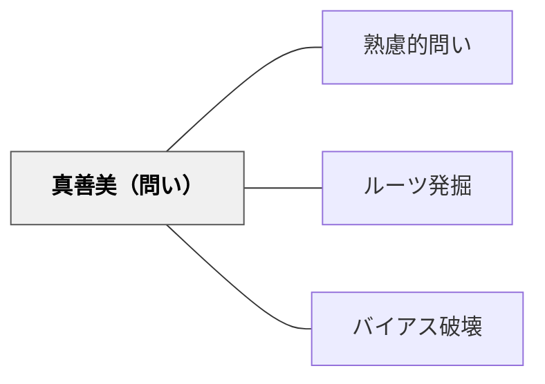

# 真善美（問い）

> 「美しいか・正しいか・役立つか」と根底にある哲学的な価値観を探る問い。

## 背景（Context）
牧口常三郎は価値を「美・利・善」の三類型で捉えた。
この枠組みは、あらゆる判断や行為の背景にある価値基準を明示するための道具として機能する。
教育の場では、アイデアや作品・行為を評価するとき、どの価値軸で見るかによって評価が異なる。
「なぜこれが良いのか」を問うとき、何を「良さ」の基準にしているかを問わないと議論はすれ違う。

## 問題（Problem）
対話や評価の場で、価値の軸が暗黙のうちに異なっており、議論が噛み合わないことがある。
「美しい解決策か」「倫理的に正しいか」「実際に役立つか」は別々の問いであるのに、混同されやすい。
学習者が自分のこだわりや判断の根拠を問われても、価値の言語を持たないために答えられない。

## 力のかたち（Forces）
- 美・善・利は互いに独立した評価軸であり、一方を満たすことが他方を損なう場合もある。
- 価値の問いは抽象的すぎると答えにくくなるため、具体的な事例と組み合わせる必要がある。
- 哲学的な問いを日常の言葉で問うことで、誰もが参加できる対話になる。
- 価値観の違いを「どちらが正しいか」ではなく「どの軸で見るか」として扱うと議論が建設的になる。

## 解決（Solution）
「これは美しいか（真）・正しいか（善）・役立つか（利）」という三つの問いを意識的に使い分ける。
一つのアイデアや作品に対して、三つの軸からそれぞれ問うワークを設計する。
学習者が「自分はどの価値を最も大切にしているか」を語る対話の場を設ける。
牧口の価値三類型を解説せずとも、「美しさ・正しさ・役立ち」という日常語で問いを立てることができる。

## 結果（Consequences）
評価や判断の背後にある価値の軸が明示され、議論が構造化される。
学習者が自分の価値観を言語化する力を養い、倫理的・審美的・実用的思考が育まれる。
三軸のトレードオフを意識することで、単純な「良い・悪い」を超えた複眼的思考が生まれる。
哲学的な問いへの慣れが必要なため、最初は具体的な事例を用いた足場かけが重要となる。

## 関連パタン
- [[パタン/熟慮的問い]] — 親パタン
- [[パタン/ルーツ発掘]] — 価値観の背景を掘り起こす
- [[パタン/バイアス破壊]] — 価値の前提を問い直す

## クラスター図

## Actionable Insight

- 作品や解決策を評価するとき「美しいか・正しいか・役立つか」の三つの問いを順番に問う——価値の軸が明示されると議論が建設的に構造化される
- 「あなたはこの解決策のどこに一番価値を感じますか？美しさ・正しさ・役立ちのどれ？」と問う——価値基準を自分の言葉で語る練習が倫理的・審美的思考を育てる
- 一つの事例に対して「美しい解決か・倫理的に正しいか・実際に役立つか」を別々に問う授業活動を設ける——三軸のトレードオフを経験することで複眼的思考が生まれる

## 出典
- [[文献/熟慮的問いのパターンリスト（動画記録）]]
- 牧口常三郎（1903）『人生地理学』聖教新聞社
