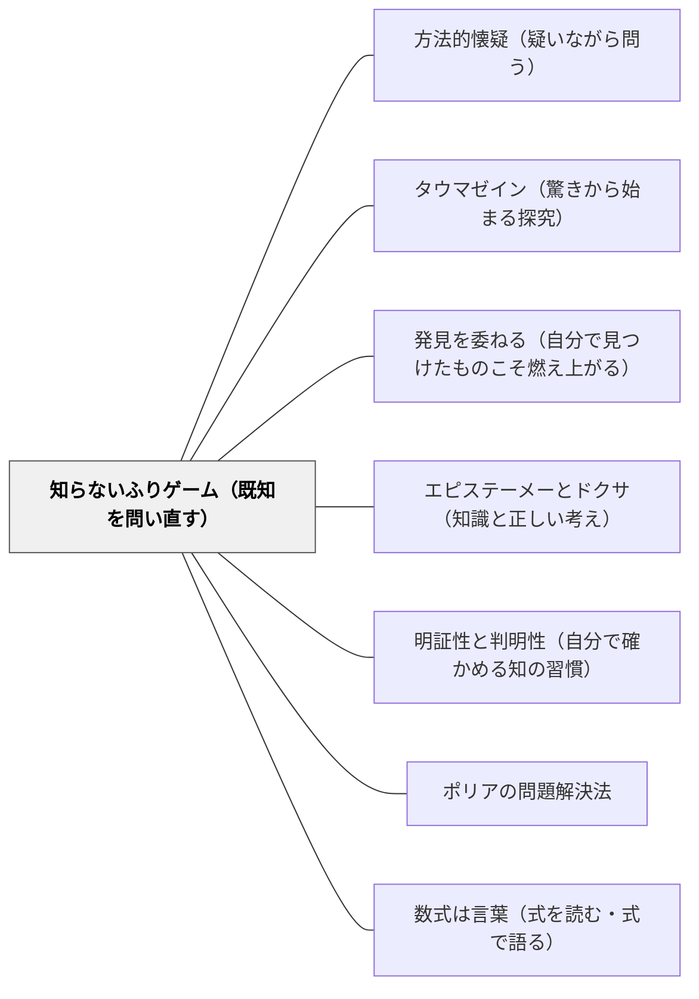

# 知らないふりゲーム（既知を問い直す）

> 「知らないふりをして、ゼロから考え直してみよう。」（第4章 ミルカ、知らないふりゲームの命名）

---

## [Pattern Connection]

**数学ガールの物理ノート／ニュートン力学（結城浩, 2024）統合：**

ミルカが第4章「力学的エネルギー保存則」において命名・実践する探索法。「力学的エネルギー保存則を知っている」として公式を使うのでなく、「まだその法則を知らない人間として、運動方程式だけから何が導けるか」を問い直す。これにより「なぜその公式が成り立つのか」が発見として経験される。

- **既存パタンとの関連**:
  - [[パタン/方法的懐疑（疑いながら問う）]] との根本的な接続——デカルトの方法的懐疑（「明証的でないものを括弧に入れる」）の数学・物理版。知っているつもりのものを「括弧に入れ」、「もし知らなかったら？」から問い直す。ゲームとして軽く実践できる形式的な懐疑。
  - [[パタン/タウマゼイン（驚きから始まる探究）]] との接続——「知っている」公式は驚きを生まない。「知らないふり」をすることで、発見の驚き（タウマゼイン）が再生される。既知を未知に変える意図的な認識の組み替え。
  - [[パタン/発見を委ねる（自分で見つけたものこそ燃え上がる）]] との深い接続——教師が「発見を委ねる」とき、子どもは「知らないふり状態」にある。「知らないふりゲーム」はその状態を自分で意図的に作り出す力である。

- **補強された点**:
  - [[パタン/エピステーメーとドクサ（知識と正しい考え）]] の「ドクサからエピステーメーへ」——「なんとなく知っている」（ドクサ）を「なぜそうなるか自分で確かめた知識」（エピステーメー）に高める具体的実践として機能する。
  - [[パタン/明証性と判明性（自分で確かめる知の習慣）]] の「四問テスト」——「別の場面でも使えるか」という転移の確認は、「知らないふりで再導出できるか」に対応する。

- **他のパタンへの波及**:
  - [[パタン/数式は言葉（式を読む・式で語る）]] — 「知らないふりゲーム」は数式を「覚えた言語」でなく「考える道具」として再体験させる。
  - [[パタン/ポリアの問題解決法]] — 「何も知らなければどこからスタートするか」という問いは、ポリアの「与えられているものは何か」の徹底した応用。使えるものを最小化することで問題構造が見える。

---

## 背景（Context）

算数・数学を学ぶ過程では、多くの知識が「教わった事実」として蓄積される。九九、割り算の筆算、分数の計算——それらが「なぜそうなるのか」を忘れても、手続きとして使えてしまう。手続きとして使える知識が増えると、「なぜ？」という問いを立てることが難しくなる。

「知らないふりゲーム」は、そのような「手続きとして知っているが理由が分からない」状態に対して、「もし何も知らなかったら、ここから何が導けるか？」と問い直す実践だ。

ミルカが力学的エネルギー保存則の導出でこれを実践する——「わかっている結論（力学的エネルギーが保存される）を使わず、運動方程式という道具だけで、保存則を再発見できるか」。

## 問題（Problem）

「知っている」ことが「理解している」の代わりになる：

- 公式を知っているが、その公式がどこから来たかを言えない
- 計算手続きが分かるが「なぜその手続きが有効か」が分からない
- 「覚えた」から問い直す動機が生まれない——知識の終着点になってしまう
- 「すでに知っている」ため、「発見の経験」がない——手渡された知識と自分で見つけた知識の差が生まれない

## 力のかたち（Forces）

- 「知らないふり」はコストがかかる——すでに知っているものをわざわざ「忘れる」には認知的努力が必要
- 「ゲーム」という形式が実践を可能にする——ふりを「許可」する枠組みがあると実践できる
- すべての知識で「知らないふり」をするのは現実的でない——どこで使うかの優先順位が必要
- 「知らないふり」の出発点となる「最小限の道具」が必要——何も使えなければ発見に到達できない

## 解決（Solution）

**「知らないふりゲーム」として、既知の結論を「まだ知らない」として括弧に入れ、より基礎的な道具だけで再発見する経験を作る。教師が「みんなこの公式知ってるよね？今日は知らないふりして、ゼロから考えてみよう」と宣言することで、問い直しが許可される。**

---

### 知らないふりゲームの三段階

**1. 括弧に入れる**: 「今日は〇〇を知らないことにしよう。」既知の結論を一時的に保留する。

**2. 道具を確認する**: 「代わりに何なら使っていいか？」使えるものを明示する。（ミルカの場合: 運動方程式と微積分のみ。教室なら: 図・かけ算・特定の既習事項のみ。）

**3. 再発見を経験する**: 「その道具だけで、どこまで行けるか？」進んだとき、既知の結論に到達すれば「発見」が起きる。

---

### 具体例

**例1: 算数「分数の割り算」**
「ひっくり返してかけるのは知ってるよね。今日は知らないふりして、なぜひっくり返すと正しいか考えてみよう。」——具体的な数字（2÷1/3 = ?）と図だけを道具に、手続きを再発見する。「1/3がいくつあれば2になるか」から考え直す経験が、手続きの意味を明らかにする。

**例2: 算数「面積=縦×横」**
「面積の公式は知ってる。でも知らないふりして、1cmずつ数えることしか知らなかったとしたら、なぜ縦×横で出せるの？」——公式の意味を再発見する。「縦に何個、横に何個で、全部でいくつ」という構造が見える。

**例3: 理科「浮力」**
「アルキメデスの原理は知ってる。でも知らないふりして、押しのけた水と関係があることだけ分かってるとしたら、何が言える？」——実験から法則を再構成する発見の経験。

**例4: 岩井の数学デイリー**
解法を知っている問題を「知らないふり状態」で解き直す——「手続きを実行する」から「なぜこの手続きが使えるか」を自問する習慣。理解の「地層」を掘り下げる実践。「答えは合っていたが、なぜこの方法が使えるかを知らないふりで考え直した」という形式。

## 結果（Consequences）

- 「覚えた知識」が「理解した知識」に転換される——再発見の経験が、既知に新しい意味を与える
- 「なぜ？」を問う習慣が育つ——一度「知らないふり」が成功すると、他の知識にも疑問が向かう
- 「証明より発見」（テトラ）の状態が生まれる——証明の後に「でもなぜこの形になるのか」が問える
- ただし: 時間がかかる——全単元でこれをするのは現実的でない。「なぜ？」の問いに値する核心的概念の場面で使う

## 関連パタン

- [[パタン/方法的懐疑（疑いながら問う）]] — 知らないふりは方法的懐疑の実践形式
- [[パタン/タウマゼイン（驚きから始まる探究）]] — 既知を未知に変えて驚きを再生する
- [[パタン/発見を委ねる（自分で見つけたものこそ燃え上がる）]] — 自分で見つける経験の自己生成
- [[パタン/エピステーメーとドクサ（知識と正しい考え）]] — ドクサをエピステーメーに高める実践
- [[パタン/明証性と判明性（自分で確かめる知の習慣）]] — 「転移できるか」という確認の実践形式
- [[パタン/ポリアの問題解決法]] — 「与えられているものは何か」の徹底した確認
- [[パタン/数式は言葉（式を読む・式で語る）]] — 数式を「知らない言語」として再体験
- [[文献/数学ガールの物理ノート・ニュートン力学（結城浩）]] — 本パタンの出典

---

## クラスター図

## Actionable Insight

- 「今日は知らないふりゲームをします」と宣言してから問いを出す——ゲームという名付けが「公式を使わない」を許可し、子どもに問い直す余地を与える
- 「この公式を使わないで、この結果に到達できる？」という問いを算数の単元の中に1回入れる——どこで使うかより、1回でも「発見の経験」を作ることに意味がある
- 自分（教師）が「知らないふりゲーム」をしてみる——「この公式はなぜ成り立つか、知らないつもりで考えてみる」という自己実験が、授業設計のヒントになる

---

## 出典

結城, 浩（2024）.『数学ガールの物理ノート／ニュートン力学』SBクリエイティブ. 第4章.
