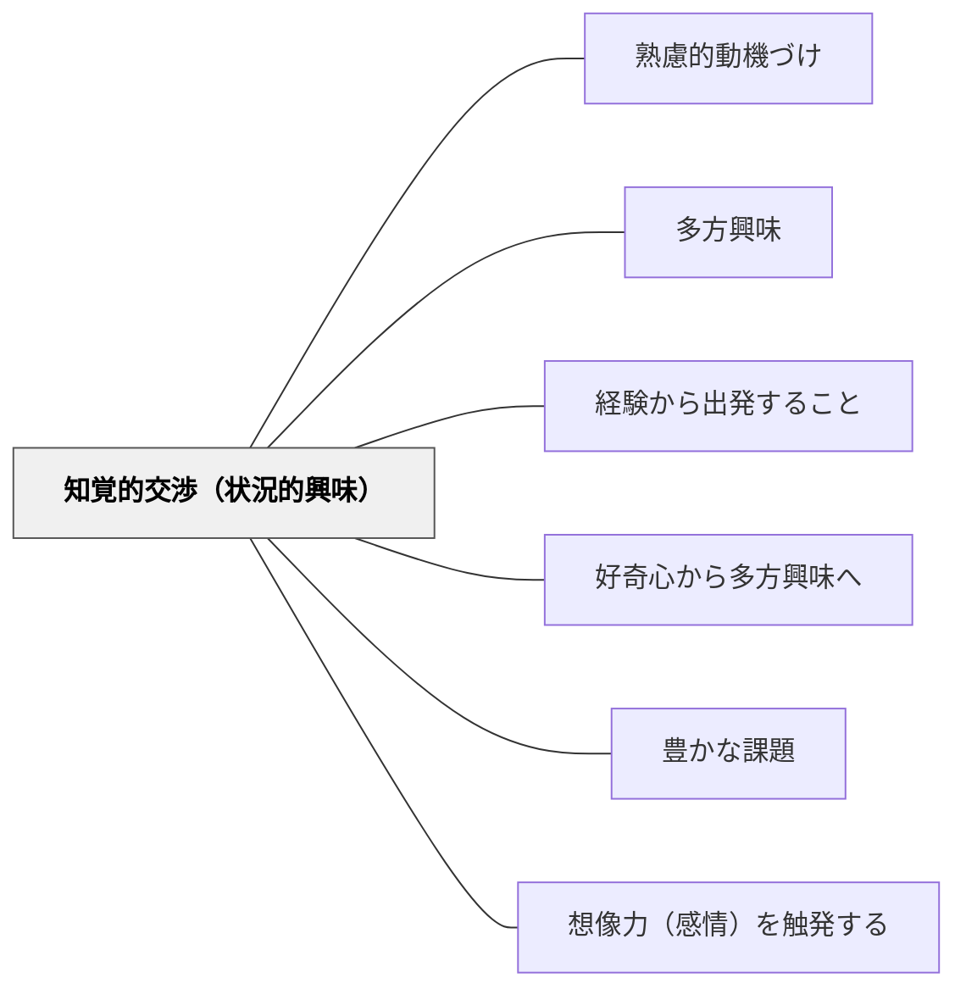

# 知覚的交渉（状況的興味）

> 直接触れて、見て、感じることから、学習への入り口が開く。

## 背景（Context）
ヘルバルトの多方興味論および牧口常三郎の教育理論における「知覚的交渉」。自然・社会・物など、外界との直接的な感覚的接触から生まれる興味・関心を指す。影踏み遊びから光の反射を学ぶなど、まず直接体験・出会いが学習の入り口となる。状況的興味（Hidi & Renningerの興味発達論の第1段階）とも対応する。

## 問題（Problem）
教室での抽象的な説明から入ると、学習者が「これは自分には関係ない」と感じて動機が生まれない。学習内容が日常の体験とつながっていないため、知識が孤立した情報として処理されやすい。

## 力のかたち（Forces）
- 直接体験は記憶に残りやすく、感情との結びつきが強い
- 全員が同じ体験から同じ興味を持つわけではない
- 体験の提供には教室の外に出る必要がある場合もある
- 状況的興味は一時的なため、個人的興味へ育てる支援が必要

## 解決（Solution）
**授業の導入に直接体験・観察・操作を組み込み、学習内容と日常の感覚的世界をつなぐことで、自然な興味の入り口を作る。**

野外観察・実験・触って確かめる活動などを授業に組み込む。「なぜこうなるの？」という自然な疑問が生まれる仕掛けを設ける。影踏み・料理・工作など日常的な活動から学習内容への橋を架ける。

## 結果（Consequences）
- 学習内容への自然な興味・疑問が生まれやすくなる
- 体験に基づく記憶が概念理解の足場になる
- 状況的興味から個人的興味への発展のきっかけが生まれる

- [[概念/動機づけ]] — 状況的興味の動機付け理論的背景

## クラスター図

## Actionable Insight

- 授業の導入に「触る・見る・聞く・動かす」直接体験を1〜2分設ける——感覚的な接触が「なぜこうなるの？」という自然な疑問を生む入り口になる
- 日常の活動（料理・遊び・観察）と学習内容の橋を意識的に設計する——学習者の生活とつながった体験が状況的興味を個人的興味へ発展させる足場になる
- 体験の後に「今感じたことで不思議だと思ったことは？」と問いかける——体験が問いを生む、という循環が探究的な学びの態度を育てる

## 出典

- 一つの教育のパタン・ランゲージ（岩井輝久）

## 関連パタン
- [[パタン/熟慮的動機づけ]] — 親パタン
- [[パタン/多方興味]] — 上位パタン
- [[パタン/経験から出発すること]] — 経験を学習の起点とするパタン
- [[パタン/好奇心から多方興味へ]] — 興味発達の連続性
- [[パタン/豊かな課題]] — 状況的興味を引き出す豊かな課題設計
- [[パタン/想像力（感情）を触発する]] — 知覚的刺激が感情・想像力を動かす
