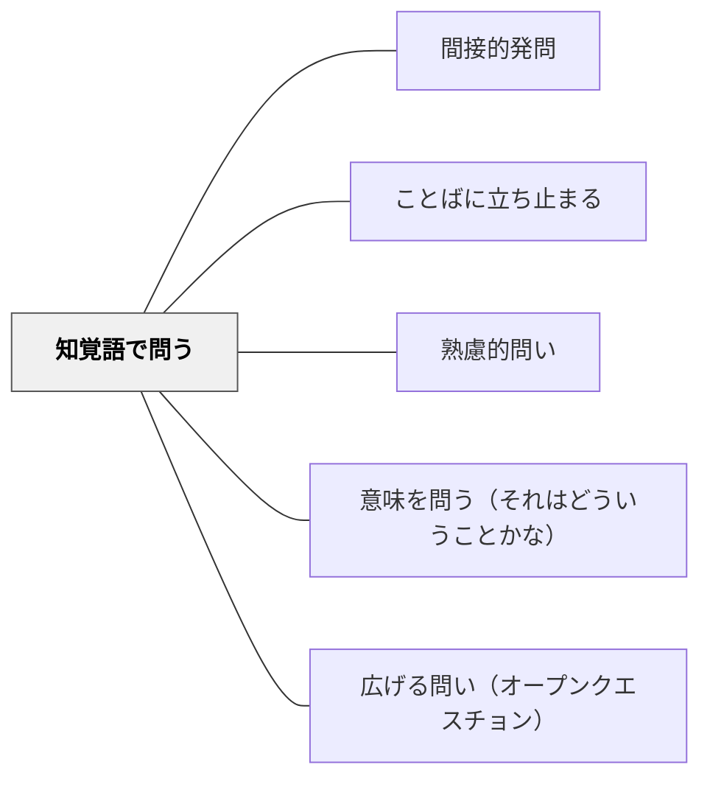

# 知覚語で問う

> 「どんな感じがする？」「どう見える？」と感覚的・身体的な言葉で問い、身体性と学びをつなぐ。

## 背景（Context）
抽象的な概念や論理的な説明に偏った学習では、身体感覚や感覚的なイメージが切り離されてしまう。しかし人間の理解は身体性と深く結びついており、感覚的な言葉で問うことで、抽象的な概念に身体的なリアリティを与えられる。

## 問題（Problem）
「なぜ？」「どう思う？」という問いは言語的・論理的な思考を呼び出すが、感覚的・直感的な理解が引き出せないことがある。知覚語を使わなければ、学習者の身体的・感覚的な理解の層にアクセスできない。

## 力のかたち（Forces）
- 感覚的な言葉は直感的な理解を引き出しやすい
- 「見える」「聞こえる」「感じる」は敷居が低く答えやすい
- 身体的な表現から論理的な説明へ橋渡しができる
- 感性と理性の両方を活かした学びが深まる

## 解決（Solution）
「これを見てどんな感じがする？」「手で触ってみてどう感じた？」「この音楽を聴いてどんな色が浮かぶ？」「この計算問題、解けそうな感じがする？難しそうな感じ？」と知覚的な言語で問いかける。たとえば理科で「この実験を見てどんな感じがした？予想と違うものを感じた？」と感覚を起点に考えさせる。

## 結果（Consequences）
- 身体感覚が学びの入口となり、概念が身近になる
- 感覚的な理解が言語化されることで、思考が豊かになる
- 多様な感覚・感性をもつ学習者が参加しやすくなる

## 関連パタン
- [[パタン/間接的発問]]
- [[パタン/ことばに立ち止まる]]
- [[パタン/熟慮的問い]] — 親パタン
- [[パタン/意味を問う（それはどういうことかな）]] — 感覚を意味へ変換する
- [[パタン/広げる問い（オープンクエスチョン）]] — 多様な答えを引き出す

## クラスター図

## Actionable Insight

- 授業の問いに「どんな感じがする？」「見てどう感じた？」を1つ加える——感覚的な言葉が敷居を下げ、多様な学習者が参加しやすくなる
- 抽象概念を学ぶ前に「これを触ったら/聞いたら/見たらどんな感じがしそう？」と身体的想像を促す——感覚的イメージが先にあることで概念の理解が身体的リアリティを持つ
- 感覚的な答えが出た後に「それって何が起きているから？」と言語化の橋渡しをする——感覚から論理への移行が理解の深みと豊かさを両立させる

## 出典
- [[文献/熟慮的問いのパターンリスト（動画記録）]]
