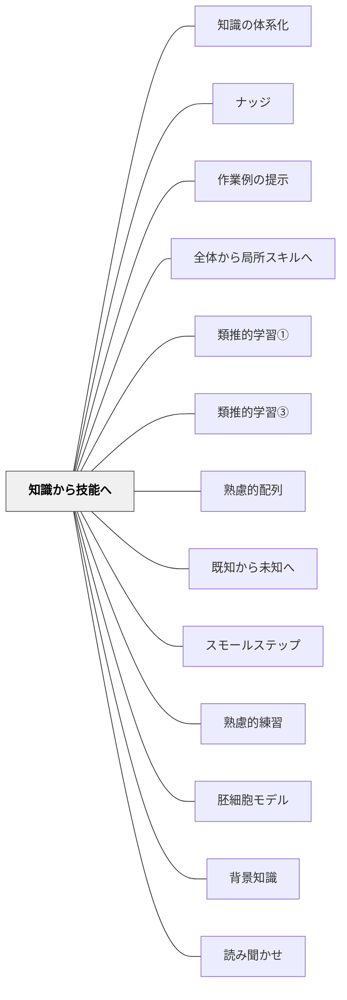

# 知識から技能へ

> 技能は、その技能を支える知識が育ったときにはじめて確実に伸びる。

---

## Pattern Connection

**ペスタロッチ（1801）ゲルトルート児童教育法 統合——Können（技能の形成）の並行発展：**

- **技能（Können）を独立した教育目標として定式化**：ペスタロッチは本書の後半で、知識（洞察）だけを教えることへの強い批判を展開した。「感覚の人よ！欲望と欲求のために、知り、考えなければならない。しかし、この欲求のために、行動し、できるようになければならない」——知ることと「できること（Können）」は、分離して育てるものでなく並行して発展させるものである。
- **同じ有機的法則に従う**：ペスタロッチは「技能の形成は、知識の形成が基づいているのと同じ有機的法則の上に成り立っている」と明言した。「有機的法則」とは心理学的順序（単純→複雑、感覚的→概念的）のことである。知識習得と技能形成は別々のルートではなく、同じ認識の発展プロセスの二側面である。
- **背景（Context）セクションとの接続**：本パタンの背景に記載されている「ペスタロッチ主義の原則（1883年「改正教授術」）」の配列原則はすべて、ペスタロッチが1801年の本書で打ち立てた「心理学的順序」を源流とする。「知識から技能へ」は認知科学的な追加であると同時に、ペスタロッチが「知識と技能の並行発展」として既に論じていたことの現代的再発見でもある。
- **技能練習と意味づけの対応**：ペスタロッチが「意味のない技能練習（洞察力のない知識）は最も恐ろしい贈り物である」と述べたことは、本パタンの「何が分からないかも分からない状態での練習」という問題設定と正確に対応する。
- **波及するパタン**：[[パタン/スモールステップ]] — 技能形成の段階性；[[パタン/感性と悟性の協働]] — 知識と技能を架橋する認識論；[[文献/ゲルトルート児童教育法（ペスタロッチ）]] — 本統合の出典

---

**Willingham（2015）統合（2026-05-17）：**

*Raising Kids Who Read* は「知識から技能へ」の原則を読書教育の文脈で実証する最も具体的な文献の一つだ。同著者の *Why Don't Students Like School?*（2019）が「背景知識が読解技能を上回る」という一般原則を示したのに対し、*Raising Kids Who Read*（2015）はその原則が**読書指導の設計にどう影響するか**を発達段階ごとに詳述している。→ [[文献/Raising Kids Who Read（Willingham）]]

- **第3学年の転換点（Grade 3 Shift）**：就学前〜2年生は「デコーディング（文字を読む技能）」が読書の壁。3年生以降は「背景知識」が壁になる——「文字は読めるが意味が取れない」子は技能（読解ストラテジー）でなく知識が不足している。「知識が先行して習得されてはじめて技能が機能する」という本パタンの原則の、発達段階的な証拠
- **ストラテジーの頭打ち**（Rosenshine et al., 1994, 1996; Suggate, 2010）：読解ストラテジー（推論・接続・質問生成等の技能）は5〜10セッションで効果が頭打ちになり、さらに練習しても伸びない——「ストラテジーは何をすべきかを教えるが、どうやるかは教えられない。なぜならそれは内容知識に依存するから」。知識なしに技能練習を繰り返しても限界がある、という直接的なエビデンス
- **自己教授仮説（Share, 1995）との連動**：フォニックスの知識（文字と音の対応ルール）を習得した子は、繰り返し読むことでスペリング経路（単語全体の視覚的認識という新たな技能）を「自己教授」で習得する——先行する知識の習得が後続の技能習得を自動的にトリガーする具体例
- **状況モデル（Kintsch, 2012）**：読解という技能は「頭の中に場面イメージ（状況モデル）を作る」作業。状況モデルを作るには背景知識が必要——「技能（読む）」が発揮されるためには「知識（内容の前提）」が先に必要という、読解の構造的な証明

**既存ページとの接続**：

- 研究的根拠②（Willingham, 2019）の野球実験——背景知識が読解技能を上回る——と本統合は同一著者の連続する主張。2015年版はその原則を「どの年齢で・どの指導に適用するか」という実践設計に落とし込んでいる
- **他のパタンへの波及**：[[パタン/背景知識]] — 「技能を支える知識」の代表例として読解における語彙・世界知識の蓄積を位置づける。[[パタン/読み聞かせ]] — 読み聞かせは技能練習の前に知識・語彙を先行させる最も効率的な手段

---

## 背景（Context）

[[パタン/熟慮的配列]] の技能形成次元。ペスタロッチ主義の原則（1883年「改正教授術」）には、次のような順序に関する教育パターンがある：

- 近なものから遠くへ
- 基地から道へ
- 形あるものから無形へ
- 具体から抽象へ
- 総合から分析へ
- 観念から表出へ
- 単純から複雑へ
- 特殊から一般へ

**「知識から技能へ」はこれらに新しく加わるもの**——その後の認知科学の研究知見を踏まえて追加された配列原則である。「練習すれば技能がつく」という直線的な理解に対し、技能習得には関連する**知識の先行習得**が重要な役割を果たすことが示されている。

## 問題（Problem）

技能の練習を繰り返しているのになかなか伸びない。理由の一つは、その技能を支える背景知識がないまま練習しているため、「何をしているのか」「なぜそうするのか」が分からず、技能の意味づけができていないことにある。

## 力のかたち（Forces）

- 背景知識があることで「何が分からないか」が分かり、問いが生まれやすくなる
- 知識がなさすぎると、技能の練習中に何をすべきか判断できない——何が分からないかも分からない
- 知識だけ先に教えすぎると、技能練習への動機が薄れることもある
- 知識と技能の往復が最も深い習得を生む
- 言葉・概念・知識そのものが、技能の転移と定着を支える

## 解決（Solution）

**技能の練習に入る前に、その技能と関連づけた知識を先に教えよ。**

知識があることで、技能練習の意味と方向が学習者に分かるようになる。技能に関連する知識を先に教えることで、生徒は技能を習得しやすくなる。

---

### 研究的根拠①：三宅・ノーマン（1979）——質問は知識があって生まれる

三宅とノーマンは「人がどのように質問するのか」を調べた。**予習のあり/なし × 教材の難しい/易しい**の2条件×2条件（4通り）で実験した。

結果：**実験参加者が難しい教材で学ぶとき、または予習していない参加者が易しい教材で学ぶとき**——つまり「ある程度学ぶことと背景知識のギャップがあり、何が知りたいかが分かる程度の準備がある」ときに質問が出やすいことが明らかになった。

逆に、**予習していない学習者が難しい教材を学ぶとき**は、知識のギャップが大きすぎて「何が分からないかも分からない」という状態になる。

→ 問は知識があって初めて生まれる。子どもたちに質問を出せるようになってほしいと思ったとき、背景知識があることで質問が出やすくなる。

---

### 研究的根拠②：Willingham（2019）——知識の効力は読解力を上回る

Willinghamは、**分析したり批判的に考えたりする認知的技能を習得するには、幅広い事実的な知識が要求される**ことを多くの実験・事例を通して指摘した。

具体的な実験：**野球の試合の半イニングを説明した文章を読む**という課題。
- 読解が得意な生徒は苦手な生徒よりも理解力が高かった
- しかし**この読解力の効力は、野球知識の効力と比べてわずかだった**
- 野球についてよく知っている生徒は、よく知らない生徒よりもずっとよくこの一節を理解できた

→ 読解という技能よりも、背景知識の方が理解に与える影響が大きい。

---

### 研究的根拠③：Gentner（2015）——筋かい実験（最も詳細・具体的）

Gentnerたちは、**比較による類推的トレーニングが、建築技術の原理である「筋かい（ブレース）」を子どもたちが理解することを助けるかどうか**をテストした。

**筋かい（bracing）とは**：柱と柱の間に斜めに入れて建築物や足場の構造を補強する部材のこと。

#### 実験デザイン

6〜8歳の子ども **91人**（と保護者）が3条件に割り当てられた：

| 条件 | 人数 | 内容 |
|------|------|------|
| ハイアライメント | 30人 | 比較しやすい2つの建物モデルで類推的トレーニング |
| ローアライメント | 31人 | 比較しにくい2つの建物モデルで類推的トレーニング |
| ノートレーニング | 30人 | トレーニングなし |

#### トレーニングの内容

**ハイアライメント**条件では、**幅・高さが全く同じ**2つの建物モデルが与えられる。一方は筋かいが2つ入っていて安定、もう一方は筋かいの代わりに**2つの水平の横材**が入っていて不安定。筋かいと水平横材のコントラストが明確で、比較対応関係を見つけやすい。

**ローアライメント**条件では、**幅が違い、いくつかの横材が突き出ている**2つの建物が与えられる。一方は筋かいあり（安定）、もう一方は筋かいなし（不安定）。しかし比較対象の対応関係を探すことが難しく、筋かいと水平横材のコントラストに気づきにくくなっている。

トレーナーは子どもたちに2つの建物モデルを比べてどちらが安定しているか予想するように求め、実際に動かして確かめる。**「どちらの建物が強いか」という質問に94%の子が正解した。**

その後、子どもたちは保護者と**12〜15分間、建物の模型をできるだけ高く構築する**活動に取り組んだ。

#### 結果①：自発的に筋かいを置けたか

91人中56人が建物の内部に構造材を置くことができた。そのうち**自発的に筋かいを置けた**のは22人：

- ハイアライメント：**8人**
- ローアライメント：**12人**
- ノートレーニング：**2人**

ハイとローの間に大きな差はなかったが、**トレーニングあり（ハイ+ロー）の子たちはノートレーニングの子たちと比べて筋かいを入れる傾向が強かった**。

#### 結果②：修理テスト

3つの条件の子どもたちに「建物がグラグラしているから安定するように修理してほしい」と依頼した——筋かいを置くことができるかをテストするもの。構造材を水平に入れるのか、垂直に入れるのか、筋かいを入れることができるのか。

**修理するテストでは、ハイアライメント条件の子たちがローアライメントとノートレーニング条件の子たちよりも筋かいを入れることに成功する傾向にあった。**

#### 結果③：親が概念語を使った場合の効果

建物を構築する活動で、**両親が「筋かい」概念に関連する言葉を少なくとも1回でも使っていた場合**、修理テストで3つのどの条件の子どもたちも、言葉を使っていない場合よりも成功する傾向にあった。

#### 結論

この実験が示すのは：
1. **たった1つの類推的な比較をする経験が、子どもたちが建築の原理を理解することを助ける**
2. **言葉・概念・知識は大事**——「筋かい」という言葉を親が使うだけで、子どもたちの成功率が上がる

---

### 知識・概念・言葉の重要性——Wiggins とヴィゴツキー

ウィギンズ「理解をもたらすカリキュラム設計」にあるキーコンセプト（key concepts）の考え方——**概念は体系の中でのみ自覚性と汎性（転移可能性）を獲得できる**というヴィゴツキーの考えに接続して理解が深まる。

「筋かい」という言葉を知っていること、その概念が何を指しているかを理解していることが、技能（実際に筋かいを使って建物を安定させること）の習得を支える。知識・言葉・概念のない技能習得は、何が分からないかも分からない状態での練習になってしまう。

---

## 結果（Consequences）

- 技能習得が速く、定着しやすくなる
- 学習者が「なぜそうするのか」を理解したうえで技能を使える
- 技能練習中の自己修正能力が高まる
- 知識・言葉・概念が技能を別の場面へ転移させる基盤になる

## 関連パタン
- [[パタン/知識の体系化]]
- [[パタン/ナッジ]]
- [[パタン/作業例の提示]]
- [[パタン/全体から局所スキルへ]]
- [[パタン/類推的学習①]]
- [[パタン/類推的学習③]]

- [[パタン/熟慮的配列]] — 上位パタン
- [[パタン/既知から未知へ]] — 技能の基盤となる既知（知識）から出発する
- [[パタン/スモールステップ]] — 技能習得を段階化する
- [[パタン/熟慮的練習]] — 意図的な練習で技能を磨く
- [[パタン/胚細胞モデル]] — 技能の背後にある胚細胞的な概念を明らかにする
- [[パタン/背景知識]] — 読書教育における「技能を支える知識」の具体——語彙・世界知識の先行蓄積が読解技能を支える（Willingham, 2015）
- [[パタン/読み聞かせ]] — 技能練習の前に知識・語彙を先行させる最も効率的な実践

## このパタンが働く実践
- [[実践/言葉をよりすぐって俳句を作ろう]]
- [[実践/個別支援級の複式算数：重さと面積をわたり・ずらしで学ぶ]]

| 実践パタン | どのように知識から技能へつなぐか |
|------------|----------------------------------|
| [[実践/10や100を単位にして計算しよう]] | 「10や100を単位として見る」という知識を、計算を説明したり自作問題に使ったりする技能へ移す |
| [[実践/カエルの算数：勝ちやすさを表で考えよう]] | 表を読む知識を、勝ちやすさを判断し理由を説明する技能へ移す |

## クラスター図

## Actionable Insight

- 技能練習を始める前に「なぜこのやり方をするのか」を5分で共有する——背景知識があるだけで練習の質が変わる
- 子どもが「分からない」と言えない状態（何が分からないかも分からない）に気づいたら、まず関連する言葉・概念を先に与える
- 授業で扱う技能の「キーワード（概念語）」を1つ決めて授業中に繰り返し使う——言葉を知っていることが技能の転移を支える

## 出典
- [[文献/一つの教育のパタン・ランゲージ]]
- [[文献/ゲルトルート児童教育法（ペスタロッチ）]]

三宅なほみ・ノーマン, D.A.（1979）「To ask a question, one must know enough to know what is not known」  
Willingham, D. T. (2019). *Why Don't Students Like School?* Jossey-Bass.  
Willingham, D. T. (2015). *Raising Kids Who Read: What Parents and Teachers Can Do*. Jossey-Bass. → [[文献/Raising Kids Who Read（Willingham）]]  
Gentner, D. et al.（2015）類推的比較と筋かい原理理解の実験（6〜8歳91人）  
Wiggins, G. & McTighe, J.「理解をもたらすカリキュラム設計」（キーコンセプト・ヴィゴツキー）  
岩井輝久「岩井輝久『一つの教育のパタン・ランゲージ』」（2026-04-29 vault収録）  
岩井輝久「パタン　知識から技能へ（動画記録）」https://youtu.be/xMMtVzsbubY
