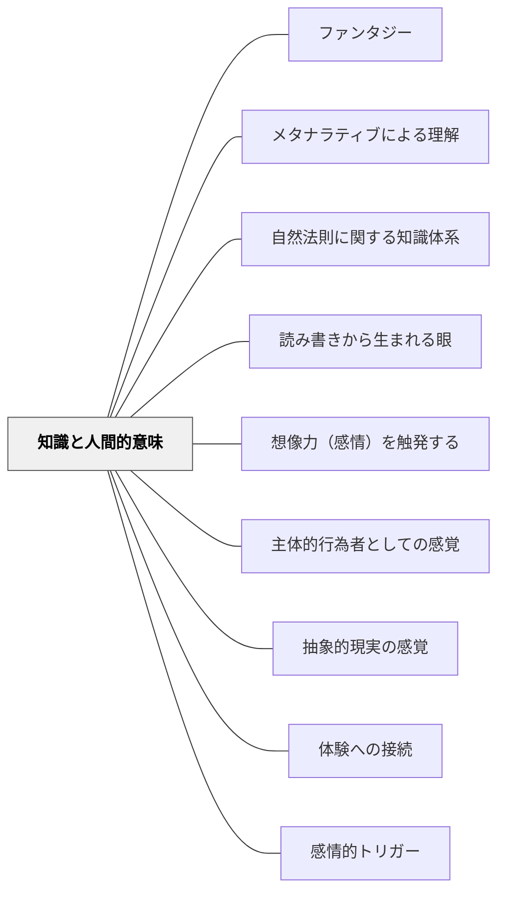

# 知識と人間的意味

> あらゆる知識には、人間の感情的・実存的意味が宿っている

## 背景（Context）

学校教育では、知識はしばしば客観的・中立的なものとして扱われる。事実や法則は感情とは無関係に存在するかのように教えられ、学習者はその知識を「外側から」習得しようとする。

## 問題（Problem）

知識が人間の営みや感情から切り離されて提示されると、学習者はその知識を自分の生と無関係なものとして受け取る。どれほど正確に教えても、学習者の中で知識が生きた意味をもたない。

## 力のかたち（Forces）

- 知識の客観性・普遍性を重視すると、個人的・感情的文脈が排除されがちである
- しかしイーガンが指摘するように、「知識は感情と無関係に存在するものはない」
- 万有引力の法則でさえ、それを発見した人間の驚き・探究・賭けと結びついている
- 感情的な共鳴がなければ、知識は記憶に定着しにくく、応用もされにくい

## 解決（Solution）

知識を教えるとき、その知識が人間にとってどのような意味をもつか、誰がどんな感情的文脈でそれを発見・形成したかを明示する。知識の「人間的側面」を前面に出すことで、学習者が知識と感情的につながれるようにする。

たとえば、万有引力を教える際には、リンゴが落ちるという日常の驚きから宇宙の運動まで同一の法則で説明できるという「発見の感動」を共有する。歴史的事実には、それを生きた人々の葛藤・希望・恐怖を重ねる。

## 結果（Consequences）

学習者は知識を「自分事」として受け取りやすくなる。記憶の定着が深まり、知識を他の文脈へと応用する意欲が生まれる。ただし、感情的文脈を過度に強調すると事実の正確な理解が薄れる危険もあるため、バランスが必要である。

## 関連パタン
- [[パタン/ファンタジー]]
- [[パタン/メタナラティブによる理解]]
- [[パタン/自然法則に関する知識体系]]
- [[パタン/読み書きから生まれる眼]]

- [[パタン/想像力（感情）を触発する]]
- [[パタン/主体的行為者としての感覚]]
- [[パタン/抽象的現実の感覚]]
- [[パタン/体験への接続]]
- [[パタン/感情的トリガー]]

## クラスター図

## Actionable Insight

- 新概念を教える前に「これを最初に発見した人はどんな状況にいたと思う？」と問いかける——発見の人間的ドラマへの共感が知識への感情的な入り口を開く
- 歴史的事実を教えるとき「そこにいた人々は何を感じていたか？」を一文添える——人間的感情と結びついた知識は記憶に定着しやすく応用への意欲を生む
- 「この知識は人間にとってどんな意味があるか？」を単元の終わりに問いかける——知識の人間的意味の言語化が学んだことを「自分のもの」に変える

## 出典

Egan, K. (2005). *An Imaginative Approach to Teaching*. Jossey-Bass.（邦訳（2010）『想像力を触発する教育――認知的道具を活かした授業づくり』北大路書房）
