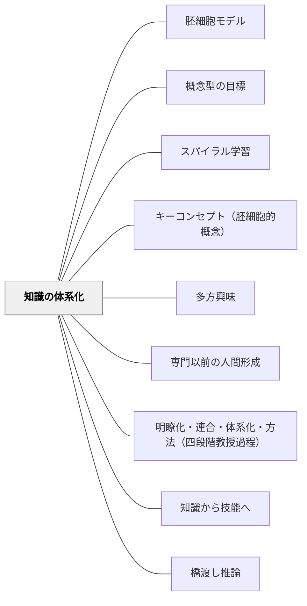

# 知識の体系化

> 「部分的な見解をつなぎ合わせ、いわば知識の全領域の地図を作りあげること」——J.S. ミル（1867年）

---

## [Pattern Connection]

### J.S. ミル（1867）大学教育について——「全領域の地図」の思想

ミルはセント・アンドルーズ大学就任講演（1867年）の中で、大学教育の役割についての最も洗練された見解として次のように述べた：

> 「学生は、それまでいろいろなところで得た知識の領域に属する部分的な見解をつなぎ合わせ、いわば知識の全領域の地図を作りあげることです。さらに具体的に申しますと、すべての知識をいかに関連づけるか、ある分野から他の分野にいかに進めうるか、高度な知識は一般的な知識をいかに修正するか、また逆に、高度な知識を理解する上で、一般的な知識はいかに役立ちうるかを考察することです。」

これは「一般教養教育の極致・完成」の定義として提示されている。

- **既存パタンとの関係**：[[パタン/胚細胞モデル]] が「単元を貫く核となる概念」を問うのに対し、本パタンは「全教科・全分野の知識がどう関係するか」という**メタレベルの地図**を問う。胚細胞モデルが1本の木を育てる技術なら、知識の体系化は森全体の地図を描く技術。
- **補強された点**：「なぜ教科横断的な学びが必要か」という問いに、ミルは「人間がよりよく世界を理解するためには、断片的知識だけでなく全体像が必要だ」という哲学的根拠を提供する。
- **他のパタンへの波及**：[[パタン/スパイラル学習]] — 体系化は一回の授業でなく螺旋的に深まる；[[パタン/専門以前の人間形成]] — 知識の体系化は人格形成の知的な柱

---

### ヘルバルト（1806）教育学綱要——「明瞭化・連合・体系化・方法」の第三段階

ヘルバルトの四段階教授過程（明瞭化 → 連合 → 体系化 → 方法）の第三段階「体系化（System）」は、個々の観念を「全体の中の位置」に定置することである。ミルの「全領域の地図」は、ヘルバルトの「体系化」を単元レベルから教育全体のレベルへと拡張したものとして読める。

→ [[パタン/明瞭化・連合・体系化・方法（四段階教授過程）]]

---

## 背景（Context）

現代の学校教育は教科別に組織されている。算数は算数、国語は国語、理科は理科——それぞれ独自の語彙・方法・真理基準を持つ。この分業体制は深い専門知識を育てるうえで効果的だが、学習者が「知識の全体像」を見渡す機会を奪うという副作用を持つ。

牧口常三郎は「一切の科学は人間の自然的・社会的・人為的環境をいずれかの方向から研究している」と述べた。すべての科学は世界という一つの対象の異なる切り口にすぎない。この事実を学習者が体験できる機会はほとんどない。

## 問題（Problem）

断片的に蓄積された知識は、文脈が変わると使えなくなる。「算数で学んだこと」は算数の問題に、「国語で学んだこと」は国語の問題にしか適用されない。

より深い問題：学習者が「なぜこの知識を学ぶのか」「この知識は他の知識とどう関係するのか」を見失う。知識が地図なく散らばった状態では、自分が今どこにいて、どこへ向かえるかが分からない。

## 力のかたち（Forces）

- 教科別のカリキュラムは深化を促すが、断片化を生む
- 「全体像の地図」がなければ転移は起きにくい
- 高度な知識は、それが支える一般的知識との関係を理解しないと「暗記された手順」になる
- 逆に、一般的知識は高度な知識によって修正・深化される
- 学習者は地図を持つことで「分からないこと」が「分からない」と言えるようになる

## 解決（Solution）

**「この知識は他のどの知識とどうつながるか」を問う場を、定期的に意図的に設けよ。**

---

### 解決①：「接続の問い」を授業に組み込む

単元・授業の中に「これは前に学んだあれとどうつながるか」という問いを定期的に設ける。

- 「算数で学んだ割合の考えは、理科のどこで使えるか」
- 「国語で書いた説明文の構造は、社会のレポートとどう似ているか」
- 「歴史の出来事を、今の社会の問題とどうつなぐか」

### 解決②：教科の「方法の違い」を見せる

各教科がどのような方法で真理を確立するかを明示する——観察（理科）・論理的推論（算数）・文献批判（歴史）・感性的判断（芸術）。

「方法の違いを知る」こと自体が、知識の地図の骨格を与える。

### 解決③：「知識の地図」を可視化する

学年末・単元末に「今年学んだことの地図」を学習者が描く活動を設ける。教師が与えた地図でなく、学習者自身が線を引く体験が体系化の感覚を育てる。

### 解決④：単元間・教科間の「橋渡し」を意図的に設計する

教師が単元設計の段階で「この単元は前の単元の何を使うか・次の単元の何につながるか」を明示する。[[パタン/スパイラル学習]] と組み合わせて、知識が螺旋状に深まる経路を見えるようにする。

---

## 結果（Consequences）

- 学習者が「なぜこれを学ぶのか」を感じ取れるようになる
- ある分野で学んだ方法を別の分野に適用できる（転移）
- 「分からないことが何かが分かる」状態——[[パタン/知識から技能へ]] の質問生成条件——が整いやすくなる
- 教師自身の教材研究・授業設計が教科の枠を越えて豊かになる
- ただし：「全体の地図」を先に渡しすぎると、探究の余地が消える。体系化は探究の後に来るプロセスでもある

## 関連パタン

- [[パタン/胚細胞モデル]] — 単元レベルの核概念。知識の体系化の「1本の木」に対する「森全体の地図」
- [[パタン/概念型の目標]] — 転移可能な概念を単元目標に据える
- [[パタン/スパイラル学習]] — 知識の体系化は螺旋的に深まる
- [[パタン/キーコンセプト（胚細胞的概念）]] — 教科横断的に機能するキー概念
- [[パタン/多方興味]] — 六種類の興味が世界との交渉の多様なチャンネルをなす。体系化の「多方向性」と対応
- [[パタン/専門以前の人間形成]] — 知識の体系化は人格形成の知的な柱
- [[パタン/明瞭化・連合・体系化・方法（四段階教授過程）]] — ヘルバルトの「体系化」段階との接続
- [[パタン/知識から技能へ]] — 体系化された知識が技能の転移を支える
- [[パタン/橋渡し推論]] — 知識間の橋を明示的に設計する
- [[概念/教養と人格形成]] — 知識の体系化が一般教養教育の「判断の層」を支える
- [[概念/知識から技能へ]] — 知識の先行が技能形成を支える（認知科学的根拠）

---

## クラスター図

## Actionable Insight

- 今週の授業の冒頭で「先週（先月・去年）学んだことと今日の内容はどうつながるか」を30秒問う——接続の意識を育てる最小の一手
- 学期末の振り返りに「今学期学んだことを5つ選んで、それがどうつながっているか矢印で結ぶ」活動を一度設ける
- 教師が単元設計で「この単元は○○科の何とつながる」を1箇所メモする習慣をつける——教師の体系化感覚が授業の言葉に滲み出る
- 算数の問題を国語の「説明文を書く」課題として出す・理科の観察記録を「推論のはしご」で読む——教科間の「橋」を一つ実験してみる

---

## 出典

Mill, J.S. (1867). *Inaugural Address delivered to the University of St. Andrews, Feb. 1st 1867*. London: Longman, Green, Reader, and Dyer.

ミル, J.S.（竹内一誠訳）（2013）．*大学教育について*．岩波文庫（34-116-10）．→ [[文献/大学教育について（J.S.ミル）]]

Herbart, J.F. (1806). *Allgemeine Pädagogik*. → [[文献/教育学綱要（ヘルバルト）]]（体系化の第三段階）

> 「学生は、それまでいろいろなところで得た知識の領域に属する部分的な見解をつなぎ合わせ、いわば知識の全領域の地図を作りあげることです。」——J.S. ミル（1867年）
