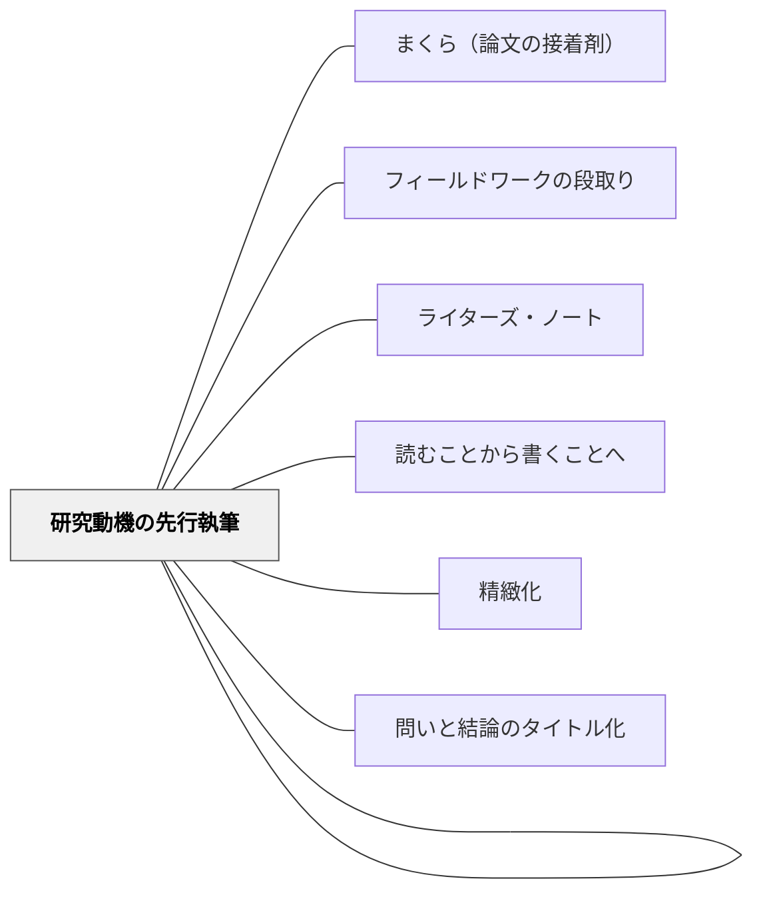

# 研究ピース

> 論文の最小単位は「ピース」——自分の言葉（まくら）で入り、人の言葉（引用）を受け取り、自分の意見（コメント）で締める。この三層構造の反復が論文になる。

---

## Pattern Connection

**卒業論文のデザイン（片岡則夫, 2025）統合（2026-05-27）：**

清教学園中学校の論文指導ガイドブック第3章「情報収集」より、研究ピースの構造を統合する。

- **既存パタンとの関連**：[[パタン/ライターズ・ノート]] での「感動詞のある読書→ノートまとめ」がピース生成の前工程にあたる。[[パタン/読むことから書くことへ]] の実践的な橋渡し
- **補強された点**：[[パタン/精緻化]] の「自分の言葉で再表現する」という原則が、まくら＋コメントの層として具体化されている
- **他のパタンへの波及**：[[パタン/まくら（論文の接着剤）]] — ピースが増えて初めてまくら（連結器）が機能する。[[パタン/フィールドワークの段取り]] — FWの記録もピース形式で書く

---

## 背景（Context）

「調べたことをまとめる」という指示だけでは、子どもは資料のコピーペーストや要約に終わってしまう。「引用してはいけない」「丸写しはダメ」とだけ言われても、では何をどう書けばいいかわからない。

また「自分の意見を書きなさい」と言っても、根拠なき感想（感想文）になりがちで、論文的な意見の書き方が身についていない。

清教学園中学校では、論文の最小単位を「ピース」と名付け、その構造を明示的に教えることで、生徒が「引用」「まくら」「コメント」の役割を理解しながら論文を組み立てられるようにしている。

## 問題（Problem）

論文を書くとき、何を「自分の言葉」で書き、何を「人の言葉（引用）」で使えばいいかの区別が曖昧なまま書き始めると、剽窃（盗用）に陥ったり、感想の羅列になったりする。

「まとめる」という概念では、資料内容の転記と自分の思考の区別が生まれない。

## 力のかたち（Forces）

- 引用には「人のコトバをそのまま写す」「文献表示をつける」「自分の言葉と区別する」の三条件が必要（引用と剽窃の違い）
- 感想（情緒的・一次的・コントロールしにくい）と意見（論理的・継続的・コントロールできる）は区別される
- 「感動詞（！？なるほど）→要約→感想→接続詞→客観的意見」という変換プロセスで感想が意見に育つ
- ピースが増えてかたまりになり章になり論文になる——ジグソーパズルのメタファー

## 解決（Solution）

**論文の最小単位「ピース」を、【まくら（自分の言葉）＋引用（人の言葉）＋コメント（自分の意見）】の三層構造として明示的に教え、この構造を繰り返すことで論文を組み立てる。**

---

### 研究ピースの構造

```
① タイトル（小見出し）  ← ピースの内容を一言で
② まくら（自分の言葉）  ← 前のピースを受け、この引用を紹介する理由・必然性を書く
③ 引用（人の言葉）      ← ボックス引用（7行以内）またはインライン引用（1〜2行）
   （著者名, 出版年, p.ページ数）
④ コメント（自分の意見）← 引用を受けて、「いいかえれば〜である」と自分の言葉で断定する
```

---

### 具体例①：読書からピースを作る

感動詞のある読書（付箋を貼る読書）から、以下の順でピースを作る：

1. 本を読みながら「！」「？」「なるほど」という感動詞が浮かんだ箇所に付箋を貼る
2. 付箋の箇所を研究ノートに書き出す（引用） → ここが③
3. なぜその箇所に感動したかを書く（感想） → ④コメントの素材
4. 「この引用に関連する、前のピースとの関係」を書く → ②まくら

---

### 具体例②：インライン引用 vs ボックス引用

| 種類 | 長さ | 書き方 |
|------|------|--------|
| **インライン引用** | 1〜2行 | まくらとコメントの行間に「〇〇」（著者名, 出版年, p.〇）と挿入 |
| **ボックス引用** | 3〜7行 | 青字で別段落にし、末尾に（著者名, 出版年, p.〇）と記す |

引用が7行を超える場合は、必要な部分だけに絞る。論文はコメント（自分の言葉）が全体の6割以上であることが望ましい。

---

### 具体例③：感想から意見へ

| 段階 | 例 |
|------|----|
| 感動詞（感想） | 「コミックマーケットすごい！」 |
| 要約 | 「コミックマーケットは、だれでも作家になれる場所をつくった」 |
| 感想 | 「こんなに面白いとは思わなかった」 |
| 接続詞＋意見 | 「いいかえれば、コミックマーケットは『だれでも作家になれる回路』を作り上げたのだ」 |

「〜と思った」→「〜である」への転換が、感想文を論文にする一歩。

---

## 結果（Consequences）

- 「ピース」という最小単位の概念が生まれることで、「書けない」状態が「ピースがまだない」という具体的な課題に変わる
- まくら＋引用＋コメントの三層が身につくと、剽窃のリスクが下がり、自分の思考が論文に明確に現れるようになる
- ピースが増えると章が見えてくるという「ジグソーパズル」の経験が、論文完成への見通しをもたらす
- コメント（自分の言葉）を6割以上書く習慣が、能動的な思考者としての読書スタイルを育てる

## 関連パタン

- [[パタン/まくら（論文の接着剤）]] — ピースとピースをつなぐ連結器
- [[パタン/研究動機の先行執筆]] — 動機が定まるとどのピースを集めるかが決まる
- [[パタン/フィールドワークの段取り]] — FWの記録もピース形式で整理する
- [[パタン/ライターズ・ノート]] — 感動詞のある読書がピース生成の前工程
- [[パタン/読むことから書くことへ]] — 読書が引用・コメントというアウトプットに変わる
- [[パタン/精緻化]] — コメントは精緻化（自分の言葉で再表現）そのもの
- [[パタン/問いと結論のタイトル化]] — ピースが揃うことで論文全体のタイトルが見えてくる

## クラスター図



## Actionable Insight

- 授業中の「まとめ」を「まくら＋引用＋コメント」の三層で書かせてみる——「自分の言葉」と「人の言葉」を色分けするだけで、子どもが自分の思考の量を意識し始める
- 読書感想文を「感動した引用文＋それに対する自分の意見（なぜそう思うか）」の形式で書かせる——感想文から意見文への最初の一歩になる
- ノートの書き方指導で「教科書の言葉（青）」と「自分の言葉（黒）」を色分けする習慣をつける——研究ピースの三層構造の先行経験になる

---

## 出典

山崎勇気・片岡則夫・南百合絵（2025）『卒業論文のデザイン：「なんでやねん」2025』清教学園中学校, pp.58-68

[[文献/卒業論文のデザイン（片岡則夫）]]
