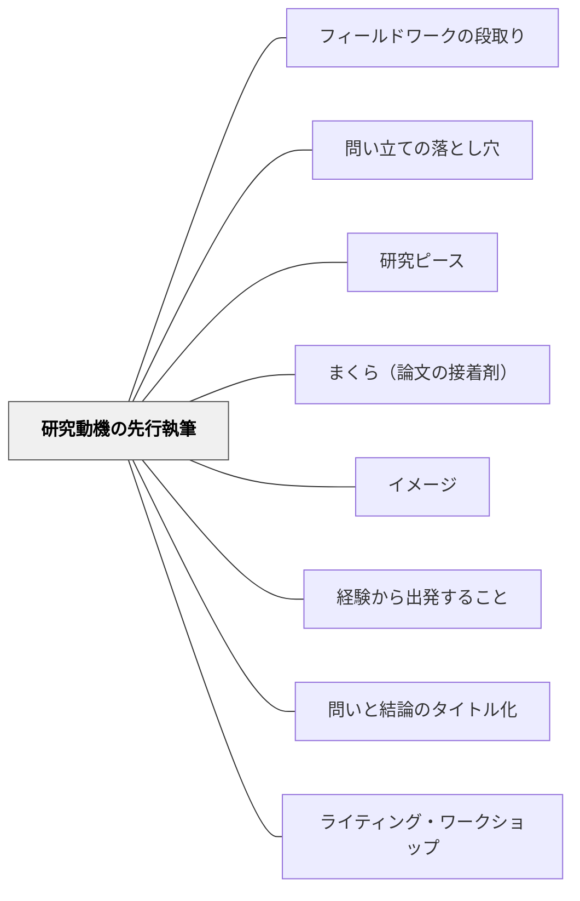

# 研究動機の先行執筆

> 論文を書き始める前に「おわりに」を書く。なぜその題材を研究したいのか、自分の動機を言語化することが、すべての研究の土台になる。

---

## Pattern Connection

**卒業論文のデザイン（片岡則夫, 2025）統合（2026-05-27）：**

清教学園中学校の論文指導ガイドブック第1章より、「はじめに『おわりに』があった」という核心的な知見を統合する。

- **既存パタンとの関連**：[[パタン/イメージ]] が「授業のゴールを先にイメージする」のと同じ原理。動機という「おわりに向かう力」が研究の駆動力になる
- **補強された点**：[[パタン/経験から出発すること]] の「個人の経験や問いから学習を始める」という原則を、長期的な探究（1年以上）に適用した形
- **他のパタンへの波及**：[[パタン/問い立ての落とし穴]] — 動機なき研究はNGテーマに陥りやすい。[[パタン/研究ピース]] — 動機が定まることでどのピースを集めるかが明確になる

---

## 背景（Context）

中学校・小学校の総合学習で、生徒・児童が「なぜそのテーマを選んだのか」を明確にできないまま調べ始めることがある。分野は決まったが、なぜそれを研究したいのかが曖昧なまま情報収集に入ってしまう。

清教学園中学校では1年半にわたる卒業論文の指導を通じて、「論文が書けない生徒は、動機が曖昧だった」という観察が積み重なってきた。テーマへの個人的な引力がないと、資料集めが義務になり、フィールドワークへの意欲も生まれない。

## 問題（Problem）

「調べたら面白そう」という漠然とした動機で研究を始めると、途中で行き詰まる。資料を集めても「だから何か」という問いに答えられない。書くべき「おわりに」（動機・感想・残された課題）が浮かばない。

「自分が知りたい」「自分が解きたい謎がある」という内発的な問いがないまま進んでいるから、論文が自分のものにならない。

## 力のかたち（Forces）

- 研究の動機は「はじめに」ではなく「おわりに」に現れる——論文の最後に書く「このテーマを研究したきっかけ」が、実は最初に確認すべき事柄
- 動機が言語化されると、どの情報が「自分の問いに関係するか」が判断できるようになる
- 動機が弱いと「ハウツーテーマ」「好き好きテーマ」に流れやすい（→[[パタン/問い立ての落とし穴]]）
- 広く学ぶことで動機が深まる——最初から絞らず、関連分野を広く読みながら動機を育てていく

## 解決（Solution）

**研究を本格的に始める前に、「おわりに」のドラフトを書く。自分はなぜこの題材を研究したいのか、この研究を通じて何を知りたいのかを、数行でよいので言葉にしてみる。**

---

#### 具体例①：動機の言語化の問いかけ

「このテーマを研究したい。でもなぜ？」という問いを、研究ノートに書かせる。

- いつ、どんなきっかけでこの題材に出会ったか
- このテーマを研究して、自分は何を知りたいか / 何に答えが出たら嬉しいか
- このテーマを研究することで、他の人にとって何が役に立つか

この「おわりに」ドラフトを担当教師やパートナーに読んでもらう。「なんで？」と聞かれて答えられるかを試す。

---

#### 具体例②：「広げながら学ぶ→絞る」順序

動機が曖昧な段階では、分野を広く読んでから絞る。

1. まず分野（例：動物・環境・歴史）を選ぶ
2. 分野に関する本を複数読み、感動詞（「！」「？」「なるほど」）を付箋でつける（→[[パタン/研究ピース]]）
3. 付箋を眺めて「自分はここが一番気になる」という部分から題材を絞る
4. 「分野→題材→テーマ（問い）」の三段階で、ゆっくり絞り込む

「無駄な勉強を恐れるな」——遠回りに見える広い読書が、動機を深め、テーマを本物にする。

---

## 結果（Consequences）

- 動機が言語化されることで、「自分のための研究」という感覚が生まれ、長期間の探究が持続しやすくなる
- 「おわりに」を先に書くことで、論文完成時に「おわりに」を書く負担が減り、全体の構成が見通せる
- 動機が弱い段階で無理に研究を進めても、途中でテーマ変更を余儀なくされることが多いという経験則から、動機確認を前工程に置く効果が大きい
- 「動機の言語化」自体が、教師が生徒の本気度を把握するアセスメントになる

## 関連パタン
- [[パタン/フィールドワークの段取り]]

- [[パタン/問い立ての落とし穴]] — 動機なき研究はNGテーマに陥りやすい
- [[パタン/研究ピース]] — 動機が定まると読書・引用の方向が決まる
- [[パタン/まくら（論文の接着剤）]] — 動機というストーリーがまくらの土台になる
- [[パタン/イメージ]] — 「おわりの姿」を先にもつという原則の共有
- [[パタン/経験から出発すること]] — 個人の経験・疑問から探究を始める
- [[パタン/問いと結論のタイトル化]] — 動機が明確になることでタイトル設計が可能になる
- [[パタン/ライティング・ワークショップ]] — ライターズ・ノートに動機を書きためる

## クラスター図

## Actionable Insight

- 探究学習や作文の最初に「なぜこの題材を選んだのか、3行で書いてみよう」と促す——動機が書けない子どもは題材を変えた方が長続きする可能性が高い
- 「調べ終わったとき、何がわかったら嬉しい？」と問いかける——答えられると、それが「おわりに」の核心であり、研究テーマの本質でもある
- 動機を友達に話させてみる——「なんで？」「それの何が面白いの？」という自然な問いかけが、動機を深める最良の足場になる

---

## 出典

山崎勇気・片岡則夫・南百合絵（2025）『卒業論文のデザイン：「なんでやねん」2025』清教学園中学校

[[文献/卒業論文のデザイン（片岡則夫）]]
