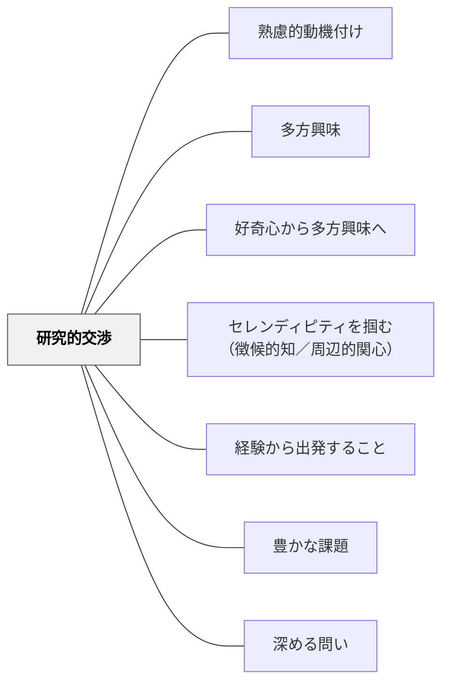

# 研究的交渉

> 「知りたい」という欲求が、探究と学びの原動力になる。

## 背景（Context）
ヘルバルトの多方興味論および牧口常三郎の教育理論における「研究的交渉」。科学的探究・調査・「なぜ？どうして？」という問いから生まれる動機。何かを知りたいと調べ・実験し・考察するプロセスへの興味が学習の動力となる。

## 問題（Problem）
教えられた知識を受け取るだけの授業では、「自分で知りたい」という探究の欲求が育ちにくい。「正解を知ること」が目標になると、問いを立てる力や、わからないことへの耐性が育たない。

## 力のかたち（Forces）
- 本物の疑問・問いが探究への強い動機を生む
- 正解が決まっていない問いのほうが探究的になりやすい
- 探究的な学びには一定の時間と自由度が必要
- 探究の過程で「わからない」に耐える力が求められる

## 解決（Solution）
**学習者自身が「知りたい」と思える本物の問いを中心に据え、調べる・実験する・考察するプロセスを学習に組み込む。**

教師が答えを持っていない問いや、複数の解釈が可能なテーマを探究の対象とする。調査・観察・実験・インタビューなど、知識を能動的に構築するプロセスを保障する。発見の驚き・面白さを大切にする文化を作る。

## 結果（Consequences）
- 学習者の自律的な探究意欲が育まれる
- 知識の受動的受容から能動的構築への転換が起きる
- 問いを立てる力・仮説思考が発達する

## クラスター図

## Actionable Insight

- 単元の導入で「先生も答えを知らない問い」を一つ提示する——教師が持っていない答えを探す場面が、本物の探究意欲を引き出す
- 調べ学習の前に「どうやって調べるか」の方法を学習者に選ばせる（観察・インタビュー・実験など）——方法を自分で選ぶことが当事者としての探究の入口になる
- 調べた結果を「答え」ではなく「わかったこと・まだわからないこと」の形でまとめさせる——疑問が残ることが探究の続きへの動機になる

## 出典

- 一つの教育のパタン・ランゲージ（岩井輝久）

## 関連パタン
- [[パタン/熟慮的動機付け]] — 親パタン
- [[パタン/多方興味]] — 上位パタン
- [[パタン/好奇心から多方興味へ]] — 好奇心と探究の接続
- [[パタン/セレンディピティを掴む（徴候的知／周辺的関心）]] — 偶然の発見を探究に変える
- [[パタン/経験から出発すること]] — 研究的な探究を体験から始める
- [[パタン/豊かな課題]] — 研究的探究を核にした豊かな課題
- [[パタン/深める問い]] — 研究的交渉が探究の問いを深める
