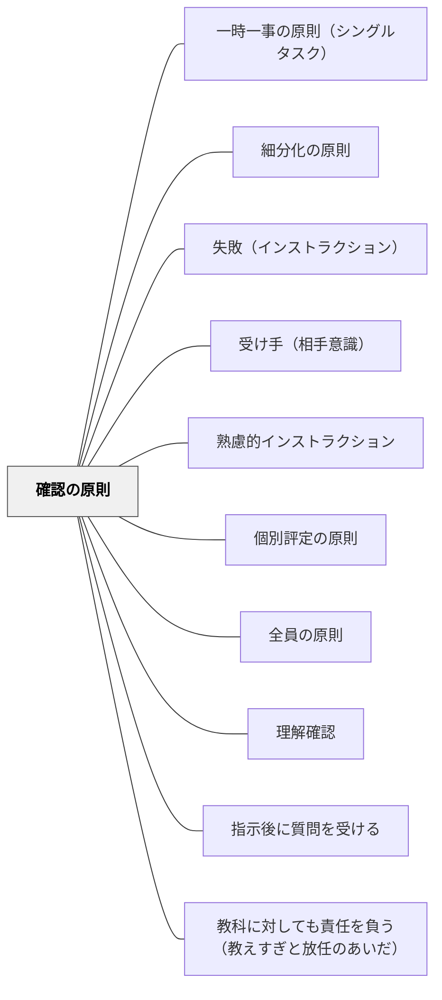

# 確認の原則

> 指示は出して終わりではない。実際にできているかを確認してこそ完結する。

## 背景（Context）
確認の原則は向山洋一（1985）『授業の腕をあげる法則』明治図書に示される10原則の一つである。インストラクションはフィードバックループを持って初めてシステムとして機能する。「指示した」と「できている」の間には大きなギャップがあり、確認によってそのギャップを埋める。

## 問題（Problem）
指示を出した後、教師がそのまま次の活動に移ってしまい、受け手が指示通りにできているかを確かめない場面がある。「言ったのにできていない」という状況は、確認の欠如によって生まれることが多い。指示が届いたかどうかを確認することが教師の責任の一部である。

## 力のかたち（Forces）
- 確認することで、指示が届いていない子への早期支援が可能になる
- 確認の方法（机間指導・挙手・発表・作品確認）によって得られる情報の質が変わる
- 過度な確認は受け手の自律性を損ない、依存を生む

## 解決（Solution）
**指示の後、机間指導・挙手確認・口頭確認・作品の確認などの方法を使って、全員が指示通りに動いているかを確かめる。**

「できた人は手を挙げて」「ノートを見せてください」「隣の人と確認してみましょう」のように、確認の方法を意図的に設計する。確認は全体→個別の順に行い、まず教室全体の状況を把握してから、できていない子への個別支援に移る。

## 結果（Consequences）
- 指示が届いているかどうかの正確な把握ができる
- できていない子への支援が早くなり、遅れが積み重なるのを防ぐ
- 受け手が「確認される」という意識を持ち、指示を聞く集中度が上がる

## クラスター図

## Actionable Insight

- 指示の後「できた人は手を挙げて」「ノートを見せてください」「隣の人と確認してみましょう」のように確認の方法を意図的に設計する——指示が届いているかどうかの正確な把握ができる
- 確認は全体→個別の順に行い、まず教室全体の状況を把握してから個別支援に移る——できていない子への支援が早くなり遅れが積み重なるのを防ぐ
- 机間指導・挙手確認を習慣化するだけで受け手が「確認される」意識を持ち指示を聞く集中度が上がる——「伝えた」でなく「できているか確かめた」を基準にする

## 出典

- 一つの教育のパタン・ランゲージ（岩井輝久）

## 関連パタン
- [[パタン/一時一事の原則（シングルタスク）]]
- [[パタン/細分化の原則]]
- [[パタン/失敗（インストラクション）]]
- [[パタン/受け手（相手意識）]]
- [[パタン/熟慮的インストラクション]] — 親パタン
- [[パタン/個別評定の原則]] — 確認後の個別フィードバック
- [[パタン/全員の原則]] — 全員への確認と連動
- [[パタン/理解確認]] — 理解面での確認パタン
- [[パタン/指示後に質問を受ける]] — 確認の一形態
- [[パタン/教科に対しても責任を負う（教えすぎと放任のあいだ）]] — 「指示して終わり」にしないことは、生徒に対する責任の最小形
