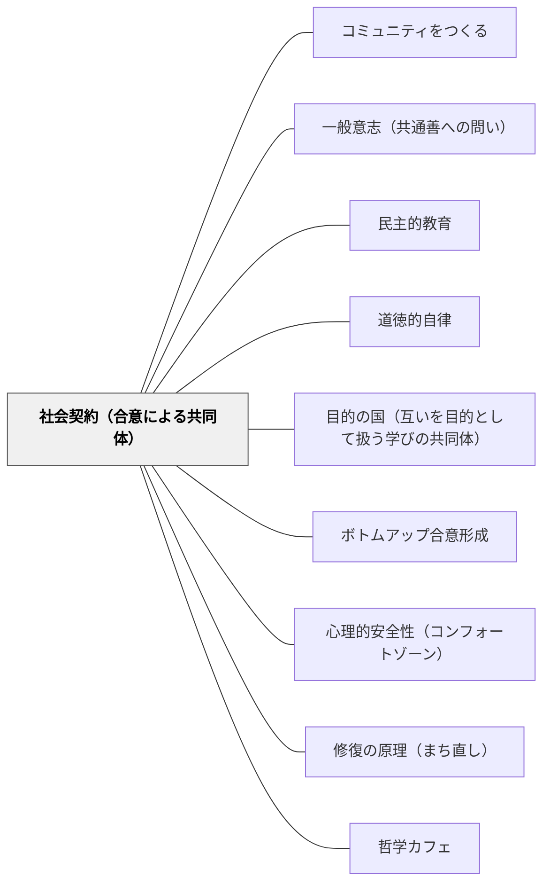

# 社会契約（合意による共同体）

> 力によって服従させるのでなく、合意によって結ばれる——これが正当な共同体の唯一の根拠。教室も同じだ。教師の力（評価・命令・罰）でなく、子どもたちの合意から生まれたルールだけが、学習者を真に内側から動かす。

## [Pattern Connection]

> 本パタンは [[パタン/コミュニティをつくる]] のPattern Connection（哲学的基盤）に統合されている。独立ページとしても機能するが、哲学的根拠としてはハブを参照。本パタンは「共同体の正当性の根拠」として、フィリア（感情的基盤）・目的の国（道徳的構造）と並ぶ三つの哲学的基盤のひとつを担う。

### ルソー（1762）社会契約論——正当な権威の唯一の根拠

**補強点**：
- ルソーが「力は権利を作りださない」と明示したことで、教師の権威の根拠が問い直される。「先生だから従う」という力の権威（実質的な強制）でなく、「みんなで決めた」という合意の権威（一般意志の表現）が教室に正当な秩序をもたらす。
- 「自由であるよう強制される」という一見逆説的な命題は、教育の核心的パラドクスとして読める。学習者が道徳的自由（自分が定めた目標への服従）に至るために、ある段階では構造・制約・課題が必要——「強制」と「自由の実現」は矛盾しない。

**拡張点**：
- 社会契約の定式「われわれ各人は、すべての人格とすべての力を、一般意志の最高の指導のもとに委ねる」は、学級での合意形成の構造として読める。誰かの意見でなく「私たちの一般意志」に従うとき、子どもは服従ではなく自律を経験する。
- 「立法者」の概念——法を自ら作らず、人民が正しく意志できる条件を設計する者——は教師の役割モデルとして機能する。教師は規則を与える者でなく、子どもたちが自分たちの規則を発見できる条件を設計する者。

**波及するパタン**：
- [[パタン/一般意志（共通善への問い）]] — 社会契約の内容（何に合意するか）を一般意志として発見する
- [[パタン/民主的教育]] — 社会契約のプロセスを日常化することが民主的教育の実践
- [[パタン/道徳的自律]] — 「自分が定めた法への服従」（ルソーの道徳的自由）からカントの自律へと深化する
- [[パタン/目的の国（互いを目的として扱う学びの共同体）]] — 合意による共同体は互いを目的として扱う関係性から生まれる

---

## 背景（Context）

学習者が学校のルールに従うとき、それが「力への服従」なのか「合意への参加」なのかで、学習者の主体性の質が変わる。ルールを「与えられたもの」として受け取るとき、子どもは従うか反抗するかしか選べない。ルールを「自分たちが作ったもの」として受け取るとき、子どもはルールの意味を担う主体になる。

ルソーは1762年の『社会契約論』で、正当な権威の根拠を根本から問い直した。「力（強者であること）」は権利の根拠にならない——力への服従は義務でなく、力が消えれば服従も消える。正当な権威は「合意」に基づくしかなく、その合意の形式が「社会契約」である。

## 問題（Problem）

教室のルールは多くの場合、教師（または学校）が与え、子どもが従うという構造をとる。しかしこの構造では、ルールは「力への服従」として機能し、教師の目が届かない場面・関係性が変わった場面では効力を失う。「見られていなくてもルールを守る」という内発的な遵守は、力の権威から生まれない。

同時に「子どもに全部任せる」という放任も機能しない。自分で決めた規則を守れる能力（道徳的自由）を育てる前に、すべてを委ねると無秩序になる。

## 力のかたち（Forces）

- 子どもは「自分たちが決めた」ルールを「もらったルール」より守りやすい——しかし全ての決定を子どもに委ねることはできない
- 「力（罰・評価・権威）への服従」は外部から制御しやすいが、教師不在の場面では機能しない
- 「自由であるよう強制される」という逆説：道徳的自由を育てるためには、初期の段階で適切な構造・制約が必要
- 「みんなで決める」手続きが形式的になると、声の大きい子・権威に近い子の意見がルールになる（全体意志の誤謬）
- ルールの数が多すぎると、子どもはルールの意味でなくルールの記憶を求め始める

## 解決（Solution）

**「教師が与えるルール」から「一般意志を探る合意のプロセス」へ——学習共同体の正当性の根拠を力から合意に置き換える。**

### 社会契約の三段階設計

**(1) 自然状態の認識——「今の状態の何が問題か」**

まず「ルールがなかったらどうなるか」を体験または想像させる。自然状態（ルールなし）が「強い者が勝つ」だけになることを子ども自身が発見する——これがルールの必要性を内側から理解する出発点。

- 「もし何のルールもなかったら、このクラスはどうなる？」
- 実際に数分間「ルールなし」で過ごしてみる（短時間の実験）

**(2) 社会契約の形成——「みんなにとって必要なことを一般意志から発見する」**

- 各自が「このクラスで守りたいこと」「守ってほしいこと」を書く
- KJ法的なグルーピングで、繰り返し出てきた関心を整理する
- 差異の底から共通関心（一般意志）を発見する → [[パタン/一般意志（共通善への問い）]]
- 「法の一般性」の原則：特定の誰かを対象にしたルール（「〇〇くんは〇〇しない」）でなく、全員に適用されるルール（「みんなが安心して話せるように」）として表現する

**(3) 社会契約の維持——「ルールは更新できる」という定期的見直し**

- ルソーが人民集会の定期的開催を不可欠とした理由：時間とともにルールは形骸化し、力の権威に戻る傾向がある
- 定期的な振り返り（月1回・学期1回）：「このルールは今も必要か」「守れていない理由は何か」「新しく必要なことはあるか」

---

### 「自由であるよう強制される」の教育的実装

ルソーの一見逆説的な命題を教育に読み替えると：

| ルソーの命題 | 教育版 |
|---|---|
| 自然的自由（欲望のままに動く） | 目の前の欲求に従う段階（好きなことだけする） |
| 社会契約への参加（一般意志への委託） | クラスのルールの意味を理解して従う段階 |
| 市民的自由（一般意志の範囲内の自由） | ルールを前提に自分の学びを選ぶ段階 |
| 道徳的自由（自分が定めた法への服従） | 自分で設定した目標に自律的に従う段階 |

「宿題をやりなさい」という命令は自然的自由を制限する（強制）。「なぜ宿題をやるのか、やらなかったときに何が失われるかを自分で考え、自分で決める」という設計は道徳的自由を育てる。この移行プロセスが「自由であるよう強制される」の教育的実装。

---

### 具体例1——「学級憲法」を作る

学年始めに「私たちのクラスの憲法」を子どもたちと作る実践。

1. 個人で「このクラスにあってほしいもの・守りたいもの」を書く（5分）
2. ペアで共有・整理（5分）
3. 全体で板書し、グルーピング（10分）
4. 各グループのタイトルを「〇〇する」という動詞で表現する（5分）
5. 「憲法」として全員が署名する（儀式的な合意の表明）

重要なのは内容より「合意のプロセス」——子どもたちが「自分たちで決めた」という感覚を持てるかどうか。

---

### 具体例2——「立法者としての教師」

教師はルールを直接作るのでなく、子どもたちがルールを発見できる条件を設計する。

- ×「先生が決めたルールを守りなさい」
- ×「みんな自由にしていい」（放任）
- ○「なぜこのルールが必要か、どんなルールならみんながよくなるかを探ろう」（立法者としての条件設計）

教師の役割は「問いを立てる者」「整理する者」「合意の場を設計する者」——法の内容は一般意志が決める。

---

### 具体例3——ルールの違反を「社会契約の点検」として扱う

誰かがルールを破ったとき——

従来：「なぜ守れないか」を個人の問題として扱う
社会契約的アプローチ：「このルールは本当にみんなの一般意志から来ているか？」を問い直す

「守られないルールは、そもそも一般意志から来ていないか、一般意志の表現が不適切だった」というルソー的解釈から、ルール自体を見直すきっかけにする。

---

## 結果（Consequences）

- ルールが「力への服従」でなく「合意への参加」として機能するとき、教師不在でも自律的に守られる
- 「ルールを破る」という行為の意味が変わる——「先生に怒られるから」でなく「自分たちの合意を破る」という問題として子ども自身が認識する
- 合意形成のプロセスを繰り返すことで、「自分の意見を言う・他者の意見を聞く・共通善を探る」という民主的な能力が育つ
- 道徳的自由（自分が定めた目標への服従）への土台が形成される——カントの自律に連続する

## 関連パタン

- [[パタン/コミュニティをつくる]] — 合意による共同体は実践コミュニティの哲学的基盤（正当性の根拠）。ハブパタンに本パタンの内容が統合されている
- [[パタン/一般意志（共通善への問い）]] — 合意の内容（何に合意するか）を発見するための問いの設計
- [[パタン/民主的教育]] — 社会契約のプロセスを授業・学級経営に日常化する
- [[パタン/道徳的自律]] — 「自分が定めた法への服従」（社会契約）→ カントの自律へ
- [[パタン/目的の国（互いを目的として扱う学びの共同体）]] — 合意による共同体は互いを手段としない関係性を前提にする
- [[パタン/ボトムアップ合意形成]] — 合意形成の実践的な手続き（感動ポイント・芋づる・KJ法）
- [[パタン/心理的安全性（コンフォートゾーン）]] — 合意のプロセスには安全な場が必要
- [[パタン/修復の原理（まち直し）]] — ルールの定期的な点検・修復は社会契約の更新
- [[パタン/哲学カフェ]] — 合意形成の哲学的実践形態
- [[文献/社会契約論／ジュネーヴ草稿（ルソー）]] — 本パタンの主要出典

---

## クラスター図

## Actionable Insight

- **「このルールはなぜあるの？」を問う**：今クラスにあるルールの一つを取り上げ、「このルールがなかったらどうなるか」「このルールは誰のため・何のためにあるか」を子どもと考える——ルールの意味の共有が合意の始まり
- **「学級憲法」の一項目だけ試す**：学年初めでなくても、今月の学習目標を「みんなで決める」という形式を一度試みる——全部でなく一項目だけでよい
- **ルール違反を「点検の機会」にする**：「なぜ守れなかった？」でなく「このルールは本当に必要か・表現が合っているか」を問い直す——ルール自体を見直す文化が合意の継続的更新
- **「自由であるよう」の問いを毎朝立てる**：「今日の学習で、自分で決めていいことは何か」「今日の学習で、クラスの合意として大切にすることは何か」を毎朝1分で確認する

---

## 出典

ルソー, J.-J.（1762）『社会契約論』（Du Contrat Social）。中山元訳（2008）『社会契約論／ジュネーヴ草稿』光文社古典新訳文庫。

> 「われわれ各人は、われわれのすべての人格とすべての力を、一般意志の最高の指導のもとに委ねる」——ルソー（第一篇第六章）

> 「一般意志に従うことを強制されることは、自由であるよう強制されることにほかならない」——ルソー（第一篇第七章）
