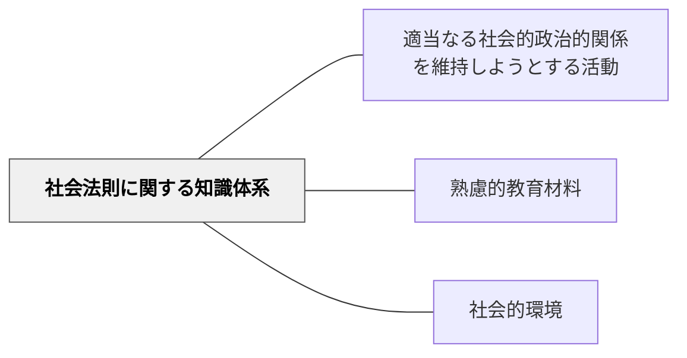

# 社会法則に関する知識体系

> 社会科学が明らかにした社会の構造・法則が教育材料の重要な柱。

## 背景（Context）

牧口常三郎の知識体系分類の一つ。経済学・社会学・政治学・歴史学など、社会の仕組みや変化を支配する法則・原理に関する知識体系。社会科・公民・歴史・家庭科などの教科内容がここに含まれる。

## 問題（Problem）

社会の法則・構造を「暗記すべき事実」として扱うと、社会を批判的に読む力が育たない。

## 力のかたち（Forces）

- 社会法則は文化・時代によって変わる可能性がある
- 統計・調査・フィールドワークで体験的に学べる

## 解決（Solution）

**社会科学の知識を「社会の仕組みを理解し批判的に考えるための道具」として教材化し、実社会の現象との接続を重視する。**

## 結果（Consequences）

- 社会リテラシーと批判的思考が育つ
- 社会参加への動機が高まる

## 関連パタン
- [[パタン/適当なる社会的政治的関係を維持しようとする活動]]

- [[パタン/熟慮的教材教具]] — 親パタン
- [[パタン/社会的環境]] — 社会的環境との接続

## クラスター図

## Actionable Insight

- 社会科学の概念を教えるとき「今起きているニュース・社会問題」の1つと結びつける——抽象的な法則が現実社会の読み解き道具になることへの実感が学習の意義を生む
- 「なぜこの社会構造はこうなっているのか？ 別の可能性はあるか？」と批判的な問いを授業に入れる——事実を暗記するだけでなく社会を批判的に読む力が育つ
- 統計・調査・フィールドワークの経験を1単元に1度組み込む——実証的なアプローチが社会科学の知識を体験的に理解させる

## 出典

- 牧口常三郎（1972）『牧口常三郎全集第4巻 創価教育学体系 上』聖教新聞社
