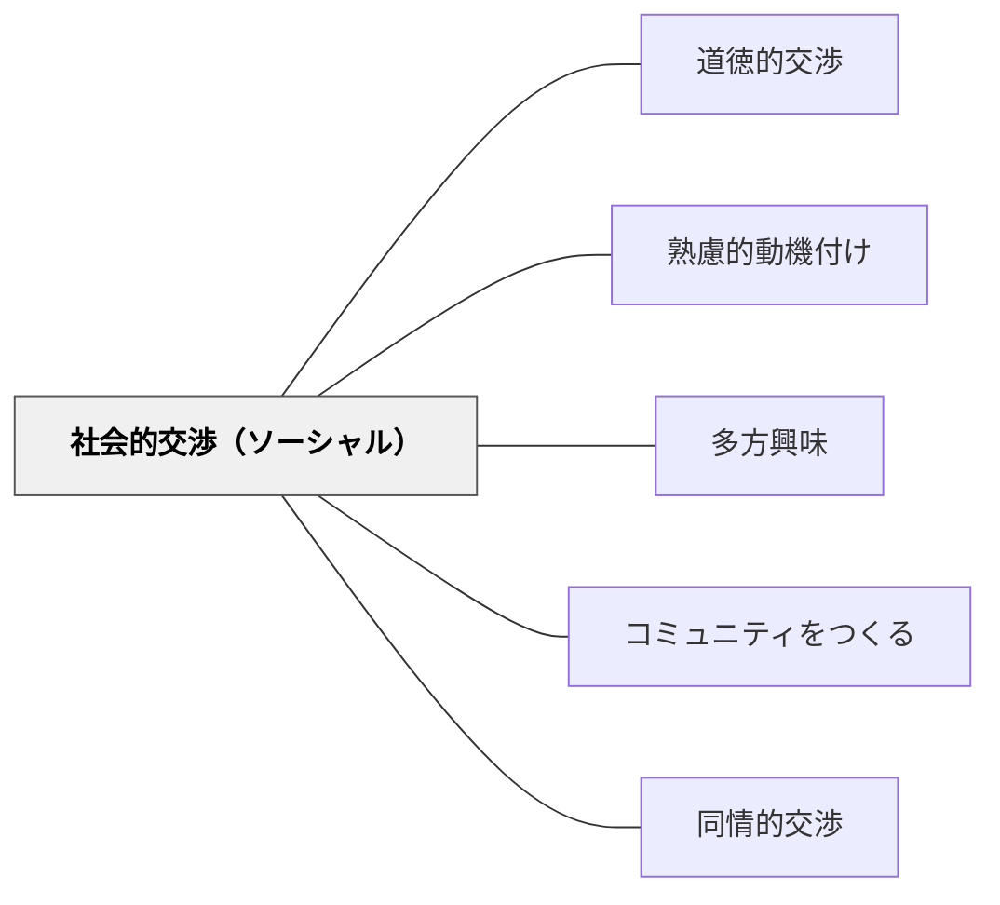

# 社会的交渉（ソーシャル）

> 家族・仲間・地域・社会の一員であることが、学ぼうとする動機を支える。

## 背景（Context）
ヘルバルトの多方興味論および牧口常三郎の教育理論における「社会的交渉」。家族・学校・地域・国家・人類など、社会との関わりへの興味から生まれる動機を指す。「家族の一員として」「クラスのために」「社会をよくしたい」という帰属意識・社会的責任感も含む。

## 問題（Problem）
個人の学習に閉じた設計では、「自分だけのため」という動機に限定される。しかし多くの学習者は、他者とのつながりや、社会への貢献の感覚が動機の重要な源泉となっている。その動機が学習設計に活かされていないことがある。

## 力のかたち（Forces）
- 集団への帰属感・貢献感が強い動機になる
- 仲間と一緒に学ぶこと自体が動機を高める（協同学習）
- 社会的認知（承認・評価）への欲求と結びつく
- 社会的プレッシャーがネガティブに働く場合もある

## 解決（Solution）
**学習を個人の達成にとどめず、仲間・家族・地域・社会とのつながりの中に位置づけることで、社会的な動機を学習の力に変える。**

クラスや地域の問題解決を学習の文脈にする。学習成果を発表・共有して他者に貢献する体験を設ける。「このクラスの一員として学ぶ」という帰属感を大切にした学習文化をつくる。

## 結果（Consequences）
- 社会的なつながりを通じた学習の意味が高まる
- 協働・貢献の経験が市民としての主体性を育む
- 孤立せず仲間と共に学ぶ文化が形成される

## クラスター図

## Actionable Insight

- 学習の成果をクラス・保護者・地域など「本物の聴衆」に発表する機会を1単元に1回設ける——本物の他者への貢献が学習の社会的な動機を引き出す
- 協働課題で「自分の役割がなければグループが成立しない」構造を設計する——相互依存の実感が集団への帰属感と責任感を育てる
- 「このクラスの一員として」「地域のために」という文脈を学習課題に1文付け加える——社会的なつながりへの言及が個人の動機を共同体への貢献と結びつける

## 出典

- 一つの教育のパタン・ランゲージ（岩井輝久）

## 関連パタン
- [[パタン/道徳的交渉]]
- [[パタン/熟慮的動機付け]] — 親パタン
- [[パタン/多方興味]] — 上位パタン
- [[パタン/コミュニティをつくる]] — 学習の社会的文脈を設計するパタン
- [[パタン/同情的交渉]] — 他者への共感・関心と連動する
