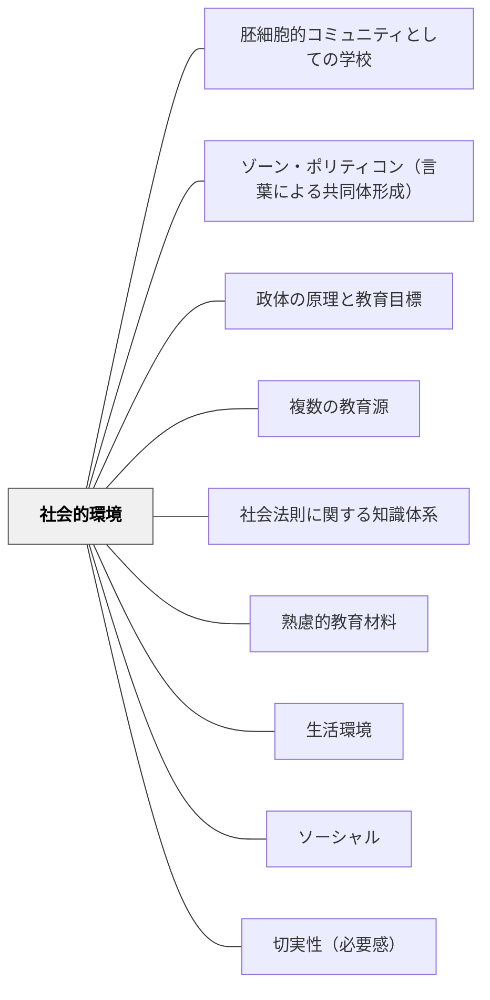

# 社会的環境

> 人間関係・コミュニティ・社会の仕組みそのものが教育材料になる。

## Pattern Connection

### モンテスキュー（1748）——Livre IV, Ch.II

> 「Ce n'est point dans les maisons publiques où l'on instruit l'enfance, que l'on reçoit dans les monarchies la principale éducation; c'est lorsque l'on entre dans le monde, que l'éducation en quelque façon commence.」
> （王政において主要な教育を受けるのは、子どもを教える公の場所においてではなく、世界に参入するときに教育がある意味で始まる。）

- **既存パタンとの関連**：牧口常三郎が「社会的環境との関わりから価値が生まれる」と言うとき、モンテスキューはその18世紀版を描いていた——「世界」そのものが主要な教育の場である。本パタンの「社会的環境を教育材料に組み込む」という解決は、その自覚的な設計である。
- **補強された点**：モンテスキューの診断によれば、「世界に参入する」経験は学校教育を超える影響力を持つ。これは[[パタン/複数の教育源]]の「世界（デジタル含む）からの教育」と接続し、教師がコントロールできない教育源を意識的に活用するという本パタンの意義を深める。
- **エレクトロニクス時代への拡張**：「世界への参入」は今やデジタル空間への参入でもある。子どもたちが「世界に参入」する主要な窓口がSNS・YouTube・ゲームになった時代、社会的環境の設計は物理的な地域・コミュニティと、デジタル社会空間の両方を視野に入れる必要がある。

---

## 背景（Context）

学習者を取り巻く社会的環境——家族・友人・地域・職業・制度・文化——は豊かな教育材料の源である。牧口常三郎は社会的環境との関わりから価値（利・善・美）が生まれると考えた。社会科・道徳・国語など多くの教科で社会的環境を教材化できる。

## 問題（Problem）

学習が個人の頭の中だけで完結する設計になると、社会的関わりの中で育まれるべき力が育たない。

## 力のかたち（Forces）

- 社会的文脈が学習内容に意味を与える
- 他者との関わりが動機付け・協働・批判的思考を生む
- 学習者の社会的環境は多様で一律化が難しい

## 解決（Solution）

**学習者の社会的環境（地域・家族・職業・制度など）を調査・体験・参加の対象として教育材料に組み込む。**

## 結果（Consequences）

- 学習内容が現実社会と結びつき、当事者意識が育つ
- 社会参加への意識が育まれる

## 関連パタン
- [[パタン/胚細胞的コミュニティとしての学校]]
- [[パタン/ゾーン・ポリティコン（言葉による共同体形成）]]
- [[パタン/政体の原理と教育目標]]
- [[パタン/複数の教育源]]
- [[学級経営/学級経営で使えるパタン]]
- [[特別支援/特別支援で使えるパタン]]
- [[パタン/社会法則に関する知識体系]]

- [[パタン/熟慮的教材教具]] — 親パタン
- [[パタン/生活環境]] — 上位パタン
- [[パタン/ソーシャル]] — 社会的関係を学習に活かす
- [[パタン/切実性（必要感）]] — 社会から生まれる必要感

## クラスター図

## Actionable Insight

- 授業に地域の人・保護者・専門家を1人招いて学習テーマに関連する話を聞く——学習内容が現実社会の人々の生活と直結することで当事者意識が育まれる
- 学習者に「家族や地域の誰かにインタビューしてみよう」という課題を出す——社会的環境への直接参加が学習の意味と必要感を高める
- 今起きている地域・社会の出来事と授業内容を1つつなげて紹介する——現実社会との接続が学習への関与と社会参加への動機を生む

## 出典

- 牧口常三郎（1972）『牧口常三郎全集第4巻 創価教育学体系 上』聖教新聞社
- [[文献/法の精神（モンテスキュー）]] — Ch.II「世界への参入」

> 「C'est lorsque l'on entre dans le monde, que l'éducation en quelque façon commence.」——モンテスキュー（Livre IV, Ch.II）
