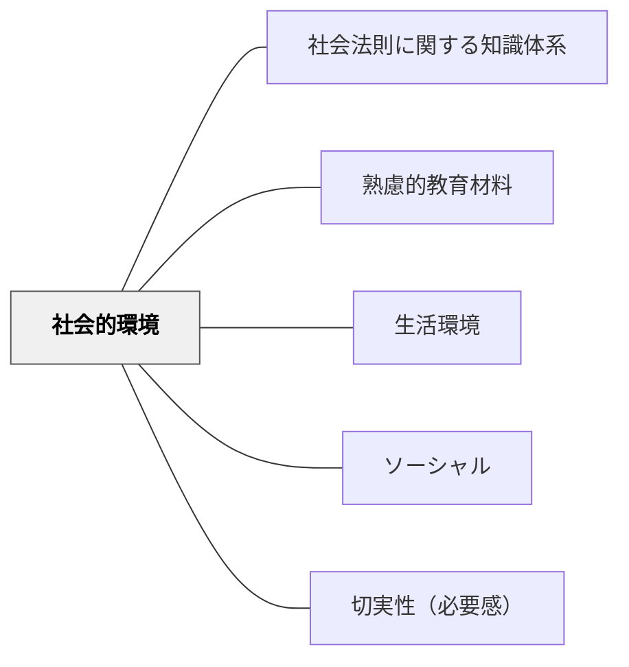

# 社会的環境

> 人間関係・コミュニティ・社会の仕組みそのものが教育材料になる。

## 背景（Context）

学習者を取り巻く社会的環境——家族・友人・地域・職業・制度・文化——は豊かな教育材料の源である。牧口常三郎は社会的環境との関わりから価値（利・善・美）が生まれると考えた。社会科・道徳・国語など多くの教科で社会的環境を教材化できる。

## 問題（Problem）

学習が個人の頭の中だけで完結する設計になると、社会的関わりの中で育まれるべき力が育たない。

## 力のかたち（Forces）

- 社会的文脈が学習内容に意味を与える
- 他者との関わりが動機付け・協働・批判的思考を生む
- 学習者の社会的環境は多様で一律化が難しい

## 解決（Solution）

**学習者の社会的環境（地域・家族・職業・制度など）を調査・体験・参加の対象として教育材料に組み込む。**

## 結果（Consequences）

- 学習内容が現実社会と結びつき、当事者意識が育つ
- 社会参加への意識が育まれる

## 関連パタン
- [[パタン/社会法則に関する知識体系]]

- [[パタン/熟慮的教材教具]] — 親パタン
- [[パタン/生活環境]] — 上位パタン
- [[パタン/ソーシャル]] — 社会的関係を学習に活かす
- [[パタン/切実性（必要感）]] — 社会から生まれる必要感

## クラスター図

## Actionable Insight

- 授業に地域の人・保護者・専門家を1人招いて学習テーマに関連する話を聞く——学習内容が現実社会の人々の生活と直結することで当事者意識が育まれる
- 学習者に「家族や地域の誰かにインタビューしてみよう」という課題を出す——社会的環境への直接参加が学習の意味と必要感を高める
- 今起きている地域・社会の出来事と授業内容を1つつなげて紹介する——現実社会との接続が学習への関与と社会参加への動機を生む

## 出典

- 牧口常三郎（1972）『牧口常三郎全集第4巻 創価教育学体系 上』聖教新聞社
