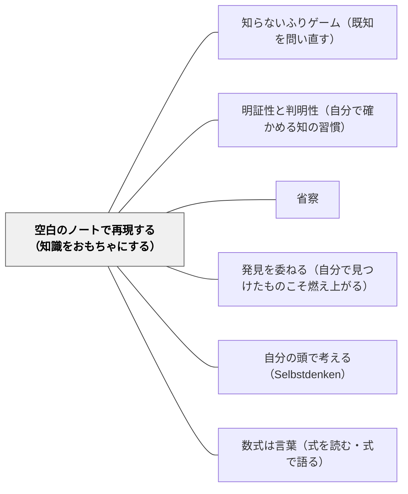

# 空白のノートで再現する（知識をおもちゃにする）

> 「《何も書いていないノートに自分で数学を再現する》んだ。数学の教科書や参考書で見たことを、思い出しながらぜんぶ再現してみるんだよ。僕はいつもそうしている」（第3章）

---

## [Pattern Connection]

**数学ガールの秘密ノート・丸い三角関数（結城浩, 2014）統合：**

第3章「世界を回す」の核心エピソード。テトラが「数学には《できあがった感じ》がする」と言うとき——教科書にすべてまとめられた「完成品」として数学に接している状態を正確に描写している。語り手（僕）は「おもちゃとしての数学」という比喩を使い、「何も書いていないノートに自分で再現する」という実践法を提示する。

> テトラ「あたしには、数学って《できあがった感じ》がするんです。だって、教科書をめくったら、ぜんぶ書かれていますから！ きちんとまとまっていて、ぜんぶ書かれている。でも、先輩は数学をそんなふうには見ていらっしゃらないんですね。だから、自由にいじれる《おもちゃ》のように考えることができるんです。でも、あたしは数学を《おもちゃ》のように自由にいじれるような気がしなくて——」
>
> 「《何も書いていないノートに自分で数学を再現する》んだ。数学の教科書や参考書で見たことを、思い出しながらぜんぶ再現してみるんだよ。僕はいつもそうしている」
>
> テトラ「でも……あたしにはそれ、ハードル高過ぎます」
>
> 「**自分の力の範囲でいいんだよ**。だって、まずは自分ができることを確かめないことにはしょうがないよね」

「自分の力の範囲でいい」という許可が、「ハードル高すぎる」という躊躇を解く。

- **既存パタンとの関連**:
  - [[パタン/知らないふりゲーム（既知を問い直す）]] との構造的な接続——「知らないふりゲーム」が「特定の公式を知らないとして再発見する」のに対し、「空白のノートで再現する」は「自分が知っていることだけで書く」という、より広いスコープの能動的再構成。両者は「受け取った知識を自分のものにする実践」として連続する。
  - [[パタン/明証性と判明性（自分で確かめる知の習慣）]] との接続——「空白のノートに再現できるか」は、明証性の確認の最も強い形式。「書けない場所」が「まだ本当に分かっていない場所」を正直に示す。「自分の言葉で説明できるか」という明証性の第一問に、「ノートなしで書けるか」が加わる。
  - [[パタン/省察]] との接続——「何が書けて何が書けないか」を白紙で確認する行為は、省察（枚挙・見直し）の実践形態。特に「何を理解したか」の自己点検として機能する。

- **補強された点**:
  - [[パタン/発見を委ねる（自分で見つけたものこそ燃え上がる）]] の「自分で見つけた」体験を、「白紙再現」という日常的な実践として自己生成する方法が与えられる。特別な教師の働きかけがなくても、自分で「発見の条件」を作れる。
  - [[パタン/自分の頭で考える（Selbstdenken）]] の数学版——「ノートに書いてあることを読む」でなく「ノートを閉じて自分で書く」という転換がSelbstdenkenの実践。

- **他のパタンへの波及**:
  - [[パタン/数式は言葉（式を読む・式で語る）]] — 「数式を言語として読み書きする」能力があれば、白紙再現が可能になる。再現できない式は「言語として獲得していない式」である。
  - [[パタン/ポリアの問題解決法]] — Step 4「振り返り」の深化：「別の方法でも解けるか」の前に「解法を白紙で再現できるか」を問うことが、より深い振り返りを生む。

---

### 新装版 数学読本 1（松坂和夫, 1989）——「自分の力で解いてみる」という実践の必要性

松坂和夫はまえがきで、問（とい）を巻末解答つきで収録する理由として次のように述べる。

> 「数学の諸概念を心の中に定着させるためには、ただ本を読んで理解したと思うだけでは不十分で、やはり『自分の力で解いてみる』という実践が必要であるからです」——松坂（1989）

「読んで理解した」と「自分で解ける」の区別が、1989年に数学者の立場から明示されている。結城浩（2014）の「何も書いていないノートに再現する」は、この区別の実践的な実装と見ることができる。

**「読んで理解した」が実は借り物の理解である理由：**

本書の構成はこの認識に基づいて設計されている——例・例題（モデル）の後に必ず問（とい）（自己確認の実践）が続く構造。「例をたくさん読む」だけでは数学の概念は定着しない。自分の手を動かして解く実践が、概念を「自分のもの」にする。

**結城（2014）・松坂（1989）の対比——「再現の実践」への二つの到達経路：**

| | 結城浩（2014）丸い三角関数 | 松坂和夫（1989）数学読本 1 |
|---|---|---|
| 問題意識 | 「できあがった感じ」からの脱出 | 読んだだけでは定着しない |
| 実践形態 | 白紙のノートに再現する | 問（とい）を自分の力で解く |
| 「自分のもの」の確認方法 | 「書けた場所」と「書けない場所」 | 解答なしで解けるかどうか |
| 出発点 | テトラの「ハードル高すぎます」 | 読者への序文での明示 |

両者は「読むことと解くことは別の認知的行為」という同じ洞察から出発し、それぞれ「白紙再現（結城）」「問を解く（松坂）」という実践形態を提案している。

**補強された点**：
- 「自分の力で解いてみる」という実践の重要性が、1989年の数学テキストのまえがきに明示されていたことで、このパタンの歴史的・普遍的な裏付けが加わる。
- 結城の「おもちゃとしての数学」に対して、松坂は「概念を心の中に定着させる」という機能的な説明を与える。二つの説明は補完的である。

→ [[文献/新装版 数学読本 1（松坂和夫）]]

---

## 背景（Context）

教科書や参考書を読んで「分かった」と感じる。そのまま問題を解いて正解もできる。しかし翌日、同じ問題をノートを見ずに解こうとするとできない——という経験は多い。

これは「理解を借りた」状態であり「理解した」状態ではない。教科書の論理は美しく整理されているため、読んでいるときは「自分が理解している」と錯覚しやすい。完成された論理を追うことと、自分で論理を再構成することは、まったく違う認知的活動である。

テトラが「数学には《できあがった感じ》がする」と言うとき、この錯覚の構造を正確に捉えている——完成品に接すると、それを「作れる」とは思えない。おもちゃを「いじる」感覚と、「どこから来たのか分からない完成品」を「扱う」感覚は根本から異なる。

## 問題（Problem）

「教科書を読んだら分かった」が「教科書を閉じたら何も言えない」に変わる：

- 解説を読んで「なるほど」と感じるが、自分では再現できない
- 問題を解くたびに「このステップどこかで見た」という感覚で進む——自分のものになっていない
- 「数学は完成品だ」という感覚から、「自分でいじれる」という感覚へ移行できない
- 「理解した」と「再現できる」の差を自覚しない

## 力のかたち（Forces）

- 教科書の論理は「完成品」として提示されるため、学習者が「作れる」と思いにくい
- 「ハードル高すぎる」という感覚——完全に再現しなければならないという思い込みが阻む
- 「自分の力の範囲でいい」という許可が必要——「書けない場所があっていい」という前提
- 白紙再現は時間がかかる——すべての学習でこれをするのは現実的でない
- 「どこが書けなかったか」を直視するには、自分の理解の不完全さを受け入れる勇気が必要

## 解決（Solution）

**教科書や参考書を閉じて、「何も書いていないノート」に自分で再現する。完全でなくていい——「自分の力の範囲でいい」。書けた場所が「自分のもの」であり、書けなかった場所が「まだ借りている」理解である。この確認が「知識をおもちゃにする」出発点になる。**

---

### 「おもちゃとしての数学」への三段階

**1. 「完成品」から「おもちゃ」への認識の転換**: 「教科書にある」から「自分でいじれる」へ。「触ったり、つついたり、回したり」という身体的なおもちゃとの関わりが比喩として使われる——数学の概念も同じように扱える。

**2. 白紙再現の実践**: ノートを閉じ、教科書を閉じ、自分が知っていることだけで書いてみる。書けた場所と書けない場所の地図が、理解の実態を正直に示す。「単純にした図を自分で描く」（テトラの反省）もこれの一部。

**3. 「書けない場所」を次の出発点にする**: 書けなかった場所が次の学習の問いになる。「ここが分からなかった」という正直な自覚が、次の探索の動機になる。

---

### 具体例

**例1: 算数「面積の公式」（小学校）**
「面積=縦×横」を知っている。ノートを閉じて「なぜそうなるのか、1cmのタイルの話から説明してみる」。説明できれば「自分のもの」であり、できなければ「借りた理解」。タイルで確かめ直すことが再現になる。

**例2: 数学「sin・cosの定義」（中学・高校）**
「単位円の上の点のx座標がcos、y座標がsinだ」を知っている。白紙に「単位円を描き、なぜその定義が必要になったかの話から書いてみる」。「直角三角形に縛られていた」という文脈から書けるかどうかが理解の深さを示す。

**例3: 国語「物語の構造」**
「起承転結」を知っている。白紙に「読んだ物語で、この場面が転に当たる理由を説明する」と書いてみる。説明できれば概念が「おもちゃ」になっている。できなければ「転の定義を言葉にしていない」ことが分かる。

**例4: 岩井の数学デイリー（自己教育実践）**
問題を解いた後、「使った定理・公式を何も見ずに書けるか」を確認する。書けた部分は「自分のもの」であり、書けない部分を次の数学デイリーの出発点にする。「空白のノートで再現する」の最小バージョン——一問ごとに適用できる。

## 結果（Consequences）

- 「理解した」と「再現できる」の差が自覚されるようになる——メタ認知的モニタリングの強化
- 「書けない場所」が次の学習の正直な出発点になる——曖昧な理解の上に積み上げる問題が減る
- 知識が「完成品」でなく「自分で再構成できるもの」として感じられるようになる——「おもちゃ感」の獲得
- ただし: 時間がかかる——毎回は現実的でない。核心的な概念・公式で選択的に行う

## 関連パタン

- [[パタン/知らないふりゲーム（既知を問い直す）]] — 特定の公式を「知らない」として再発見する実践（より限定的な形）
- [[パタン/明証性と判明性（自分で確かめる知の習慣）]] — 「白紙に再現できるか」が明証性の最強の確認
- [[パタン/省察]] — 「何が書けて何が書けないか」を確認する省察の実践
- [[パタン/発見を委ねる（自分で見つけたものこそ燃え上がる）]] — 白紙再現が自分で発見する条件を自己生成する
- [[パタン/自分の頭で考える（Selbstdenken）]] — ノートを閉じて書くことがSelbstdenkenの実践
- [[パタン/数式は言葉（式を読む・式で語る）]] — 数式を言語として使える力が白紙再現を可能にする
- [[文献/数学ガールの秘密ノート・丸い三角関数（結城浩）]] — 本パタンの出典

---

## クラスター図

## Actionable Insight

- 授業の最後3分で「ノートを閉じて、今日習ったことで最も大事だと思うことを白紙に書いてみよう」を試す——「書けなかった場所を教えて」という問いが、次の授業の出発点になる
- 「自分の力の範囲でいい」「完全でなくていい」という言葉を最初に伝える——「ハードル高すぎる」という躊躇を解く許可が、実践を始める鍵
- 数学デイリーや自主学習で「使った公式を何も見ずに書く」を一行習慣にする——白紙再現の最小バージョンが「知識をおもちゃにする」第一歩

---

## 出典

結城, 浩（2014）.『数学ガールの秘密ノート／丸い三角関数』SBクリエイティブ. 第3章.

> 「《何も書いていないノートに自分で数学を再現する》んだ。数学の教科書や参考書で見たことを、思い出しながらぜんぶ再現してみるんだよ。僕はいつもそうしている」

> 「**自分の力の範囲でいいんだよ**。だって、まずは自分ができることを確かめないことにはしょうがないよね」
