# 答えの出どころを推し量る（誤答の解釈）

> 「ふざけている」と読まれた発言が、無限の入れ子構造の発見だったことがある。見当外れに見える答えを前にして、教師がまずすべきなのは正すことではなく、その答えがどこから来たのかを推し量ることである。

## [Pattern Connection]

このWikiには、子どもの答えを読む技術がすでに二つ置かれている。本パタンは三つ目の座標を足す。

**[[パタン/理解のしるしを読む（fit と match）]] の裏側にあたる。** あちらが扱うのは「**正答は理解の証拠にならない**」——丸のついた答案の中に、教師の理解と一致（match）していない子が隠れているという問題である。本パタンが扱うのはその反対側で、「**見当外れに見える答えが、どこから来たのかを推し量る**」。同じ非対称の両端を、二つのパタンで塞ぐ形になる。正答の側では情報が取れないことが問題であり、誤答の側では情報が多すぎて読み違えることが問題である。

**[[パタン/エラー分析]] とは座標が違う。** エラー分析は誤りの**型**を分類し、その分類を子ども自身に渡して思考を促す技術である。本パタンが与えるのは分類ではなく、**自己調整の過程のどこで何が起きたかを推定する**という別の軸である。同じ「$3.6 \div 0.4$ の答えが $0.9$」という誤答でも、課題の同定でつまずいたのか、質の規準を誤解したのか、あるいは正しく同定したうえで表層の特徴に誘導されたのかで、必要な手立てはまったく違う。エラー分析は「何を間違えたか」を、本パタンは「**どこで分岐したか**」を見る。両者は競合せず、後者が前者の前段に入る。

**Winne & Hadwin のモデルが座標軸になる。** Black & Wiliam（2009）§4 は自己調整学習の四相——①課題の同定 ②応答の計画 ③方略の遂行 ④適応（見直し・やり直し）——と、そこで動員される資源（条件・操作・規準・評価）を、教師が応答を解釈するための地図として使う。「わかっていない」の一語で括られている状態が、この地図の上では**七つ以上の別々の場所**に分かれる（[[概念/自己調整学習の内側（成長の道とウェルビーイングの道）]]）。

**接続の要点は、これが分類表ではないということである。** 著者らは、事例を集めて規則のリストを作る誘惑と、その危険を明記している。応答はそれが産出された文脈の外では解釈できず、ある教科・あるねらいで通じる規則が別の場面ではまったく不適切でありうる。したがって本パタンは「誤答の分類表」ではなく「**見立ての角度のリスト**」として使う。この点は「結果」節で改めて釘を刺す。

**波及先。** [[パタン/偶発の瞬間を活かす（コンティンジェンシー）]] は、子どもの応答が出た瞬間をどう授業の資源に変えるかを扱う。本パタンはその瞬間の**内側**——数秒のあいだに教師の頭の中で起きている解釈——を開く。[[パタン/聴き方を変える（評価的・解釈的・解釈学的）]] とは、あちらが「構え」、本パタンが「構えたあとに何を仮説として立てるか」という関係になる。

## 背景（Context）

授業中、子どもが答える。その答えが、こちらの想定とまるで違う。

このとき教師に与えられているのは数秒である。次の子を指すか、言い直させるか、板書に書くか、流すか。判断は反射に近い速さで下される。しかもその反射は、たいてい**答えの正しさ**を軸に組み立てられている。合っていれば拾い、外れていれば拾わない。外れ方が大きければ「ちがうね」と言って別の子を指す。

Black & Wiliam（2009）§4 は、この数秒の中に実は二つのステップが畳み込まれていると指摘する。

- **診断的（diagnostic）**——生徒の発言を、それが生徒の**思考と動機づけ**について何を明かしているかという観点で解釈する
- **予後的（prognostic）**——最適な応答を選ぶ

そして著者らはこう書き添える。この二つは複雑な判断であり、**しばしば数秒しか使えない中で下される**。

つまり教師は、毎時間何十回も、診断と処方を数秒で同時に行っている。そしてほとんどの場合、診断の段は飛ばされる。飛ばしても授業は進むからである。

## 問題（Problem）

**見当外れに見える答えを、教師は「わかっていない」と読む。しかしその一語の下には、まったく別の手立てを要求する複数の状態が畳み込まれている。**

Black & Wiliam（2009）§4 が挙げる二つの事例が、この問題の形を最も鋭く示す。

### 事例A：「ベティという名前だと思います」

水仙の絵を描いている6歳の子に、教師が尋ねた——「この花は何と呼ばれていますか（What is this flower called?）」。子どもは答えた——「**ベティという名前だと思います（I think it's called Betty）**」（Fisher, 1995）。

著者らの分析はこうである。この子は「called」という語についての**自分の理解に沿って課題を同定した**。満足のいく答えの規準は**日常会話のそれ**であって、**固有名と一般名の区別が本質的であるような学習の言説のそれではない**。犬にポチという名前があるように、この花にも名前があるのだろう——日常の言語使用としては完全に筋が通っている。

そして著者らは続ける。教師がこの応答をそう見るなら、フィードバックは「**is called」という句の様々な意味についての議論を開くように組み立てられうる**。誤答が、言語についての授業の入口に変わる。

### 事例B：「クリーム・オブ・ウィートの箱の裏だと思う」

「無限」の話題を導入する教師が、その語が自分にとって何を意味しうるかを生徒に言わせた。最初に応じたのは、**深刻な行動上の問題があり特別なカウンセリングを受けている生徒**だった。彼はこう言った——「**クリーム・オブ・ウィートの箱の裏だと思う**」。教師は答えた——「**ばかなことを言わないの、ビリー（Don't be silly Billy）**」（Lighthall, 1988）。

のちにカウンセラーとの対話でビリーが説明したところによれば、彼は朝食のとき、シリアルの箱の裏に**その同じ箱を持った男の絵**があり、その絵の中の男もまた同じ箱を持っていて、それが延々と続いていることに気づいていた。

著者らの判定は、教師にとって痛い。

- **生徒は課題をきわめて正確に同定していた**——「無限」という語が自分にとって何を意味するか、という問いに、彼は正確に答えている
- **朝食の経験を含む様々な資源を引き出して答えを組み立てていた**
- **彼は過去の問題行動の傾向を克服したくて関与しようとしていた**
- 何をもって十分に明晰な答えとするかについての**彼の規準は不十分だった**——なぜその箱が無限なのかを言葉にできていない
- しかし——**本当の困難は、その答えが妥当かもしれないと考えてもっと説明を求めることをしなかった教師の側にあった**

ここで教師が読み違えたのは、内容ではなく**動機**である。教師はこの発言を、学習から降りるための発言（ウェルビーイングの道）だと読んだ。実際には、学習に入ろうとする発言（成長の道）だった。行動上の困難があるという情報が、解釈を先回りして歪めている。

### 日本の教室でも同じことが起きる

この構図はそのまま日本の教室に移る。四年生「大きい数」の授業で「数はどこまで大きくなるか」と問うたとき、「**ポテトチップスの袋**」と答える子がいる。教室は笑い、教師は「まじめに考えて」と言う。あとで聞くと、その子は袋の裏に印刷された「おいしさのひみつ」の写真の中に同じ袋が写っていることを見ていた。

**笑いが起きた時点で、この発言はもう拾えない。** 教師の一手が、教室全体の解釈を確定させてしまう。

問題の形はこうなる。教師は数秒で判定する。判定は「合っている／いない」と「まじめ／ふざけ」の二軸で下される。しかし答えの出どころは、その二軸では到底表せない多様さを持っている。

## 力のかたち（Forces）

- **数秒しかない vs 診断には時間がいる**——授業は止まらない。三十人が待っている。診断的解釈を丁寧に行う時間は、構造的に存在しない。しかし解釈を飛ばした処方は、当たっていても偶然である
- **正しさは一次元、出どころは多次元**——正誤の判定は速く、共有可能で、記録できる。出どころの推定は遅く、教師ごとに違い、記録しにくい。効率のよいほうが常に勝つ
- **動機の読みが内容の読みを汚染する**——「この子はいつもふざける」という履歴が、発言の内容を聞く前に解釈を決める。ビリーの事例が示すのはまさにこれで、**行動上の困難という情報が、最も的確な発言を最も強く退けさせた**
- **教室の反応は一手で確定する**——笑いが起きた発言、「ちがうね」と返された発言は、その場で価値を失う。教師の一手は、自分の解釈を教室全体の解釈にしてしまう
- **説明を求めることは弱さに見える**——「もう少し聞かせて」と返すことは、教師が答えを持っていないように見える瞬間がある。とくに参観日や研究授業では、この心理的コストが上がる
- **一つの解釈の中にも選択肢がある**——出どころを正しく推定できたとしても、次の手は一つに決まらない。議論の欠陥を指摘するか、その種の推論を育てる探究的な議論を開くか、学習者の資源そのものに働きかけるか。診断が済んでも予後の判断が残る
- **規則にすると使えるが、使えるからこそ危ない**——「こういう誤答にはこう返す」という対応表があれば実務は楽になる。しかし応答は文脈の外では解釈できず、教科もねらいも違えば同じ規則は不適切になる

## 解決（Solution）

**見当外れに見える答えに対して、判定の前に一手だけ「出どころを推し量る」段を入れる。推し量る角度として、自己調整の過程のどこで分岐しうるかを示す七つの可能性を持っておく。そしてこれを分類表ではなく、見立ての角度のリストとして使う。**

### 不出来な出力が示しうる七つのこと

Black & Wiliam（2009）§4 は、自己調整学習モデルの細部が「**不出来な出力は、いくつもの異なる問題の証拠でありうる**」ことを浮き彫りにすると述べ、次の可能性を挙げる。以下、原文の順に訳し、日本の教室での例を一つずつ添える。

**1. 使われている言語を誤解した**
原文の例——「なぜ」の意味が分からず「なぜ」の問いに当惑する。
日本の教室では——「**なぜそうなるか説明しましょう**」に対して、やり方の手順を書く子。「なぜ」が「どうやって」と区別されていない。あるいは「**くらべる量**」「**もとにする量**」という語そのものが、日常語の「もと」と結びついていない。

**2. 全体の目的と文脈を誤解した**
原文の例——算数とはアルゴリズムを正しく当てることだと思い込む／すべての算数の問題には解がただ一つあると思い込む／歴史とは「実際どうだったか」を語ることだと思い込む。
日本の教室では——「答えは一つ」という信念が最も広く共有されている。「**この分け方でもいい？**」と聞かれて「**どっちが正解ですか**」と返してくる子は、内容ではなく**教科そのものの像**でつまずいている。国語で「登場人物の気持ちを書きましょう」に対し「正解を当てにいく」構えも同型である。

**3. 問題の表層的な側面に誤導された**
原文の例——0.4の平方根は0.2だと思う。
日本の教室では——「$0.4$ の $\frac{1}{2}$ は $0.2$」の類推がそのまま平方根に流れ込む形。小学校なら、$\frac{1}{2} + \frac{1}{3} = \frac{2}{5}$（分母と分子をそれぞれ足す）、面積が「たて×よこ」だから体積も「二つかける」、「あわせて」とあるからたし算——**表層の形が正しく写されているぶん、内部の操作は止まっている**。

**4. その特定の課題を誤解した**
原文の例——求められているのは**説明する**ことなのに、より良い記述を与えることだと取り違える。
日本の教室では——「**どうしてそう考えたか書きましょう**」に対して、答えをもう一度丁寧に書き直す子。記述の質を上げることに全力を注いでいるが、問われているのは記述ではなく理由である。本人の側から見れば、真面目に取り組んで外している。

**5. 課題に取り組むのに不適切または効果のない方略を使っている**
日本の教室では——数直線を使えば一手で済む問題を、すべて数え上げで処理している子。$100$ 以上のかけ算をすべてたし算の繰り返しで解く子。**答えは合う**ので発見が遅れる。時間切れや計算ミスとして現れたときに初めて見える。

**6. 質の規準を理解していない**
原文の例——良い自伝は事実を正確に順序よく明示し、句読点・綴り・段落分けが正確でなければならないと思い込み、その結果**感情を欠いた退屈な記述**になる。
日本の教室では——行事作文がそのまま当てはまる。「朝七時に起きました。バスに乗りました。着きました。楽しかったです。」——**この子は失敗していない。教わった規準を正確に満たしている。** 正確さばかりを指導してきた結果として、規準どおりの退屈が生産されている（[[概念/質的判断（曖昧な規準とメタ規準）]]）。

**7. 関連する答えを与えてはいるが、より深い水準での説明を試みる必要がある**
原文の例——植物の成長と光合成の理科の授業で、教師が「なぜ2つの植物は違う育ち方をしたのか」と尋ねたのに対し、生徒が「窓辺のこの植物は戸棚のあの植物より強く育った、なぜならより多くの光があったから」と言う。**問いの狙いは、光がなぜどのように成長に影響するのかの説明を探ることだった**（Black et al., 2003 pp.36-9）。
日本の教室では——「なぜこの容器のほうが早く溶けたか」に「**お湯だったから**」。答えは正しい。しかし問いが求めていたのは温度と溶解の関係の説明である。この場合、**間違いを正す手立ては一つも要らない**。要るのは「もう一段」だけである。

### 七つは「わかっていない」の一語で潰れる

実務上の価値はここにある。**七つはどれも「わかっていない」の一語で片づけられるが、必要な手立てはまったく違う。**

| 出どころ | 誤って打たれがちな手 | 実際に要る手 |
|---|---|---|
| 1 言語の誤解 | 内容をもう一度説明する | その語の意味を扱う（語の授業に切り替える） |
| 2 目的・文脈の誤解 | 問題数を増やす | 教科観そのものを揺らす場面を作る |
| 3 表層への誤導 | 「よく見て」と注意する | 表層が破れる一例を出して衝突させる |
| 4 課題の誤解 | 書き方を指導する | 何を問うているかを言い直させる |
| 5 方略の不適 | 練習量を増やす | 別の方略を並べて比べる |
| 6 規準の誤解 | 「もっと工夫して」と言う | よい例と並みの例を並べて規準を見せる |
| 7 深さの不足 | 正答として流す | 「もう一段」だけを求める |

**この表の左端を推定しないまま右端を選ぶと、たいてい真ん中の列を打つことになる。** 真ん中の列は無害ではない。7の子に「よく見て」と言えば、正しく答えたのに叱られたことになる。6の子に「もっと工夫して」と言えば、教わったとおりにやった子に、教わっていない何かを要求することになる。

### 診断と予後——数秒を二段に割る

Black & Wiliam（2009）§4・§7 が示す二段の構造を、実務の言い方に直すとこうなる。

**第一段（診断）**——「この子は、この答えをどうやって作ったのだろう」とだけ考える。この段では**正しさを判定しない**。判定を保留する。
**第二段（予後）**——推定した出どころに対して、最適な応答を選ぶ。

そして著者らは、**一つの解釈の中にも選択肢がある**ことを明示する。たとえばベティの事例では、少なくとも三つの手がある。

- 議論の中の欠陥を指摘する（「花の名前は、その子だけの名前じゃないよね」）
- この種の議論で展開されている推論を育てるために**探究的な議論を開く**（「じゃあ、この花にベティって名前をつけてもいい？ つけたら何が困る？」）
- **学習者の資源そのものに働きかける**（「『〜と呼ばれる』って、どんなときに使う？」と、句の様々な用法の探究に誘う）

三つとも正当である。どれを選ぶかは、その時間のねらいで決まる。診断が定まっても処方は一つに定まらない——ここを混同すると、本パタンは「正しい対応表」を探す作業に堕ちる。

---

### 具体例1：一度だけ「もう少し聞かせて」と返す（全教科・ビリーの事例の反転）

最小の実装はこれ一つである。**判定の前に、一手だけ挟む。**

要点は聞き方にある。「どうしてそう思ったの？」は、この場面では効きにくい。子どもの側から見ると、この問いは**外れたときにしか来ない**からである。教室の子どもは、「どうして？」と聞かれた瞬間に「間違えた」と理解する。すると答えは説明ではなく訂正になり、出どころは永久に見えなくなる。

代わりに、**内容に沿って**聞く。

- ×「どうしてそう思ったの？」 → ○「**その箱、もう少し説明して**」
- ×「本当にそれでいい？」 → ○「**ポテトチップスの袋の、どこを見てた？**」
- ×「ちがうよ、もう一回考えて」 → ○「**その考えでいくと、次はどうなる？**」

内容に沿った問いには、二つの働きがある。第一に、答えが訂正ではなく**続き**になる。第二に、教室に対して「この発言は聞く価値がある」という判定を先に示すことになる。ビリーの教室で起きたのは、教師の一手が発言の価値を確定させたという事故だった。それを反転させる。

そして——**この一手は正答にも使う**。外れたときだけ使うと、この問いは「外れの合図」として学習される。合っている子にも「その考え、もう少し聞かせて」と返す日を作る（[[パタン/理解のしるしを読む（fit と match）]] の見取りと同じ道具になる）。

なお、待つことが要る。内容に沿って聞いたあと、子どもは自分の見ていたものを言葉にしようとする。そこに三秒はかかる（[[パタン/待ち時間（問いのあとの3秒）]]）。

---

### 具体例2：算数の誤答を七つの角度で読む（第5学年・小数のわり算）

$3.6 \div 0.4$ の答えを、四人の子が違う形で外した。従来は全員まとめて「小数のわり算がわかっていない」で処理していた。七つの角度で読み直すと、四人は四か所に分かれた。

**A児：$0.9$**——$3.6 \div 4 = 0.9$ を計算し、小数点の処理を「$4$ を $0.4$ にしたぶん、こっちも小さく」と類推している。**3（表層への誤導）**。手立ては説明ではなく、**表層が破れる一例**である。「$3.6 \div 0.4$ は、$0.4$ が何個分？」を数直線で一度だけやる。$0.9$ 個分では $3.6$ にならないことが、その場で見える。

**B児：$9$（正答）だが、「なぜ大きくなるの、おかしい」と余白に書いている**——これは**7（深さの不足の逆）**ではなく、むしろ質が高い。答えは出ているが、割ると小さくなるという信念と衝突している。手立ては「もう一段」だけ。「$1$ より小さい数で割ると何が起きる？」を学級全体の問いにする。**この子の余白の一行が、その時間の中心の問いになる。**

**C児：筆算を書かず、$3.6$ を $0.4$ ずつ引いていって $9$ にたどり着いた**——正答である。しかし九回引いている。**5（方略の不適）**。誤答ではないので、丸つけでは絶対に見えない。手立ては別の方略との比較であって、「その方法はだめ」ではない。むしろ「引いていくやり方は、わり算の意味そのものだね」と価値づけたうえで、数が大きくなったときにどうなるかを一緒に確かめる。

**D児：答えを書かず、「どっちが正解ですか」と聞きにきた**——教師が「$3.6$ のリボンを $0.4$ m ずつに切ると何本？」と「$3.6$ を $0.4$ 等分すると？」の二つの読み方を提示した場面である。この子は**2（目的・文脈の誤解）**にいる。「算数の問題は解が一つ」という信念が、二つの読みが提示されたこと自体を処理できていない。手立ては小数のわり算の指導ではなく、**教科観に触る**ことである。「どっちも正しい読み方だよ。だから、どっちを聞かれているかを決めるのは、問題文なんだ」と言う。

四人に必要な手立ては四つとも違い、そのうち**二人は誤答ですらなかった**。

---

### 具体例3：作文の「退屈な自伝」——規準の誤解を、指導の履歴として読む（第4学年・国語）

行事作文の一枚。「朝七時に起きました。集合しました。バスに乗りました。水族館に着きました。イルカを見ました。楽しかったです。」

従来の読みは「感想が書けていない」であり、朱書きは「**もっと気持ちを書きましょう**」になる。しかし七つの角度で読むと、これは**6（質の規準を理解していない）**である。原文の例と完全に同型で、著者らは「事実を正確に順序よく明示し、句読点・綴り・段落分けが正確でなければならない」という規準の理解が「**感情を欠いた退屈な記述**」を生むと書いている。

重要なのは、この規準を**教えたのは教師だ**ということである。低学年から、時系列で書きなさい、事実を書きなさい、句読点を正しく、と指導してきた。この子はそれを完全に達成している。**この作文は失敗作ではなく、成功作である**——ただし満たしている規準が、いま求めているものと違う。

したがって「もっと気持ちを書きましょう」は効かない。それは規準を言い換えただけで、規準を**見せて**いないからである。手立ては規準の提示になる。

同じ題材で書かれた三つの短い文章を並べる。一つは上のような時系列の記述、一つは一場面だけを詳しく書いたもの、一つは音と匂いだけで書いたもの。並べて「**どれが読みたいか、なぜか**」を子どもたちに言わせる。規準を言葉で渡すのではなく、**比較の中から取り出させる**（[[パタン/練り上げ（比較検討の全体交流）]]・[[概念/質的判断（曖昧な規準とメタ規準）]]）。

そして次の作文では、条件を一つだけ変える。「**十五分のあいだに起きたことだけを書く**」。時系列の規準はそのままに、範囲だけを縮める。範囲が縮むと、事実だけでは埋まらなくなる。規準の説教ではなく、**規準が破れる課題**を出す。

---

### 具体例4：特別支援の視点——判定を早くしないという原則が、最も重く効く場所

ビリーの事例が特別支援の文脈そのものであることを、まず確認しておきたい。**深刻な行動上の問題があり特別なカウンセリングを受けている生徒**——この情報が教師の解釈を先回りして決めた。著者らは、彼が「**過去の問題行動の傾向を克服したくて関与しようとしていた**」と書いている。最も的確な発言が、最も強く退けられた。

支援級・通級・通常学級の配慮を要する子の場面では、七つのうちどれかを判別する材料が構造的に少ない。

- 発語が少ない・遅い子は、そもそも応答が短い。短い応答からは出どころが読めない
- 書字に困難のある子は、途中の式や下書きを残さない。過程の痕跡が残らない
- 一問の答えが出るまでの時間が長い子は、そのあいだの内側が見えない
- 「わからない」と言えない子は、当てずっぽうで場をしのぐ。それは**ウェルビーイングの道**への切り替えだが、外からは「わかっていない」としか見えない（[[概念/自己調整学習の内側（成長の道とウェルビーイングの道）]]）

だからこそ、**判定を早くしないという原則がここで最も重く効く**。材料が少ないほど、推定は当てにならない。当てにならない推定に基づいて手を打つと、外れたときの damage が大きい——「ちがう」と言われる回数が積み上がることそのものが、学習からの離脱を招く（[[パタン/心理的安全性（コンフォートゾーン）]]）。

実務的には次の三つを置く。

**第一に、応答の様式を言語に限定しない。** 「その箱、もう少し説明して」が言えない子には、「**指でさして**」「**同じことを、これでやってみて**」（具体物・図・カード）と求める。理解と言語表出は別の層にある。

**第二に、判定を一日ずらす。** その場で読めない応答は、その場で判定しない。ノート・作業の跡・帰り際の一言を材料にして、翌日にもう一度同じことを聞く。「昨日の、あれ、もう少し聞かせて」は、通常学級では不自然でも、支援級では自然に成立する。

**第三に、記録に出どころの推定を書く。** 「$3.6\div0.4$ 不正解」ではなく「$3.6\div0.4$ 不正解・表層の類推か（要確認）」と書く。**推定であることを記号で残す**（[[パタン/つまずきを構造で記録する（診断の粒度設計）]]）。確定として書かれた誤診は、翌年の担任にそのまま引き継がれる。

---

### 具体例5：自己教育での適用——大人の独学でも出どころは七つに分かれる

この推し量りは、自分自身に対しても使える。数学の独学で解けなかった問題を「わからなかった」で記録すると、翌週の自分に何も渡らない。七つの角度で書き分けると、次の一手が変わる。

- 「**問題文の語の意味が取れなかった**」（1）——辞書・定義に戻る
- 「**この分野が何をする分野なのかがわかっていない**」（2）——章の頭に戻る
- 「**形が似ている既習に引っ張られた**」（3）——反例を一つ自分で作る
- 「**問われているのが証明なのか計算なのか取り違えた**」（4）——問題文をもう一度写す
- 「**方針は合っていたが手数が多すぎて時間切れ**」（5）——解答の方針と自分の方針を並べる
- 「**答えは合ったが、これでいいのか自分で判断できない**」（6）——模範解答の何が「よい」のかを言葉にする
- 「**答えは出たが、なぜそうなるかは言えない**」（7）——もう一段だけ掘る

**六つ目と七つ目が、独学で最も多く、最も見過ごされる。** 答えが合っているので記録上は「できた」になり、そのまま先へ進む。[[パタン/理解のしるしを読む（fit と match）]] が指摘する fit の問題は、独学では誰も外から指摘してくれない。

## 結果（Consequences）

**利点**

- **「わかっていない」の一語が解像する**——同じ誤答が、七つの異なる場所に分かれる。手立ての当たり率が上がるだけでなく、**手立てを打たなくてよい場合（7の「もう一段だけ」や、正答している5の方略問題）が識別できる**
- **正しく答えた子を叱らずに済む**——七つ目の可能性を持っているだけで、「関連する答えは与えているが深さが足りない」を「間違い」として扱う事故が減る。これは教室の信頼に直接効く
- **一手だけで実装できる**——「もう少し聞かせて」を一度返すこと。準備も教材も要らず、明日から使える。本論文から取れる**最も安上がりな改善**である
- **誤答が授業の資源になる**——ベティの「called」は、言語についての探究の入口になりうる。ビリーの箱は、入れ子構造という無限の最良の直観だった。出どころが読めれば、外れた答えほど授業を動かす（[[パタン/偶発の瞬間を活かす（コンティンジェンシー）]]・[[パタン/間違いや失敗から学ぶ文化]]）
- **教師の指導履歴が可視化される**——6（規準の誤解）を見つけることは、自分が何を規準として教えてきたかを見ることである。退屈な作文は子どもの欠落ではなく、指導の履歴の産物として読める
- **記録の質が変わる**——「不正解」ではなく「どこで分岐したか（推定）」を残すと、翌週・翌年の手立てが具体になる

**注意点・リスク**

- **これは分類表ではない——最大の注意点**。著者らは §7 で、事例を集めて**規則のリストを作るのは魅力的だが危険がある**と明記する。理由は二つ。第一に、**応答はそれが産出された文脈の外では解釈できない**。第二に、**ある教科、あるいはその教科の中の特定の学習目標を追う授業では当てはまる規則が、別の教科や別のねらいで組み立てられた相互作用ではまったく不適切でありうる**。したがって七項目は「誤答の分類表」ではなく「**見立ての角度のリスト**」として使う。左端を選んで右端を実行する対応表として運用した瞬間、本パタンは別のものに変質する
- **診断が済んでも処方は一つに定まらない**——著者らは「一つの解釈の中にも選択肢がある」と明示する。欠陥を指摘するか、探究的な議論を開くか、学習者の資源に働きかけるか。どれを選ぶかは**その時間のねらい**で決まる。診断を正しくすれば手が自動的に決まる、と考えると誤る
- **教師が組み立てるのは教師自身の概念からできたモデルである**——後述の von Glasersfeld の警告。「この子はこう考えている」は、**子どもの頭の中ではなく、教師の頭の中にある構成物**である。推定が精緻になるほど、それを事実と取り違えるリスクが上がる。到達できる最善は「利用可能な経験の範囲内で生き延びるモデル」にすぎない
- **推定が確定として記録に残る**——最も実害の出る失敗モード。「この子は表層に引っ張られやすい」と書かれた所見は、翌年の担任にとって事実として届く。**推定は推定として書く**（「〜か（要確認）」）。確定した誤診は、ラベリングとして数年働き続ける
- **数秒しかないという条件は消えない**——本パタンは授業の速度を要求どおり落とさない。全部の応答に一手挟むことは不可能である。**一時間に一つ、一日に三つ**と上限を決める。決めないと二週間で消える
- **「もう少し聞かせて」が外れの合図になる**——外れた子にだけ使うと、この問いは「間違えた印」として学習される。**正答にも使う日を作る**。ここを外すと、道具そのものが機能を失う
- **履歴が解釈を汚染するのは避けられない**——ビリーの事例が示すとおり、「この子はいつも」という情報は解釈より先に来る。消せない。できるのは、**特定の子については一手挟むことを既定にしておく**ことである。判断ではなく手順にする
- **教科ごとに何が「よい説明」かは違う**——著者らは、数学の教室でよい説明とされるものと歴史の教室でよい説明とされるものは違うと認めている（§7）。七つの角度は教科横断だが、7（深さの不足）の判定基準は教科固有である

### 最後の但し書き——モデルは教師のものであって、子どもの頭の中ではない

Black & Wiliam（2009）は、以上の分析すべてに対して最後の注意を置く。von Glasersfeld（1987）の警告である（原文と訳は「出典」節）。

要点は三つある。

第一に、**教師が組み立てるモデルは、子どもの概念要素からではなく、教師自身の概念要素から作られる**。「この子は $\frac{1}{2}$ を割合として見ている」という推定は、割合という教師の概念で子どもを記述したものであって、子どもの内側にある何かの写しではない。

第二に、だからこそ **fit と match の区別が決定的に重要になる**。認知する有機体が自分の経験の概念的組織を独立した客観的実在の構造と比較できないのとまったく同じように、**面接者・実験者・教師は、自分が組み立てた子どもの概念化のモデルを、子どもの頭の中で実際に起きていることと比較することができない**。

第三に、**到達できる最善は、利用可能な経験の範囲内で生き延びるモデル**にすぎない。生き延びる（viable）とは、これまでの観察と矛盾しない、という以上のことを意味しない。次の一言で壊れうる。

この謙抑は、本パタンを臆病にするためのものではない。逆である。**モデルが壊れうるものだと知っているからこそ、壊すための一手——「もう少し聞かせて」——を出せる。** 推定を確定だと思っている教師は、確認する必要を感じない。ビリーの教師が説明を求めなかったのは、自分の解釈を疑っていなかったからである。

## 関連パタン

- [[パタン/理解のしるしを読む（fit と match）]] — 対をなす。あちらは「正答は理解の証拠にならない」、本パタンは「見当外れの答えがどこから来たか」。同じ非対称の両端を塞ぐ。von Glasersfeld はあちらが1998年版・正答の側、本パタンは2009年版・教師のモデルの限界の側
- [[パタン/エラー分析]] — 座標が違う姉妹パタン。あちらは誤りの型の分類と、その分類を子どもに渡す技術。本パタンは自己調整の過程のどこで分岐したかの推定で、エラー分析の前段に入る
- [[パタン/誤概念の組み替え（素朴概念を資源にする）]] — 七つのうち2・3の深い形。素朴概念という資源の側から誤答を読み直す発展形
- [[パタン/誤りフィードバック]] — 予後の段の技術。出どころを推定したあと、何をどう返すかを扱う
- [[パタン/聴き方を変える（評価的・解釈的・解釈学的）]] — 構えの側。あちらが「どんな耳で聴くか」、本パタンが「聴いたあとに何を仮説として立てるか」
- [[パタン/問い返し（リヴォイシング）]] — 「もう少し聞かせて」の具体的な形。内容に沿って返す技術の中核
- [[パタン/待ち時間（問いのあとの3秒）]] — 出どころは即答では出てこない。待たなければ本パタンは機能しない
- [[パタン/偶発の瞬間を活かす（コンティンジェンシー）]] — 応答が出た瞬間を授業の資源に変える技術。本パタンはその瞬間の内側で起きている解釈を開く
- [[パタン/練り上げ（比較検討の全体交流）]] — 出どころの違う複数の答えを、学級全体の資源として並べる場。七つの角度は誰の考えを取り上げるかの選択にも効く
- [[パタン/つまずきを構造で記録する（診断の粒度設計）]] — 推定を記録に残す形式。確定ではなく推定として書き分ける設計が要る
- [[パタン/間違いや失敗から学ぶ文化]] — 前提条件。外れた答えを言える教室でなければ、推し量る材料そのものが出てこない
- [[パタン/心理的安全性（コンフォートゾーン）]] — 同じく前提条件。「ばかなことを言わないの」の一言が何を壊すかを扱う
- [[パタン/形成的評価]] — 上位。情報が実際に使われて教授と学習が変わること。本パタンは「何を情報として読むか」の解釈の段を担う
- [[パタン/理解確認]] — 「わかりましたか」に代わる確認の形。本パタンは確認で得た応答をどう読むかを扱う
- [[概念/自己調整学習の内側（成長の道とウェルビーイングの道）]] — 七つの可能性が置かれている座標そのもの。ビリーの読み違えは成長の道をウェルビーイングの道と誤読したこと
- [[概念/教授学的契約（やり過ごしの均衡）]] — 「どうしてそう思ったの？」が訂正の合図として学習される機構。契約の下では、外れたときだけ来る問いは判定として読まれる
- [[概念/質的判断（曖昧な規準とメタ規準）]] — 六つ目（規準の誤解）の背景。規準は言葉で渡すのではなく比較の中から取り出させる
- [[文献/Developing the Theory of Formative Assessment（Black & Wiliam, 2009）]] — 出典。二つの事例と七つの可能性は §4、規則化の危険は §7
- [[文献/Assessment and Classroom Learning（Black & Wiliam）]] — 姉妹文献。fit と match の初出はこちら

## クラスター図

```mermaid
flowchart LR
    ne7ad94e38188e381aee587bae381a9e38193e3828de38292e68ea8e38197e9878fe3828befbc88e8aaa4e7ad94e381aee8a7a3e98788efbc89["答えの出どころを推し量る（誤答の解釈）"]
    ne79086e8a7a3e381aee38197e3828be38197e38292e8aaade38280efbc8866697420e381a8206d61746368efbc89["理解のしるしを読む（fit と match）"]
    ne382a8e383a9e383bce58886e69e90["エラー分析"]
    ne8aaa4e6a682e5bfb5e381aee7b584e381bfe69bbfe38188efbc88e7b4a0e69cb4e6a682e5bfb5e38292e8b387e6ba90e381abe38199e3828befbc89["誤概念の組み替え（素朴概念を資源にする）"]
    ne8aaa4e3828ae38395e382a3e383bce38389e38390e38383e382af["誤りフィードバック"]
    ne881b4e3818de696b9e38292e5a489e38188e3828befbc88e8a995e4bea1e79a84e383bbe8a7a3e98788e79a84e383bbe8a7a3e98788e5ada6e79a84efbc89["聴き方を変える（評価的・解釈的・解釈学的）"]
    ne5958fe38184e8bf94e38197efbc88e383aae383b4e382a9e382a4e382b7e383b3e382b0efbc89["問い返し（リヴォイシング）"]
    ne5be85e381a1e69982e99693efbc88e5958fe38184e381aee38182e381a8e381ae33e7a792efbc89["待ち時間（問いのあとの3秒）"]
    ne581b6e799bae381aee79eace99693e38292e6b4bbe3818be38199efbc88e382b3e383b3e38386e382a3e383b3e382b8e382a7e383b3e382b7e383bcefbc89["偶発の瞬間を活かす（コンティンジェンシー）"]
    ne7b7b4e3828ae4b88ae38192efbc88e6af94e8bc83e6a49ce8a88ee381aee585a8e4bd93e4baa4e6b581efbc89["練り上げ（比較検討の全体交流）"]
    ne381a4e381bee3819ae3818de38292e6a78be980a0e381a7e8a898e98cb2e38199e3828befbc88e8a8bae696ade381aee7b292e5baa6e8a8ade8a888efbc89["つまずきを構造で記録する（診断の粒度設計）"]
    ne99693e98195e38184e38284e5a4b1e69597e3818be38289e5ada6e381b6e69687e58c96["間違いや失敗から学ぶ文化"]
    ne5bf83e79086e79a84e5ae89e585a8e680a7efbc88e382b3e383b3e38395e382a9e383bce38388e382bee383bce383b3efbc89["心理的安全性（コンフォートゾーン）"]
    ne5bda2e68890e79a84e8a995e4bea1["形成的評価"]
    ne79086e8a7a3e7a2bae8aa8d["理解確認"]

    ne7ad94e38188e381aee587bae381a9e38193e3828de38292e68ea8e38197e9878fe3828befbc88e8aaa4e7ad94e381aee8a7a3e98788efbc89 --- ne79086e8a7a3e381aee38197e3828be38197e38292e8aaade38280efbc8866697420e381a8206d61746368efbc89
    ne7ad94e38188e381aee587bae381a9e38193e3828de38292e68ea8e38197e9878fe3828befbc88e8aaa4e7ad94e381aee8a7a3e98788efbc89 --- ne382a8e383a9e383bce58886e69e90
    ne7ad94e38188e381aee587bae381a9e38193e3828de38292e68ea8e38197e9878fe3828befbc88e8aaa4e7ad94e381aee8a7a3e98788efbc89 --- ne8aaa4e6a682e5bfb5e381aee7b584e381bfe69bbfe38188efbc88e7b4a0e69cb4e6a682e5bfb5e38292e8b387e6ba90e381abe38199e3828befbc89
    ne7ad94e38188e381aee587bae381a9e38193e3828de38292e68ea8e38197e9878fe3828befbc88e8aaa4e7ad94e381aee8a7a3e98788efbc89 --- ne8aaa4e3828ae38395e382a3e383bce38389e38390e38383e382af
    ne7ad94e38188e381aee587bae381a9e38193e3828de38292e68ea8e38197e9878fe3828befbc88e8aaa4e7ad94e381aee8a7a3e98788efbc89 --- ne881b4e3818de696b9e38292e5a489e38188e3828befbc88e8a995e4bea1e79a84e383bbe8a7a3e98788e79a84e383bbe8a7a3e98788e5ada6e79a84efbc89
    ne7ad94e38188e381aee587bae381a9e38193e3828de38292e68ea8e38197e9878fe3828befbc88e8aaa4e7ad94e381aee8a7a3e98788efbc89 --- ne5958fe38184e8bf94e38197efbc88e383aae383b4e382a9e382a4e382b7e383b3e382b0efbc89
    ne7ad94e38188e381aee587bae381a9e38193e3828de38292e68ea8e38197e9878fe3828befbc88e8aaa4e7ad94e381aee8a7a3e98788efbc89 --- ne5be85e381a1e69982e99693efbc88e5958fe38184e381aee38182e381a8e381ae33e7a792efbc89
    ne7ad94e38188e381aee587bae381a9e38193e3828de38292e68ea8e38197e9878fe3828befbc88e8aaa4e7ad94e381aee8a7a3e98788efbc89 --- ne581b6e799bae381aee79eace99693e38292e6b4bbe3818be38199efbc88e382b3e383b3e38386e382a3e383b3e382b8e382a7e383b3e382b7e383bcefbc89
    ne7ad94e38188e381aee587bae381a9e38193e3828de38292e68ea8e38197e9878fe3828befbc88e8aaa4e7ad94e381aee8a7a3e98788efbc89 --- ne7b7b4e3828ae4b88ae38192efbc88e6af94e8bc83e6a49ce8a88ee381aee585a8e4bd93e4baa4e6b581efbc89
    ne7ad94e38188e381aee587bae381a9e38193e3828de38292e68ea8e38197e9878fe3828befbc88e8aaa4e7ad94e381aee8a7a3e98788efbc89 --- ne381a4e381bee3819ae3818de38292e6a78be980a0e381a7e8a898e98cb2e38199e3828befbc88e8a8bae696ade381aee7b292e5baa6e8a8ade8a888efbc89
    ne7ad94e38188e381aee587bae381a9e38193e3828de38292e68ea8e38197e9878fe3828befbc88e8aaa4e7ad94e381aee8a7a3e98788efbc89 --- ne99693e98195e38184e38284e5a4b1e69597e3818be38289e5ada6e381b6e69687e58c96
    ne7ad94e38188e381aee587bae381a9e38193e3828de38292e68ea8e38197e9878fe3828befbc88e8aaa4e7ad94e381aee8a7a3e98788efbc89 --- ne5bf83e79086e79a84e5ae89e585a8e680a7efbc88e382b3e383b3e38395e382a9e383bce38388e382bee383bce383b3efbc89
    ne7ad94e38188e381aee587bae381a9e38193e3828de38292e68ea8e38197e9878fe3828befbc88e8aaa4e7ad94e381aee8a7a3e98788efbc89 --- ne5bda2e68890e79a84e8a995e4bea1
    ne7ad94e38188e381aee587bae381a9e38193e3828de38292e68ea8e38197e9878fe3828befbc88e8aaa4e7ad94e381aee8a7a3e98788efbc89 --- ne79086e8a7a3e7a2bae8aa8d

    classDef hub fill:#f0f0f0,stroke:#555,color:#000,font-weight:bold
    class ne7ad94e38188e381aee587bae381a9e38193e3828de38292e68ea8e38197e9878fe3828befbc88e8aaa4e7ad94e381aee8a7a3e98788efbc89 hub
```

## Actionable Insight

- **明日、外れた答えに一度だけ「その考え、もう少し聞かせて」と返す**——一日一回でよい。判定も訂正もせず、内容に沿って続きを求める。「どうしてそう思ったの？」ではなく「**その箱の、どこを見てた？**」のように、子どもが見ていたものを指して聞く
- **同じ問いを、正答した子にも一日一回使う**——外れたときだけ使うと「間違いの合図」として学習される。合っている子に「その考え、もう少し聞かせて」と返す日を作る
- **今週の誤答を五つ選んで、七つの角度のどれかに当ててみる**——採点済みの単元テストでよい。「言語／目的・文脈／表層／課題／方略／規準／深さ」のどこかに置く。置けないものが出てきたら、それは**材料が足りない**というしるしであり、その子には翌日もう一度聞く
- **正答の中から「方略が非効率な子」を一人見つける**——七つ目の角度は誤答からは出てこない。丸のついたノートで、途中の書き方だけを見る。数え上げ・書き写し・遠回りが残っている子が必ずいる
- **記録の書き方を変える——「不正解」ではなく「不正解・◯◯か（要確認）」**——推定であることを記号で残す。確定として書かれた誤診は、翌年の担任にそのまま引き継がれる
- **行事作文を返す前に、同じ題材の短い文章を三つ並べて「どれが読みたいか」を聞く**——「もっと気持ちを書きましょう」は規準の言い換えであって規準の提示ではない。規準は比較の中からしか取り出せない
- **配慮を要する子については、一手挟むことを判断ではなく手順にしておく**——履歴が解釈を汚染するのは避けられない。避けられないなら、その子に対しては「必ず一度聞く」を既定にする

## 出典

Black, P., & Wiliam, D. (2009). Developing the theory of formative assessment. *Educational Assessment, Evaluation and Accountability, 21*(1), 5–31.（入手したのは著者校正前プレプリント "Revise of 3rd November 08" のため、本文の引用には頁を付さず節で示す）

§4「自己調整学習」より、二つの事例。

> In the first, a teacher says to a six-year-old drawing a picture of a daffodil: "What is this flower called?" The child answers: "I think it's called Betty" (Fisher, 1995). The child has identified the task in terms of her understanding of the term "called"; her standard for a satisfactory answer is that of everyday talk, not that of a learning discourse in which the distinction between proper and generic names is essential.
> — 第一の例では、水仙の絵を描いている6歳の子に教師がこう言う——「この花は何と呼ばれていますか」。子どもは答える——「ベティという名前だと思います」（Fisher, 1995）。この子は「called」という語についての自分の理解に沿って課題を同定した。満足のいく答えについての彼女の規準は日常会話のそれであって、固有名と一般名の区別が本質的であるような学習の言説のそれではない。

> In this example, the student identified the task very accurately, and drew on various resources, including his breakfast experience, to formulate an answer. He was trying to engage because he wanted to overcome past tendencies to misbehave. His criterion for what would count as an adequately clear answer was inadequate, but the real difficulty lay with the teacher's failure to consider that the answer might be valid and so to ask for more explanation.
> — この例では、生徒は課題をきわめて正確に同定し、朝食の経験を含む様々な資源を引き出して答えを組み立てていた。彼は過去の問題行動の傾向を克服したくて関与しようとしていた。何をもって十分に明晰な答えとするかについての彼の規準は不十分だったが、本当の困難は、その答えが妥当かもしれないと考えてもっと説明を求めることをしなかった教師の側にあった。

§4「実践的な指針は得られるか」より、診断と予後の二段。

> In formulating effective feedback the teacher has to make decisions on numerous occasions, often with little time for reflective analysis before making a commitment. The two steps involved, the diagnostic in interpreting the student contribution in terms of what it reveals about the student's thinking and motivation, and the prognostic in choosing the optimum response: both involve complex decisions, often to be taken with only a few seconds available.
> — 効果的なフィードバックを組み立てるにあたって、教師は数多くの場面で判断を下さねばならず、しかも決断の前に省察的な分析を行う時間はほとんどない。そこに含まれる二つのステップ——生徒の発言を、それが生徒の思考と動機づけについて何を明かしているかという観点で解釈する診断的なステップと、最適な応答を選ぶ予後的なステップ——は、どちらも複雑な判断を伴い、しばしば数秒しか使えない中で下される。

§4 より、不出来な出力が示しうる七つの可能性（原文は箇条書き。学習者が——）。

> • has misunderstood the language used, e.g. is baffled by a 'why' question because of failure to understand the meaning of 'why';
> • has misunderstood the whole purpose and context, e.g. assuming that maths is about getting the algorithm right, that all maths problems have one and only one solution, or that history is about telling it "how it really was";
> • has been misled by a superficial aspect of the problem, e.g. thinking that the square root of 0.4 is 0.2;
> • has misunderstood the particular task, e.g. overlooking that the point is to explain, not to give an improved account;
> • is using an inappropriate or ineffective strategy to tackle the task;
> • has not understood the criteria of quality e.g. assuming that a good piece of autobiography should present the correct facts clearly and in order, and has to have accurate punctuation, spelling and paragraphing - thus yielding a dull account devoid of feelings;
> • has given a relevant answer but needs to attempt an explanation at a deeper level, e.g. in a science lesson on plant growth and photosynthesis, where the teacher asked why two plants had grown differently, a student says "this plant in the window grew stronger than that one in the cupboard because it had more light" - whereas the point of the question was to explore explanations of why and how light affects growth (Black et al., 2003 pp. 36-9).
> — 学習者が——使われている言語を誤解した（例：「なぜ」の意味が理解できず「なぜ」の問いに当惑する）／全体の目的と文脈を誤解した（例：算数とはアルゴリズムを正しく当てることだ、すべての算数の問題には解がただ一つある、歴史とは「実際どうだったか」を語ることだ、と思い込む）／問題の表層的な側面に誤導された（例：0.4の平方根は0.2だと思う）／その特定の課題を誤解した（例：求められているのは説明することであって、より良い記述を与えることではない、という点を見落とす）／課題に取り組むのに不適切または効果のない方略を使っている／質の規準を理解していない（例：良い自伝は事実を正確に順序よく明示し、句読点・綴り・段落分けが正確でなければならないと思い込み、その結果、感情を欠いた退屈な記述になる）／関連する答えを与えてはいるが、より深い水準での説明を試みる必要がある（例：植物の成長と光合成の理科の授業で、教師が「なぜ2つの植物は違う育ち方をしたのか」と尋ねたのに対し、生徒が「窓辺のこの植物は戸棚のあの植物より強く育った、なぜならより多くの光があったから」と言う——しかし問いの狙いは、光がなぜどのように成長に影響するのかの説明を探ることだった）。

§7「結論」より、規則化の危険。

> It might be attractive to attempt to compose a list of rules from an extensive collection of examples like the few presented in section 6. However, there would be dangers. The first is that a response cannot be interpreted outside the context within which it has been produced. Another is that a rule that might apply in one subject, or in a lesson that was pursuing a particular learning aim within that subject, might be quite inappropriate for another subject or for an interaction that was being orchestrated with a different aim in mind.
> — 第6節に示したようないくつかの例を大量に集めて規則のリストを作ろうとするのは、魅力的かもしれない。しかし、そこには危険があるだろう。第一に、応答は、それが産出された文脈の外では解釈できない。もう一つは、ある教科において、あるいはその教科の中で特定の学習目標を追っている授業において当てはまるかもしれない規則が、別の教科や、別のねらいをもって組み立てられた相互作用にとっては、まったく不適切でありうるということである。

von Glasersfeld, E. (1987). Learning as a constructive activity. In C. Janvier (Ed.), *Problems of representation in the teaching and learning of mathematics*. Lawrence Erlbaum.（Black & Wiliam, 2009 §4 に引用）

> Inevitably, that model will be constructed, not out of the child's conceptual elements, but out of the conceptual elements that are the interviewer's own. It is in this context that the epistemological principle of fit, rather than match is of crucial importance. Just as cognitive organisms can never compare their conceptual organisations of experience with the structure of an independent objective reality, so the interviewer, experimenter, or teacher can never compare the model he or she has constructed of a child's conceptualisations with what actually goes on in the child's head. In the one case as in the other, the best that can be achieved is a model that remains viable within the range of available experience. （p.13）
> — 不可避的に、そのモデルは、子どもの概念要素からではなく、面接者自身のものである概念要素から組み立てられることになる。この文脈においてこそ、match ではなく fit という認識論的原理が決定的に重要となる。認知する有機体が、自らの経験の概念的組織を、独立した客観的実在の構造と比較することが決してできないのとまったく同じように、面接者・実験者・教師は、自分が組み立てた子どもの概念化のモデルを、子どもの頭の中で実際に起きていることと比較することが決してできない。一方の場合においても他方の場合においても、到達できる最善は、利用可能な経験の範囲内で生き延びるモデルにすぎない。

Fisher, R. (1995). *Teaching children to learn*. Continuum.（ベティの事例。Black & Wiliam, 2009 §4 に引用）

Lighthall, F. F. (1988). Local realities, local adaptations: Problem, process and person in a school's governance. Falmer.（ビリーの事例。Black & Wiliam, 2009 §4 に引用）

Winne, P. H., & Hadwin, A. F. (1998). Studying as self-regulated learning. In D. J. Hacker, J. Dunlosky & A. C. Graesser (Eds.), *Metacognition in educational theory and practice*. Lawrence Erlbaum.（四相＋四資源のモデル。Black & Wiliam, 2009 §4 に要約）

Black, P., Harrison, C., Lee, C., Marshall, B., & Wiliam, D. (2003). *Assessment for learning: Putting it into practice*. Open University Press.（光合成の授業の例。pp.36-9）
