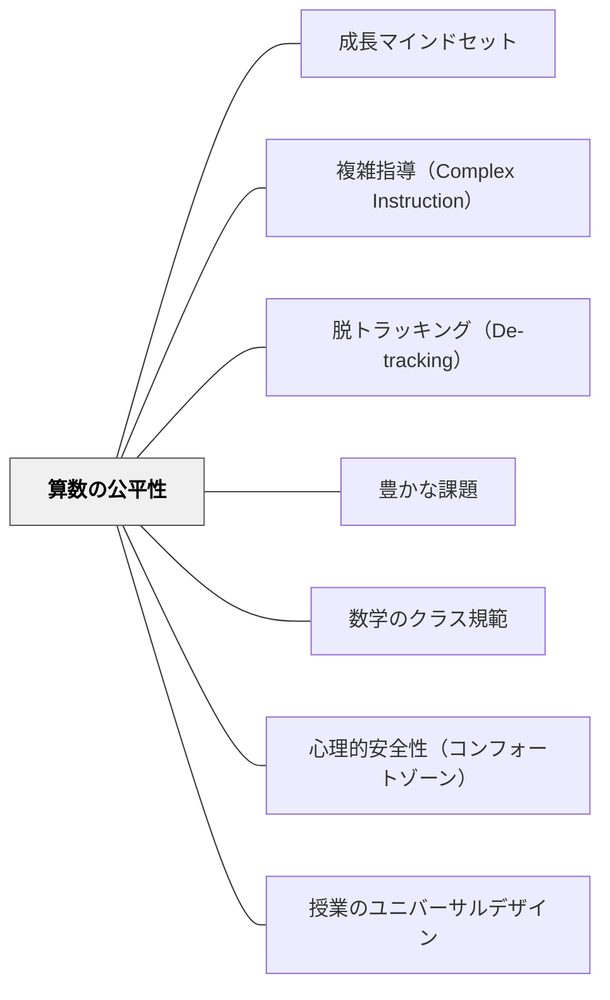

# 算数の公平性

> 「算数は才能のある子のもの」——この信念そのものが、最も大きな学習の壁である。

## [Pattern Connection]

Boaler（2016）Ch.6「Mathematics and the Path to Equity」が一次資料。Leslie et al.（2015）のギフテッド信仰研究・Steele のステレオタイプ脅威・Beilock et al.（2009）の女性教師の数学不安研究を基盤とする。

- **既存パタンとの関連**: [[パタン/成長マインドセット]] の「誰でも伸びられる」という信念を、構造的・社会的な障壁の除去として具体化する。個人のマインドセット変革だけでは不十分——教室設計・評価・グループ編成まで変える必要がある
- **補強された点**: 特別支援学級での実践において「支援の子に高い数学的思考は期待できない」という無意識の偏見が、教師の課題設計に直接影響することへの警戒
- **他のパタンへの波及**: [[パタン/複雑指導（Complex Instruction）]]・[[パタン/脱トラッキング（De-tracking）]]・[[パタン/豊かな課題]] と組み合わさって初めて機能する

---

## 背景（Context）

数学はすべての学問分野の中で「生まれながらの才能が必要」という信仰が最も強い分野の一つである（Leslie et al., 2015）。研究によれば、ギフテッド信仰が強い分野ほど女性・少数民族のPhD取得者が少ない。この信仰は教師にも保護者にも子どもにも浸透しており、無意識に教室の設計・発言・評価に織り込まれていく。

日本の小学校でも「算数が得意な子・苦手な子」という二項対立は普遍的に存在し、特別支援学級では「高い数学的思考よりも計算の定着」というバイアスが特に強く働きやすい。

## 問題（Problem）

「算数は才能のある子のもの」という信念が教室文化に埋め込まれると、教師の期待・課題設計・声かけ・評価がすべてその信念を強化する方向に動く。子どもたちは「自分は算数をやる人かどうか」を小学校の早い段階で決めてしまい、その後の学習機会が大きく分岐する。

## 力のかたち（Forces）

- **ステレオタイプ脅威**（Claude Steele）: テスト前に性別・所属グループを「思い出させる」だけで認知リソースが奪われ、成績が低下する。意図的な差別がなくても、文化的な文脈が成績差を生む
- **女性教師の数学不安の伝染**（Beilock et al., 2009）: 女性教師が数学不安を持つと、その年度の女子生徒の成績が低下する。男子生徒は影響を受けない——教師自身のマインドセットが直接学習者に伝わる
- **女子は深い理解を欲する**: 手順型教育では女子が最初に脱落する。「なぜそうなるのか」を理解したい欲求と「とにかく計算を練習する」文化の衝突
- **「支援の子には簡単な算数」という誤信念**: 特別支援の文脈でも、抽象的・創造的な数学的思考を楽しむ子どもは多い。課題のフロアが高いと参加できないだけで、フロアを下げれば深く探究できる

## 解決（Solution）

**算数の教室から「誰が数学をする人か」というラベルを除去し、すべての子どもが深い数学的思考に参加できる環境を設計する。**

---

### ステレオタイプ脅威への対応

- テスト・課題から性別欄・得意/苦手の自己申告欄を削除する
- 「女の子だから」「支援級だから」という文脈でのハードル下げ表現を自己点検する（「できなくていいから」より「どう考えた？」）
- 「数学は才能ではなく、経験と努力で伸びる」というメッセージを年度初めに明示する

### 女子・特別支援の生徒への追加的な励まし

- 「私はあなたにはできると思っている」を普段発言が少ない子に個別に伝える
- 女性数学者・科学者のロールモデル（例：Maryam Mirzakhani、フィールズ賞受賞者）を算数の授業で紹介する
- 女子が求めるもの（123のSTEMプログラムメタ分析）：実地体験・プロジェクト型・実生活応用・共同作業——ロールモデルよりこれらが参加率を高める

### 多次元性の確保

- 「算数で得意なこと」を一次元（計算の速さ）でなく多次元で定義する：空間的思考・パターン発見・直観的推論・図解・説明・関係の発見
- 授業で「空間的思考が得意な人は？」「図で考えるのが好きな人は？」と多次元の得意を引き出す問いを週1回入れる
- 特別支援の子が「このクラスで一番よく気づく人」「図で考えるのが一番うまい人」として認められる場を作る

### Boalerの6つの公平性戦略

1. **メッセージを変える**: 「誰もが最高レベルの数学まで到達できる」を文化として共有する
2. **探究機会を増やす**: 手順の練習より概念の探究を増やす——探究こそが全員を同じ場に連れて行く
3. **共同作業の技術を教える**: グループワークのスキルを明示的に指導する（[[パタン/複雑指導（Complex Instruction）]] 参照）
4. **追加的励まし**: 女子・有色人種・特別支援の生徒に「あなたにはできる」を個別に伝える
5. **宿題を見直す**: 低収入家庭には静かな学習環境・インターネット・保護者の時間がない——宿題の格差拡大効果を認識する
6. **ロールモデルを示す**: 多様な数学者・科学者の姿を見せる

---

具体例：Uri Treismanの研究（バークレー、1980年代）

アフリカ系アメリカ人学生の数学落第率が高い原因を調査したところ、知識・能力でなく「孤独な学習」が原因だとわかった。アジア系学生は自然に共同学習グループを作っていた。Treismanがアフリカ系学生に共同学習グループを提供したところ、落第率ゼロを達成した。「才能の差」ではなく「学習環境の差」が格差を生んでいた。

---

## 結果（Consequences）

- 「算数が得意な子・苦手な子」の二分法が教室から薄れる
- 普段発言しない子が「自分には得意な見方がある」と気づく場面が生まれる
- 特別支援の子が深い数学的思考に参加できる瞬間が増える
- 女子生徒の算数への参加率・発言率が上がる
- ただし、一人の教師の努力だけでは変えにくい構造的問題も多い——学校全体の設計として考える必要がある

## 関連パタン

- [[パタン/成長マインドセット]] — 公平性の根底にある信念。個人のマインドセットから教室文化へ
- [[パタン/複雑指導（Complex Instruction）]] — 格差解消の最も実証された具体的実践
- [[パタン/脱トラッキング（De-tracking）]] — 能力別グループは格差を固定化する構造
- [[パタン/豊かな課題]] — LFHC課題設計が多様な参加を保証する
- [[パタン/数学のクラス規範]] — 「誰でも最高レベルへ」という規範の設定
- [[パタン/心理的安全性（コンフォートゾーン）]] — 安全な環境があってこそ公平な参加が生まれる
- [[パタン/授業のユニバーサルデザイン]] — UDLとの接続：設計段階からの公平性
- [[文献/Mathematical Mindsets（Boaler）]] — 一次資料

---

## クラスター図

## Actionable Insight

- 今週の算数テストから「名前の横に好きな算数のジャンルを書く欄」を外し、代わりに「今日どんなことを考えたか」を書く欄を作る
- 「〇〇は算数が苦手だから」という文脈での課題の調整を自己点検する——フロアを下げた同じ課題で参加できるか確認する
- 算数の授業で「今日誰かの気づきが一番よかった？」という質問で授業を終わる——計算の速さでなく気づきを評価する文化をつくる
- 「あなたにはできると思っている」の一言を、今週1人だけでも普段発言の少ない子に伝える

---

## 出典

Boaler, J. (2016). *Mathematical Mindsets: Unleashing Students' Potential Through Creative Math, Inspiring Messages and Innovative Teaching*. Jossey-Bass.

Beilock, S. L., Gunderson, E. A., Ramirez, G., & Levine, S. C. (2009). Female teachers' math anxiety affects girls' math achievement. *PNAS*, 107(5), 1860–1863.

Leslie, S. J., Cimpian, A., Meyer, M., & Freeland, E. (2015). Expectations of brilliance underlie gender distributions across academic disciplines. *Science*, 347(6219), 262–265.

Steele, C. M. (2010). *Whistling Vivaldi: How Stereotypes Affect Us and What We Can Do*. Norton.

> "It is not the students who have failed; it is the system that has failed the students." — Jo Boaler

[[文献/Mathematical Mindsets（Boaler）]]
