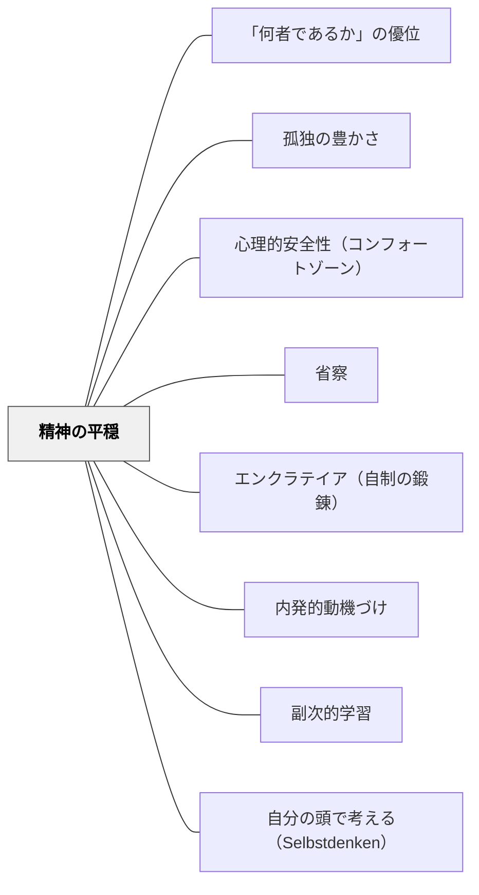

# 精神の平穏

> 申し分のない健康と恵まれた体質から生まれる、落ち着いた朗らかな気質……これらは、位階も富も取って代わることのできない美点である。——ショーペンハウアー（1851）

---

## Pattern Connection

**ショーペンハウアー（1851/2013）「幸福について」統合（2026-05-31）：**

ショーペンハウアーは「精神の平穏（Serenity of Mind）」を幸福の本質条件として論じた。「外部から救いの手を差し伸べても、あまり役に立たない」——幸福の源泉は外部ではなく内的な意識の性状にある。

- **既存パタンとの関連**：[[パタン/心理的安全性（コンフォートゾーン）]] が「安心して試せる場」という外的設計を論じるなら、精神の平穏は子ども・教師双方の「内側の安定状態」として補完的な概念を提供する。外側の心理的安全性と内側の精神の平穏が揃うとき、深い学びが生まれる
- **補強された点**：[[パタン/省察]] の「自分の経験に問い返す」は、精神の平穏があるときに初めて深く機能する。揺さぶられた状態・評価への不安が強い状態では、省察は防衛的な振り返りに終わりやすい
- **修正・拡張された点**：「安心感」は「危険がないこと」という外的条件だけでなく、「自分の内的状態が安定していること」という主観的条件でもある。この区別がショーペンハウアーによって明確になる
- **他のパタンへの波及**：[[パタン/「何者であるか」の優位]] — 「何者であるか」が充実しているとき精神の平穏は自然に生まれる；[[パタン/孤独の豊かさ]] — 精神の平穏は孤独を楽しめる状態の基盤となる

---

## 背景（Context）

学校という場は、外部からの刺激と評価が絶え間なく入ってくる。テスト・通知表・友達との比較・教師の言葉・保護者の期待——子どもたちは常に何らかの評価の文脈にいる。教師もまた管理職からの評価・保護者からの問い合わせ・学習指導要領への適合という外部圧力の中にいる。

ショーペンハウアーは「申し分のない健康と恵まれた体質から生まれる、落ち着いた朗らかな気質……これらは、位階も富も取って代わることのできない美点である」と述べた。さらに「だれもが自分の意識にすっぽり包まれて生きており、直接的には意識のなかでのみ生を営んでいる」——つまり幸福の決定因は外部ではなく「意識の性状」だ。

## 問題（Problem）

外部からの刺激と評価への不安が、学習者の内的状態を不安定にする。

子どもが「間違えたらどう思われるか」「点数が低かったらどうなるか」という不安の中にいるとき、深い思考・本物の探究・自由な発想は生まれにくい。教師が「授業がうまくいかなかったらどう評価されるか」という不安の中で教えているとき、目の前の子どもへの純粋な関心が失われる。

内的状態の不安定さは、外側からは見えにくい。しかし学習の質・省察の深さ・子どもとの関係の質に確実に影響する。

## 力のかたち（Forces）

- 外部の刺激（評価・比較・期待）は学習の動機にもなるが、強すぎると内的安定を損なう
- 精神の平穏は「何もしない」状態ではなく「内側から動いている」安定した活動の状態
- 外部状況が変わっても「意識の性状」が安定していれば、同じ出来事を全く違う形で経験できる
- 精神の平穏は一時的なリラクゼーションではなく、日々の実践（省察・節制・孤独の時間）によって育てられる性質
- 「教師の精神の平穏」が学級全体の雰囲気に波及する——副次的学習として伝わる

## 解決（Solution）

**外部の評価・刺激に揺さぶられない内的安定状態を、子どもと教師双方が育てる。そのための「精神の平穏の場」を意図的に設計する。**

---

### 子どもの精神の平穏を育てる設計

**「評価されない時間」の保護**

授業の中に「これが正解でなくていい」「評価されない」時間を置く。自由記述・問いを持つ時間・ジャーナル・独立読書——これらは外部評価が入らない、子ども自身の内的世界に向き合う場だ。

**「比較でなく自己との対話」のフィードバック**

「他の人より」ではなく「昨日の自分より」「最初の考えと比べて」というフィードバックの言語が、外部比較から内的成長への注意の方向を変える。

**安心して「わからない」と言える文化**

「わかりません」「まだ考え中です」が受け入れられる学級文化は、外部評価への不安を下げ、精神の平穏の土台をつくる。→ [[パタン/心理的安全性（コンフォートゾーン）]]

---

### 教師の精神の平穏の実践

**「一度に一つの引き出しを開ける」**

ショーペンハウアーの訓話：「ひとつのことを企てたら、他の一切を度外視し、払いのけねばならない。いわば思考の引き出しのひとつを開けたら、その間は他の引き出しを閉めたままにしておきなさい」——授業中は授業に、振り返りの時間は振り返りに。同時進行する不安・懸念・課題を意識的に「棚上げ」する実践。

**「持っていないものでなく、持っているものを見る」**

ショーペンハウアーの感謝の技法：「自分が持っているものに対して、『これが私のものでなかったら、どんなだろう?』としばしば自問してみよう」——クラスの子どもたちの「あの子が問題なのに」ではなく「この子がいてくれている」という視点の意図的な転換。

**省察による精神の平穏の深化**

日々の授業の後、「今日の自分の内側はどうだったか」を短く振り返る。評価（うまくいったか・よかったか）でなく、「自分の意識の性状」への問いが精神の平穏を育てる。

---

### 岩井自身の自己教育での精神の平穏

日々の数学研究・このWiki構築・パタン・ランゲージの探究は「外部から評価されるためでなく、内的関心から動く活動」だ。この活動が続くとき、精神の平穏はその副産物として生まれる。

「外部評価が揺さぶってきたとき（批判・無関心・比較）に動じない」という状態は、内的活動の充実から来る。ショーペンハウアーはこれを「才知あふれる人物はまったく独りぼっちでも、みずからの思索や想像ですばらしく楽しめる」と表現した。

---

## 結果（Consequences）

- 子どもが外部評価への依存を減らし、自分の内的関心から学べるようになる
- 教師の内的安定が学級の雰囲気を安定させる——焦り・不安の伝染が減る
- 深い省察・本物の探究・自由な発想が生まれやすくなる
- ただし「精神の平穏」は「無関心・無感動」ではない——積極的な安定であり、適切な感情の動きを含む
- 外部からの強いプレッシャーの中でも育てられるが、制度的な評価圧力が強い環境では実践が難しくなる

## 関連パタン

- [[パタン/「何者であるか」の優位]] — 内的性状の充実が精神の平穏の基盤
- [[パタン/孤独の豊かさ]] — 精神の平穏があるとき孤独は苦ではなく豊かさになる
- [[パタン/心理的安全性（コンフォートゾーン）]] — 外的安全性と内的平穏の補完関係
- [[パタン/省察]] — 精神の平穏を深化させる実践
- [[パタン/エンクラテイア（自制の鍛錬）]] — 欲望・感情の管理が精神の平穏を支える
- [[パタン/内発的動機づけ]] — 内側から動く動機づけの状態は精神の平穏と重なる
- [[パタン/副次的学習]] — 教師の精神の平穏が学習者に副次的に伝わる
- [[パタン/自分の頭で考える（Selbstdenken）]] — 思索による内的充実が精神の平穏を育てる
- [[文献/幸福について（ショーペンハウアー）]] — 本パタンの一次資料

---

## クラスター図

## Actionable Insight

- **授業中に「一つの引き出しだけを開ける」を試す**：今日の授業では「国語の授業に集中する」——その間は明日の会議の心配を意識的に棚上げにする。30秒でも「今ここに集中する」意図が精神の平穏の実践になる
- **「持っているものを見る」視点を朝に一つ書く**：「今日の自分にある良いものは何か」を出勤前に1つ書く。欠けているものでなく、あるものへの注意が精神の平穏の土台を作る
- **子どもに「評価されない問い」を1つ設ける**：「正解はなく、あなたが今思っていること」を書かせる時間を週1回つくる。その時間は採点しない・コメントしないと事前に告げる

---

## 出典

ショーペンハウアー、鈴木芳子（訳）（2013）『幸福について』光文社古典新訳文庫（原著 Schopenhauer, A. (1851). Aphorismen zur Lebensweisheit. In Parerga und Paralipomena.）

> 「申し分のない健康と恵まれた体質から生まれる、落ち着いた朗らかな気質……これらは、位階も富も取って代わることのできない美点である」——ショーペンハウアー（1851/2013）

> 「だれもが自分の意識にすっぽり包まれて生きており、直接的には意識のなかでのみ生を営んでいる。だから外部から救いの手を差し伸べても、あまり役に立たない」——ショーペンハウアー（1851/2013）
