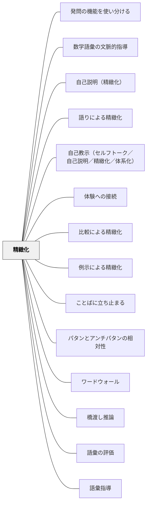

# 精緻化

**一文でいうと**：新しい知識を既有知識・経験・例・説明と結び、使える理解へ深める。

## 使いどころ・使いすぎ注意

| 観点         | 内容                                       |
| ------------ | ------------------------------------------ |
| 使いどころ   | 知識をつなぎ、使える理解へ深めたいとき。   |
| 使いすぎ注意 | 関連づけを増やしすぎると、中心がぼやける。 |

---

## Pattern Connection

**Allen（1999）統合（2026-05-20）**：

_Words, Words, Words_ は語彙習得の三条件として「統合（Integration）・反復（Repetition）・意味ある使用（Meaningful Use）」を挙げる（Nagy, 1988）。これは精緻化の三つの実装形式として読むことができる。

- **既存パタンとの関連**：精緻化の核心「新しい知識を既有の知識・経験と結びつける」＝語彙の「統合（Integration）」と直接対応する。語彙習得における精緻化は「その語を自分の知識・経験に引き寄せること」だ。Allenの三条件は精緻化パタンに「語彙指導における操作的定義」を与える
- **補強された点**：精緻化には「反復（Repetition）」の次元が加わる。知識を一度結びつけるだけでなく、10〜15回の意味のある出会いが必要——単発の精緻化でなく、単元を通じて繰り返し異なる文脈で精緻化を重ねる設計が必要だ
- **修正・拡張された点**：「意味ある使用（Meaningful Use）」が精緻化に実践の場を与える。精緻化は「理解する」だけで終わらず、「使う」「書く」「話す」ことで初めて完結する——これは「学んだことを使う活動を後に置く」ことの根拠となる
- **他のパタンへの波及**：[[パタン/語彙指導]] — 統合・反復・意味ある使用の三条件を語彙指導として実装するパタン。[[パタン/ワードウォール]] — 精緻化の反復機会を環境として設計する

### 語彙精緻化の3つのツール（Allen, 1999）

| ツール                                       | 精緻化のタイプ                                         |
| -------------------------------------------- | ------------------------------------------------------ |
| **コンテクスト−コンテンツ−エクスペリエンス** | 文脈の定義→教科的知識→個人体験の三層を横断する統合     |
| **コンセプト・ラダー**                       | 語の見た目・機能・部分・代替語を問いで掘り下げる深化   |
| **リニア・アレイ**                           | 関連語を程度の強弱で並べ、微妙な意味の違いを精緻化する |

### 岩井輝久（2023）——パタン記述は精緻化の実践でもある

岩井は「一つの教育のパタン・ランゲージ」の思考断片の中で次のように記している：

> 「パタン記述は、精緻化でもある。短いパタン記述でもいいから、パタン記述を続けていくことには価値がある。」

パタン記述（背景・問題・力のかたち・解決・関連パタン）を書くプロセスは、精緻化の具体的な実践である：

- **既有知識との接続**：授業実践を既知の概念・理論と結びつける（精緻化の核心）
- **関連パタンの列挙**：知識をネットワークとして構造化する
- **具体例・エピソードの記述**：抽象的なパタンを実体験に接続する

パタン記述を書くことは「パタン記述の知識」を学ぶことではなく、「自分の経験と教育知識を結びつける」という精緻化の行為そのものである。この観点から、パタン・ランゲージを育てることは、教師の専門知識を精緻化し続けることでもある。

- **他のパタンへの波及**：[[自分のパタンを作る]]（パタン記述を書く実践）・[[パタン/守・破・離（習熟の三段階）]]（精緻化は「破」の段階で深まる）

---

**Weinstein & Sumeracki（2018）統合（2026-05-14）：**

_Understanding How We Learn_（東京書籍, 2022）は、精緻化（Elaboration）を6つの学習方略の1つとして「精緻化的質問（Elaborative Interrogation）」として体系化している。

- **補強された点**：精緻化の核心が「なぜ？」「どのように？」を問うことで新旧知識を接続する行為であることが明確になった。「精緻化的質問」として授業の発問設計に直接対応する形式が整理された。
- **接続した概念**：本書の「具体例（Concrete Examples）」方略——抽象概念に多様な文脈からの具体例を添えること——が精緻化の子パタン [[パタン/例示による精緻化]] と対応する。具体例の設計原則（多様な文脈・非例・学習者が例を作る）は [[パタン/具体例]] として独立パタン化された。
- **他のパタンへの波及**：[[実践/学習科学の6方略]] で6方略の文脈に位置づけられた。精緻化は間隔学習・検索練習と組み合わせると「検索しながら精緻化する（なぜそうなるかを思い出しながら説明する）」という高次の学習活動になる。

---

## 背景（Context）

学習者は新しい知識を得るとき、それを**既有の知識や経験と関連づけること**で、より深く・より持続的に理解できるようになる。理解が浅いと、知識が断片のまま保持され、応用や転移が困難になる。

## 問題（Problem）

情報が表面的に処理されると、知識は記憶に残りにくく、「**わかったつもり**」「知っているだけ」の状態にとどまる。このような学びでは、後の実践や思考で知識を使うことが難しい。

## 力のかたち（Forces）

- 学習は有限の時間の中で行われるため、つい事実の伝達に偏りがち
- 学習者の既有知識や関心は多様で、関連づけの仕方も一様ではない
- 精緻化には、意図的に思考する時間と機会が必要

## 解決（Solution）

学習した内容を、既有の知識や経験・他の概念・日常生活・物語などと**積極的に結びつける**。

**精緻化の具体的方法（子パタン）：**

| 子パタン                    | 内容                                                 |
| --------------------------- | ---------------------------------------------------- |
| [[パタン/説明による精緻化]] | 自分の言葉で他者に説明することで知識を再構成する     |
| [[パタン/例示による精緻化]] | 具体例を挙げて抽象的知識と結びつける                 |
| [[パタン/比較による精緻化]] | 類似点・相違点を意識することで概念の構造を明確にする |
| [[パタン/体験への接続]]     | 学習内容と自分の実体験・感情とを結びつける           |
| [[パタン/可視化]]           | 図解・メモ・マッピングなどで関係性を明らかにする     |
| [[パタン/語りによる精緻化]] | 物語として語ることで知識の流れや意味を保持する       |
| [[パタン/ソーシャル]]       | 異なる視点や補完的知識と結びつける対話による精緻化   |

**授業での実践例：**

- 社会科の「江戸の産業」で現代の商業と比較して違いや共通点を見つける
- 理科の「電気の働き」で回路図を自分で描き、言葉で仕組みを説明するプレゼン
- 国語で読んだ物語と現代のニュースを結びつけて価値観の違いを語るディスカッション
- 授業のまとめに「今日の学びを一言で表すと？」という言語化を取り入れる

## 結果（Consequences）

- 知識が単独でなく、**ネットワークとして構築される**ようになる
- 学習者の中に、**説明可能性・応用可能性のある知識**が育つ
- 後の学習や実践場面で、**知識を再利用・再組織する力**が発揮される（転移）
- 他者との学び合いの中で、より多様なつながりや気づきが生まれる

## 関連パタン
- [[教科/国語]]
- [[パタン/発問の機能を使い分ける]]
- [[パタン/数学語彙の文脈的指導]]
- [[パタン/自己説明（精緻化）]]
- [[教科/算数・数学で使うパタン]]
- [[パタン/語りによる精緻化]]
- [[パタン/自己教示（セルフトーク／自己説明／精緻化／体系化）]]
- [[パタン/体験への接続]]
- [[パタン/比較による精緻化]]
- [[パタン/例示による精緻化]]
- [[パタン/ことばに立ち止まる]]
- [[パタン/パタンとアンチパタンの相対性]]
- [[パタン/ワードウォール]]
- [[パタン/橋渡し推論]]
- [[パタン/語彙の評価]]
- [[パタン/語彙指導]]
- [[パタン/作家のクラフト]]
- [[パタン/作家のように読む]]
- [[パタン/守・破・離（習熟の三段階）]]
- [[パタン/手がかりと記憶対象]]
- [[パタン/表現して学ぶ]]

- [[パタン/説明による精緻化]] — 自分の言葉で語ることで理解を深める（子パタン）
- [[パタン/具体例]] — 精緻化の実装として多様な具体例を使う独立パタン
- [[パタン/可視化]] — 見えないものを見える形にする
- [[パタン/問い返しのデザイン]] — 発言を深める問い返し
- [[パタン/メタ意識]] — 自分の理解状態を把握する構え
- [[パタン/望ましい困難]] — 「なぜ？」を問う精緻化は学習中に難しく感じるが定着が深い
- [[概念/精緻化]] — 精緻化の概念的背景と子パタン群の整理
- [[パタン/自己調整]] — 精緻化が深まるほど自己調整の質が高まる
- [[パタン/推論する（インファリング）]] — 書かれていないことを既知とつなげて読む推論は精緻化の読書版
- [[パタン/深い理解（3水準の読解）]] — 表面・推論・創造の3水準を深める過程が精緻化
- [[パタン/統合する（シンセサイジング）]] — 複数の情報を統合して新しい理解を生む上位の精緻化
- [[パタン/読みとつながる]] — テキストと自己・他書・世界をつなぐことが読書における精緻化
- [[パタン/テキスト・フレーム]] — 文章構造を枠組みとして把握することで精緻化を支える
- [[パタン/背景知識]] — 既有知識が豊かなほど精緻化の幅が広がる
- [[パタン/類推的学習②]] — 既知の構造を未知に当てはめる類推は精緻化の核心
- [[パタン/場所法（記憶の宮殿）]] — 空間イメージとの結びつけは精緻化による記憶強化の典型
- [[パタン/研究ピース]] — コメント（自分の意見）は精緻化（自分の言葉で再表現する）そのもの
- [[パタン/熟慮的問い]] — 精緻化的質問（なぜ？どのように？）は発問設計と直接対応する
- [[パタン/メタ認知的モニタリング]] — 精緻化が深まるほど自分の理解状態のモニタリング精度が上がる
- [[パタン/フィードバック]] — フィードバックを受けて新旧知識を結びつける精緻化が定着を深める
- [[パタン/リーディング・ワークショップ]] — 読書における精緻化の実践場（テキストと自己・他書・世界をつなぐ）
- [[パタン/身体性に沿う]] — 身体的体験との接続が精緻化の具体的土台をつくる

## このパタンが働く実践
- [[実践/テキストコーディング]]
- [[実践/思考の記録サイクル]]
- [[実践/2列メモ（シンクシート）]]
- [[実践/ライターズ・ノートの起動]]
- [[実践/書き出しのクラフト]]
- [[実践/10や100を単位にして計算しよう]]
- [[実践/BDA読解授業の設計]] — Afterフェーズ（統合・転移・要約）が精緻化の実践場になる
- [[実践/文学討論グループの設計]] — 討論での説明・根拠づけ・問い直しが精緻化の深い実践になる
- [[実践/リーダーズ・ノートの起動]] — テキストと自己・他書・世界をつなぐ書き込みが精緻化の実践になる

| 実践パタン                      | どのように精緻化しているか                               |
| ------------------------------- | -------------------------------------------------------- |
| [[パタン/ナンバートーク]]       | 複数の解法を比較し、数の関係や計算の構造を詳しく理解する |
| [[パタン/数学語彙の文脈的指導]] | 新しい語彙を図・例・非例・日常語との違いに結びつける     |
| [[パタン/説明による精緻化]]     | 自分の言葉で説明することで知識を再構成する               |

## 参考文献

- ノヴァク & ゴーウェン（1984）『概念マップと意味ある学習』
- アウジベル（1963）有意味受容学習論
- John Hattie（2021）『教師のための教育効果を高めるマインドフレーム』

## クラスター図

## Actionable Insight

- 授業のまとめに「今日の学びを1文で説明してみよう」と投げかける——自分の言葉で説明することが最も強力な精緻化の一つ
- 学習した概念に「自分の経験からの具体例」を1つ挙げさせる——体験への接続が知識をネットワーク化する
- 単元の終わりに「これと似ている別のこと・つながること」を1つ書かせる——類推が転移可能な理解を育てる
- 算数でたし算とかけ算の両方を学んだあと「どんなときにかけ算、どんなときにたし算？」と問う——違いを説明させる行為が概念の輪郭を作る
- 国語で新しい言葉を学んだあと「自分の経験でこの言葉を使った場面は？」と問う——体験との接続が語彙の定着を深める（Allen, 1999）
- ペア・シェアの前に「1文で言うと？」と書かせてから共有する——言語化してから対話することで精緻化が2段階で深まる

## 出典

- パタン集/精緻化.md
