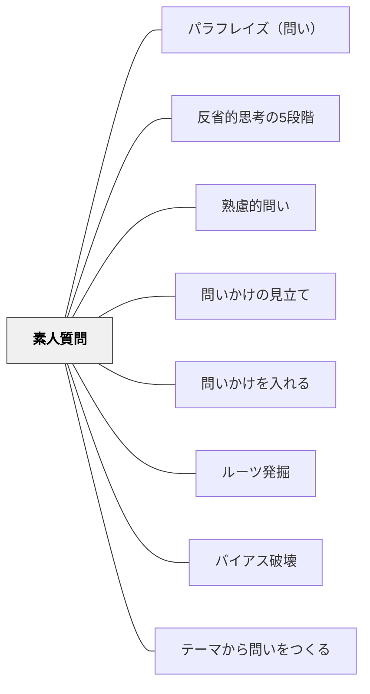

# 素人質問

> 専門家が当たり前と思っていることを「それってどういうこと？」と問う。

## Pattern Connection（安斎勇樹, 2021）

**位置づけの補強**：安斎（2021）は素人質問を「フカボリモード」（こだわりを深掘りする問い）の1技法として位置づけ、「AKY（あえて・空気・読まない）」という名前で実践法を具体化している。専門家が当然視する前提に、あえて空気を読まずに問いを立てることで、見えなくなっていた前提が可視化される。

**AKY技法**——あえて・空気・読まない

安斎は「なぜカーナビを作るのですか？」という問いを例に挙げる。開発者にとって自明な「カーナビ＝道を案内するもの」という前提を問い直すことで、「移動体験そのものを豊かにする」という本来の目的が浮かび上がる。「そもそも、なぜこれをするんでしたっけ？」は最もシンプルな素人質問の型。

**吃音のA君エピソード**（安斎の体験より）

吃音があり普段あまり話さない小学5年生のA君が、「あなたが小さい頃に夢中になっていた遊びはなんですか？」という問いに、堰を切ったように話し始めた。「準備できていないうちに意見を求められるプレッシャー」が問題だった——問いが個人の体験・こだわりに向けられたとき、それまで閉じていた口が開く。これは素人質問が持つ「前提を外す力」の教育的意義を示している。

**他のパタンへの波及**：素人質問をどの場面で使うかは [[パタン/問いかけの見立て]] の「こだわりを感じたか」によって決まる。素人質問で引き出した答えを受けて、さらに [[パタン/ルーツ発掘]] で源泉を聞き込むという連続技が有効。

---

## 背景（Context）
ある分野の専門家や熟練者は、長年の経験によって多くのことを「自明」として扱うようになる。
その自明性は、当該分野の外からは必ずしも明らかではない。
学習者や対話相手が専門家と知識の前提を共有していないとき、問いの出発点にズレが生まれる。
素直な問いほど、深い前提を照らし出す力をもつ。

## 問題（Problem）
専門家や熟練者が「当然のこと」として言葉にしない前提が、対話や学びを妨げている。
学習者は「こんなことを聞いてよいのか」と躊躇し、根本的な疑問を飲み込んでしまう。
その結果、表面的な理解にとどまり、概念の核心に触れる機会が失われる。

## 力のかたち（Forces）
- 専門性は深い理解を生む反面、初学者との認識ギャップを広げる。
- 「当たり前」に問いを立てることは、知的な勇気を必要とする。
- 素朴な問いは、しばしば専門家自身も答えを言語化できていない核心に触れる。
- 問いを歓迎する心理的安全性がなければ、素人質問は生まれない。

## 解決（Solution）
「それってどういうこと？」「なぜそれが前提なの？」という素朴な問いを意識的に許容し、むしろ奨励する。
「なぜ空は青いのですか？」のような問いが持つ力を、学習場面で積極的に活かす。
専門家・教師・ファシリテーターは、素人質問を歓迎する姿勢を明示し、前提を言語化する練習の場を設ける。
問いを立てること自体を評価する文化を育てることで、学習者が安心して根本を問える環境をつくる。

## 結果（Consequences）
隠れていた前提が可視化され、概念の根幹に迫る対話が生まれやすくなる。
専門家自身も自分の知識を再言語化する機会を得て、理解が深まる。
学習者が「問うこと」に自信をもち、批判的思考の基盤が育まれる。
一方で、問いが多すぎると授業の進行が滞るリスクがあるため、問いを扱う時間の設計が必要になる。

## 関連パタン
- [[パタン/パラフレイズ（問い）]]
- [[パタン/反省的思考の5段階]]
- [[パタン/熟慮的問い]] — 親パタン
- [[パタン/問いかけの見立て]] — フカボリ（こだわり）が必要かどうかを判断する前段
- [[パタン/問いかけを入れる]] — 素人質問をフカボリモードとして体系的に位置づける
- [[パタン/ルーツ発掘]] — 素人質問で引き出した後のこだわりの源泉を聞き込む
- [[パタン/バイアス破壊]] — 同じく前提を問い直すアプローチ（ユサブリ寄り）
- [[パタン/テーマから問いをつくる]] — 既有知識やテーマを起点に問いを立てる

## クラスター図

## Actionable Insight

- 授業の冒頭に「どんな素朴な疑問でも聞いて大丈夫」と明示し、最初の素人質問を全体でポジティブに拾う——心理的安全性を宣言することが素人質問の文化の土台になる
- 学習者が「こんなこと聞いていいのか」という顔をしたときこそ「それが一番大事な問いかもしれない」と返す——教師の反応が問いの文化を作る最大の変数
- 自分の授業の「当たり前にしていること」を1つ取り上げ「なぜ当たり前なの？」と学習者に問わせる——前提の言語化が専門家自身の理解も深める

## 出典
- [[文献/熟慮的問いのパターンリスト（動画記録）]]
