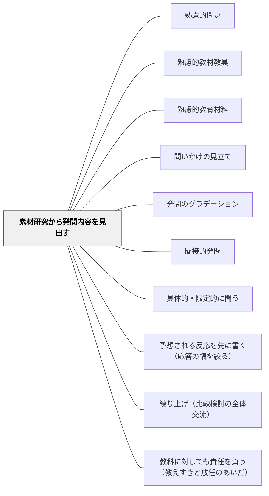

# 素材研究から発問内容を見出す

> 発問の「内容」は教師が自分で教材をやってみることから始まる——素材を体験し感じた疑問・発見・驚きを起点に、学習指導要領で絞り込み、子どもの実態と照合して発問の核を見出す。

## [Pattern Connection]

- **既存パタンとの関連**：[[パタン/熟慮的問い]] が発問の種類と技法を扱うのに対し、本パタンは発問の「内容」を決める前段階の教材研究プロセスを扱う。[[パタン/熟慮的教材教具]] ・[[パタン/熟慮的教材教具]] が教材の選択・設計を扱うのに対し、本パタンは扱う素材から発問の核を掘り出すプロセスに特化する。
- **補強された点**：土居（2026）が「内容と方法は車の両輪」と述べる背景として、発問の「内容」を外した発問がどれだけ「工夫」されていても授業のねらいを達成できないという問題が明確になった。「教師がやってみる」という体験的素材研究が「指導の熱」を生むという点も補強された。
- **修正・拡張された点**：「素材研究→学習指導要領で絞り込む→子どもの実態と照合する」という3ステップを体系化した。体育・算数・理科など国語以外への応用可能性も示した。
- **他のパタンへの波及**：[[パタン/問いかけの見立て]] の「内容を見立てる」部分として機能する。[[パタン/発問のグラデーション]] においても「発問の内容は変えずにレベルだけを変える」という原則の前提として素材研究が必須であることが示された。

## 背景（Context）

発問の質は「工夫」（どのように問うか）だけで決まるのではなく、「内容」（何を問うか）によっても決定される。どれだけ間接的・具体的・ゆさぶりを施しても、発問の内容が授業のねらいを外れていれば子どもの深い学びにつながらない。土居（2026）はこれを「内容と方法は車の両輪」と表現している。発問の内容を見出す出発点は、教師が教材・素材を自分自身で深く研究することだ。

## 問題（Problem）

授業の発問を「指導書や参考書の発問をそのまま使う」「何となくその場で思いついた問いで進める」という状態では、教師自身の発問に「熱」が乗らない。また、教師自身が素材を深く経験していないと、子どもがどこでつまずくかの予測も立てにくい。発問の「内容」が不十分なまま「工夫」だけが先行すると、「活動あって学びなし」の授業になる。

## 力のかたち（Forces）

- 素材研究が深まると「教えたいこと」が広がりすぎ、絞り込みが必要になる
- 学習指導要領を参照することで「今学年・今単元で指導すべき内容」が明確になる
- 「自分がやってみる」という体験から生まれた気づきは、「指導の熱」として授業に乗る
- 指導書・書籍を先に読むと、その枠組みに引っ張られ自分なりの気づきが薄くなる
- 子どものつまずきを予測する「学習者研究」が欠けると、教師の論理だけの発問になる

## 解決（Solution）

**発問の内容を見出すには、①教師が自分で教材をやってみる、②学習指導要領で絞り込む、③子どものつまずきと実態を照合する、という3ステップを順番通りに行う。**

### ステップ1：教師が自分で「やってみる」

素材研究の最初で最も重要なことは「教師自身が教材を体験する」ことだ。

**国語**：まず教材文を一読者として読む。得た感想・読後感・違和感を全て記録する。「このことを子ども達と一緒に考えたい！」という気づきが生まれる。

**算数**：自分なりに問題の解決の仕方を考えてみる。「子どもに気づいてほしいこと」が明確になる。

**体育**：実際に体を動かして技を練習する。土居が市の公開授業で跳び箱運動の素材研究をした際、自分が実際に跳んでみることで「子どもに伝えたいことがたくさん見つかった」という。

**理科**：予備実験を先に教師がやってみる。実験のポイント・子どもに気をつけさせること・考えさせたいことが明確になる。

> 「この順序が重要です。指導書や書籍に初めから当たってしまうと、どうしてもそれらに引っ張られ、その知識や枠組みで教材を見るようになります」——土居正博（2026）

### ステップ2：学習指導要領で絞り込む

「自分でやってみる」と教えたいことが広がりすぎる。学習指導要領を参照することで、「今学年・今単元で指導すべき内容」に絞り込む。

- 「大造じいさんとガン」（5年）→ 学習指導要領高学年文学「登場人物の相互関係」「描写」
- 「跳び箱運動」（中学年）→ 解説に例示された技（開脚跳び・台上前転・首はね跳び）

絞り込みによって「発問の内容を何にするか」が具体的に定まっていく。

### ステップ3：子どものつまずきと実態を照合する

**つまずきの予測（困難度査定）**：
- 「ごんぎつね」で「子ぎつね」を「小ぎつね」と誤読する子が多い——そのためのの手立てを発問として設計できる（「ごんは大人かな、子どもかな」）
- マット運動の後転でお尻をすぐ近くについてしまう——それを見越した発問が設計できる

**子どもの実態の見取り**：
- 言語的：ノート・端末の記述、発言、つぶやき
- 非言語的：しぐさ、表情、姿勢

実態を把握することで、「教師側の論理」と「子ども側の論理」のバランスをとりながら発問内容を最終的に決定する。

### 順序の原則

1. まず自分がやってみる（体験で「熱」を生む）
2. 次に指導書・書籍にあたる（視野を広げる）
3. 学習指導要領で絞り込む（ねらいを明確にする）
4. 子どものつまずきと実態を照合する（学習者研究）

## 結果（Consequences）

- 発問の内容に教師自身の「熱」が乗り、子どもに伝わる授業になる
- 授業のねらいを外さない発問が設計できる
- 素材研究を重ねると、発問のグラデーションを「内容を変えずにレベルだけ変える」設計も可能になる
- 「あれもこれも教えたい」状態から「これを問うべき」という焦点化された発問に至れる

## 関連パタン

- [[パタン/熟慮的問い]] — 発問設計の上位パタン
- [[パタン/熟慮的教材教具]] — 教材選択・設計の上位パタン
- [[パタン/熟慮的教材教具]] — 素材選択の関連パタン
- [[パタン/問いかけの見立て]] — 素材研究の結果をもとに発問の種類を選ぶ
- [[パタン/発問のグラデーション]] — 発問の内容を決めてからグラデーションを設定する
- [[パタン/間接的発問]] — 内容が決まったあとに「方法」として工夫を加える
- [[パタン/具体的・限定的に問う]] — 内容が決まったあとに「方法」として限定化を加える

- [[パタン/予想される反応を先に書く（応答の幅を絞る）]] — 予想される反応を書けるかどうかは、素材研究の深さに依存する
- [[パタン/練り上げ（比較検討の全体交流）]] — 比較のために何をどう並べるかは、素材研究の段階で決まる
- [[パタン/教科に対しても責任を負う（教えすぎと放任のあいだ）]] — 「教科の本質」を教師が持っていなければ設計し込めない。その持ち方

## クラスター図

## Actionable Insight

- 次の単元の教材を「教師として今日1回、一読者・一学習者として体験する」——気になった点・驚いた点・わからなかった点をメモするだけで発問の種が生まれる
- 単元の発問案を書いた後「この発問は学習指導要領のどの指導事項と対応しているか」を確認する——対応していない発問を削ぎ落とすと授業が焦点化する
- 「この内容を学ぶときに子どもがつまずきやすいポイントは何か」を1つ想定してから発問を設計する——つまずきを見越した発問が、すべての子に届く問いになる

## 出典

- 土居正博（2026）『自分で考え、学べる子を育てる！ 発問の技術』学陽書房
- 田近光一・井上尚美・中村和弘編（2018）『国語教育指導用語辞典第5版』教育出版（素材研究・学習者研究・指導法研究の3要素）
- 植阪友理（2021）「学習者のつまずきをもとに設計する国語授業」小山義徳・道田泰司編 『「問う力」を育てる理論と実践』ひつじ書房
- [[文献/自分で考え、学べる子を育てる！ 発問の技術]]

> 「素材研究が重要だ、ということは、教師であれば一度は耳にすることです。しかし、具体的にどのように教材研究をしたらいいかはイマイチわかっていない……まず何より大切なことは、『教師自身が行ってみる』ということです」——土居正博（2026）
