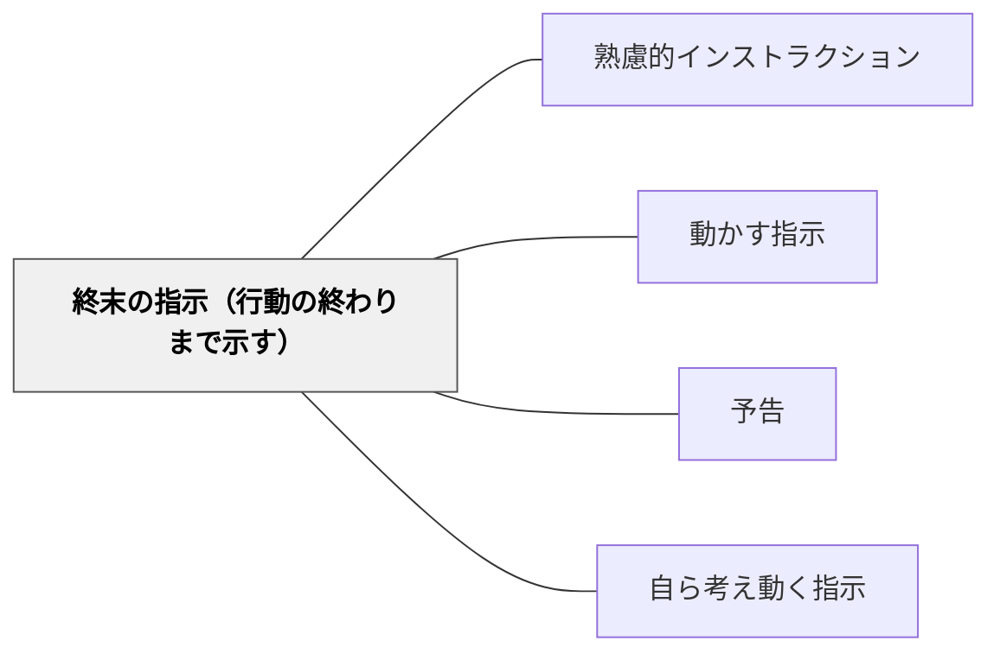

# 終末の指示（行動の終わりまで示す）

> 「食べ終わったら元の並び方で集合する」のように、活動の終結まで含めた指示が混乱を防ぐ。

## 背景（Context）
指示を出すとき、活動の開始や途中の手順だけを伝えて終わりの状態を示さないことがある。受け手は活動が終わったあと「次にどうすればいいか」が分からず、その場で迷ったり動きが止まったりする。土居正博は指示論の中で、終末まで示すことの重要性を強調した。

## 問題（Problem）
終わりが示されない指示では、活動の終了後に混乱が生じやすい。「活動が終わったら何をすればいいか」という問いに答えが用意されていないと、学習者が個別に判断を求めてきたり待機状態が長引いたりする。活動の区切りと次の行動が明確でないと、集団の動きが乱れる。

## 力のかたち（Forces）
- 活動の終わりは個人差があるため、先に終わった人の行動も設計が必要
- 「終わり」が見えると、学習者は見通しをもって取り組める
- 終末の指示がないと、指示者が個別対応に追われる
- 活動の終わりを明示することで、次の活動への移行がスムーズになる

## 解決（Solution）
**指示には活動の開始だけでなく、終了後の行動・状態まで含めて一度で伝える。**

「〜したら、〜してください」という形で、活動の終結と次の行動をセットにして指示する。「読み終わったら静かに待つ」「書き終わったら伏せて待つ」のように、終了後の状態を具体的に示す。活動の「始まり」と「終わり」を両方設計することで、指示が完結する。

## 結果（Consequences）
- 活動後の混乱・待機の乱れが減る
- 指示者が個別対応に追われる頻度が下がる
- 学習者が見通しをもって活動に取り組める

## クラスター図

## Actionable Insight

- 全ての活動指示を「〜したら、〜してください」の形で終わりまで含めて伝える——終結の指示があることで活動後の混乱・待機の乱れが防げる
- 活動の早い終わりをした学習者向けの「終わったらやること」を事前に準備して伝える——個人差への対応が個別対応に追われる時間を減らす
- 指示の終わりに「終わったときの状態はこうなっています」と最終状態を一言付け加える——終了状態の明示が学習者の見通しと自律的な行動を支える

## 出典

- 一つの教育のパタン・ランゲージ（岩井輝久）

## 関連パタン
- [[パタン/熟慮的インストラクション]] — 親パタン
- [[パタン/動かす指示]] — 具体的行動を引き出す指示と連動
- [[パタン/予告]] — 次の活動を事前に知らせる
- [[パタン/自ら考え動く指示]] — 終末後の自律的行動へ
