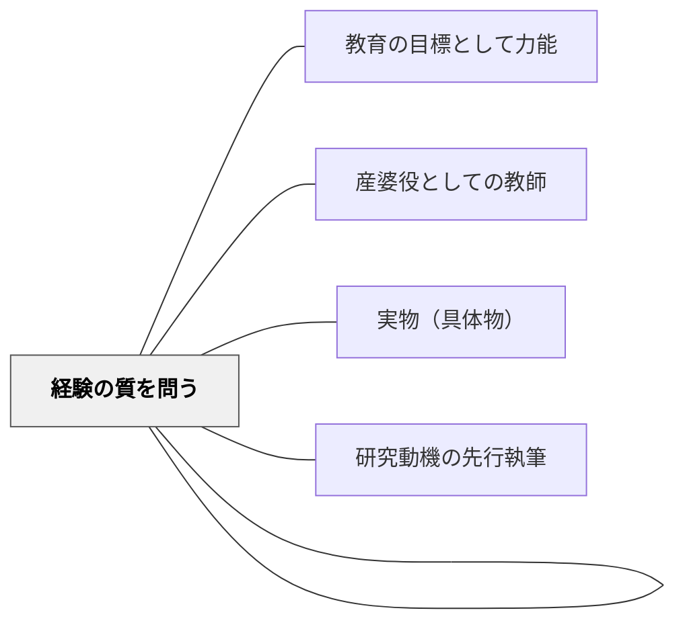

# 経験から出発すること

> しかしすべての認識が感覚だけからできるわけではない。

## Pattern Connection

### 牧口常三郎（1930）——教科の三段階構造：郷土科から統合教科へ

牧口は *創価教育学体系 第4巻*（教材論）において、教科の理想的な構造を三段階として示した。この構造は「経験から出発すること」の原理が、単一の授業設計だけでなく**カリキュラム全体の設計原理**になることを示している。

**教科の三段階構造**

| 段階 | 教科の型 | 内容 |
|---|---|---|
| **第一段階：郷土科** | 基礎的直観・身近な環境 | 学習者が直接体験できる地域・生活・環境を学習の出発点とする。抽象概念より前に「自分が知っている世界」から始める |
| **第二段階：分業的学習教科** | 国語・算数・理科など各教科 | 郷土科で得た直接体験を基盤に、各教科の体系的知識・技能を深める |
| **第三段階：統合教科（国民科）** | 横断的・総合的学習 | 各教科を統合して、社会・国家・人類への関心と価値創造能力を育む |

**「経験から出発すること」との直接接続**

郷土科が第一段階に置かれる理由は、「直観なき概念は不毛」（カント）の原理に従っている——学習者が直接体験していない遠い世界の抽象的知識から始めると、「不毛な概念」が積み上がる。郷土（自分が見聞きしている世界）から始めることで、直観と概念が正しい順序で結合する。

牧口は郷土科の重要性について：教師が地域の事物を直接手に取って教えることで、教科書知識より前に「経験的認識」が確立される。これが全ての学習の土台になる。

**現代の総合的な学習の時間との接続**

牧口の「郷土科→分業教科→統合教科」の三段階は、現代日本の「総合的な学習の時間」の理念と構造的に一致する：地域を出発点とし（探究の基盤）、各教科の力を使い（方法論）、社会的課題に向き合う（統合的問題解決）。

**補強点**：「経験から出発すること」の原理が、単一の授業設計だけでなく教科カリキュラム全体の配列原理としても機能することを示す。

- **他のパタンへの波及**：[[パタン/本物を扱う（当事者意識・自分ごと）]]（郷土科は「本物の地域・環境」と向き合う場）・[[パタン/学習指導の三方面]]（郷土科での直接経験が認識・評価・創価の三作用を自然に引き出す）

### 牧口常三郎（1931）——「知識は伝達し得べからず」

牧口常三郎は *創価教育学体系 第3巻* において、ソクラテスの言葉を引いてこのパタンの核心を言い切る：

> 「知識は伝達し得べからず」

「被教育者が自ら概念を再構成しなければ知識は形成されない」という主張は、このパタンの「経験（直観）が概念形成の基盤である」という原理を強化する。牧口は続けて「ゆえに教授方法こそが教材知識よりも重要である」と論じた——経験から概念を引き出す「方法」の技術が教師の本務の中心だからである。

**補強点**：カントの「直観なき概念は不毛、概念なき直観は盲目」に、牧口の「知識は外から伝わらず、学習者自身が構成する」という構成主義的原理が加わることで、「なぜ経験から始めなければならないか」の根拠が二重になる。

**他のパタンへの波及**：
- [[パタン/産婆役としての教師]] — 「知識は伝達し得べからず」が教師の役割転換を要求する

---

## 背景（Context）

教育の目的は力能にある。なぜなら、幸福な生活も自由も喜びも人格の完成も民主主義の成熟も力能を
発揮した結果にあるからだ。何かを認識し世界に対する知識を得ることは、思考力や判断力など力能を増
大することである。

## 問題（Problem）

学習者が学習の土台に乗れず、本来の教育の価値が届かない。

## 力のかたち（Forces）

- 教育者の意図と学習者の実態のギャップ
- 個々の状況に応じた柔軟な対応の必要性
- 経済性（無駄なコスト・苦しみを省く）の原理

## 解決（Solution）

「直観なき概念は不毛であり、概念なき直観は盲目である」イマヌエル・カント

　意識で行っていること、つまり、見たり、聞いたり、嗅いだり、味わったり、触ったり、
感覚を通して受け取るものから、「明るい、暗い」「よい香りがする、嫌な臭いがする」
「冷たい、熱い」など一つ一つ自分で感じ取り、自分以外の存在の意味や構造をつかんで
いかなければならない。時間的に、私たちのあらゆる認識は、感覚に先立つものではな
い。しかしすべての認識が感覚だけからできるわけではない。経験的認識は、感覚を通し
て受け取るもの（直観）と私たち自身の認識する能力が与えてくれるもの（概念）との結
合であるからだ。

　概念ばかりが直観に先行し、間違った不毛な概念を構成してはいないだろうか。間違っ
た概念の活用によって、人を傷つけたり苦しい思いをしたりしてはいないだろうか。逆に
感覚ばかりでよしとして、感性的な印象の次元に止まってはいないだろうか。直観の与え
る概念（生活的概念、または素朴概念）には、たくさんの矛盾が含まれているので、概念
の修正を行う必要がある。教育は、感性的な印象の次元でよしとせず認識能力を高めてい
く課題を背負っているのだ。

　ドン・キホーテのように頭の中を妄想でいっぱいにしてはいないだろうか。一次資料を
読まないで歴史小説を読んで、本当にあったことだと考えてはいないだろうか。わたした
ちは、一次資料にあたることで歴史的認識が修正されることがある。

　粘土などの物を平らにしたり、バラバラにしたりするなど形を変えると重さが変わると
いう、重さの素朴概念を抱いている人がいる。それぞれの重さを測り比べることで、形を
変えても物の重さは変わらないと、重さの概念を修正することもあるだろう。

「００１　経験なしでは何も始まらない
　わたしたちのすべての認識は経験とともに始まる。これは疑問の余地の

## 結果（Consequences）

- 学習者の力能（なしうる力）が増大する
- パタンの圧縮による教育の経済性が実現する
- 関連パタンと重ね合わせることで効果が高まる

## 関連パタン

- [[パタン/教育の目標として力能]]
- [[パタン/経験の質を問う]] — 経験を「評価の極限基準」とするデューイ的視点（補完関係）
- [[パタン/産婆役としての教師]] — 「知識は伝達し得べからず」を受けた教師の役割転換
- [[パタン/実物（具体物）]] — 直観の提供として実物が機能する；経験の第一段階
- [[パタン/研究動機の先行執筆]] — 個人の経験・疑問から探究を始めるという原則を長期探究（1年以上）に適用した形

## クラスター図

## Actionable Insight

- 授業の最初に「実物・写真・体験」から始める——概念の説明より先に感覚的な出会いを設ける（直観→概念の順序）
- 学習テーマに関連する一次資料（実物・現地・当事者の声）に1つでも触れる機会を作る——間接情報だけの学習は「不毛な概念」を生みやすい
- 「今日の学びで、自分が感じたこと」を1行書かせてから解説に入る——感覚的な印象を入り口にすることで概念の修正が深く起こる

## 出典

岩井輝久「教育のパタン・ランゲージ入門」（岩井輝久『一つの教育のパタン・ランゲージ』所収、2026-04-29 vault収録）
