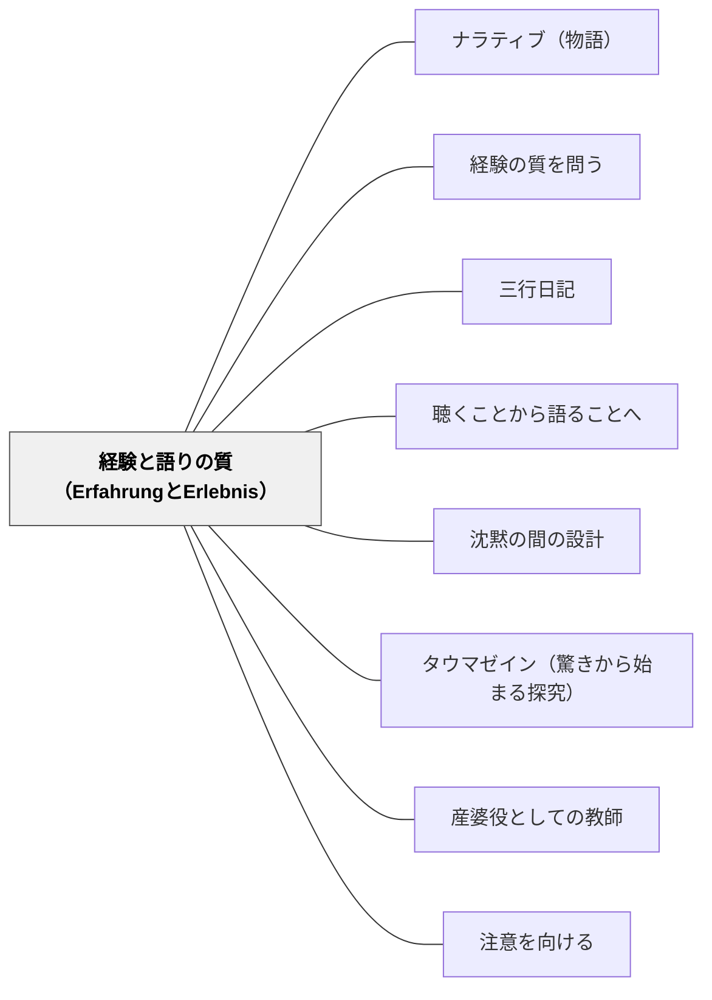

# 経験と語りの質（ErfahrungとErlebnis）

> 「経験」と「体験」は別物だ。何十もの活動をこなした子どもが、そのうちの何一つを自分の言葉で語れないとき、蓄積したのは「体験」であって「経験」ではなかった。

## [Pattern Connection]

### ベンヤミン（1921–1936）——ErfahrungとErlebnis：語れる経験の哲学的基盤

ヴァルター・ベンヤミンは、「経験（Erfahrung）」と「体験（Erlebnis）」を根本的に区別した。この区別は、彼が1913年の論考「経験」から最晩年の「歴史の概念について」まで一貫して追求した問いの核心をなす。

**Erfahrungとは何か**：

Erfahrungは、積み重なり、伝承され、語り得る経験を指す。ベンヤミンが「物語作家」論文で描いた職人的な物語の語り手——その言葉には「陶工の手の跡が皿に残るように」語り手自身の痕跡が宿っている。Erfahrungを持つ者は、自分が経験したことを後から「語れる」。語ることで、経験は次世代に伝わり、共同体の知恵として蓄積される。

**Erlebnisとは何か**：

Erlebnisは、ショック・刺激・情報による瞬間的な反応を指す。それは「体験」として起きるが、積み重ならない。語れない。断片的なまま消費される。ベンヤミンは近代の都市生活——広告・群衆・機械・戦争——を、人間からErfahrungを奪い、Erlebnisの濁流に曝す力として分析した。

第一次世界大戦の帰還兵が象徴的である：

> 「彼らは貧しくなって戦場から帰ってきた。語ることができるものを失って。十年経ってもそれは語られることがなかった」——「経験と貧困」

最新技術（戦車・毒ガス・飛行機）の戦争は、語り継ぐことができる「経験」を粉々に破壊した。帰還兵は「押し黙ったまま帰って来た」。

**「経験を吹聴する大人」への批判（1913年論考「経験」）**：

> 「大人が若者に対して頻繁に用いる『経験』という言葉は、物質主義的な秩序への順応を促して青春を圧殺する大人の仮面である」

若者に「経験から言えば○○だ」と語る大人は、実は既成秩序への順応を「経験」と呼んでいる。本当のErfahrungは、既成秩序に収まる前の、生の問いそのものの中にある。

**教育パタンへの接続**：

| 次元 | Erfahrung（経験） | Erlebnis（体験） |
|---|---|---|
| 積み重なり方 | 蓄積・深化する | 消費・断片化する |
| 語れるか | 語れる（痕跡が残る） | 語れない（処理で終わる） |
| 伝承 | 次世代に伝わる | 揮発する |
| 教室での対応物 | 三行日記・語り・手紙・詩 | 活動の消費・テスト得点 |

- **既存パタンとの関連**：[[パタン/経験の質を問う]] が示すデューイの「連続性」はErfahrungの連続性と共鳴する。「感受性の麻痺」「経験の分断」はErlebnisへの退行と読める
- **補強された点**：「語れるかどうか」という問いが加わる。連続性・感情的質・相互作用の三軸に「語り可能性（narratibility）」という第四の軸が追加される
- **他のパタンへの波及**：[[パタン/ナラティブ（物語）]] — 物語作家的語りがErfahrungの媒体；[[パタン/三行日記]] — 三行日記は毎日のErlebnisをErfahrungへ変換する実践；[[パタン/沈黙の間の設計]] — 沈黙はErfahrungが熟成する時間

---

## 背景（Context）

教育においては、「経験」の量は増えているのに、子どもが「語れる経験」を持っていないように見える場面がある。行事・体験学習・実験・グループワーク——活動は豊富でも、単元が終わったとき「この学習で何があったか」を自分の言葉で語れる子どもは多くない。

ベンヤミンが分析した近代社会と同じことが教室でも起きている。情報・活動・刺激が速く流れるほど、子どもはErlebnisを大量に消費しつつ、Erfahrungを積み上げる機会を失う。

## 問題（Problem）

授業・行事・体験学習が「活動の完了」で終わり、子どもの経験がErfahrungとして蓄積されない。

- 「やったこと」はあっても「語れること」がない
- 単元末に「この学習で何を学んだか」と問われると、答えられない
- 体験が多いほど「語る時間」がなくなる——Erlebnisの加速がErfahrungを駆逐する
- 「大人の経験」を押し付けられると、子ども自身の経験の芽が摘まれる

## 力のかたち（Forces）

- 語ることで経験は強固になるが、語る時間・場・受け手が必要
- 「感情的に動いた体験」がErfahrungになるためには、内省・言語化・共有のプロセスが必要
- 活動量と語り可能性はトレードオフになりやすい——詰め込むほど積み上がらない
- 「経験は自然に蓄積する」という誤った前提が、語りの時間を後回しにさせる
- 物語作家的な語りには「語り手が何かを失った（変わった）」という経験の深さが必要

## 解決（Solution）

**「体験を語れる経験に変換する」プロセスを授業設計に組み込む。語ること・書くこと・伝えることを、活動の「おまけ」でなく「経験の完成」として位置づける。**

---

**ステップ1：体験の直後に「止まって語る」時間を設ける**

活動・実験・読書・行事の直後に「今何が起きたか」を語る・書く時間を意図的に置く。この「止まり」がErlebnisをErfahrungに変換する転換点になる。

**ステップ2：「語り手の痕跡が残る」形で記録させる**

「正解を書く」のではなく「自分がそこにいたことが伝わる」記録を促す。「陶工の手の跡が皿に残るように」——語り手の経験が文章・絵・語りに宿るよう設計する。

具体的な問い：
- 「このことを知らない人に話すとしたら、どこから始める？」
- 「来年の自分に手紙を書くとしたら、何を伝えたい？」
- 「この3週間で、一番「あっ」と思った瞬間はいつ？」

**ステップ3：語りが届く相手を設計する**

Erfahrungは「伝わる」ことで完成する。聴き手・読み手・受け手を設計する——クラスメイト、保護者、来年の自分、後輩、架空の読者。語りが「届いた」という経験が、次のErfahrungを生む動機になる。

---

**具体例1：算数単元末の「家族への語り」**

分数の単元を終えた後、「お家の人が知らないとしたら、どう説明する？」と問い、3分で語る準備をさせる。「語れるかどうか」が理解の深さを測るだけでなく、語るという行為自体が理解を深める。Erlebnisだった授業がErfahrungに変換される瞬間。

**具体例2：三行日記によるErfahrung化**

毎日の授業や生活を三行日記に記す実践は、日々のErlebnisを「語り手の痕跡が残る言葉」に変換するプロセスである。三行という制約が「何が一番大事だったか」を選び取る力を育て、断片的体験をErfahrungとして結晶させる。

**具体例3：国語「詩として経験を結晶させる」**

行事・理科実験・休み時間の体験を詩に書く活動は、Erlebnisの「揮発」を防ぐ。詩の形式は「最も大切なものを最少の言葉で」という凝縮を強いる——凝縮の作業がErfahrungを生む。

**具体例4：自己教育への適用（数学デイリー）**

岩井自身の数学デイリー実践は、毎日の問題を解くというErlebnisを「語れる経験」にするか否かの分岐点を持つ。「今日の問題で何に詰まったか」「なぜそう考えたか」を一行書くことで、断片的な体験が積み重なるErfahrungになる。解いた数ではなく、語れる内容が蓄積の指標になる。

## 結果（Consequences）

- 学習が「やった活動の集積」でなく「語れる経験の軌跡」として子どものなかに積み上がる
- 「誰かに伝えたい」という内発的動機が生まれ、語ることへの意欲が育つ
- 単元末・学期末に子どもが「自分の言葉で語れる」ものが明確になる
- 反面、語りの時間を設けると活動量が減る——量より質の優先は常に判断が必要
- 語ることが苦手な子には、語りの「型」（物語形式・詩・箇条書き）の選択肢を複数用意する必要がある

## 関連パタン

- [[パタン/ナラティブ（物語）]] — 物語の形式がErfahrungの媒体になる；物語作家的な語りの実践
- [[パタン/経験の質を問う]] — デューイの経験論と本パタンは同じ問いを別の角度から問う
- [[パタン/三行日記]] — Erlebnisを日々のErfahrungに変換する具体的実践
- [[パタン/聴くことから語ることへ]] — 十分な受容（聴く）の後に語る = Erfahrungが熟成する順序
- [[パタン/沈黙の間の設計]] — 沈黙はErfahrungが熟成する時間；語る前の静けさ
- [[パタン/タウマゼイン（驚きから始まる探究）]] — 驚きの瞬間（弁証法的像）はErfahrungの核心になりうる
- [[パタン/産婆役としての教師]] — 語れる経験を「産み出す」過程を助ける教師の役割
- [[パタン/注意を向ける]] — 語り得ない子の経験に注意深く向き合う（Aufmerksamkeit）
- [[文献/闇を歩く批評（ベンヤミン・柿木伸之）]] — 本パタンの主要出典

## クラスター図

## Actionable Insight

- 単元の最後に「このことを知らない人に3分で説明するとしたら？」という問いを置く——「語れるかどうか」が体験からErfahrungへの変換を確認する最も手軽な指標になる
- 授業記録を「正解メモ」でなく「自分がそこにいたことが伝わる言葉」で書かせる——「陶工の手の跡が残る」記録の文化が、子どもの経験を語り可能にしていく
- 今日の「数学デイリー（または任意の自己学習）」で「今日詰まった瞬間」を一行書いてみる——Erlebnisを積み上げるのではなく、語れる経験として残すことが自己教育のErfahrung化になる

## 出典

柿木伸之（2021）『ヴァルター・ベンヤミン 闇を歩く批評』岩波新書.
→ [[文献/闇を歩く批評（ベンヤミン・柿木伸之）]]

> 「経験を伝える物語は、ちょうど陶器の皿に陶工の手の跡が残っているように、語り手の痕跡をとどめている」——ベンヤミン「物語作家」（柿木, 2021より引用）

> 「大人が若者に対して頻繁に用いる『経験』という言葉は、物質主義的な秩序への順応を促して青春を圧殺する大人の仮面である」——ベンヤミン1913年論考「経験」（柿木, 2021より引用）
