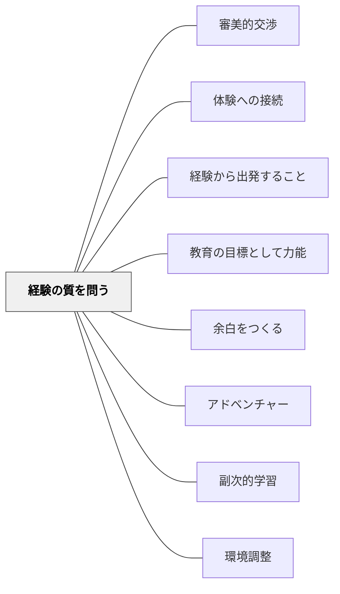

# 経験の質を問う

## 背景（Context）

教育にはさまざまな理論・方法・価値観が存在し、「学習成果」「社会適応」「関係の質」「自律性」など、それぞれの立場から異なる基準で教育の良し悪しが語られる。しかし、これらの基準はどれを採用すればいいか判断が難しく、実践者と理論家の間でしばしば食い違う。

## 問題（Problem）

教育を設計・評価・記述するための基準（クライテリア）が多様で相対的であるため、「何がよい教育か」という問いに一貫して答えられない。その結果、表面的な指標（テストの点数・活動の完成度・教師の指導技術）に流れ、学び手の内側で実際に何が起きているかを問わなくなる。

## 力のかたち（Forces）

- 教育の目的・方法・内容は無数にあり、単一の基準では捉えきれない
- 理論がどれほど洗練されても「実際に何が起きているか」から離れると机上の空論になる
- 「よい経験かどうか」は数値化しにくいため、評価から外されやすい
- 目先の結果（完成品・正解・従順さ）が「経験の質」を犠牲にして成立することがある

## Pattern Connection

### Dewey（1938）

*Experience and Education*（1938）は本パタンに、経験の質を判断する2つの哲学的基準を与える。1916年の *Democracy and Education* が「経験から出発せよ」と方向を示したのに対し、1938年の本書は「どんな経験でも良いわけではない」という質の基準を精錬した。

- **既存パタンとの関連**：本パタンがすでに「連続性」と「感情的質」を2軸として持っているが、E&E はそれに「相互作用（Interaction）」という第3の次元を加え、構造を完成させる。
- **補強された点**：「相互作用」の軸——経験は学習者の内的条件（needs, desires, purposes, capacities）と客観的条件（環境・素材・教師の言葉）の相互作用として生まれる。一方だけを見ていると経験の質は半分しか見えない。

**E&E が加える「相互作用（Interaction）」の次元**

> "An experience is always what it is because of a transaction taking place between an individual and what, at the time, constitutes his environment."（Dewey, 1938, Ch.3）

| 軸 | 問い | 傾いたとき |
|---|---|---|
| 内的条件への注目 | この学習者は今どんな必要・目的・能力を持っているか | 外から押し付けるだけの伝統的教育 |
| 客観的条件への注目 | どんな環境・素材・教師の言葉が提供されているか | 子どもの衝動に任せる放任的進歩教育 |

**非教育的経験（Miseducative Experience）の4類型**

経験の質が問われるのは、Deweyが「すべての経験が教育的ではない」と明言したから：

| 類型 | 内容 |
|---|---|
| 感受性の麻痺 | 経験が豊かさへの感受性を失わせ、次の経験の可能性を狭める |
| 溝にはまる | 自動的スキルを高めるが、思考を停止させ他の文脈で使えなくなる |
| たるんだ態度 | 即座に楽しいが、怠惰・不注意な姿勢を育てる |
| 経験の分断 | それぞれ活気があっても累積的につながらず、散漫な性格を形成する |

- **他のパタンへの波及**：[[パタン/副次的学習]]（副次的に形成される態度が経験の質の中核をなす）・[[メタパタン/経験から出発する]]（出発した後の経験がどの方向に向かうかの連続性）

---

## 解決（Solution）

教育のあらゆる実践・設計・評価において、**「それが学び手にとってどのような経験になるか」を最終的な判断基準（極限クライテリア）として問い続ける**。

デューイによれば、経験には三つの不可欠な次元がある：

| 次元 | 内容 | 教育的含意 |
|---|---|---|
| **感情的質** | 快・不快、安心・不安、達成感・屈辱感といった情動的トーン | 学びの入り口に感情的安全が不可欠 |
| **連続性** | その経験が次の経験を促進するか妨げるか | 教育とは「つながる経験の連鎖の構築」 |
| **相互作用** | 内的条件と客観的条件が均衡しているか | 環境調整と子ども理解の両方が必要 |

この二軸に照らすことで、次のような問いが生まれる：

- この活動は、子どもにとってどう感じられるか？
- この経験は、次の学びへの扉を開くか、閉じるか？
- 結果として残るのは「できた」という感覚か、それとも「やらされた」という感覚か？

> **教育が教育であるために必要な極限的な基準は「経験」である。**

## 結果（Consequences）

- 授業・教材・評価の設計が「経験の質」を出発点とするようになる
- テストの点数や課題の完成度より、「子どもが何をどう感じ、次に何を求めるか」が問われるようになる
- 教育者は「指導計画の実施者」ではなく、「経験の設計者・応答者」として位置づけられる
- カントやフッサールの洞察（「いかなる知も経験の形式を通じてしか現れない」）ともつながり、教育理論をメタ的に見渡す視座になる

## 関連パタン
- [[パタン/審美的交渉]]
- [[パタン/体験への接続]]

- [[パタン/経験から出発すること]] — 経験を認識の「出発点」とするカント的視点（補完関係）
- [[パタン/教育の目標として力能]] — 経験の質が力能（なしうる力）の増大につながる
- [[パタン/余白をつくる]] — 余白こそが「よい経験の質」が生まれる場
- [[パタン/アドベンチャー]] — 挑戦的な経験が連続性を生む
- [[概念/教育の目標と力能]] — 力能論の概念的背景
- [[パタン/副次的学習]] — 副次的に形成される態度が経験の質の核心
- [[パタン/環境調整]] — 客観的条件の調整が相互作用の設計

## クラスター図

## Actionable Insight

- 授業・活動の後に「子どもはこの経験をどう感じたか」を1分間振り返る——感情的質の確認が形式的な活動設計を防ぐ
- 単元の最後に「この学習が次の学びへの扉を開いたか」と問う——連続性の観点が教師の授業設計を改善する
- 「指導計画通りに進んだか」より「子どもにとってどんな経験だったか」を週1回問い直す——経験の質を基準にすることで教育的判断の軸が変わる

## 出典

- パタン集/教育事象における公理的・極限的クライテリアとしての「経験」.md
- Dewey, J.（1938）『経験と教育』
- Biesta, G.（2010）_Good Education in an Age of Measurement_
