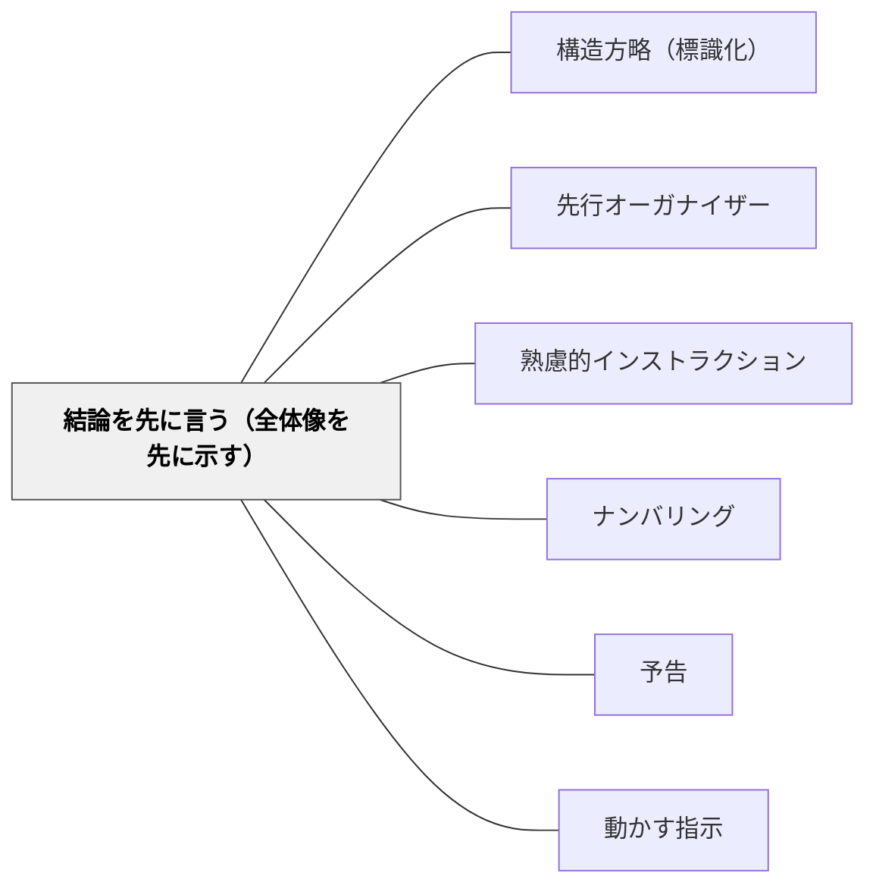

# 結論を先に言う（全体像を先に示す）

> 全体像・結論を最初に示すと、続く詳細が意味をもって届く。

## 背景（Context）
説明や指示を行うとき、背景や経緯から順番に話し始めると、聞き手は「これが何の話か」が分からないまま情報を受け取り続けることになる。土居正博は指示論の中で、全体像を先に示すことの重要性を説く。ワーマン（情報建築家）も同様に、受け手が全体構造を把握してから詳細に入ることの理解促進効果を指摘している。

## 問題（Problem）
詳細から始まる説明は、受け手が「なぜこの情報が必要なのか」を把握できないまま情報を処理しなければならない。各部分の説明が終わって初めて全体像が見えるため、途中の情報は文脈なしに受け取られる。聞き手の認知負荷が高くなり、理解と記憶が妨げられる。

## 力のかたち（Forces）
- 人は全体の中で部分を理解するとき、理解が深まりやすい
- 結論・ゴールが先に示されると、詳細が「そのための手段」として意味をもつ
- 全体像がないと受け手は不安になり、理解に集中できない
- 説明者側は経緯から話したい傾向があるため、意識的に逆転させる必要がある

## 解決（Solution）
**まず結論・全体像・ゴールを一文で示し、その後に詳細・手順・根拠を展開する。**

「今日は〇〇をします。その手順は3つあります。まず…」のように、何をするかを最初に宣言してから詳細に入る。説明の冒頭で「何の話か」「どこへ向かうか」を明示する。[[パタン/ナンバリング]]と組み合わせることで、全体の見通しと構造が同時に伝わる。

## 結果（Consequences）
- 受け手が全体構造を把握した状態で詳細を聞けるため、理解が深まる
- 途中で迷子になる学習者が減る
- 話し手が自分の伝えたいことを整理するきっかけにもなる

## クラスター図

## Actionable Insight

- 指示の冒頭で必ず「今日は〇〇をします。手順は3つです」と全体像を一文で示してから詳細に入る——全体が見えた状態で聞く学習者は迷子にならない
- 授業の最初に「この時間のゴールは□□ができること」と黒板に書く——結論が先に見えると、続く説明が「そのための手段」として意味をもって届く
- 説明が長くなりそうなときは「ポイントは2点です」と先に数を宣言する——数が先に示されると、学習者は聞きながら「あと何個」と見通しを持てる

## 出典

- 一つの教育のパタン・ランゲージ（岩井輝久）

## 関連パタン
- [[パタン/構造方略（標識化）]]
- [[パタン/先行オーガナイザー]]
- [[パタン/熟慮的インストラクション]] — 親パタン
- [[パタン/ナンバリング]] — 全体の構造を番号で示す
- [[パタン/予告]] — 活動の前に全体を知らせる
- [[パタン/動かす指示]] — 明確な行動指示と組み合わせる
