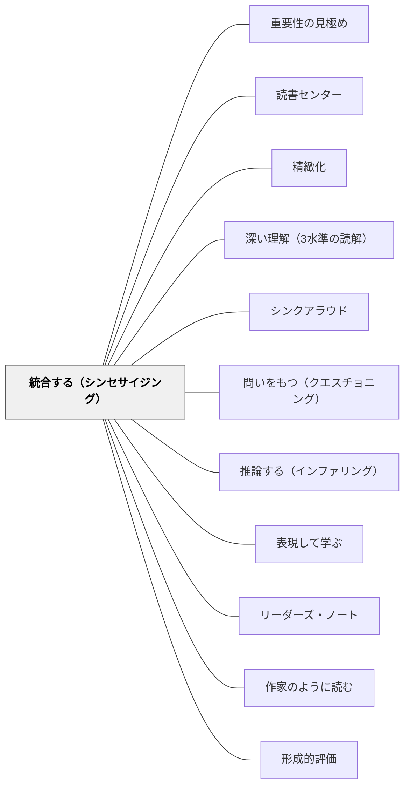

# 統合する（シンセサイジング）

> 統合とは思考の進化である——読む前の考えと読んだ後の考えが変わること。要約（何が起きたか）と統合（自分の考えがどう変わったか）は全く別のことだ。

---

## Pattern Connection

**Harvey & Goudvis（2007）統合（2026-05-17）：**

*Strategies That Work* 第11章は Synthesizing を「6つのストラテジーの中で最も複雑」と位置づける。読解後に「何が書いてあったか」をまとめるのが要約（Summary）。それに対し Synthesis（統合）は「自分の考えがどのように変わったか」——Reading changes thinking を問うことである。

- **既存パタンとの関連**：[[パタン/精緻化]] の「知識をつなぐ」という核と対応する。精緻化が「既有知識とのつながりを深める」とすれば、統合は「そのつながりの中で自分の考えが変化すること」を記録・可視化する
- **補強された点**：[[パタン/深い理解（3水準の読解）]] の第3水準「応用的理解（評価・批判・比較）」は、統合なしに起きない。統合は第2水準（推論）から第3水準へ移行する橋
- **他のパタンへの波及**：[[パタン/シンクアラウド]] — 統合のプロセスは声に出してモデリングできる。[[パタン/問いをもつ（クエスチョニング）]] — 問いが統合を駆動する。[[パタン/表現して学ぶ]] — CPC フォームは「表現することで統合を深める」実践

---

## 背景（Context）

学校の読書指導では、読後に「あらすじを書く」「感想を書く」という活動が多い。あらすじは要約（Summary）であり、感想は印象の記述である。しかし Harvey & Goudvis が「統合（Synthesis）」と呼ぶプロセスは、これらとは異なる。

「統合」は読者の思考の変化を捉える：

- 読む前に何を考えていたか
- 読んでいる間に考えが変わった瞬間はどこか
- 読み終えて、最初の考えとどう違うか

読書は静的な情報の受け取りではなく、**思考のダイナミックな進化**である。

## 問題（Problem）

「要約を書きなさい」という指示では、子どもたちは「何が起きたか」を再告するだけで、自分の考えがどう変わったかを問わない。「感想を書きなさい」では「面白かった」「悲しかった」という印象で終わる。どちらも統合ではない。

Summary（要約）と Synthesis（統合）の区別を明示的に指導しなければ、子どもたちは読書後に「どう変わったか」を問う習慣を持てない。

## 力のかたち（Forces）

- 要約は誰でも「正解」が分かる——「何が起きたか」は確認できる。しかし統合は個人の思考の変化なので、「正解」がない
- 思考の変化は自覚しにくい——「読む前の考え」を記録しておかないと、変化に気づけない
- 統合はすべてのストラテジーの融合点——つながり・問い・推論・重要性判断がすべて統合に流れ込む
- 統合を記録するツール（チャート・フォーム）があると、見えない思考の変化が可視化される

## 解決（Solution）

**読む前の考えを記録し、読書中・読書後に「考えがどう変わったか」を問い続ける。要約（何が起きたか）と統合（考えがどう変わったか）を明確に区別して指導する。**

---

### Summary ≠ Synthesis：2つの違いを教える

| | Summary（要約） | Synthesis（統合） |
|---|---|---|
| **問い** | 何が起きたか・何が書いてあったか | 自分の考えがどう変わったか |
| **視点** | テキスト中心 | 読者中心 |
| **思考** | 情報の整理・再告 | 思考の進化の記録 |
| **例** | 「〜ということが書かれていた」 | 「最初は〜と思っていたが、読んで〜と変わった」 |

子どもたちに「これは要約？統合？」を問い返す習慣をつくる。「自分の考えはどう変わった？」が統合への問いかけ。

---

### Think-Aloud での統合のモデリング

教師が声に出して統合する：

> 「この本を読む前は、ホームレスの問題は大人だけのことだと思っていました。でも今読んで……子どもにも起きることだと分かった。そして最初は『自己責任だ』と思っていた自分の考えが、変わった気がしています。」

「Before I thought... After reading I think...」という枠が統合のモデリングに有効。

---

### CPC フォーム（Content / Process / Craft）

読書後に3つの視点から統合を記録するフォーム：

| 視点 | 問い | 記録例 |
|------|------|--------|
| **Content（内容）** | この本から何を学んだか。考えはどう変わったか | 「ホームレスの子どもの数が思ったより多いと知った。最初の考えが変わった」 |
| **Process（プロセス）** | どんなストラテジーを使ったか。どう読んだか | 「TW をたくさん使った。ニュースで見た話とつながった」 |
| **Craft（技法）** | 著者はどう書いていたか。どんな工夫が効果的だったか | 「具体的な子どもの名前で話が始まっていて引き込まれた」 |

CPC フォームはリーダーズ・ノートやライターズ・ノートと組み合わせて使える。Content だけでなく Process と Craft を加えることで、読書がライティングの学習にもなる。

---

### 統合の段階的手放し

| 段階 | 活動 |
|------|------|
| **教師のモデリング** | Think-Aloud で「Before / After」を声に出す |
| **ガイドされた練習** | 全体で読み、要約と統合の違いを対話で整理する |
| **協働的練習** | ペアで CPC フォームを一緒に書く |
| **独立した実践** | 自分の本で CPC フォームや統合ジャーナルを書く |
| **本物の応用** | 読書後に「自分の考えはどう変わった？」を自然に問う |

---

## 結果（Consequences）

- 読後の「あらすじ・感想」から「思考の変化の記録」へと読書アウトプットが変わる
- 「読む前の考えを記録する」習慣により、変化が自覚できるようになる
- CPC フォームにより、内容・プロセス・技法の3視点から読書を振り返れるようになる
- 統合が習慣化すると、読書を通じて自分の考えが変わることへの開放性が育つ

## 関連パタン
- [[実践/BDA読解授業の設計]]
- [[パタン/重要性の見極め]]
- [[パタン/読書センター]]

- [[パタン/精緻化]] — 統合は精緻化の最も深い形
- [[パタン/深い理解（3水準の読解）]] — 統合は第3水準（評価・批判・応用）の前提条件
- [[パタン/シンクアラウド]] — 統合のプロセスを「Before/After」でモデリングする
- [[パタン/問いをもつ（クエスチョニング）]] — 問いが統合の駆動力になる
- [[パタン/推論する（インファリング）]] — 推論の積み重ねが統合になる
- [[パタン/表現して学ぶ]] — CPC フォームは「書くことで統合を深める」実践
- [[パタン/リーダーズ・ノート]] — 統合の記録をリーダーズ・ノートに残す
- [[パタン/作家のように読む]] — Craft 視点（CPC の C）が読書とライティングをつなぐ
- [[パタン/形成的評価]] — CPC フォームは読書理解の形成的評価ツールになる

## クラスター図

## Actionable Insight

- 読書後に「要約を書いて」の代わりに「最初の考えと、読んで変わったことを書いて」と問う——「Before I thought... After I think...」の2文だけでも統合は始まる
- 教師が読み語りの最後に「私はこの本を読んで、〜という考えが変わりました」と声に出す——統合のモデリングを1回見るだけで子どもたちの書く内容が変わる
- 「これは要約？それとも統合？」をクラスの合い言葉にする——子どもが「感想を書いた」とき、「自分の考えはどう変わった？」を問い返すだけで統合に転換できる

---

## 出典

Harvey, S., & Goudvis, A. (2007). *Strategies That Work: Teaching Comprehension for Understanding and Engagement* (2nd ed.). Stenhouse Publishers.

> "Synthesis is about the evolution of thought, not a summary of information... Reading changes thinking."

[[文献/Strategies That Work（Harvey & Goudvis）]]
