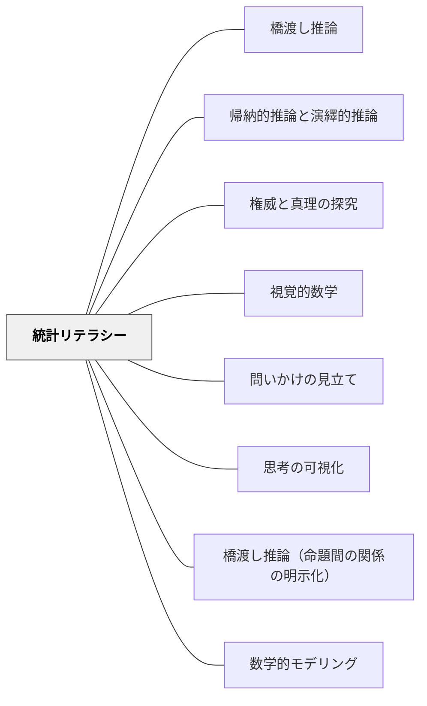

# 統計リテラシー

> 数字は嘘をつかないが、グラフは嘘をつける——データを「受け取る」だけでなく「読み解く」力を育てる。

---

## 背景（Context）

私たちは日々、グラフ・統計数値・確率表現で満ちた情報環境の中に生きている。ニュース・広告・政策説明・教科書のどれもが数字で主張を裏付けようとする。しかし数字やグラフは、意図的あるいは意図せずして、誤った印象を与えることができる。

Blitzer（2014）の *Thinking Mathematically* Chapter 12 は、統計を「記述するツール」と「批判的に読むツール」の両面から扱う。最も重要な指摘は：

> "Because statisticians both record data and influence our behavior, it is important to distinguish between good and bad methods for collecting, presenting, and interpreting data."（Blitzer, 2014）

統計リテラシーとは、数字とグラフを正確に読むだけでなく、**誰が・何のために・どのように提示しているか**を問う力である。

## 問題（Problem）

グラフや統計数値を「見る」だけで「読む」ことができない子ども・大人が多い。縦軸の目盛りが操作されていること、サンプル数が明示されていないこと、比較基準がずれていることに気づかないまま、提示された結論を受け入れてしまう。

## 力のかたち（Forces）

- 視覚的な情報（グラフ）は言語的情報より強い印象を与える——だからこそ操作されやすい
- 数字の正確さ（小数点以下まで書かれている等）が「信頼できる」という錯覚を生む
- 統計の批判的読解は「不信感を持つ」ことではなく「問いを持つ」ことが目的
- データを疑う習慣を育てる授業は、子どもに「自分で考える権利」を与える

## 解決（Solution）

### グラフ批判的読解の5チェック（Blitzer, 2014）

Blitzer は「視覚的データ提示で気をつけること（Things to Watch for in Visual Displays of Data）」として以下のチェックリストを提示している：

| チェック | 問い |
|--------|------|
| **①縦軸の切り取り** | 縦軸は0から始まっているか？途中から始まっていると差が誇張される |
| **②目盛りの不均一** | 縦軸の目盛りは等間隔か？間隔が変わるとグラフの傾きが歪む |
| **③比較基準のずれ** | 比較する2つのグラフは同じ基準（同じ期間・同じ単位）か |
| **④母集団とサンプルの区別** | このデータは「全員」か「一部」か、誰を対象にしたか |
| **⑤時間軸の操作** | 時間軸は等間隔か？「最近急増」が実は1年前のデータということはないか |

---

### 記述統計 vs 推測統計の区別

| 種類 | 内容 | 例 |
|------|------|---|
| **記述統計** | 収集したデータを整理・要約・提示する | 「このクラスの平均点は75点」 |
| **推測統計** | データから母集団全体に関して一般化する | 「日本の小学生の平均読書量は〜」 |

推測統計を読むときは「このサンプルはどこから取られたか」「母集団を代表しているか」を必ず問う。

---

### 代表値のトリック

Blitzer は平均値・中央値・最頻値の使い分けが印象を変えることを示している：

- 年収のデータで「平均」が使われるとき、少数の超高所得者が平均を引き上げている可能性がある
- 「中央値」を使えば「ほとんどの人の実感」に近い値になる
- どちらを使うかの選択が、主張を有利にする意図を持つことがある

---

### 確率表現の批判的読み（Chapter 11）

- 「10人に1人がかかる」と「発症率10%」は同じことだが印象が異なる
- 「このサプリを飲むと病気のリスクが50%減少」——元の発症率が0.002%なら50%減少しても0.001%
- **相対リスク**（50%減少）と**絶対リスク**（0.001%ポイント減）の区別が必要

---

### 授業での応用：「グラフを疑う」活動

1. 新聞・ニュースサイトからグラフを1枚選ぶ
2. 5チェックリストで読む
3. 「このグラフを作った人は何を伝えたかった？」「別の表し方をしたらどう見える？」

同じデータを「大きく見える縦軸」と「小さく見える縦軸」で2パターン作成し、どちらの印象が強いかを比較する活動は、小学校高学年・中学生で有効。

---

## 結果（Consequences）

- グラフを「写す・読む」から「批判的に問う」へのシフトが起きる
- 「数字が書いてあるから正しい」という素朴な信頼から、「誰が・どのデータで・どう提示しているか」という問いを持つ態度が育つ
- データを「選ぶ」「作る」経験（自分でアンケートを設計し集計する等）が統計的思考を内側から育てる

## 関連パタン
- [[パタン/橋渡し推論]]

- [[パタン/帰納的推論と演繹的推論]] — 帰納的推論の批判的使用（サンプルから一般化する危険性）
- [[パタン/権威と真理の探究]] — 統計リテラシーは批判的思考の数学的実践形（「権威ある数字」を疑う態度）
- [[パタン/視覚的数学]] — データを視覚化する力と批判的に読む力は両輪
- [[パタン/問いかけの見立て]] — 「このグラフに何を問えばいい？」という教師の問いの設計
- [[パタン/思考の可視化]] — グラフ読解のプロセスを可視化する
- [[パタン/橋渡し推論（命題間の関係の明示化）]] — 「AだからB」という統計的因果推論の誤りを見抜く
- [[パタン/数学的モデリング]] — データを扱うモデルの限界と前提条件の明示

---

## クラスター図

## Actionable Insight

- 教科書や教師用指導書のグラフを1つ選んで「縦軸は0から始まっているか？」だけを子どもに問う——一つの問いから「グラフを疑う」態度への入口が開く
- 「平均」「多数」「ほとんど」という言葉が使われているとき「何人中何人？」と具体的な数を確認する習慣を授業で作る——言語的操作を数字で検証する力の基礎になる
- 社会科のグラフ読解で「このグラフを作った人は何を伝えたかった？」という問いを1問追加する——「正確に読む」から「意図を読む」へのシフトが批判的思考を育てる

---

## 出典

Blitzer, R. F.（2014）*Thinking Mathematically* (5th ed., Ch.12). Pearson Education Limited. → [[文献/Thinking Mathematically（Blitzer）]]

> "Because statisticians both record data and influence our behavior, it is important to distinguish between good and bad methods for collecting, presenting, and interpreting data." ——Blitzer（2014）
