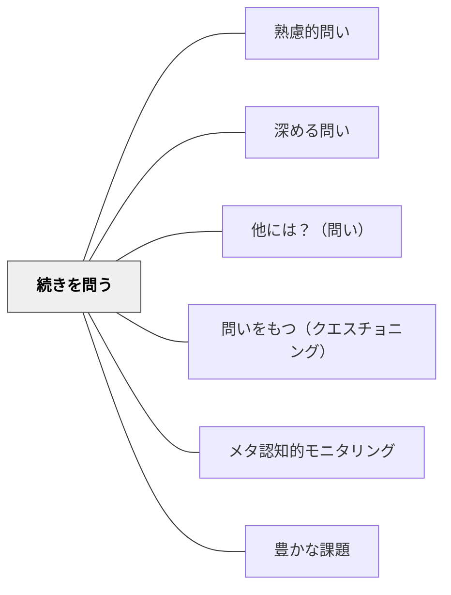

# 続きを問う

> 「この続きはどう説明できる？」と問い、途中で止まった思考を前に進める。

## 背景（Context）
学習者が思考の途中で止まってしまったり、説明を尻切れとんぼに終わらせてしまうことがある。教師がすぐに補ってしまうと、学習者は自力で思考を続ける経験を得られない。「続き」を問うことで、学習者自身が思考を完成させる機会を与える。

## 問題（Problem）
思考が途中で止まった状態を放置すると、理解が不完全なまま先に進む。逆に教師が続きを全部話してしまうと、学習者の思考は受動的なままになる。思考の続きを引き出す問いがなければ、学習者は「途中まで考えれば十分」と感じてしまう。

## 力のかたち（Forces）
- 「続きは？」という問いはシンプルで敷居が低い
- 続きを考えることで思考の全体像が整理される
- 途中まで出た考えを肯定しつつ先を促す
- 沈黙を恐れず待つ姿勢が思考の深まりを支える

## 解決（Solution）
「そこから、続きはどう考える？」「もう少し言えそう？」「次はどうなるかな？」と問い、学習者に思考の続きを語らせる。たとえば植物の成長を説明しかけた学習者に「根の次は？茎はどうなる？」と続きを引き出す。説明が完結しなくても「ここまで言えたね、あとはどこが難しそう？」と足場をかけてもよい。

## 結果（Consequences）
- 思考を途中で諦めない粘り強さが育つ
- 説明の流れを整理することで理解が深まる
- 「続き」を問われる習慣が、自分で問い続ける力を育てる

## 関連パタン
- [[パタン/熟慮的問い]] — 親パタン
- [[パタン/深める問い]] — 表面から核心へ掘り下げる
- [[パタン/他には？（問い）]] — さらに追加・拡張を促す

- [[パタン/問いをもつ（クエスチョニング）]] — 続きを問う力を育てる上位パタン
- [[パタン/メタ認知的モニタリング]] — 続きを問うことが自己の理解状態をモニタリングする
- [[パタン/豊かな課題]] — 続きへの問いが探究課題を豊かに広げる
## クラスター図

## Actionable Insight

- 学習者が説明を途中で止めたとき、すぐ補わずに「もう少し言えそう？」と言って10秒待つ——その沈黙が自力で思考を続ける経験を積む場になる
- 「そこから続きはどう考える？」を授業中の口癖にする——続きを問われる習慣が学習者自身が問い続ける力を育てる
- 「ここまで言えたね、あとはどこが難しそう？」と足場をかけながら思考を前に進める——肯定から始まる問いが学習者の粘り強さを引き出す

## 出典
- [[文献/熟慮的問いのパターンリスト（動画記録）]]
