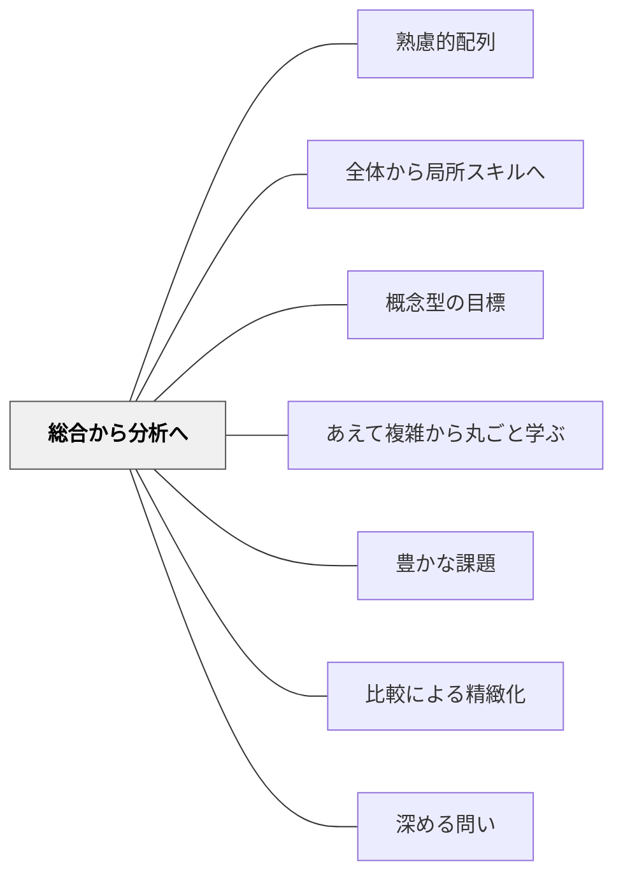

# 総合から分析へ

> 全体を見てから、部分に分け入る。

## 背景（Context）

[[パタン/熟慮的配列]] の分析方向次元。学習者がはじめて領域に触れるとき、全体的な印象・雰囲気・ゲシュタルトを先に経験させてから、その内部構造を分析していく順序。

## 問題（Problem）

部分・要素から積み上げる分析的アプローチは論理的だが、学習者には「この部品は何のためのものか」がわからないまま進む不安を与える。文脈なき部品の学習は動機づけが低い。

## 力のかたち（Forces）

- 全体像は方向感覚と意味を与える
- 全体を理解するには部分の知識も必要という循環がある
- あまりに複雑な全体を最初に見せると圧倒される
- 教科書は伝統的に分析的順序（定義→例→応用）をとりやすい

## 解決（Solution）

**まず「完成形」「動いているもの全体」「文脈の中での全体像」を見せ、そこから分析・分解に入る。**

実践例：
- 楽器演奏：まず曲全体を先生が弾いて聴かせてから、技術の個別練習へ
- 文章の読解：段落ごとの精読の前に全文を通し読みして全体の流れをつかむ
- 算数の単元：単元末の問題（どんな力がつくか）を最初に見せてから学習を始める
- 実験：結果の現象を先に見せてから、なぜそうなるかを分析する探究に入る

## 結果（Consequences）

- 学習者が「今、全体のどこを学んでいるか」を常に把握できる
- 部分の学習に意味と文脈が生まれ、動機づけが維持される
- 分析結果を再び全体に統合する力が育つ

## クラスター図

## Actionable Insight

- 単元の最初に「単元末にできるようになること」の完成例を見せる——全体像が先にあると学習者は「今どこを学んでいるか」を常に把握できる
- 楽器や文章の指導で、まず教師が完成形を見せてから個別の技術練習に入る——全体の印象を先に体験させることで部分の練習に意味が生まれる
- 実験は結果の現象を先に見せてから「なぜそうなるか」の分析探究に入る——「これがなぜ起きるか」という問いが分析の動機になる

## 出典

- 一つの教育のパタン・ランゲージ（岩井輝久）

## 関連パタン

- [[パタン/熟慮的配列]] — 上位パタン
- [[パタン/全体から局所スキルへ]] — スキル習得における同じ方向
- [[パタン/概念型の目標]] — 学習の全体像を概念で示す
- [[パタン/あえて複雑から丸ごと学ぶ]] — 複雑な全体を最初から扱う変形
- [[パタン/豊かな課題]] — 総合から分析への学習が豊かな課題設計の起点
- [[パタン/比較による精緻化]] — 分析の比較が概念の精緻化を促す
- [[パタン/深める問い]] — 分析が問いを深める
