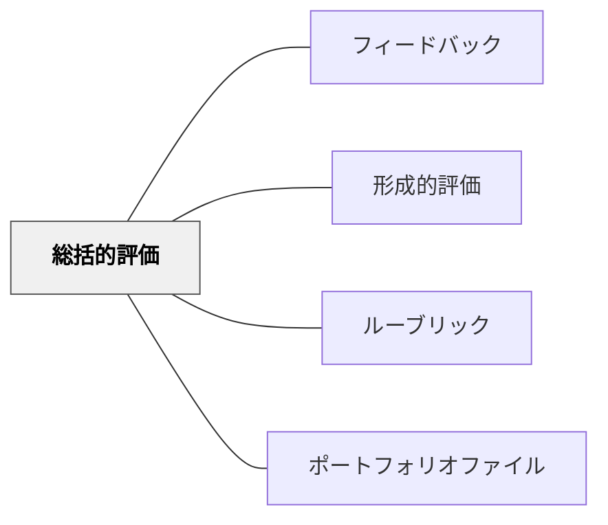

# 総括的評価

> 学習の旅が終わったとき、どこまで到達したかを確かめる。

## 背景（Context）

教育における評価には、学習の途中で改善を促す形成的評価と、学習の終わりに達成を確認する総括的評価の二種類がある。総括的評価は「学習の評価（Assessment of Learning）」とも呼ばれ、一定期間の学習が終了した時点で、学習者が何を達成したかを確認・認定する機能をもつ。

定期テスト、学期末試験、資格試験、卒業制作の審査などが総括的評価の代表例であり、社会的な認定・資格付与・成績報告といった目的に応えている。

## 問題（Problem）

総括的評価だけに依存した教育では、学習の途中での改善機会が失われる。「テストのために勉強する」という構造が生まれ、学習者の興味や深い理解よりも点数が優先されやすい。

また、総括的評価の結果は学習の「後」に来るため、その単元の学習改善には直接つながらない。次の学習サイクルへのフィードバックとして機能させるには、結果の意味を丁寧に解釈する必要がある。

## 力のかたち（Forces）

- 総括的評価は社会的・制度的な認定機能として不可欠であり、廃止することはできない
- しかし、総括的評価に過度に焦点化すると、学習が「評価に備えること」に矮小化される
- 形成的評価と総括的評価の適切なバランスが、学習の質と評価の妥当性を両立させる

## 解決（Solution）

総括的評価を学習サイクルの最終確認として適切に設計し、形成的評価と組み合わせて使う。総括的評価の前に形成的評価を複数回行うことで、学習者は評価時点で自分の現在地を把握した状態になっている。

総括的評価の結果は、学習者・教師双方にとって次の学習設計のための情報源となる。「何点取れたか」だけでなく、「どの領域でつまずきがあったか」「どのスキルが定着しているか」を分析することで、総括的評価が次の形成的サイクルの出発点になる。また、パフォーマンス課題やポートフォリオを総括的評価として採用することで、真正な学びの達成を評価できる。

## 結果（Consequences）

- 学習の達成が明確に確認され、学習者・教師・保護者・社会に対して情報を提供できる
- 形成的評価と組み合わせることで、評価が学習の阻害ではなく推進力として機能する
- 総括的評価の結果が次の学習設計の根拠データとなる

## 関連パタン

- [[パタン/フィードバック]] — 親パタン
- [[パタン/形成的評価]] — 対比となる評価形式。両者の組み合わせが学習を支える
- [[パタン/ルーブリック]] — 総括的評価の基準を明確化するツール
- [[パタン/ポートフォリオファイル]] — 真正な達成を示す総括的評価の形式

## クラスター図

## Actionable Insight

- 単元末テストの前に2回の形成的評価を入れ、学習者が自分の現在地を把握した状態で総括的評価に臨ませる——形成的評価との組み合わせが総括的評価の意味を変える
- 総括的評価の結果を「何点か」だけでなく「どの領域でつまずきがあったか」で分析する——結果の解釈が次の学習設計の出発点になる
- パフォーマンス課題やポートフォリオを総括的評価の一形式として取り入れる——点数以外の形式が真正な達成を証拠として残す

## 出典

Bloom, B. S., Hastings, J. T., & Madaus, G. F. (1971). *Handbook on Formative and Summative Evaluation of Student Learning*. McGraw-Hill.
Wiliam, D. (2011). *Embedded Formative Assessment*. Solution Tree.
