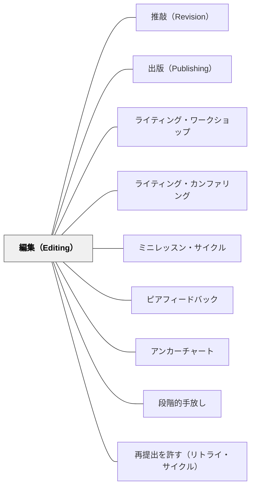

# 編集（Editing）

> 編集は「内容が決まってから、表記の規約を読者のために整える」最終段階である。推敲と混ぜると両方が死に、教師の赤ペンに委ねると子どもの編集力が育たない。編集の主体は教師ではなく、子ども自身——そのことを制度として組み込んだとき、表記の規約は文法ドリルではなく「読者への礼儀」として身につく。

## 背景（Context）

ライティング・ワークショップの書くプロセスは、プリライティング→起草→推敲→**編集**→出版の5段階で進む。このWikiでは、[[パタン/プリライティング]]・[[パタン/推敲（Revision）]]・[[パタン/出版（Publishing）]] はすでにパタン化されていたが、**編集だけがパタンとして欠けていた**（コンテンツ監査2026-06で検出された「欠落段階」）。

姉妹パタンである [[パタン/推敲（Revision）]] はその本文の中で「推敲と編集の分離」を明確に宣言している——「まず作品を良くする（推敲）、その後に正しくする（編集）」。本パタンはこの宣言の**受け皿**となる、編集段階そのものの設計である。

編集とは何か。誤字・かなづかい・句読点・段落の改行・原稿用紙の使い方など、書き言葉の規約（メカニクス）を整える行為である。推敲（内容・構成・声の再視）が「もう一度見る（Re-vision）」だとすれば、編集は「読者のために整える（Edit for the reader）」。出版（本物の読者に届ける）という最終段階があるからこそ、編集に動機が生まれる——「読者への礼儀」としての規約である。

## 問題（Problem）

日本の作文指導では「直すこと」が一括りにされがちで、推敲と編集の境界が曖昧なまま運用されている。そこから二つの失敗形が生まれる。

**失敗形①：教師が赤ペンで全部直す。** 提出された原稿の誤字・句読点・段落のすべてを教師が朱字で訂正する。子どもは返却された原稿を見て、訂正された通りに「清書」する。これは編集のように見えて、子ども側には**編集のスキルも責任も育っていない**。むしろ「先生が直してくれる」という依存を学習させてしまう。教師の側の負担は莫大なのに、学習効果は薄い——労力対効果が最も悪い指導形態の一つである。

**失敗形②：編集が丸ごと省略される。** 推敲も編集もまとめて「直す時間」として済まされ、結果的に誤字だらけのまま掲示板に貼り出され、文集に綴じられる。読者意識も規約の学習機会もここでは失われる。「書きっぱなし」が文化になると、子どもは「自分の文章は読まれない」という前提で書くようになる。

加えて、編集を**書きながら**やらせると流暢さが死ぬ。「正しく書かなければ」という意識が書く手を止め、自己検閲を生む。これは特に書字に困難のある子・正書法の負荷が高い子にとって致命的である。

## 力のかたち（Forces）

- 書いている最中に表記を気にすると流暢さが死ぬ——「正しく書かなければ」が書く手を止め、自己検閲を生む
- 全部の観点（誤字・句読点・段落・かなづかい）を一度に直そうとすると見落とす——人間の校正は1観点ずつ通すほうが確実
- 教師が全部直すと子どもの編集力が育たず、「先生が直してくれる」という依存を学習する——労力対効果が悪い
- 規約の習得状況は子どもによって違う——「自分が習った規約にだけ責任を持つ」のが公平
- 自分の文章は脳内で「書いたつもりの文」に補正されて読めてしまう——距離を作る技法が要る
- 編集偏重は書く意欲を殺す（特に書字・正書法に困難のある子にとって）——順序を守らないと書くこと自体が嫌いになる
- 出版という本物の読者がいて初めて、編集は「規則だから」ではなく「読者のため」になる

## 解決（Solution）

**編集を「内容が決まってから、表記の規約を読者のために整える最終段階」として時間的に分離し、子ども自身がチェックリストと技法を使って通す活動として設計する。教師の赤ペンに委ねず、出版という本物の読者を編集の動機に置く。**

実装は次の6点で進める。

1. **時間的に分離する**：推敲（内容・構成の再視）が終わってから編集パスに入る。「考える日（推敲）」と「整える日（編集）」を授業計画の上で分ける。書きながら直さない・推敲しながら直さない——順序を守ることが本体
2. **自分用の編集チェックリスト**：習った規約だけを3〜5項目（「。と、を打つ」「自分の名前のかん字を正しく書く」「会話文は改行する」など）。リストは個人で持ち、ミニレッスンで新しい規約を教えるたびに**1項目ずつ追加していく**——リストは学年とともに成長する。長すぎると形骸化するので3〜5項目を上限に
3. **1観点ずつ読み直す**：誤字パス→句読点パス→段落パスと観点を分けて通す。一度に全部見ようとすると見落とす。「今日は『、と。』だけを見る」と限定して全文を通す
4. **距離を作る技法**：自分の文章は脳内で「書いたつもり」に補正されて読めてしまう。これを切るために——声に出して読む／最後の文から1文ずつ逆順に読む／一晩寝かせる／指やペンで1語ずつ指して読む。これらの技法を編集ミニレッスンで教える
5. **ピア編集**：編集パートナーと交換し、チェックリストの観点だけを見合う。「内容の感想」ではなく「規約のチェック」に役割を限定すると、ピア編集は機能する
6. **教師は最終編集者**：出版直前に教師が最後の編集をするのは、本物の出版と同じ（本にも編集者がいる）。ただし**教えた規約は直さず**に「この行に1つあるよ」と返し、子ども自身に見つけさせる。まだ教えていない規約だけ黙って直す——これにより「教えた規約は子ども・教えていない規約は教師」という責任分担が制度化する

---

### 具体例1：成長する編集チェックリストの運用

年度初め、編集チェックリストはたった2項目から始める。たとえば2年生なら「『、』と『。』を打つ／自分の名前のかん字を正しく書く」。この2項目だけを編集パスで見る。

数週間後、「かぎかっこの使い方」の編集ミニレッスンを行う。レッスン後、全員のチェックリストに3項目めとして「会話は『 』に入れて行をかえる」が加わる。次は「拗音・促音の小さい字（っ、ょ）」、その次は「同じ言葉を続けて使わない」——授業の進度に合わせてリストは育っていく。

リストには個人差があってよい。すでに習得済みの子はその項目を飛ばし、次の規約に進む。「自分が習った規約にだけ責任を持つ」——これが規約の習得状況に差がある教室での公平性の担保になる（[[パタン/アンカーチャート]] と同じ思想——共同で育てる地図として運用する）。

---

### 具体例2：文集の出版前・編集の1週間

学期末の文集出版を前に、編集だけに集中する1週間を設計する。「来週、家の人が読む文集になります」——本物の読者の存在を子どもに先に告知する。読者が見えると、編集の意味が「規則だから」から「読者のため」に変わる。

1週間の流れ：

- **月曜日**：誤字パス（自分のチェックリストの「字」項目だけを見る）
- **火曜日**：句読点パス（「、と。」「かぎかっこ」だけを見る）
- **水曜日**：段落・改行パス
- **木曜日**：ピア編集——編集パートナーと交換し、相手のチェックリストの観点だけを見合う
- **金曜日**：教師の最終編集——教えた規約は「この行に1つあるよ」と返し、まだ教えていない規約は黙って直す

[[パタン/ミニレッスン・サイクル]] の3〜6時間サイクル設計を、編集に特化させた実装でもある。出版という本物の読者（[[パタン/出版（Publishing）]]）が編集の意味を変える、という構造が体験として刻まれる。

---

### 具体例3：逆から読む・声に出す——「書いたつもり」補正への技法

編集ミニレッスンの一つとして、距離を作る技法を実演する。子どもは自分の文章を「書いたつもりの文」として読んでしまい、誤字や抜けに気づかない——脳が補完してしまう。

実演のステップ：

1. 教師が自分の文章（モデル文）をモニターに映し、ふつうに読む——「ふつうに読むと、わかった気になるね」
2. 同じ文章を**最後の文から逆順に**1文ずつ読み上げる——「意味の流れが切れるね。すると表記だけが見えてくる」
3. 指で1語ずつ指して読む——「指のスピードで読むと、一文字ずつ目に入ってくる」
4. 声に出して読む——「耳から入ると、自分が書いたときには気づかなかった引っかかりが見つかる」

子どもは独立書きの編集パスで、自分に合う技法を一つ選んで使う。「逆から読む」が好きな子もいれば「指で追う」が落ち着く子もいる。技法は処方ではなく道具棚として渡す。

---

### 特別支援の視点：書字・正書法の負荷を下げる設計

書字・正書法の負荷が高い子（書くこと自体に運動的・認知的な困難がある子）にとって、編集の規約をすべて課すことは「書くこと」そのものを嫌いにしてしまう。

- **チェック項目を1つに絞る**：全員が3〜5項目のところを、その子だけ「。を打つ」の1項目だけにする。他は教師の最終編集で支える
- **音声読み上げ（ICT）で耳から確かめる**：自分の文章を読み上げソフトで聴き、引っかかった場所だけを直す。「書いたつもり」補正を機械的に切る技法
- **編集の完璧さより「読者に届ける」経験を優先する**：誤字が残っていても、家族に読んでもらえた経験のほうがその子の書く未来を支える。最後は教師が支える
- **発明的綴り（invented spelling）を成長の足跡として扱う**：習っていない字を音で書く・ひらがなで代用する——これは誤りではなく、その子の発達段階における正当な選択である。低学年で発明的綴りを許容しないと、書くこと自体ができなくなる

特別支援の視点は通常学級の編集設計とも地続きである——「全員に同じ基準を一律に課す」より「自分が習った規約にだけ責任を持つ」のほうが、結果的に全員にとって公平になる。

## 結果（Consequences）

**利点：**
- 規約が文法ドリルでなく**自分の文章という文脈で**定着する——「読者のため」という動機が規約の意味を変える
- 子どもが「読者意識」を持って書くようになる——出版という本物の読者の存在が編集の動機に直結する
- 教師の赤ペン負担が構造的に減る——子どもがチェックリストで自分の文章を通すため、教師は最終編集だけに集中できる
- 出版物の質が上がり、子どもの誇りになる——文集や掲示物が「自分の作品」として残る
- ピア編集の経験が「他者の文章を読む」読者の目を育てる——書き手としても育つ（[[パタン/ピアフィードバック]] の編集版実装）

**注意点：**
- 編集を**先に立てる**と書く意欲が死ぬ——プロセスの最後に置く順序が本体。プリライティング→起草→推敲→**編集**→出版の順を守る
- 低学年では発明的綴りを許容しないと書けなくなる——「正しく書かないと書けない」より「まず書く」を優先する時期がある
- チェックリストが長すぎると形骸化する——3〜5項目の上限を守る。長くなったら習得済みの項目を外す
- 教師の最終編集で**全部直してしまう**と、子ども自身の編集（②⑥）の設計が崩れる——教えた規約は「この行に1つあるよ」と返し、自分で見つけさせる節度を守る
- 出版という本物の読者がない教室では、編集はただの規則の押しつけになる——[[パタン/出版（Publishing）]] とセットで設計する

## 関連パタン

- [[パタン/推敲（Revision）]] — 姉妹パタン。推敲＝内容・構成の再視／編集＝表記の規約。時間的に分離し、推敲→編集の順に通す
- [[パタン/出版（Publishing）]] — 編集の動機の源泉。本物の読者に届くから表記を整える意味が生まれる
- [[パタン/ライティング・ワークショップ]] — 編集が位置づく授業構造（推敲の後・出版の前）
- [[パタン/ライティング・カンファリング]] — 編集段階のカンファランスは「教える規約を1つ選ぶ」場になる
- [[パタン/ミニレッスン・サイクル]] — 編集規約は編集ミニレッスンで1つずつ教えられ、チェックリストに追加される
- [[パタン/ピアフィードバック]] — ピア編集（編集パートナー）はその編集版。「規約のチェック」に役割を限定して機能させる
- [[パタン/アンカーチャート]] — 学級共通の編集チェックリスト・編集記号の掲示は教室の参照点になる
- [[パタン/段階的手放し]] — 教師の全直しから子ども自身の編集へ、責任を段階的に移す（I Do→We Do→You Doの編集版）
- [[パタン/再提出を許す（リトライ・サイクル）]] — 編集パスを経た再提出は「直せる」構造の書くこと版
- [[文献/Writing Workshop Survival Kit（Muschla）]] — 一次資料のひとつ。推敲と編集の分離・編集チェックリストの体系の出典

## クラスター図

## Actionable Insight

- **次の作文単元で「考える日」と「整える日」を分けて予告する**——単元の冒頭に「○月○日は推敲の日（内容を見直す日）、○月○日は編集の日（表記を整える日）」と授業予定として明示する。順序を「制度」にすることが推敲と編集を混ぜない最も効く一手
- **学級共通の編集チェックリストを2項目から始める**——年度初め（または学期初め）に、編集チェックリストを2項目だけアンカーチャートとして教室に掲示する。例：「『、』と『。』を打つ／自分の名前のかん字を正しく書く」。編集ミニレッスンを1本行うたびに1項目追加する。リストが「育っていく」ことを子どもと共有する
- **返却時に直さず「この行に1つあるよ」と書く**——次の編集対象作品の返却で、教えた規約は朱字で直さず、その行の余白に「この行に1つ」とだけ書く。子ども自身が探す。教師の編集負担が減るだけでなく、編集の責任が構造として子どもに戻る

## 出典

Fletcher, R., & Portalupi, J. (2001). *Writing workshop: The essential guide*. Heinemann.

Calkins, L. M. (1994). *The art of teaching writing* (2nd ed.). Heinemann.

Muschla, G. R. (2005). *Writing workshop survival kit* (2nd ed.). Jossey-Bass.
