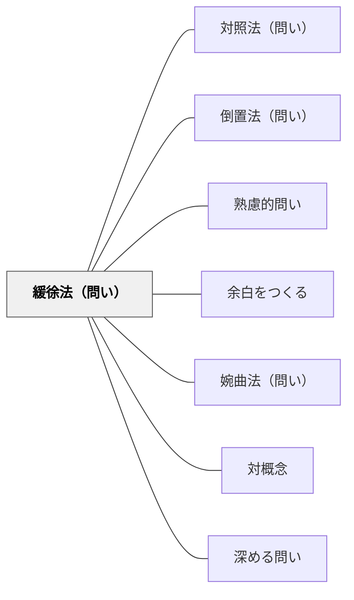

# 緩徐法（問い）

> 二重否定を使って直接表現の印象を操作する問い

## 背景（Context）
緩徐法（リトーテス）は、否定の否定によって肯定を間接的に表現する修辞技法である。「悪くはない」は「良い」を、「不可能ではない」は「可能だ」を含意する。問いに二重否定を用いることで、断定を避けながら可能性を問いかける柔らかな圧力を作り出すことができる。慎重な検討や控えめな見解を引き出したいときに有効である。

## 問題（Problem）
直接的な問いは、学習者に「答えなければならない」という緊張感を与えることがある。特に不確実な状況や、まだ考えが固まっていない段階では、明確な回答を求める問いが思考を止めてしまう。また、肯定的な断言を求める問いは、慎重な見解や留保を含む複雑な思考を排除しがちである。

## 力のかたち（Forces）
- 断定の求め vs 留保の許容
- 問いの明確さ vs 曖昧さへの耐性
- 肯定的回答の促進 vs 批判的思考の尊重
- 問いの柔らかさ vs 鋭さ

## 解決（Solution）
「〇〇でないとはいえないのでは？」「この可能性を無視できるとは言いにくいのでは？」「そうではないとも言い切れないのではないか？」のように、二重否定の形で問う。特に仮説を慎重に検討させたいとき、あるいは学習者の発言を尊重しつつ揺さぶりをかけたいときに使う。

## 結果（Consequences）
- 学習者が断言を避けながら複雑な考えを表現しやすくなる
- 慎重な検討や留保のある思考が議論に持ち込まれる
- 断定的な二項対立を超えた微妙なニュアンスの探究が促される

## 関連パタン
- [[パタン/対照法（問い）]]
- [[パタン/倒置法（問い）]]
- [[パタン/熟慮的問い]] — 親パタン
- [[パタン/余白をつくる]] — 断定を手放す余白が二重否定の問いを成立させる
- [[パタン/婉曲法（問い）]] — ネガティブな内容を柔らかく問う兄弟パタン
- [[パタン/対概念]] — 二項対立を超えた微妙なニュアンスへの問いかけ
- [[パタン/深める問い]] — 留保ある思考を引き出す問いの上位グループ

## クラスター図

## Actionable Insight

- 仮説を慎重に検討させたいとき、「○○でないとはいえないのでは？」という二重否定の形で問う——断定を避けながら可能性を問いかける柔らかな問いが留保ある思考を引き出す
- 「この可能性を無視できるとは言いにくいのではないか？」と問うことで、強い主張をしにくい学習者も発言しやすくなる——留保を許容する問いが慎重な見解を議論に持ち込む
- 断定的な二項対立になりやすい議論で意図的に二重否定の問いを挿入する——複雑なニュアンスへの気づきが生まれる

## 出典
- [[文献/熟慮的問いのパターンリスト（動画記録）]]
