# 練り上げ（比較検討の全体交流）

> 発表会は練り上げではない。出そろった考えを、効率・一般化可能性・既習との類似という物差しで比べ合わせ、粘土を練るようにひとつの塊にしていく——教師は判断を最後まで留保し、最初に集め、要約し、違いを問う。

## [Pattern Connection]

このWikiには発問のパタンが十本以上ある。[[パタン/発問の機能を使い分ける]]、[[パタン/ゆさぶり発問]]、[[パタン/深める問い]]、[[パタン/素材研究から発問内容を見出す]]、[[パタン/待ち時間（問いのあとの3秒）]]——問いを立てる技術は厚く記述されてきた。ところが**その問いのあとに来る授業の中心部分**、すなわち出そろった考えを全体で比べ合わせる時間は、名前を持たないまま置かれていた。日本の教室では当たり前すぎて、意識して名指す必要がなかったからである。

Black & Wiliam（2009）が興味深いのは、**その当たり前を外から名指している**点にある。彼らは §5 で、世界中の多くの共同体で「ある正典的な授業デザイン（a canonical lesson design）」への受容が広がっており、それは今や **"signature pedagogy"（Shulman, 2005）と呼ぶに足るほど普及しているかもしれない**と書く。そしてその授業デザインを記述するときに、彼らは日本語をそのまま二語使う——**hatsumon**（大きな問い）と **neriage**（練り上げ）である。

つまりこの節は、形成的評価の理論的モデルを作ろうとしている国際的なレビュー論文が、**日本の教師が毎日やっていることを、理論の中に据えるべき対象として拾い上げた**箇所である。日本の教師にとっての読みどころは、新しい手法を学ぶところではなく、**自分たちの当たり前が外からどう見えているかを知る**ところにある。

接続の要点は三つある。

第一に、練り上げは**形成的評価そのものである**。[[概念/形成的評価の5つの戦略（3×3の枠組み）]] でいえば、練り上げの十五分の中に「学習意図の共有」「学習の証拠を引き出す議論の設計」「学習を前進させるフィードバック」「学習資源としての生徒同士」の四つが同時に走っている。[[パタン/形成的評価]] の定義——証拠が引き出され、解釈され、次の一手を決めるのに実際に使われること——が、練り上げでは一分単位で回る。

第二に、練り上げは [[パタン/IRE型応答の脱却（Talk Move）]] や [[パタン/問い返し（リヴォイシング）]] が扱う**発話技術の上位の枠**である。個々のトークムーブは、練り上げという場の設計があって初めて意味を持つ。逆に、場だけあってムーブがなければ、練り上げは発表の並列に落ちる。

第三に、本論文は練り上げを賛美していない。§5 の後半は、**練り上げの最中に教師が同時にさばいている葛藤**の分析に費やされる。ここが本パタンの「力のかたち」の骨格になる。当たり前だと思ってきた営みが、実は極めて高度な同時処理であることが、外からの記述によって可視化される。

## 背景（Context）

算数の一時間の典型的な流れは、多くの日本の小学校でほぼ共通している。

1. 教師が**大きな問い**を出す（本論文が hatsumon と呼ぶもの）
2. 子どもが**自力解決**に取り組む（ペアや小グループの場合もある）
3. 出た考えを**全体で発表**する
4. 出そろった考えを**比べ、つなぎ、ひとつにまとめていく**——これが**練り上げ**
5. まとめ・適用問題

本論文 §5 の記述は、この流れをほぼそのままなぞっている。授業は「注意深く設計された大きな問い」で始まり、生徒はペアか小グループでその問いに取り組み、次に教師が学級全体の場を持って異なるグループが自分たちの提案を発表し、**典型的にはそれから教師が学級全体の議論を行う。それが日本語で "neriage" と呼ばれるもの**である、と。

そして著者らは、この語の**字義が「こねる（kneading）」**であることを注記し、脚注でその出どころを明かしている——**「neriage はもともと、異なる色の粘土を重ね、切り、組み合わせ直して、複雑な模様をもつ塊を作る技法に用いられた」**。

この比喩は正確である。練り上げが目指すのは、出た考えを一つに均すこと（混色して濁らせること）ではない。**重ね、切り、組み合わせ直して、模様が見える塊にする**ことである。A児の図とB児の式が別のものとして見えたまま、しかし一つの塊の中で関係づけられている——それが練り上がった状態である。

教育における練り上げの定義として、本論文は Takahashi（2008, p.8）を引く。**「構造化された問題解決における、学級全体の議論の局面。問題解決を通した指導の中核である」**。そこで生徒が使う物差しは三つ挙げられている——**効率（efficiency）、一般化可能性（generalizability）、既習の考えとの類似（similarity to previously learned ideas）**。

## 問題（Problem）

**練り上げは、放っておくと発表会になる。**

各グループが順に前に出て、自分たちの考えを言い、拍手が起き、次のグループに交代する。全部出そろったところで教師が「いろいろな考えが出ましたね」と言い、黒板にまとめを書く。時間は使われ、全員が発言し、活動としては成立している。だが**比較が一度も起きていない**。

これは練り上げではない。Takahashi の定義が「shared ideas を critically analyze, compare and contrast する」局面だと言っているのは、**共有のあとに来る操作**のことである。共有で終われば、それは共有であって練り上げではない。

なぜ発表会に落ちるのか。本論文 §5 の分析が、その理由を教師の側の負荷として説明している。

> 練り上げの場を運ぶにあたって、教師は**互いに衝突しうる複数の関心を釣り合わせねばならない**。教師は**学習への焦点を保たねばならない**。生徒の発言が新しい可能性を開いたとき、教師は**そのスレッドを追うか、教師が意図していたところへ会話を戻すかを、一瞬で決めねばならない（split-second decisions）**。

そしてもうひとつ、より根の深い圧力がある。

> **すべての発言を価値づけよという圧力は強い**。というのも、学級全体の学習を前へ進めることに加えて、教師は、**自分の発言が退けられたときに生徒が感じる拒絶の感覚を最小化しようとする**からである。

ここが決定的である。発表会化は、教師の怠慢や技術不足から起きるのではない。**「どの子の発言も大切にしたい」という、教師としてまっとうな願いから起きる**。比較は必然的に「こちらのほうが効率的だ」「こちらは特殊な場合にしか使えない」という判定を含む。判定を避ければ、比較は起きない。全部を等しく価値づけた瞬間に、練り上げは並列の発表に戻る。

本論文はこの葛藤への手がかりを、熟達者研究から引いてくる。

> この点で興味深いのは、Bromme & Steinbring（1994）が2人の数学教師の「熟達者・初心者」分析で発見したことである。**初心者の教師は生徒の問いを「個々の学習者からのもの」として扱う傾向があり、熟達者の教師の応答はより「集合的な生徒（collective student）」に向けられる傾向があった**。言い換えれば、**熟達者はひとつひとつの発言について、その子個人にとってではなく学級全体の学習にとっての含意を引き出そうとしていた**。

この一文が、練り上げの技術の核心を言い当てている。熟達者は「A児の発言をどう受けとめるか」を考えていない。「**A児の発言が、この学級の学習にとって何を開くか**」を考えている。だから比較ができる。個人への応答と読まれないからである。

## 力のかたち（Forces）

- **すべての発言を価値づけたい vs 学習の焦点を保ちたい**——本論文が名指す第一の衝突。全部を等価に扱えば比較は消え、比較を優先すれば誰かの発言が退けられる。この二つは原理的に両立しない。**同時には**両立しないだけで、扱う層を分ければ扱える（後述）
- **新しいスレッドを追う vs 意図した場所へ戻す**——一瞬の判断（split-second decisions）が求められる。子どもの発言は予定になかった可能性を開く。それを追えば教材の核から逸れるかもしれないし、戻せば「先生は自分の考えを聞いていない」という経験を残す
- **個人への応答 vs 集合的な生徒への応答**——熟達者は後者に寄る。しかし後者に寄りすぎると、発言した本人が「自分の考えが素材として使われただけ」と感じうる。本論文はこの影までは書いていないが、実務では必ず出る
- **発表の順序を教師が決める vs 出た順に扱う**——比較を成立させるには順序が要る（素朴な方法→図→式）。だが順序を教師が握ることは、「先生が正解に近い順に並べている」と読まれる危険と隣り合わせである
- **時間の非対称**——自力解決は時間が読めるが、練り上げは読めない。研究授業でいちばん最初に削られるのは、たいてい練り上げの後半である。しかし削られた後半こそが練り上げである
- **収束させたい vs 収束させてはいけない場面がある**——本論文は正直にこう付け加えている。「それでも会話は明確な方向へ舵を取られている」。Dillon の例（家族関係や校内喫煙禁止の議論）に比べると方向づけがはっきりしている、と。ただし前者は**科学概念の意味についての議論**であり、後者は**価値についての議論**である。舵の取り方が違ってよい
- **教師の判断をいつ出すか**——早く出せば以後の発言はすべて答え合わせになる。遅すぎれば子どもは何を目指しているかわからないまま漂う
- **練り上げは個別指導より難しい**——本論文 §6 の一文が、この難しさを教師個人の力量問題から切り離す。**「学習者の応答を用いて、仲間とのあいだの学習談話へさらに巻き込んでいくという仕事は、個別指導で一人の生徒の応答を扱うことに比べて、教師にとってはるかに複雑な仕事である」**

## 解決（Solution）

**練り上げを「四つの手」として運ぶ。集める → 要約する → 違いを問う → 教師の判断は最後に。そして比較の物差し（効率・一般化可能性・既習との類似）を、子どもが使える言葉にして教室に固定しておく。**

四つの手は、本論文 §6 が Black et al.（2003, ch.4）の談話サンプルから読み取っている形である。同じ教師の二つの授業記録が対比されている。

- **形成的でないほう**——**生徒の発言が2語か3語の句にとどまる**。教師は期待された正答を求めているだけである
- **より形成的なほう**——**生徒の発言が完全な文になり、「思う（think）」「なぜなら（because）」といった語を使って、理由づけられた対話であることを示す**。教師は、**まず複数の発言を集め、要約し、それらの違いについてさらに意見を求め、自分の導く判断や挑戦は多くの子が発言する時間を持つまで留保する**という形で会話を舵取りしている

この四手は、そのまま練り上げの手順になる。

1. **集める**——判断せずに三つか四つ並べる。「なるほど」「いいですね」も判断である。板書に置くだけにする
2. **要約する**——「今、三つ出ています。①は数えた、②は図にした、③は式にした」。要約は教師がやってよい。ここは子どもに任せると時間が溶ける
3. **違いを問う**——「①と③、どこが同じでどこが違う？」。**これが練り上げの心臓部**である。比べる対象を教師が指定する
4. **判断は最後に**——多くの子が発言する時間を持つまで、教師の導く判断と挑戦（ゆさぶり）を留保する

そして、比較を「なんとなく」でなく行うために、**物差しを固定する**。Takahashi の三つを子どもの言葉に置き換える。

| Takahashi（2008）の物差し | 子どもが使う言葉 |
|---|---|
| efficiency（効率） | **はやい？　かんたん？** |
| generalizability（一般化可能性） | **いつでも使える？　数が大きくなっても？** |
| similarity to previously learned ideas（既習との類似） | **前に習ったどれに似てる？** |

---

### 具体例1：算数の練り上げで、三つの物差しを板書の脇に固定する

五年生「小数のかけ算」。問題は「1mが80円のリボンを2.4m買うと、代金はいくらか」。自力解決で三通りの考えが出る。

- ①**線分図**をかいて、80円が2.4個分だと示した
- ②**80×24＝1920、1920÷10＝192** と、整数に直して戻した
- ③**80×2＝160、80×0.4＝32、160＋32＝192** と、分けて足した

このとき、黒板の右端に**マグネットで三枚の短冊**を常設しておく。「**はやい？**」「**いつでも使える？**」「**前に習ったどれに似てる？**」。単元を通して貼りっぱなしにする。

発表の順序は**教師が決める**。①線分図 → ③分けて足す → ②整数に直す、の順に並べる。理由は、①が「なぜそうなるか」を持ち、③が①の言い換えとして働き、②が最も手続き的で一般性が高いからである。**素朴な方法から形式的な方法へ**という順序が、比較の軸を作る。

三つが並んだところで、教師は判断を言わない。手順どおりに進める。

- **集める**——三人に説明させる。この間、教師のことばは「もう一度、そこだけ言って」「どこを見ればいい？」だけにする
- **要約する**——「①は図でみた、③は分けて足した、②は整数に直して最後にもどした」
- **違いを問う**——「③と②、どこが同じでどこが違う？」。子ども「どっちも整数のかけ算に直してる」「でも②は最後に10でわるところが違う」
- ここで**短冊を指さす**——「じゃあ、**いつでも使える？** 2.4じゃなくて2.47だったら、③はどうなる？」

ここが練り上げの山になる。③は 80×2＋80×0.4＋80×0.07 と項が増えていく。②は 80×247÷100 で手数が変わらない。**一般化可能性という物差しが、方法の序列を子ども自身に作らせる**。教師が「②が一番いい方法です」と言う必要はない。

そして最後に、教師の判断を出す。「では、②のやり方がなぜ正しいと言えるか、①の図で説明できる人？」——ここで初めて、教師の意図（形式の根拠を図に戻す）が前に出る。

**ポイントは、教師が最初に「いい考えですね」を言わなかったこと**である。言えば、以後の発言はその評価に対する反応になる。

---

### 具体例2：「集める→要約する→違いを問う」を、実際の発話で書き分ける

同じ場面を、二通りの教師の発話で並べてみる。差は小さいが、結果は大きく変わる。

**A：発表会になる運び**

> T「Aさん、どうぞ」
> A「線分図をかきました」
> T「**いい考えですね。**線分図、大事だね。じゃあBさん」
> B「80×24をして、10でわりました」
> T「**すばらしい。**整数に直したんだね。Cさんは？」
> C「分けて足しました」
> T「**なるほど。**いろいろな考えが出ましたね。じゃあまとめます」

ひとつひとつに価値づけが入っている。教師としてはこれ以上ないほど丁寧である。だが**各発言が閉じられてしまい、次の発言と関係を持てない**。「いい考えですね」は、その発言を完成品として扱う合図になる。完成品同士は比べられない。

**B：練り上げになる運び**

> T「Aさん、どうぞ」
> A「線分図をかきました」
> T「（板書だけして）ほかに、ちがうやり方でやった人」
> B「80×24をして、10でわりました」
> T「（板書だけして）まだちがうのある？」
> C「分けて足しました」
> T「**今、三つ出ています。①図、②整数に直す、③分けて足す。**——**②と③、どこが同じで、どこがちがう？**」
> D「どっちも整数のかけ算にしてる」
> T「**Dさんの言った『整数のかけ算にしてる』って、②のどこのこと？** 前に出て指してみて」

Bで教師が言っているのは、**位置と関係の指示だけ**である。価値判断がない。そのかわり「今、三つ出ています」という**要約**が入る。要約は評価ではないので、発言を閉じない。

そして最後の一手——「Dさんの言った……って、②のどこのこと？」——が、Bromme & Steinbring のいう**集合的な生徒への応答**である。Dの発言を、D個人への返答ではなく、学級全体が使う道具に変換している。**発言者に返すのではなく、発言を学級に返す**。これが練り上げの中核技術であり、初心者と熟達者を分ける線である。

---

### 具体例3：国語・道徳の練り上げ——収束させない練り上げがある

本論文が正直に書いているとおり、Black et al. の例では**会話は明確な方向へ舵を取られている**。それは**科学概念の意味についての議論**だからである。Dillon が扱った家族関係や校内喫煙禁止の議論は、それほど方向づけられていない。**価値についての議論と、概念の意味についての議論では、舵の取り方が違ってよい**。

これは日本の教室にそのまま当てはまる。算数の練り上げは収束する。道徳の練り上げは収束しない。ところが多くの教室で、**算数の練り上げの型が道徳に持ち込まれる**。「いろいろ出ましたが、やはり思いやりが大切ですね」という収束が、算数の「②が最も効率的ですね」と同じ形で行われる。

道徳・国語で練り上げるときは、物差しを差し替える。

| 算数の物差し | 価値・解釈の議論での物差し |
|---|---|
| はやい？ | **その考えでいくと、だれが困る？** |
| いつでも使える？ | **場面が変わっても、同じことが言える？**（これは残る） |
| 前に習ったどれに似てる？ | **本文のどこからそう読んだ？**（根拠の所在） |

一般化可能性の物差しだけは共通で残る。効率は消え、代わりに**帰結**と**根拠の所在**が入る。

そして四手目——「教師の判断は最後に」——は、価値の議論では「**最後にも出さない**」という選択肢を持つ。教師が判断を留保したまま終わる練り上げは、算数では不成立だが、道徳では成立する。ただし**留保と放任は違う**。留保するときは、「今日は決めません。ただ、AさんとBさんの考えは、どこで分かれているかははっきりしました」と、**分岐点だけを確定させて終える**。何が争点だったかを残さずに終わるのは、練り上げではなく雑談である（[[パタン/教科に対しても責任を負う（教えすぎと放任のあいだ）]]）。

---

### 具体例4：支援級・少人数での練り上げ——「集合的な生徒」が作れないとき

特別支援学級や少人数指導で練り上げをしようとすると、構造上の困難にぶつかる。**人数が少ないと「集合的な生徒」が作れない**。

三人の学級で「②と③、どこがちがう？」と問えば、②はB児のもの、③はC児のものだと全員が知っている。方法の比較が、そのまま**人の比較**として届く。学級全体の学習という抽象的な受け皿がないので、比較の判定は必ず誰かの上に落ちる。本論文の熟達者の技法——個人への含意ではなく学級全体への含意を引き出す——は、母数が小さいと成立しにくい。

現実的な手立ては三つある。

**第一に、考えを人から切り離してから並べる。** 発表させず、教師が全員の考えを**先に短冊に書き写して**黒板に貼る。名前は書かない。「①のやり方」「②のやり方」と番号で呼ぶ。番号で呼べるようになると、「②はここが弱い」が「B児はここが弱い」に翻訳されなくなる。手間はかかるが、少人数だからこそ全員分を書き写せる。

**第二に、その場にいない考えを教師が持ち込む。** 「去年の子が、こんなやり方をしていました」と、教師が第四の考えを黒板に足す。誤答を含む考えでもよい。**教室の中の誰のものでもない考えが一つあるだけで、比較が人格から離れる**。これは [[パタン/答えの出どころを推し量る（誤答の解釈）]] と組み合わせて使える——「この人は、どう考えてこうしたんだろう？」という問いは、誰も傷つけずに誤りの構造を扱える唯一の入口になることがある。

**第三に、比較の物差しを一つに絞る。** 三つ全部は使わない。支援級では「**前に習ったどれに似てる？**」だけを常設するとよい。既習との類似は、優劣の判定を含まない物差しだからである。効率（はやい・かんたん）は最も優劣に直結するので、関係が安定してから入れる。

[[実践/カエルの算数：勝ちやすさを表で考えよう]] のような、予想→実験→表への整理→説明という流れの実践では、練り上げの対象が「誰の考えが正しいか」ではなく「**表から何が言えるか**」になる。データを間に置くと、比較の対象が人から離れる。少人数で練り上げを成立させたいとき、**データや教具を議論の中央に物理的に置く**ことは、それ自体が有効な設計である。

---

### 自己教育での適用：一人で練り上げる

大人の独学では、練り上げの相手がいない。しかし四手のうち三手は一人でもできる。

同じ問題を**三通りで解いてから**、三つを並べて「どこが同じでどこが違う」を書く。効率・一般化可能性・既習との類似の三つで採点する。判断（どれを自分の標準にするか）は最後に決める。

一人でやるときに欠けるのは「集める」の多様性である。自分が出す三通りは、たいてい同じ発想の変奏になる。ここを補うのが、教科書の別解・他人の解法・過去の自分のノートである。**過去の自分の解法は、いま自分のものでない考えとして扱える**——支援級で「去年の子のやり方」を持ち込むのと同じ機能を、自分の記録が果たす。

## 結果（Consequences）

**利点**

- **発表会が比較に変わる**——同じ時間・同じ発言数で、起きることが変わる。四手のうち差を生むのは主に「集める段階で価値づけをしない」の一点であり、**教師の準備を増やさずに実行できる**
- **子どもの発言が長くなる**——本論文が引く二つの談話サンプルの差がそのまま現れる。2語3語の句が、「思う」「なぜなら」を含む文になる。理由づけを含む発言は、教師にとって**より豊かな学習の証拠**でもある（[[パタン/形成的評価]]）
- **比較の物差しが子どもの手に渡る**——効率・一般化可能性・既習との類似は、教師が判定に使う基準である。それを短冊にして教室に置くことは、**判定の基準そのものを子どもに渡す**ことにあたる。渡された子どもは、次の単元で教師に問われる前に自分で比べ始める
- **教師の一瞬の判断の負荷が下がる**——比較の軸が事前に決まっていれば、予想外の発言が出たときに「この発言はどの軸に乗るか」で判断できる。ゼロから判断しなくてよい
- **単元をまたいで効く**——「前に習ったどれに似てる？」を毎時間問い続けると、既習の想起が習慣になる。練り上げの物差しが、そのまま学び方の物差しになる

**注意点・リスク**

- **最大の失敗モードは発表会化である**——各グループが順に発表して終わり、比較が一度も起きない。活動としては成立し、全員が発言し、時間も使われるので、**失敗として認識されにくい**。判定基準は一つ——「**どれとどれを比べたか**」を授業後に一文で言えるか。言えなければ、それは共有であって練り上げではない
- **すべての発言を価値づける圧力が、比較を鈍らせる**——本論文が明示するとおり、この圧力は「拒絶感を最小化したい」というまっとうな動機から来る。だから意志の力では抑えられない。**扱う層を分けるしかない**——「集める」段階では価値づけを一切せず、そのかわり**全員の考えを必ず板書に残す**。価値づけの機能を、言葉ではなく**板書に載ること**が担う。「あなたの考えはそこにある」が保証されていれば、口頭で褒める必要は減る
- **一瞬の判断（split-second decisions）を教師の直感の問題にしない**——「あの先生は勘がいい」で終わらせると、技術として継承されない。負荷は**事前の準備で下げられる**。子どもの反応を三つか四つ予想して指導案の脇に書いておくだけで、その場の判断は「予想のどれか／予想外か」の二択になる（[[パタン/予想される反応を先に書く（応答の幅を絞る）]]）。予想外だったときに追うか戻すかの判断が [[パタン/偶発の瞬間を活かす（コンティンジェンシー）]] であり、[[パタン/タクト（教育的機転）]] が扱う領域である
- **教師が最初に正解を言ってしまうと、以後の発言はすべて答え合わせになる**——「なるほど、②のやり方が効率的だね」を序盤で言った時点で、練り上げは終わる。以後の発言は②への同意か、②を持たない子の沈黙になる。**教師の判断は多くの子が発言する時間を持つまで留保する**、が四手目の内容である
- **「集合的な生徒」への応答が、個々の子を置き去りにしうる**——これは本論文にない指摘である。原文が言っているのは「熟達者は各発言について学級全体の学習への含意を引き出す傾向があった」という**観察**であり、それが望ましいという規範命題ではない。実務では、自分の考えが素材として使われ、判定され、しかし自分自身には何も返ってこなかった、という経験が積み上がる子が出る。**集合的な生徒への応答は練り上げの技術であって、その子への応答の代替ではない**。練り上げのあとの個別の時間（ノートの一言、机間指導の三十秒）で、その子個人への返しを別に確保する。熟達の技法にも影がある
- **順序を教師が握ることの副作用**——比較のために発表順を教師が決めると、子どもは「先生が正解に近い順に並べている」と学習しうる。最後に指名された考えが正解だ、という読みが定着すると、練り上げは順序の推測ゲームになる。**時々、順序をわざと崩す**か、**最初に指名した考えを最後に採用する**回を作って、順序と正しさを切り離す
- **収束させてよい議論と、そうでない議論を混同しない**——本論文が Dillon の例との違いに触れているとおり、概念の意味の議論と価値の議論では舵の取り方が違う。道徳で算数の型を使うと、練り上げは道徳的結論の押しつけになる
- **練り上げが削られる構造がある**——時間が押したとき、最初に切られるのは練り上げの後半である。だが後半が練り上げの本体であり、切られて残るのは発表会である。**削るなら自力解決の時間か、扱う考えの数を減らす**。三つ出たうち二つに絞って深く比べるほうが、四つ並べて時間切れになるより成立する

## 関連パタン

- [[パタン/IRE型応答の脱却（Talk Move）]] — 練り上げの中で使う個々の発話技術。本パタンはそれらが働く場の設計を扱う。トークムーブだけあって場がなければ、技術は空回りする
- [[パタン/問い返し（リヴォイシング）]] — 四手目「違いを問う」の直前に必要な技術。子どもの発言を学級全体が使える形に言い直すことが、「集合的な生徒」への応答の具体形になる
- [[パタン/待ち時間（問いのあとの3秒）]] — 「集める」段階の前提。待たなければ集まる考えの数が減り、比べる材料が揃わない
- [[パタン/発問の機能を使い分ける]] — 練り上げの各段階で問いの機能が変わる（集める／要約を確認する／違いを問う／ゆさぶる）。同じ「発問」でも役割が異なる
- [[パタン/ゆさぶり発問]] — 四手目「教師の判断」の代表形。留保したあとに出す一手であり、序盤で出せば練り上げを潰す
- [[パタン/深める問い]] — 「違いを問う」を理由・根拠へ進める。2語3語の応答を「思う」「なぜなら」を含む文に変える
- [[パタン/素材研究から発問内容を見出す]] — 練り上げの成否は、大きな問い（hatsumon）の設計でほぼ決まる。比べるに値する複数の解法が出る問いでなければ、練り上げる材料がない
- [[パタン/実例を比べて分析する]] — 比較によって規準を体感させる同型の構造。あちらは作品の比較、本パタンは解法の比較を扱う
- [[パタン/認知的コンフリクト]] — 比較が「どちらも正しいはずなのに答えが違う」に届いたときに発火する。練り上げが最も動く瞬間
- [[パタン/ナンバートーク]] — 練り上げの最小単位。一問の暗算で複数の解法を出して比べる五分間の型であり、練り上げの日常的な練習になる
- [[パタン/複線型授業]] — 対になる授業観。全員が同じ問いに取り組む設計を前提とする練り上げと、進度も課題も分かれる設計は緊張関係にある。複線型で全体交流をどう作るかは未解決の問い
- [[パタン/タクト（教育的機転）]] — 「一瞬の判断（split-second decisions）」の日本語での定式化。本論文が名指す教師の同時処理の負荷が、ヘルバルト以来のタクト論と同じ場所を指している
- [[パタン/予想される反応を先に書く（応答の幅を絞る）]] — 一瞬の判断の負荷を事前に下げる手立て。練り上げの準備として最も費用対効果が高い
- [[パタン/偶発の瞬間を活かす（コンティンジェンシー）]] — 予想外の発言が出たときに追うか戻すかの判断。本論文が §5 で名指した葛藤そのもの
- [[パタン/答えの出どころを推し量る（誤答の解釈）]] — 比べる対象に誤答を含めるときの扱い方。少人数で「誰のものでもない考え」を持ち込む手立てと結びつく
- [[パタン/教科に対しても責任を負う（教えすぎと放任のあいだ）]] — 収束させない練り上げが放任に落ちないための歯止め。教師は生徒にも教科にも責任を負う
- [[パタン/聴き合う文化]] — 練り上げの前提条件。他者の考えを受け取ってつなぐ聞き方がなければ、四手目まで到達しない
- [[パタン/話し合う文化]] — 同じく前提条件。発表の並列を対話に変える文化的な土台
- [[パタン/形成的評価]] — 上位。練り上げは形成的評価が一分単位で回る場であり、学習の証拠を最も豊かに引き出す時間である
- [[概念/形成的評価の5つの戦略（3×3の枠組み）]] — 練り上げの十五分に四つの戦略が同時に走っていることを示す枠組み
- [[文献/Developing the Theory of Formative Assessment（Black & Wiliam, 2009）]] — 出典。§5・§6 が練り上げの記述と談話分析にあたる
- [[文献/Assessment and Classroom Learning（Black & Wiliam）]] — 姉妹文献。教室談話と形成的評価の関係を扱う先行レビュー
- [[教科/算数]] — 練り上げが最も定型化している教科

## クラスター図

```mermaid
flowchart LR
    ne7b7b4e3828ae4b88ae38192efbc88e6af94e8bc83e6a49ce8a88ee381aee585a8e4bd93e4baa4e6b581efbc89["練り上げ（比較検討の全体交流）"]
    n495245e59e8be5bf9ce7ad94e381aee884b1e58db4efbc8854616c6b204d6f7665efbc89["IRE型応答の脱却（Talk Move）"]
    ne5958fe38184e8bf94e38197efbc88e383aae383b4e382a9e382a4e382b7e383b3e382b0efbc89["問い返し（リヴォイシング）"]
    ne5be85e381a1e69982e99693efbc88e5958fe38184e381aee38182e381a8e381ae33e7a792efbc89["待ち時間（問いのあとの3秒）"]
    ne799bae5958fe381aee6a99fe883bde38292e4bdbfe38184e58886e38191e3828b["発問の機能を使い分ける"]
    ne38286e38195e381b6e3828ae799bae5958f["ゆさぶり発問"]
    ne6b7b1e38281e3828be5958fe38184["深める問い"]
    ne7b4a0e69d90e7a094e7a9b6e3818be38289e799bae5958fe58685e5aeb9e38292e8a68be587bae38199["素材研究から発問内容を見出す"]
    ne5ae9fe4be8be38292e6af94e381b9e381a6e58886e69e90e38199e3828b["実例を比べて分析する"]
    ne8aa8de79fa5e79a84e382b3e383b3e38395e383aae382afe38388["認知的コンフリクト"]
    ne3838ae383b3e38390e383bce38388e383bce382af["ナンバートーク"]
    ne8a487e7b79ae59e8be68e88e6a5ad["複線型授業"]
    ne382bfe382afe38388efbc88e69599e882b2e79a84e6a99fe8bba2efbc89["タクト（教育的機転）"]
    ne4ba88e683b3e38195e3828ce3828be58f8de5bf9ce38292e58588e381abe69bb8e3818fefbc88e5bf9ce7ad94e381aee5b985e38292e7b59ee3828befbc89["予想される反応を先に書く（応答の幅を絞る）"]
    ne581b6e799bae381aee79eace99693e38292e6b4bbe3818be38199efbc88e382b3e383b3e38386e382a3e383b3e382b8e382a7e383b3e382b7e383bcefbc89["偶発の瞬間を活かす（コンティンジェンシー）"]

    ne7b7b4e3828ae4b88ae38192efbc88e6af94e8bc83e6a49ce8a88ee381aee585a8e4bd93e4baa4e6b581efbc89 --- n495245e59e8be5bf9ce7ad94e381aee884b1e58db4efbc8854616c6b204d6f7665efbc89
    ne7b7b4e3828ae4b88ae38192efbc88e6af94e8bc83e6a49ce8a88ee381aee585a8e4bd93e4baa4e6b581efbc89 --- ne5958fe38184e8bf94e38197efbc88e383aae383b4e382a9e382a4e382b7e383b3e382b0efbc89
    ne7b7b4e3828ae4b88ae38192efbc88e6af94e8bc83e6a49ce8a88ee381aee585a8e4bd93e4baa4e6b581efbc89 --- ne5be85e381a1e69982e99693efbc88e5958fe38184e381aee38182e381a8e381ae33e7a792efbc89
    ne7b7b4e3828ae4b88ae38192efbc88e6af94e8bc83e6a49ce8a88ee381aee585a8e4bd93e4baa4e6b581efbc89 --- ne799bae5958fe381aee6a99fe883bde38292e4bdbfe38184e58886e38191e3828b
    ne7b7b4e3828ae4b88ae38192efbc88e6af94e8bc83e6a49ce8a88ee381aee585a8e4bd93e4baa4e6b581efbc89 --- ne38286e38195e381b6e3828ae799bae5958f
    ne7b7b4e3828ae4b88ae38192efbc88e6af94e8bc83e6a49ce8a88ee381aee585a8e4bd93e4baa4e6b581efbc89 --- ne6b7b1e38281e3828be5958fe38184
    ne7b7b4e3828ae4b88ae38192efbc88e6af94e8bc83e6a49ce8a88ee381aee585a8e4bd93e4baa4e6b581efbc89 --- ne7b4a0e69d90e7a094e7a9b6e3818be38289e799bae5958fe58685e5aeb9e38292e8a68be587bae38199
    ne7b7b4e3828ae4b88ae38192efbc88e6af94e8bc83e6a49ce8a88ee381aee585a8e4bd93e4baa4e6b581efbc89 --- ne5ae9fe4be8be38292e6af94e381b9e381a6e58886e69e90e38199e3828b
    ne7b7b4e3828ae4b88ae38192efbc88e6af94e8bc83e6a49ce8a88ee381aee585a8e4bd93e4baa4e6b581efbc89 --- ne8aa8de79fa5e79a84e382b3e383b3e38395e383aae382afe38388
    ne7b7b4e3828ae4b88ae38192efbc88e6af94e8bc83e6a49ce8a88ee381aee585a8e4bd93e4baa4e6b581efbc89 --- ne3838ae383b3e38390e383bce38388e383bce382af
    ne7b7b4e3828ae4b88ae38192efbc88e6af94e8bc83e6a49ce8a88ee381aee585a8e4bd93e4baa4e6b581efbc89 --- ne8a487e7b79ae59e8be68e88e6a5ad
    ne7b7b4e3828ae4b88ae38192efbc88e6af94e8bc83e6a49ce8a88ee381aee585a8e4bd93e4baa4e6b581efbc89 --- ne382bfe382afe38388efbc88e69599e882b2e79a84e6a99fe8bba2efbc89
    ne7b7b4e3828ae4b88ae38192efbc88e6af94e8bc83e6a49ce8a88ee381aee585a8e4bd93e4baa4e6b581efbc89 --- ne4ba88e683b3e38195e3828ce3828be58f8de5bf9ce38292e58588e381abe69bb8e3818fefbc88e5bf9ce7ad94e381aee5b985e38292e7b59ee3828befbc89
    ne7b7b4e3828ae4b88ae38192efbc88e6af94e8bc83e6a49ce8a88ee381aee585a8e4bd93e4baa4e6b581efbc89 --- ne581b6e799bae381aee79eace99693e38292e6b4bbe3818be38199efbc88e382b3e383b3e38386e382a3e383b3e382b8e382a7e383b3e382b7e383bcefbc89

    classDef hub fill:#f0f0f0,stroke:#555,color:#000,font-weight:bold
    class ne7b7b4e3828ae4b88ae38192efbc88e6af94e8bc83e6a49ce8a88ee381aee585a8e4bd93e4baa4e6b581efbc89 hub
```

## Actionable Insight

- **次の算数の練り上げで、「いい考えですね」を一度も言わずに集めきってみる**——価値づけの代わりに、全員の考えを必ず板書に残す。板書に載ることが承認の機能を担う。集め終えてから「今、三つ出ています」と要約する
- **黒板の右端に三枚の短冊を常設する**——「はやい？　かんたん？」「いつでも使える？」「前に習ったどれに似てる？」。単元を通して貼りっぱなしにし、比較の場面で指さす
- **練り上げの一手を「◯と◯、どこが同じでどこがちがう？」に固定する**——比べる対象は教師が指定する。「どう思いますか」では比較は起きない
- **指導案の脇に、子どもの反応を三つか四つ予想して書いておく**——その場の判断が「予想のどれか／予想外か」の二択になり、一瞬の判断の負荷が下がる
- **授業後に一文だけ記録する——「今日は、◯と◯を比べた」**。書けない日は、練り上げではなく発表会だったということ。これが最も安価な自己点検になる
- **少人数・支援級では、考えを短冊に書き写してから並べる**——発表させず、番号で呼ぶ。「②はここが弱い」が「B児はここが弱い」に翻訳されない状態を作る
- **練り上げの直後に、発言が素材として使われた子へ三十秒返す**——「さっきのAさんの図がなかったら、②の説明ができなかった」。集合的な生徒への応答は、その子個人への応答の代替にはならない
- **道徳・国語の練り上げでは、収束させずに分岐点だけを確定して終える**——「今日は決めません。ただ、二つの考えがどこで分かれているかははっきりしました」

## 出典

Black, P., & Wiliam, D. (2009). Developing the theory of formative assessment. *Educational Assessment, Evaluation and Accountability, 21*(1), 5–31.（本ページが依拠したのは著者校正前プレプリント "Revise of 3rd November 08" のため、本論文本文からの引用には頁を付さず節で示す）

> In many communities all over the world, there is increasing acceptance of a canonical lesson design which may now be sufficiently widespread to qualify as a “signature pedagogy” (Shulman, 2005). The lesson begins with a “big question” (hatsumon in Japanese) which has been carefully designed to lead students towards the intended outcomes (however broadly they may be defined). Students are asked to work on this question in pairs or small groups, and then the teacher conducts a whole class session in which different groups present their proposals. Typically, the teacher then conducts a whole-class discussion, which is termed “neriage” in Japanese; this word, whose literal meaning is “kneading”, is used in education to describe: … （§5）
> — 世界中の多くの共同体で、ある正典的な授業デザインへの受容が広がっており、それは今や「signature pedagogy」（Shulman, 2005）と呼ぶに足るほど普及しているかもしれない。授業は「大きな問い」（日本語で hatsumon）で始まる。それは、意図された成果へ生徒を導くよう注意深く設計されている（その成果がどれだけ広く定義されていようとも）。生徒はペアか小グループでその問いに取り組むよう求められ、次に教師が学級全体の場を持ち、異なるグループが自分たちの提案を発表する。典型的には、教師はそれから学級全体の議論を行う。それが日本語で「neriage」と呼ばれるものである。この語の字義は「こねる（kneading）」であり、教育では次のように記述するのに用いられる——

> ‘neriage’ originally applied to the technique of layering, cutting and re-combining different colours of clay to produce a block with intricate patterns. （§5 脚注5）
> — 「neriage」はもともと、異なる色の粘土を重ね、切り、組み合わせ直して、複雑な模様をもつ塊を作る技法に用いられた。

Takahashi, A. (2008). *Neriage: An essential piece of a problem-based lesson. Teaching through problem solving: A Japanese approach.* Paper presented at the Annual Conference of the National Council of Teachers of Mathematics, Salt Lake City, UT.（Black & Wiliam, 2009 §5 に引用）

> the whole class discussion phase of structured problem solving. It is the core of teaching through problem solving. This happens after students have shared various solution strategies. During this phase, students, carefully guided by the teacher, critically analyze, compare and contrast the shared ideas. They will consider issues like efficiency, generalizability, and similarity to previously learned ideas. （Takahashi, 2008 p.8）
> — 構造化された問題解決における、学級全体の議論の局面。それは問題解決を通した指導の中核である。これは生徒がさまざまな解法を共有したあとに起こる。この局面で生徒たちは、教師に注意深く導かれながら、共有された考えを批判的に分析し、比較し、対比する。彼らは、効率・一般化可能性・既習の考えとの類似といった論点を検討することになる。

Black & Wiliam (2009) §5 より、練り上げにおける教師の葛藤と熟達者・初心者の差：

> In conducting the neriage session, the teacher must balance a range of different concerns, some of which may conflict with the others. The teacher must retain the focus on the learning. If student contributions raise new possibilities, the teacher has to make split-second decisions whether to follow the new thread, or bring the conversation back to where the teacher intended. The pressure to value every contribution is strong, since as well as advancing the learning of the whole class, the teacher will be seeking to minimize the sense of rejection a student might feel if her or his contribution is dismissed. （§5）
> — 練り上げの場を運ぶにあたって、教師は互いに衝突しうる複数の関心を釣り合わせねばならない。教師は学習への焦点を保たねばならない。生徒の発言が新しい可能性を開いたとき、教師は、その新しいスレッドを追うか、教師が意図していたところへ会話を戻すかを、一瞬で決めねばならない。すべての発言を価値づけよという圧力は強い。というのも、学級全体の学習を前へ進めることに加えて、教師は、自分の発言が退けられたときに生徒が感じる拒絶の感覚を最小化しようとするからである。

> Bromme and Steinbring (1994) discovered in their “expert-novice” analysis of two mathematics teachers that the novice teacher tended to treat students’ questions as being from individual learners, while the expert teacher’s responses tended to be directed more to a “collective student”. In other words, for each contribution, the expert teacher sought to draw out implications for the learning of the whole class, rather than for each individual student. （§5）
> — Bromme & Steinbring（1994）は、2人の数学教師の「熟達者・初心者」分析において、初心者の教師は生徒の問いを個々の学習者からのものとして扱う傾向があり、熟達者の教師の応答はより「集合的な生徒」に向けられる傾向があったことを発見した。言い換えれば、熟達者の教師はひとつひとつの発言について、それぞれの生徒個人にとってではなく、学級全体の学習にとっての含意を引き出そうとしていた。

Black & Wiliam (2009) §6 より、談話サンプルの対比と、教室談話の複雑さ：

> two short samples published as part of the formative assessment work reported in Black et al, (2003 - ch.4) show one episode in which pupils’ contributions amount to no more then two- or three-word phrases, whilst in a later, and more formative, example from the same teacher, pupils’ contributions take the form of complete sentences, using terms such as ‘think’ and ‘because’ which indicate reasoned dialogue. In the first of these the teacher is merely seeking the expected right answer, in the second he acts more to steer the conversation by first collecting some contributions, summarising them and asking for more comments on the differences between these, leaving his own guiding judgments and challenges until many have had time to contribute. （§6）
> — Black et al.（2003 第4章）で報告された形成的評価の取り組みの一部として公刊された二つの短いサンプルは、一方のエピソードでは生徒の発言が2語ないし3語の句にとどまるのに対し、同じ教師による後の、より形成的な例では、生徒の発言が完全な文の形をとり、「思う」「なぜなら」といった語を用いて理由づけられた対話であることを示している。前者では教師は単に期待された正答を求めているだけであるが、後者では教師は、まず複数の発言を集め、それらを要約し、それらの違いについてさらに意見を求め、自分の導く判断や挑戦は多くの者が発言する時間を持つまで留保する、という形で会話を舵取りしている。

> Nevertheless, it is clear that the conversation is being steered in a definite direction, a feature which is far less clear in Dillon’s examples. However, some of the latter are discussions of such topics as family relationships or the school’s ban on smoking, whereas the former is about the meaning of a scientific concept. （§6）
> — とはいえ、その会話が明確な方向へ舵を取られていることは明らかであり、この特徴は Dillon の例においてははるかに不明瞭である。ただし後者のうちいくつかは、家族関係や校内の喫煙禁止といった主題についての議論であるのに対し、前者は科学的概念の意味についてのものである。

> What should be emphasised here is that the task of using learners’ responses to catalyse their further involvement in a learning discourse between peers is a far more complex task for the teacher than dealing with a single student’s response in an individual tutorial. （§6）
> — ここで強調しておくべきは、学習者の応答を用いて、仲間とのあいだの学習談話へさらに彼らを巻き込んでいくという仕事は、個別指導で一人の生徒の応答を扱うことに比べて、教師にとってはるかに複雑な仕事だということである。

Bromme, R., & Steinbring, H. (1994). Interactive development of subject matter in the mathematics classroom. *Educational Studies in Mathematics, 27*(3), 217–248.（Black & Wiliam, 2009 §5 に引用）

Black, P., Harrison, C., Lee, C., Marshall, B., & Wiliam, D. (2003). *Assessment for learning: Putting it into practice*. Buckingham: Open University Press.（第4章の談話サンプル）

Dillon, J. T. (1994). *Using discussion in classrooms*. London: Open University Press.（Black & Wiliam, 2009 §6 に引用）

Shulman, L. S. (2005). *The signature pedagogies of the professions of law, medicine, engineering, and the clergy: Potential lessons for the education of teachers.* Paper presented at the National Science Foundation Mathematics and Science Partnerships Workshop, National Research Council Center for Education, Irvine, CA.（Black & Wiliam, 2009 §5 に引用）
