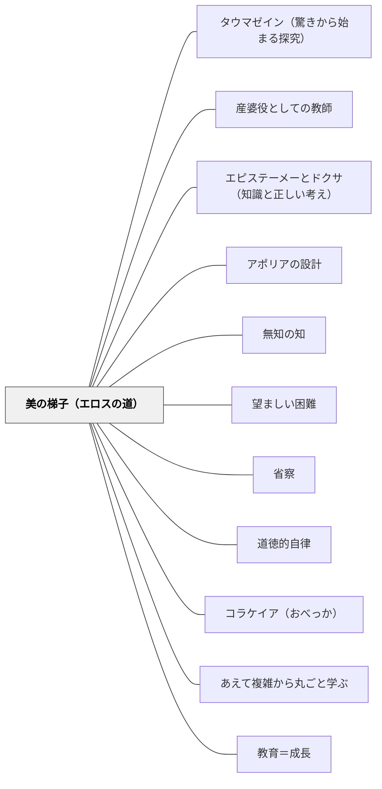

# 美の梯子（エロスの道）

> 一つの美しいものへの没入が、すべての美しいものへの愛へと拡大し、やがて美そのものに至る。学びは梯子を登るように進む——段を飛ばすことはできない。

## [Pattern Connection]

### プラトン『饗宴』（前380年頃）——ディオティマの美の梯子（209e–211b）

プラトン『饗宴』でディオティマがソクラテスに語った「エロスの道の奥義」が、このパタンの直接の源泉である。

**美の梯子の完全な記述（210a–211b）：**

> 「その姿は、さながら梯子を使って登る者のようだ。すなわち、一つの美しい体から二つの美しい体へ、二つの美しい体からすべての美しい体へと進んでいき、次いで美しい体から美しいふるまいへ、そしてふるまいからさまざまな美しい知へ、そしてついには、さまざまな知からかの知へと到達するのだ。それはまさにかの美そのものの知であり、彼はついに美それ自体を知るに至るのである。」

段階構造：

| 段階 | Stephanos | 対象 | 学習への読み替え |
|---|---|---|---|
| 1 | 210a | 美しい体（一つ） | 一つの具体的な素材・現象・問いへの没入 |
| 2 | 210b | すべての美しい体 | 個別から類・共通性への抽象化 |
| 3 | 210b | 美しい心 | 外形より内実・本質・思考への注目 |
| 4 | 210c | 美しい行為・制度 | 個別行為から社会・構造・パターンへの視点 |
| 5 | 210d | 知識の美しさ | 学問的な美・構造の優雅さへの感受性 |
| 6 | 211a | 美のイデア | 「突如として」到達——不変・単一・絶対の理 |

**三つの重要な特徴：**

1. **他者との対話の中で起こる**：ディオティマは「指導者が正しく導くなら（210a）」という条件を付ける。美の梯子は孤独な瞑想ではなく、言葉による他者との関わりの中で展開する

2. **言葉を生み出すことによって上昇する**：各段階で「美しい言葉（ロゴス）を生み出す」ことが梯子を登る行為そのものになる——「言語を通じた知の産出」が上昇の媒体

3. **一つの具体から始まる必然性**：「若いとき、一つの美しい体を愛し（210a）」——出発点は必ず「一つの具体」。いきなり抽象から入ることはできない

**「突如として（エクサイフネース）」の意味（210e）：**
最終段階（美のイデア）への到達は、段階的上昇の末に「突如として」起こる。これは計画や努力で到達するものではなく、積み上げた経験の臨界点で生じる——「わかった（アハ体験）」の哲学的記述。

---

## 背景（Context）

学習者は「分からないこと」と「分かること」の間を行き来しながら理解を深める。しかし「具体から抽象へ」という学習の方向性は、教師が意図的に設計しなければ機能しない。具体の段階に留まり続ける学習者、あるいは最初から抽象概念を押しつけられ本質が掴めない学習者——両方が困難を抱える。

プラトンが前380年頃に書いた『饗宴』で、ディオティマはソクラテスに「エロスの道の奥義」として美の梯子を語った。それは「一つの具体的な美しさへの没入」から始まり、段階的な抽象化を経て、最終的に「美そのもの（イデア）」へと至る。この梯子の構造は、学習の進行モデルとして2400年後の教室にも有効である。

## 問題（Problem）

「なぜこれを学ぶのか」「これがどこにつながるのか」が見えない学習では、学習者は具体の段階に留まるか、あるいは逆に抽象概念を暗記するだけで終わる。具体と抽象のつながりが断ち切れた学習は、転移が起きず、応用が利かない。

一方、教師が一つの具体物に徹底的に関わらせないまま抽象化を促すと、学習者の理解は砂上の楼閣になる。「一つのものへの没入」なしに「すべてへの理解」はない。

## 力のかたち（Forces）

- 人間の認識は「具体的・個別的なもの」から出発し、比較・分類を通じて「普遍的・抽象的なもの」へと向かう
- 「一つのものへの没入（愛）」が深いほど、その一つからの一般化の射程が広くなる
- 各段階で「言葉にする（ロゴスを産む）」ことが、次の段階への足がかりになる
- 段階を飛ばすことはできない——「3段目（心の美）」は「2段目（すべての体の美）」を経てから見えてくる
- 「突如として（エクサイフネース）」という飛躍的な理解は、積み上げた経験がなければ訪れない
- 適切な指導者（ダイモン的教師）の役割が明示されている——「指導者が正しく導くなら」

## 解決（Solution）

**「一つの具体的なもの」への十分な没入から始め、言葉を産出させながら段階的に抽象化を促す。各段階でのロゴス（言語化）が次の段階への足がかりになる。指導者は梯子の各段を意識しながら、上の段への橋渡しをする。**

---

**ステップ1：一つの具体的なものへの没入**

算数であれば「一つの問題」、国語であれば「一つの物語の場面」、理科であれば「一つの現象」——まず「一つのもの」に徹底的に関わらせる。「この問題を何とかして解いてみよう」「この場面の主人公は何を感じているのか」。答えを急かさず、一つとの格闘の時間をとる。

**ステップ2：比較による一般化（「すべての…」への移行）**

一つのものへの理解が深まったら、「他の場合はどうか」「これと似たものは」と比較を促す。「4つの三角形の面積を全部調べてみると、何か共通点がある？」——個別から類への移行。この段階でのキーワードは「同じ」「違う」「いつも」。

**ステップ3：内実・本質への注目（「心の美」への移行）**

「どれも同じになるのはなぜ？」「この物語で大切なのは何？」——外形（計算結果・ストーリー）から内実（なぜそうなるか・登場人物の内面）へと焦点を移す。「見た目じゃなくて、中身を考えよう」という問いかけが有効。

**ステップ4：構造・パターンへの視点（「行為の美」への移行）**

「この考え方、他の場面でも使える？」「同じ構造が他でも見えない？」——一つの理解を横断的に使えるパターンとして意識させる。転移の設計はこの段階。

**ステップ5：言語化し、共有する**

各段階で「言葉にする」時間をとる。ノートに書く・ペアで話す・全体で共有する——ロゴスを産出することが次の段階への足がかりになる。「どうして分かったか」「何が分かったか」を言語化させる。

---

**具体例1：算数・面積の学習**

三角形の面積を「一つ」だけ徹底的に調べる（段階1）→「4つ全部やってみたら、みんな同じ求め方になった」（段階2）→「なぜ同じになるのか」を考える（段階3）→「この考え方、台形でも使える？」（段階4）→「面積は全部、底辺×高さの形になっている」と言語化（段階5）。

**具体例2：物語の読み取り**

一つの場面を徹底的に読む（段階1）→「別の場面でも主人公は同じことをしている」と気づく（段階2）→「なぜこの人はいつもこうするのか？内面は何か」（段階3）→「これはこの本だけじゃなくて、人間全員に当てはまる」（段階4）→「人間の本質」について語り合う（段階5）。

**具体例3：理科・溶解**

食塩が水に溶けるのを一つ観察する（段階1）→「砂糖は？重曹は？」と比較（段階2）→「溶けるとはどういうことか」（段階3）→「混合物・純物質の区別」（段階4）→「物質とは」（段階5）。

---

## 結果（Consequences）

- 学習者が「なぜこれを学ぶのか」の見通しを持てる——梯子の各段が次につながっていると感じる
- 具体への没入が深い学習者ほど、抽象化の質も高くなる
- 各段階での言語化が学習者の理解を外化し、教師の観察・フィードバックを可能にする
- 「突如として（エクサイフネース）」の瞬間——わかった！という体験が、学習の最大の報酬になる
- 段階を急いだ場合（具体を省略して抽象から入った場合）、転移が起きない「形だけの理解」になる
- 一つのものへの没入に時間をかけると、カリキュラムの「進み」は遅くなるが、転移の射程は広くなる

## 関連パタン

- [[パタン/タウマゼイン（驚きから始まる探究）]] — タウマゼイン（驚き）は梯子の一番下の段への入り口：一つのものへの驚きが没入を生む
- [[パタン/産婆役としての教師]] — ディオティマはソクラテスの産婆役。「指導者が正しく導くなら」——梯子の各段での産婆的介入
- [[パタン/エピステーメーとドクサ（知識と正しい考え）]] — 美の梯子の最終到達点（美のイデア＝エピステーメー）と途中段階（オルテー・ドクサ）の対応
- [[パタン/アポリアの設計]] — 各段階間の「飛躍」にアポリアを設計する：「なぜ全部同じになるのか」という困惑が次の段への動力
- [[パタン/無知の知]] — エロス（欠如感）が梯子を登る動力。各段で「まだ上がある」と知ることが駆動力になる
- [[パタン/望ましい困難]] — 段階を飛ばさないという難しさ。各段での格闘が本物の理解をつくる
- [[パタン/省察]] — 各段階での言語化（ロゴスを産む）は省察の具体的な形
- [[パタン/道徳的自律]] — 美の梯子の最終目標は「真実の徳（アレテー）」を自ら生み出すこと（212a）
- [[パタン/コラケイア（おべっか）]] — コラケイア的授業は梯子を外見だけ上ったように見せる。真の梯子は内実（美しさ・真理）への上昇
- [[パタン/あえて複雑から丸ごと学ぶ]] — 「一つの具体」の選び方が梯子全体の質を決める；最初に丸ごと出会う素材の豊かさが梯子の上への射程を広げる
- [[パタン/教育＝成長]] — 美の梯子の上昇は成長のプラトン的定義：より美しいものを見る力を持つ存在になること

## クラスター図

## Actionable Insight

- 単元の最初に「一つの問題」「一つの現象」「一つの作品」への完全没入時間を設ける（最低15分）。比較・一般化は「一つへの没入」が十分になってから始める
- 各授業の終わりに「今日何が分かったか」「なぜそうなるか」を必ず言語化させる——このロゴス産出が次の授業の足がかりになる
- 「突如として（エクサイフネース）」の瞬間を見逃さない：子どもが「あ！」「そういうことか！」と言った瞬間に立ち止まり「今何が見えた？」と問い返す
- 梯子の段を自分で確認する：「今この授業は何段目か」——段を飛ばして抽象化を急いでいないか確認する

## 出典

プラトン（中澤務訳）（2013）『饗宴』光文社（光文社古典新訳文庫 Bフ 2-4）, pp. 100–107（210a–211b）

> 「その姿は、さながら梯子を使って登る者のようだ。すなわち、一つの美しい体から二つの美しい体へ、二つの美しい体からすべての美しい体へと進んでいき……ついには美それ自体を知るに至るのである。」——ディオティマ（211c）
