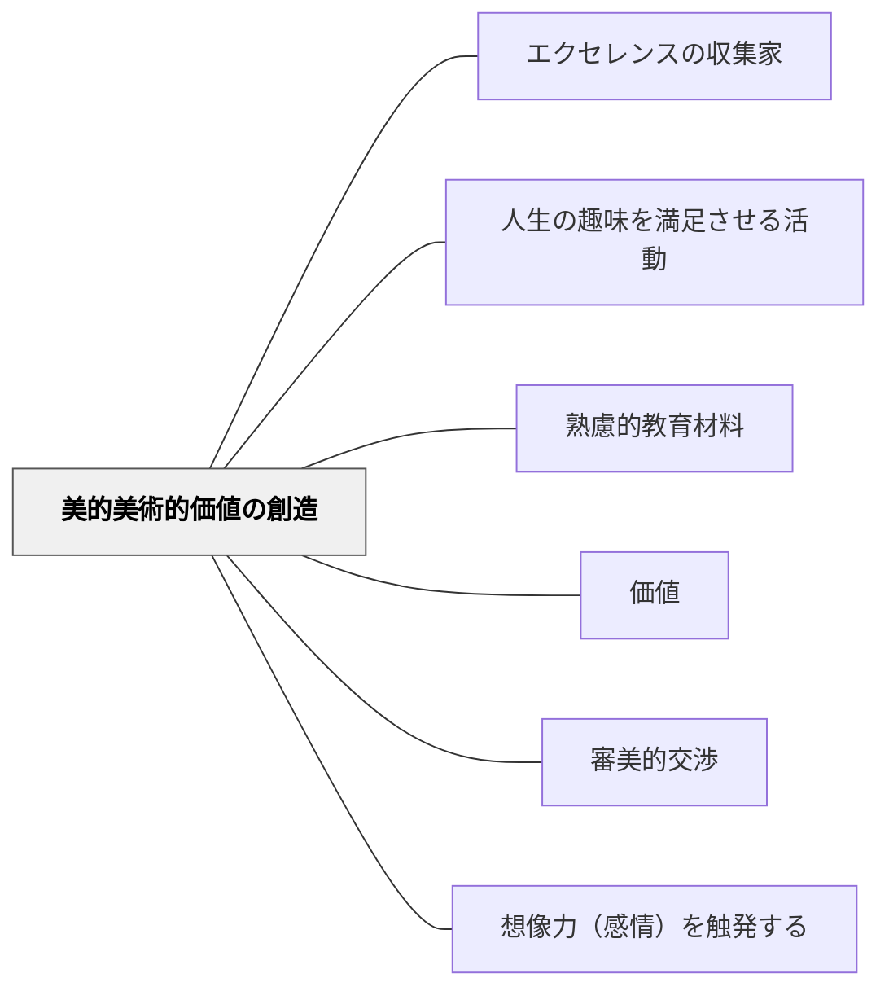

# 美的美術的価値の創造

> 美しいものに出会い、美しいものを作る——審美的価値を育む教育材料。

## Pattern Connection

### 牧口常三郎（1931）——芸術＝技術連続体論と美的価値の定義

*創価教育学体系 第2巻* は美的価値（審美的価値）の本質を詳述し、このパタンの理論的根拠を補強する。

**芸術と技術は連続している**

牧口は「芸術と非芸術（技術・日常生活）の差は質ではなく程度の差に過ぎない」と論じる。芸術は生活から切り離された特別な領域ではなく、一般の技術・生活活動の延長線上にある。ゆえに一般教育の外に別立ての「芸術教育」を設ける必要はなく、**すべての教科の中に美的価値を育てる場がある**。

> 美的価値とは「我々の精神に軽快なる驚異的感情を惹き起す程度の変化を表わす感覚的対象」に生まれる価値であり、感覚器官を通じた部分的生命への関係力である。

**美的価値は感覚的・部分的価値**

牧口の利・善・美の体系では：
- **美的価値**：感覚器官への刺激による快感・驚異の感情——部分的生命への関係力
- **利的価値**：個人の全人的生命への関係力
- **善的価値**：社会全体の生命への関係力

美的価値は「生命への脅威を感じない範囲での驚異・快感」が条件であり、恐怖や危険への反応は美的評価を消す。また「多様の統一」——単調でなく変化があり、かつ統一性がある——が美の本質的条件である。

**教育への示唆**：芸術と技術が連続するなら、算数の図形の美しさ・理科の自然の対称性・国語の言葉のリズムも等しく美的価値の教育である。「美術の時間だけが美育」ではない。

- **他のパタンへの波及**：[[パタン/守・破・離（習熟の三段階）]]（美の創造も守→破→離の三段階を経る）

**鑑賞は創作への第一歩**

第2巻には、評価（鑑賞）作用と創価（創造）作用の関係について重要な原理が示される：

> 「鑑賞は創作への第一歩であるとは、総ての美術家、芸術家の一致する主張である」

また「評価作用が創価作用への橋梁である」という命題が繰り返し強調される。

美しいものに出会い感動する（鑑賞＝評価作用）ことは、単なる受動的体験ではなく、美しいものを作る（創作＝創価作用）への能動的な入り口である。このことは、このパタンの設計原理——美しいものとの出会いを意図的に設計することの重要性——を理論的に裏付ける。

- **他のパタンへの波及**：[[パタン/創造力を目標とすること]]（鑑賞→創作の橋梁原理が価値創造の起点）

---

## 背景（Context）

牧口常三郎の3価値分類の一つ。美術・音楽・図工だけでなく、算数（図形の美しさ）・国語（言葉の美しさ）・理科（自然の美しさ）など多くの教科で美的価値を教材化できる。動画では「箱根の寄木細工の美しさとの出会いを算数の学習の入り口にする」事例が挙げられている。

## 問題（Problem）

学習内容から美的側面が取り除かれると、知識・技能の習得だけになり、感動・驚き・美への感受性が育たない。

## 力のかたち（Forces）

- 美的体験が感情・想像力を触発し深い学びを生む
- 美は主観的であり普遍的でもある
- 日常の中に潜む美を見つける目を育てることが重要

## 解決（Solution）

**学習内容の美的側面（造形・言語・音・自然など）を意図的に提示し、美への感受性と表現力を育む教材設計をする。**

## 結果（Consequences）

- 学習者の審美的感受性が育つ
- 感動・驚きを通じた深い動機が生まれる

## 関連パタン
- [[パタン/エクセレンスの収集家]]
- [[パタン/人生の趣味を満足させる活動]]

- [[パタン/熟慮的教材教具]] — 親パタン
- [[パタン/価値]] — 上位パタン
- [[パタン/審美的交渉]] — 美への関わりを動機にする
- [[パタン/想像力（感情）を触発する]] — 美が感情・想像力を触発する

## クラスター図

## Actionable Insight

- 算数・理科・国語でも「この内容の美しさを感じてもらえる瞬間」を1つ意識的に設計する——教科の美的側面の提示が感動・驚きを通じた深い動機と記憶への定着を生む
- 日常の中の美（寄木細工・自然の法則・言葉のリズム）への気づきを授業の入り口にする——美的体験が先にあることで学習者の感情と想像力が動き、概念への関与が高まる
- 学習者が作った成果物の「美しいと思うところ」を1点言語化する機会を作る——自分の作品への審美的な眼が誇りと次の創造への動機を育てる

## 出典

- 牧口常三郎（1972）『牧口常三郎全集第4巻 創価教育学体系 上』聖教新聞社
- [[文献/創価教育学体系 2（牧口常三郎）]] — 美的価値の定義・芸術＝技術連続体論・審美的価値の体系
