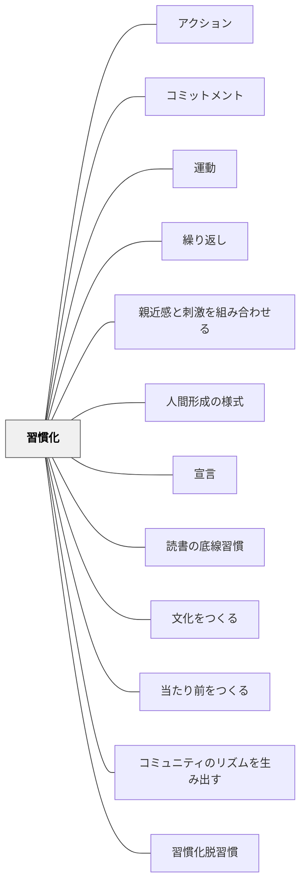

# 習慣化

> 習慣は第二の天性である。— アリストテレス

## 背景（Context）

認知資源は有限である。意識的に行う行動は認知負荷を消費するが、習慣化された行動は自動的に実行され、認知資源を解放する。学習のための良いルーティン（ノートを開く、問いを書く、振り返りをする）が習慣化されると、学習者はその行動自体ではなく、学習の内容に意識を向けられるようになる。

## 問題（Problem）

毎回意識的に「さあやろう」と促さなければ動かないルーティンは、教師の労力を消耗させ、学習者にとっても「させられること」になる。

## 力のかたち（Forces）

- 習慣形成には一定の反復期間（数週間〜数ヶ月）が必要
- 習慣は報酬・環境・トリガーのセットで形成される
- 習慣化しすぎると「慣れ」となり、活気や意味が失われることもある（→[[パタン/習慣化脱習慣]]）

## 解決（Solution）

**学習を支えるルーティンを特定し、一貫したトリガー・環境・フィードバックのセットで反復し、自動化する。**

設計の要素：
- **トリガー**：何がそのルーティンを始めさせるか（チャイム・特定の場所・開始の言葉）
- **反復**：同じ形で繰り返す（形を変えない期間を設ける）
- **フィードバック**：できたことを確認・賞賛する
- **コミュニティへの統合**：クラス全体の「当たり前」として位置づける

## 結果（Consequences）

- ルーティンが自動化され、学習者の注意が内容に向けられる
- 一貫したリズムが安心感を生む（→[[パタン/親近感と刺激を組み合わせる]]）
- 学習時間の密度が上がる

## クラスター図

## Actionable Insight

- 定着させたいルーティンを1つ選び、同じトリガー（チャイム・特定の言葉・場所）で3週間繰り返す——トリガーの一貫性が習慣の自動化を最も効果的に支える
- ルーティンの目的を学習者に伝え「クラスの当たり前」として位置づける——コミュニティとしての習慣化が個人の意志力に頼らない自動的な行動を生む
- 学習者が誰に言われるでもなくルーティンを始めたとき、そのことを称賛・共有する——「もう当たり前になっている」という承認が習慣の定着を強化する

## 出典

- 一つの教育のパタン・ランゲージ（岩井輝久）

## 関連パタン
- [[学級経営/文化をつくる]]
- [[パタン/アクション]]
- [[パタン/コミットメント]]
- [[パタン/運動]]
- [[パタン/繰り返し]]
- [[パタン/親近感と刺激を組み合わせる]]
- [[パタン/人間形成の様式]]
- [[パタン/宣言]]
- [[パタン/読書の底線習慣]]

- [[パタン/文化をつくる]] — 親パタン
- [[パタン/当たり前をつくる]] — 習慣化の目的
- [[パタン/コミュニティのリズムを生み出す]] — リズムが習慣化を支える
- [[パタン/習慣化脱習慣]] — 習慣化とその解除の両面
