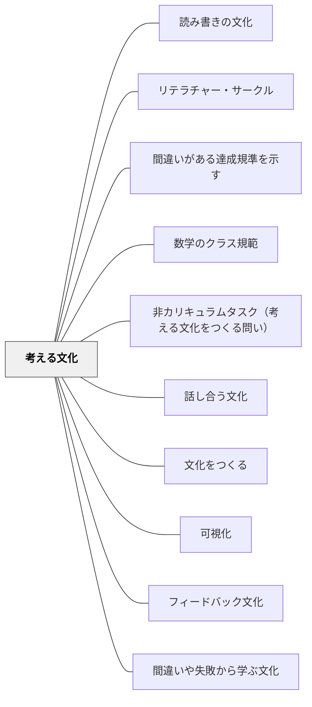

# 考える文化

**一文でいうと**：速く正解することより、考えを持ち、問い、更新することを当たり前にする。

## 使いどころ・使いすぎ注意

| 観点         | 内容                                             |
| ------------ | ------------------------------------------------ |
| 使いどころ   | 正解だけでなく思考を大事にしたいとき。           |
| 使いすぎ注意 | 考えることを求めすぎると、知識の支えが不足する。 |

> 全員に対して、個人および集団の思考が、毎日のあたりまえの経験の一部として尊重され、可視化され、強く奨励される場。— ロン・リチャート

## 背景（Context）

学校教育の本来の目的は「深く考えられる人」を育てることのはずだが、多くの教室では「正しい答えを素早く出すこと」が評価される。このとき、思考は手段ではなく邪魔になる。

## 問題（Problem）

考えることが可視化・評価されない教室では、学習者は正解を暗記することに集中し、理解のための思考を省略する。その文化では、複雑な問題に直面したとき対処できない。

## 力のかたち（Forces）

- 思考は見えないため、その価値を示すには意図的な可視化が必要
- 思考には時間・安全・他者との対話が必要
- 間違いを恐れる文化では思考が萎縮する

## 解決（Solution）

**思考を可視化・言語化するルーティンを導入し、「考えることが当たり前」の文化をつくる。**

リチャートらが開発した**シンキング・ルーティン**の例：

| ルーティン                     | 使い方                     |
| ------------------------------ | -------------------------- |
| Think-Pair-Share               | 個人思考→ペア対話→全体共有 |
| See-Think-Wonder               | 見えること→解釈→疑問       |
| I Used to Think... Now I Think | 考えの変化を言語化する     |
| Claim-Support-Question         | 主張→根拠→疑問             |

教師自身が思考プロセスを声に出してモデリングすることも不可欠。

## 結果（Consequences）

- 学習者が「わからない」を出発点として探究を続けるようになる
- 集団の思考が個人の思考を超える経験が積み重なる
- 評価が「正解の数」から「思考の質」へシフトする

## 関連パタン
- [[教科/算数]]
- [[パタン/読み書きの文化]]
- [[教科/算数・数学で使うパタン]]
- [[パタン/リテラチャー・サークル]]
- [[パタン/間違いがある達成規準を示す]]
- [[パタン/数学のクラス規範]]
- [[パタン/非カリキュラムタスク（考える文化をつくる問い）]]
- [[パタン/話し合う文化]]

- [[パタン/文化をつくる]] — 親パタン
- [[パタン/可視化]] — 思考を見えるようにする実践
- [[パタン/フィードバック文化]] — 思考へのフィードバックの文化
- [[パタン/間違いや失敗から学ぶ文化]] — 考えることの安全基地
## このパタンが働く実践

| 実践パタン                                                | どのように考える文化をつくるか                                                 |
| --------------------------------------------------------- | ------------------------------------------------------------------------------ |
| [[パタン/ナンバートーク]]                                 | 答えの速さより「どう考えたか」を共有することを日常にする                       |
| [[パタン/ブッククラブ]]                                   | 正解探しではなく、同じ本について自分の読みを持ち寄り考えを深める               |
| [[パタン/問い返しのデザイン]]                             | 学習者の発言を受け止め、さらに考えが続く問い返しを設計する                     |
| [[パタン/間違いや失敗から学ぶ文化]]                       | 間違いを隠すものではなく、みんなで考える材料として扱う                         |
| [[実践/10や100を単位にして計算しよう]]                    | まず一人で考え、数の見方を図・式・言葉で共有することで、全員が考える場をつくる |
| [[パタン/算数シンキング・タスク]]                         | 「手順を思い出す作業」でなく「本当に考える問い」で算数の考える文化をつくる     |
| [[パタン/非カリキュラムタスク（考える文化をつくる問い）]] | 年度初めに算数の「考える文化」を育てる非カリキュラム問いの設計                 |

## クラスター図

## Actionable Insight

- 週1回、「Think-Pair-Share（個人→ペア→全体）」を授業に取り入れる——最も定着しやすいシンキング・ルーティンの入門で考える文化が育ち始める
- 教師自身が考えているプロセスを声に出してモデリングする——「先生もこう考えてみたんだけど…」という独り言が考える文化の最も強力なモデルになる
- 「今日の授業で気になったこと・疑問」を付箋1枚に書いて出口チケットにする——思考の痕跡を毎日可視化することが「考えることが当たり前」の文化を育てる

## 出典

- ロン・リチャート他（2015）『子どもの思考が見える21のルーチン』北大路書房
- Project Zero（ハーバード教育大学院）"Making Thinking Visible"
