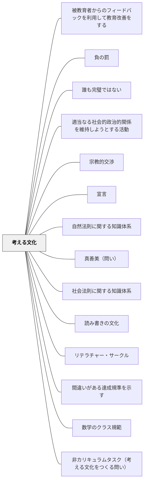

# 考える文化

**このパタンが完成を助ける大きなパタン**：[[パタン/文化をつくる]]・[[パタン/可視化]]

**一文でいうと**：速く正解することより、考えを持ち、問い、更新することを当たり前にする。

## 使いどころ・使いすぎ注意

| 観点         | 内容                                             |
| ------------ | ------------------------------------------------ |
| 使いどころ   | 正解だけでなく思考を大事にしたいとき。           |
| 使いすぎ注意 | 考えることを求めすぎると、知識の支えが不足する。 |

> 全員に対して、個人および集団の思考が、毎日のあたりまえの経験の一部として尊重され、可視化され、強く奨励される場。— ロン・リチャート

## [Pattern Connection]

**研究からの補足：話し合いの約束と個人の推論を確かめる（Mercerほか1999）**

原典のRaven検査では集団得点の伸びの差は有意でなく、個人得点では片側検定で有意だった（p. 107）。Wiki側の適用案として、話し合い後の各自の説明を残す。活発な対話だけから、全員の思考が深まったと結論しない。 出典：[[文献/話し合いの約束と個人の推論を確かめる（Mercerほか1999）]]。

**研究からの補足：予想と根拠の検討を通して数学を学ぶ（Lampert1990）**

Lampert（1990, pp. 52–58）を踏まえたWiki側の適用案として、考えを変えた場面で「前は何を前提にし、今はどの理由で考え直したか」を残す。修正を速さや従順さの評価にせず、まだ決められない理由も聞く。 出典：[[文献/予想と根拠の検討を通して数学を学ぶ（Lampert1990）]]。

**研究からの補足：数学的によい説明の基準を教室で育てる（YackelとCobb1996）**

YackelとCobb（1996）を受けたWiki側の適用案として、算数の授業後に「なぜそう考えたかを聞いた場面」と「理由を受けて考えを変えた場面」を一つずつ記録する。発言数だけで文化の成立を判断せず、次の時間にも同じ確かめ方が使われたか見る。 出典：[[文献/数学的によい説明の基準を教室で育てる（YackelとCobb1996）]]。

**研究からの補足：理由を出し合う対話を育てる（Mercerほか2004）**

原典pp. 372–373を参照したWiki側の適用案として、話し合い後に各自の説明を短く残し、共同の答えと見比べる。話が活発だったことだけで全員の理解が深まったと判定しない。 出典：[[文献/理由を出し合う対話を育てる（Mercerほか2004）]]。

**研究からの補足：学習への関与を行動と感情と思考から捉える（Fredricksほか2004）**

原典は、課題に取り組む行動だけから認知的関与を推定することの限界を論じる（pp. 65–68）。Wiki側の適用案として、発言回数に加え「考えをどう変えたか」を短く確かめる。発言が少ないことを思考の欠如とせず、問いや待つ時間など思考する条件も見る。シンキング・ルーティンの効果を直接検証した論文ではない。 出典：[[文献/学習への関与を行動と感情と思考から捉える（Fredricksほか2004）]]。

**研究からの補足：読書の対話と個人の理解を分けて確かめる（Murphyほか2009）**

Wiki側の適用案として、読書後の「前はこう考えた／今はこう考える」に文章中の根拠を添える。原典（p. 744）の個人の理解への着目を参考にした案であり、シンキング・ルーティン全体の効果を検証した研究ではない。 出典：[[文献/読書の対話と個人の理解を分けて確かめる（Murphyほか2009）]]。

## 背景（Context）

学校教育の本来の目的は「深く考えられる人」を育てることのはずだが、多くの教室では「正しい答えを素早く出すこと」が評価される。このとき、思考は手段ではなく邪魔になる。

## 問題（Problem）

考えることが可視化・評価されない教室では、学習者は正解を暗記することに集中し、理解のための思考を省略する。その文化では、複雑な問題に直面したとき対処できない。

## 力のかたち（Forces）

- 思考は見えないため、その価値を示すには意図的な可視化が必要
- 思考には時間・安全・他者との対話が必要
- 間違いを恐れる文化では思考が萎縮する

## 解決（Solution）

**思考を可視化・言語化するルーティンを導入し、「考えることが当たり前」の文化をつくる。**

**近いパタンとの見分け**：思考のルーティン全般で考えることを当たり前にするのが本パタン。算数の年度初めにその文化を先につくる手立ては [[パタン/非カリキュラムタスク（考える文化をつくる問い）]]。文化の系列の全体の表は [[パタン/文化をつくる#近いパタンとの見分け|文化をつくる]] にある。

リチャートらが開発した**シンキング・ルーティン**の例：

| ルーティン                     | 使い方                     |
| ------------------------------ | -------------------------- |
| Think-Pair-Share               | 個人思考→ペア対話→全体共有 |
| See-Think-Wonder               | 見えること→解釈→疑問       |
| I Used to Think... Now I Think | 考えの変化を言語化する     |
| Claim-Support-Question         | 主張→根拠→疑問             |

教師自身が思考プロセスを声に出してモデリングすることも不可欠。

### 研究の裏づけ

> **研究の裏づけ**：リチャートらの「考える文化」プロジェクトでは、決まった手順を教師に渡さない。8人ずつの教員の研究会で、学級文化をつくる8つの力（環境・言葉・やりとり・時間・学ぶ機会・型とルーチン・思考の手本・思考への期待）を学び、子どもの作品から思考の跡を読み、取り入れ方は各担任が決めた（pp. 146, 149–150）。その学級で1年過ごした3〜11年生239人は、考えることを「方略」として書く割合が増えた。比べる群のない前後比較で、根拠は仮説の段にとどまる（p. 150）。出典：[[文献/思考を見える形にする学級で1年過ごすと、子どもの「考えること」のとらえ方が変わるかを確かめる（Ritchhartほか2009）]]。

> **研究の裏づけ**：（実践の報告）プロジェクト・ゼロは、学校は教師にとっても考える文化でなければならないとする。教師は研究会で子どもの思考の記録を持ち寄り、よく見る→子どもの思考を推し量る→問いを出す→授業への意味を考える、の順で話し合う。1年生の学級の一つの話し合いに90分をかけた例がある。教師向けの雑誌の解説で、効果を確かめた研究ではない（Creating a Culture of Thinking for Teachers）。出典：[[文献/思考ルーチンと記録で、考えを見える形にする（RitchhartとPerkins2008）]]。

## 結果（Consequences）

- 学習者が「わからない」を出発点として探究を続けるようになる
- 集団の思考が個人の思考を超える経験が積み重なる
- 評価が「正解の数」から「思考の質」へシフトする

## 関連パタン
- [[文献/読書の対話と個人の理解を分けて確かめる（Murphyほか2009）]] — 思考の可視化を、個人の理解を確かめる入口にする。
- [[学級経営/学級経営で使えるパタン]]
- [[パタン/被教育者からのフィードバックを利用して教育改善をする]]
- [[パタン/負の罰]]
- [[パタン/誰も完璧ではない]]
- [[パタン/適当なる社会的政治的関係を維持しようとする活動]]
- [[パタン/宗教的交渉]]
- [[パタン/宣言]]
- [[パタン/自然法則に関する知識体系]]
- [[パタン/真善美（問い）]]
- [[パタン/社会法則に関する知識体系]]
- [[教科/算数]]
- [[パタン/読み書きの文化]]
- [[教科/算数・数学で使うパタン]]
- [[パタン/リテラチャー・サークル]]
- [[パタン/間違いがある達成規準を示す]]
- [[パタン/数学のクラス規範]]
- [[パタン/非カリキュラムタスク（考える文化をつくる問い）]]
- [[パタン/話し合う文化]]

- [[パタン/文化をつくる]] — 親パタン
- [[パタン/可視化]] — 思考を見えるようにする実践
- [[パタン/フィードバック文化]] — 思考へのフィードバックの文化
- [[パタン/間違いや失敗から学ぶ文化]] — 考えることの安全基地
- [[文献/学習への関与を行動と感情と思考から捉える（Fredricksほか2004）]] — 活動量と考えの内容を分け、思考する機会も点検する。
- [[文献/理由を出し合う対話を育てる（Mercerほか2004）]] — 対話の記録と、個人の考えの変化を見比べる。
- [[文献/数学的によい説明の基準を教室で育てる（YackelとCobb1996）]] — 発言の多さに加えて、理由を検討する応答を見る。
- [[文献/予想と根拠の検討を通して数学を学ぶ（Lampert1990）]] — 考えを修正する過程を、日々の学びの一部として扱う。
- [[文献/話し合いの約束と個人の推論を確かめる（Mercerほか1999）]] — 共同の答えと個人の推論を別々に確かめる。
- [[文献/思考を見える形にする学級で1年過ごすと、子どもの「考えること」のとらえ方が変わるかを確かめる（Ritchhartほか2009）]] — 教員の研究会と8つの文化の力で「考える文化」をつくった学校の前後比較
- [[文献/大学の講義に思考ルーチンを入れると、学生の参加と成績はどう変わるかを確かめる（Ramos-Vallecilloほか2024）]] — 大学の講義で思考ルーチンを使った準実験（参加と成績）
- [[文献/思考ルーチンと記録で、考えを見える形にする（RitchhartとPerkins2008）]] — 教師にとっての考える文化と、子どもの思考の記録を読む研究会（実践の解説）

## このパタンが働く実践
- [[実践/学習する学校をつくる]]

| 実践パタン                                                | どのように考える文化をつくるか                                                 |
| --------------------------------------------------------- | ------------------------------------------------------------------------------ |
| [[パタン/ナンバートーク]]                                 | 答えの速さより「どう考えたか」を共有することを日常にする                       |
| [[パタン/ブッククラブ]]                                   | 正解探しではなく、同じ本について自分の読みを持ち寄り考えを深める               |
| [[パタン/問い返しのデザイン]]                             | 学習者の発言を受け止め、さらに考えが続く問い返しを設計する                     |
| [[パタン/間違いや失敗から学ぶ文化]]                       | 間違いを隠すものではなく、みんなで考える材料として扱う                         |
| [[実践/10や100を単位にして計算しよう]]                    | まず一人で考え、数の見方を図・式・言葉で共有することで、全員が考える場をつくる |
| [[パタン/算数シンキング・タスク]]                         | 「手順を思い出す作業」でなく「本当に考える問い」で算数の考える文化をつくる     |
| [[パタン/非カリキュラムタスク（考える文化をつくる問い）]] | 年度初めに算数の「考える文化」を育てる非カリキュラム問いの設計                 |

## クラスター図

```mermaid
flowchart LR
    ne88083e38188e3828be69687e58c96["考える文化"]
    ne8a2abe69599e882b2e88085e3818be38289e381aee38395e382a3e383bce38389e38390e38383e382afe38292e588a9e794a8e38197e381a6e69599e882b2e694b9e59684e38292e38199e3828b["被教育者からのフィードバックを利用して教育改善をする"]
    ne8b2a0e381aee7bdb0["負の罰"]
    ne8aab0e38282e5ae8ce792a7e381a7e381afe381aae38184["誰も完璧ではない"]
    ne981a9e5bd93e381aae3828be7a4bee4bc9ae79a84e694bfe6b2bbe79a84e996a2e4bf82e38292e7b6ade68c81e38197e38288e38186e381a8e38199e3828be6b4bbe58b95["適当なる社会的政治的関係を維持しようとする活動"]
    ne5ae97e69599e79a84e4baa4e6b889["宗教的交渉"]
    ne5aea3e8a880["宣言"]
    ne887aae784b6e6b395e58987e381abe996a2e38199e3828be79fa5e8ad98e4bd93e7b3bb["自然法則に関する知識体系"]
    ne79c9fe59684e7be8eefbc88e5958fe38184efbc89["真善美（問い）"]
    ne7a4bee4bc9ae6b395e58987e381abe996a2e38199e3828be79fa5e8ad98e4bd93e7b3bb["社会法則に関する知識体系"]
    ne8aaade381bfe69bb8e3818de381aee69687e58c96["読み書きの文化"]
    ne383aae38386e383a9e38381e383a3e383bce383bbe382b5e383bce382afe383ab["リテラチャー・サークル"]
    ne99693e98195e38184e3818ce38182e3828be98194e68890e8a68fe6ba96e38292e7a4bae38199["間違いがある達成規準を示す"]
    ne695b0e5ada6e381aee382afe383a9e382b9e8a68fe7af84["数学のクラス規範"]
    ne99d9ee382abe383aae382ade383a5e383a9e383a0e382bfe382b9e382afefbc88e88083e38188e3828be69687e58c96e38292e381a4e3818fe3828be5958fe38184efbc89["非カリキュラムタスク（考える文化をつくる問い）"]

    ne88083e38188e3828be69687e58c96 --- ne8a2abe69599e882b2e88085e3818be38289e381aee38395e382a3e383bce38389e38390e38383e382afe38292e588a9e794a8e38197e381a6e69599e882b2e694b9e59684e38292e38199e3828b
    ne88083e38188e3828be69687e58c96 --- ne8b2a0e381aee7bdb0
    ne88083e38188e3828be69687e58c96 --- ne8aab0e38282e5ae8ce792a7e381a7e381afe381aae38184
    ne88083e38188e3828be69687e58c96 --- ne981a9e5bd93e381aae3828be7a4bee4bc9ae79a84e694bfe6b2bbe79a84e996a2e4bf82e38292e7b6ade68c81e38197e38288e38186e381a8e38199e3828be6b4bbe58b95
    ne88083e38188e3828be69687e58c96 --- ne5ae97e69599e79a84e4baa4e6b889
    ne88083e38188e3828be69687e58c96 --- ne5aea3e8a880
    ne88083e38188e3828be69687e58c96 --- ne887aae784b6e6b395e58987e381abe996a2e38199e3828be79fa5e8ad98e4bd93e7b3bb
    ne88083e38188e3828be69687e58c96 --- ne79c9fe59684e7be8eefbc88e5958fe38184efbc89
    ne88083e38188e3828be69687e58c96 --- ne7a4bee4bc9ae6b395e58987e381abe996a2e38199e3828be79fa5e8ad98e4bd93e7b3bb
    ne88083e38188e3828be69687e58c96 --- ne8aaade381bfe69bb8e3818de381aee69687e58c96
    ne88083e38188e3828be69687e58c96 --- ne383aae38386e383a9e38381e383a3e383bce383bbe382b5e383bce382afe383ab
    ne88083e38188e3828be69687e58c96 --- ne99693e98195e38184e3818ce38182e3828be98194e68890e8a68fe6ba96e38292e7a4bae38199
    ne88083e38188e3828be69687e58c96 --- ne695b0e5ada6e381aee382afe383a9e382b9e8a68fe7af84
    ne88083e38188e3828be69687e58c96 --- ne99d9ee382abe383aae382ade383a5e383a9e383a0e382bfe382b9e382afefbc88e88083e38188e3828be69687e58c96e38292e381a4e3818fe3828be5958fe38184efbc89

    classDef hub fill:#f0f0f0,stroke:#555,color:#000,font-weight:bold
    class ne88083e38188e3828be69687e58c96 hub
```

## Actionable Insight

- 週1回、「Think-Pair-Share（個人→ペア→全体）」を授業に取り入れる——最も定着しやすいシンキング・ルーティンの入門で考える文化が育ち始める
- 教師自身が考えているプロセスを声に出してモデリングする——「先生もこう考えてみたんだけど…」という独り言が考える文化の最も強力なモデルになる
- 「今日の授業で気になったこと・疑問」を付箋1枚に書いて出口チケットにする——思考の痕跡を毎日可視化することが「考えることが当たり前」の文化を育てる

## 出典

- ロン・リチャート他（2015）『子どもの思考が見える21のルーチン』北大路書房
- Project Zero（ハーバード教育大学院）"Making Thinking Visible"
