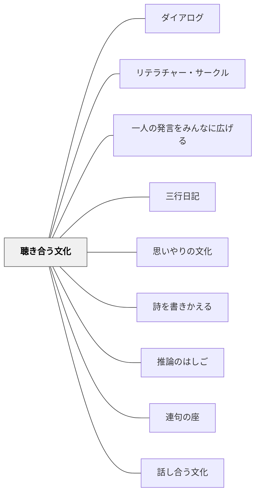

# 聴き合う文化

**一文でいうと**：話す力だけでなく、他者の考えを受け取り、つなげる聞き方を育てる。

## 使いどころ・使いすぎ注意

| 観点         | 内容                                             |
| ------------ | ------------------------------------------------ |
| 使いどころ   | 対話が発表の並列になっているとき。               |
| 使いすぎ注意 | 聴くことだけを求めると、発言する力が育ちにくい。 |

> 聴くことは、話すことと同じくらい能動的な行為である。

---

## Pattern Connection

**Senge et al.（2000/2012）統合（2026-05-14）：**

_Schools That Learn_ のチーム学習（Team Learning）ディシプリンは、「ダイアログ（Dialogue）」を聴き合う文化の深化形として位置づけている。

- **補強された点**：本パタンの「聴くことをスキルとして練習する」という方向性に加え、「仮定を宙吊りにして共に考える」というダイアログ固有の構造が加わった。アクティブ・リスニング（傾聴スキル）とダイアログ（集合的思考）は異なる水準の実践であり、相互に補完し合う。
- **接続した概念**：[[パタン/推論のはしご]] — 本当に聴くためには、相手のはしごを「間違っている」ではなく「どのデータを選んでいるか」という好奇心で受け取る必要がある。傾聴の質は、聴き手の推論のはしごへの意識に左右される。
- **他のパタンへの波及**：[[パタン/ダイアログ]] として「議論との使い分け」を含む発展的パタンが生成された。

---

## 背景（Context）

対話において、発話と傾聴は一体である。しかし学校では「話すこと・発表すること」が評価されやすく、「聴くこと」は受動的なものとして軽視されがちである。本当の意味での話し合いは、質の高い傾聴があってこそ成立する。

## 問題（Problem）

聴く文化がないと、話し合いは「自分が話す順番を待つ時間」になる。他者の言葉が響かず、対話が積み重なっていかない。

## 力のかたち（Forces）

- 聴くことは自然に育つ能力ではなく、意識的に練習するスキルである
- 「聴いている」を示す行動（うなずき・目線・反応）はコミュニティによって異なる
- 深く聴くためには判断を一時停止する必要があり、これには訓練が要る

## 解決（Solution）

**聴くことを可視化し、賞賛し、スキルとして練習する。**

実践例：

- 「今、仲間の言葉で心に残ったことを繰り返してみて」という習慣
- 話し合い後に「誰がどんなことを言っていたか」を振り返る
- アクティブ・リスニングの要素（反映、明確化、共感）を教える
- 「聴いてもらえた経験」を定期的に共有する

## 結果（Consequences）

- 話し合いが積み重なり、対話として深まるようになる
- 学習者が自分の言葉が届くと感じ、発言への安心感が育つ
- 教師の言葉も、より受け取られやすくなる

## クラスター図

## Actionable Insight

## 出典

- 一つの教育のパタン・ランゲージ（岩井輝久）

- 話し合いの後に「仲間の言葉で心に残ったことを1つ繰り返してみて」を習慣にする——他者の言葉を復唱することが傾聴を能動的な行為として可視化し文化として育てる
- 話し合い後に「誰がどんなことを言っていたか」を振り返る時間を1〜2分取る——「聴いていたかどうか」が評価されると学習者の傾聴の質が変わる
- 「今日、誰かの話をしっかり聴けたと感じた場面はどこ？」を授業の最後に問いかける——聴く経験の言語化がコミュニティに傾聴の文化を根付かせる

## 関連パタン
- [[パタン/ダイアログ]]
- [[パタン/リテラチャー・サークル]]
- [[パタン/一人の発言をみんなに広げる]]
- [[パタン/三行日記]]
- [[パタン/思いやりの文化]]
- [[パタン/詩を書きかえる]]
- [[パタン/推論のはしご]]
- [[パタン/連句の座]]
- [[パタン/話し合う文化]]

## このパタンが働く実践
- [[実践/ローベルみたいな物語を書こう]]
- [[実践/言葉をよりすぐって俳句を作ろう]]
- [[実践/詩歌の授業（詩を書く・詩を読む）]]

| 実践パタン                          | どのように聴き合う文化をつくるか                                               |
| ----------------------------------- | ------------------------------------------------------------------------------ |
| [[パタン/数学ワークショップ]]       | 学習チームで、答えを教えるのでなく、困っているところを聞き、考え方を説明し合う |
| [[パタン/ブッククラブ]]             | 仲間の読みを聴き、自分の読みが変わる経験を積み重ねる                           |
| [[実践/俳句と短歌を楽しもう]]       | 句会で選んだ俳句の感想を聴き合い、言葉のよさを互いの感じ方から広げる           |
| [[実践/詩を紹介する・詩を創作する]] | ペアで紹介文や詩を対話しながら読み歩き、よいところを伝え合う                   |
| [[パタン/問い返しのデザイン]]       | 相手の言葉を受け止め、さらに考えが続く問い返しを行う                           |

## このパタンが働く教材

| 教材                              | どのように聴き合う文化を支えるか                                                                 |
| --------------------------------- | ------------------------------------------------------------------------------------------------ |
| [[教材/読書会の質問（テーマ）集]] | 「もう一回言ってくれる？」「○○はどう思う？」など、友だちの発言を受けて対話を続ける言葉を用意する |

- [[パタン/文化をつくる]] — 親パタン
- [[パタン/話し合う文化]] — 傾聴と対話の相互補完
- [[パタン/思いやりの文化]] — 聴くことはケアの実践
- [[パタン/安心基地]] — 聴いてもらえる安心感
- [[パタン/一人の発言をみんなに広げる]] — 発言を全体の素材にする技術。教師の立ち位置の変化が「聴く」を促す（小倉勝登）
- [[パタン/三行日記]] — 書いたものを読んでもらえる経験が「聴いてもらえた」感覚を毎日つくる
