# 聴き方を変える（評価的・解釈的・解釈学的）

> 教師は自分が「聴いている」と思っている。実際に聴いているのは、子どもの言葉が自分の期待にどれだけ合っているか、だけであることが多い。

## [Pattern Connection]

- **既存パタンとの関連**：本パタンは Davis（1997）が一人の中学校数学教師を2年間追跡して記録した聴き方の変容を、この Wiki の対話・発問パタン群の**構えの層**として置く。[[パタン/問い返し（リヴォイシング）]] も [[パタン/待ち時間（問いのあとの3秒）]] も、技法としては外形が同じでも、どの構えの下で使われるかで機能が正反対になる。評価的な聴き方の下でのリヴォイシングは、子どもの言葉を教師の言葉へ変換する誘導になる。待ち時間も、期待した答えが出るまで待つ時間になる。**技法の層だけを積み上げても、聴き方は変わらない**
- **[[パタン/被教育者からのフィードバックを利用して教育改善をする]] の実行形式**：子どもの発言を「教師の教え方についての情報」として読むことが、第二段階の実質である。本パタンはその抽象的な原則に、**授業記録という具体的な実行形式**を与える
- **[[概念/圏論と教育]] との接続**：第三段階では「教えられている教科内容についての教師自身の見方が、子どものそれと共に発展し変化した」。これは教師の側の経験の再構成であり、教師と子どもが同じ運動の中にいる状態である
- **このWikiの視点との接続（重要）**：この Wiki は、自己教育と子どもの教育が**入れ子構造**をなすという立場を取る。岩井は「子どもに教えるパタンを外から設計した観察者」ではなく「同じパタンを自分の身体で試している実践者」でもある。Davis の第三段階——教師自身の教科の見方が子どもと共に変わる——は、この立場と正面から響き合う。第一・第二段階では教師は変わらない側にいる。第三段階ではじめて、教師は自分も学習者である場所に立つ。**入れ子は、聴き方が第三段階に届いたときに現実になる**
- **[[概念/教授学的契約（やり過ごしの均衡）]] への波及**：聴き方が変われば、子どもの側の契約も変わる。「教師は正解を待っている」という前提の上で子どもは発言を選んでいる。教師が情報を求めて聴くようになると、その前提が崩れ、出てくる発言の種類が変わる。逆に言えば、契約が組み替わらないかぎり、教師だけが構えを変えても発言は変わらない
- **他のパタンへの波及**：[[パタン/理解のしるしを読む（fit と match）]] と対をなす。あちらは**何をしるしとして読むか**、本パタンは**どんな耳で聴くか**を扱う。両方が要る

## 背景（Context）

授業を見合ったあとの協議会で、「よく聴いていましたね」という評価が出る。うなずき、目線、最後まで遮らない態度。これらはすべて、聴くことの**外形**である。

Davis（1997）は、一人の中学校数学教師の授業を2年間にわたって記録し、その教師の聴き方が三度、質的に変わっていく過程を追った。Black & Wiliam（1998, pp.55-56）はこれを、形成的評価が教師の側に何を要求するかを示す事例として引いている。

**①評価的な聴き方（evaluative listening）**——注意は、子どもの応答が教師の期待にどれだけ合致するかに向かう。これが出発点である。

**②解釈的な聴き方（interpretive listening）**——研究者との数か月にわたる持続的な省察と議論を経て、重心が「**応答を求める（response-seeking）**」ことから「**情報を求める（information-seeking）**」ことへ移る。同じ問いを発しても、期待した答えが返ることを求めるのではなく、この子が何を考えているかの情報を求めるようになる。

**③解釈学的な聴き方（hermeneutic listening）**——2年目の終わり近く、明確な授業構造と事前に特定された学習成果から著しく離れ、**教師が共同参加者（co-participant）となる**豊かな数学的状況の探究へ向かう。この段階では「教えられている教科内容についての**教師自身の見方が、子どものそれと共に発展し変化した**」。

三つの段階のあいだの距離を、この記述は正直に示している。①から②へは数か月、②から③へは2年目の終わり。そして全過程に**研究者との持続的な省察と議論**が伴っていた。この変容は、自然には起こらない。

Black & Wiliam はさらに、形成的評価の使用へのコミットメントは**必然的に単一的な知能概念からの離脱を伴う**と述べる。子どもの応答を「正解に近いか遠いか」という一本の軸で並べているかぎり、聴き方は第一段階を出られない。一本の軸を手放すことと、聴き方が変わることは、同じ一つの変化の二つの面である。

## 問題（Problem）

教師は自分が聴いていると思っている。実際に聴いているのは、期待との一致度である。

この構えの下では、発問は情報収集ではなく**答え合わせ**になる。子どもが話し終える前に、教師の頭の中では「合っている／ずれている」の判定が終わっている。だから待てない（[[パタン/待ち時間（問いのあとの3秒）]] の Wait Time II が消える）。だから問い返しが誘導になる——「つまり○○ということだね？」が、確認ではなく着地点の指定になる。

さらに深刻なのは、**ずれた発言が情報として扱われない**ことである。評価的な聴き方の下で、期待から外れた応答は「誤り」というカテゴリに入れられ、正しい方向へ引き戻す対象になる。そこに含まれていた「この子は何をどう見ているか」という情報は、引き戻しの過程で捨てられる。教師は誤答を扱っているつもりで、実は**誤答を消している**。

そしてこの構えは、教師自身には見えない。自分が期待を持って聴いていることは、期待が満たされなかったときにしか意識にのぼらない。だから「もっとよく聴こう」という決意では変わらない。**構えは内省では見えず、記録によってしか見えない**。

現場の条件がこれを強化する。45分で終わらせるべき内容があり、評価すべき観点があり、次の単元が待っている。期待からの距離を測ることは、この条件の下では合理的な省エネである。聴き方の問題は、教師の姿勢の問題であるより先に、**時間と評価の構造の問題**である。

## 力のかたち（Forces）

- **評価的な聴き方は必要である vs 評価的な聴き方だけでは足りない**——習熟の確認、安全に関わる指示、既習事項の点検では、期待との一致を聴くのが正しい。第三段階を目標に据えて第一段階を否定すると、授業が成立しなくなる
- **情報を求めて聴くと時間がかかる vs 時間をかけないと情報が出ない**——「もう少し聞かせて」を一人に3分使えば、その時間は他から引かれる。1時間で全員には使えない
- **構えは自分では見えない vs 記録は手間がかかる**——録音・書き起こしは効くが、続かない。1時間の書き起こしに数時間かかる
- **解釈学的な聴き方は学習目標から離れる vs 学習目標の放棄ではない**——「明確な授業構造から著しく離れる」という記述は、無構造の授業を推奨するものではない。何が起きても受け止める構えと、何を目指すかを持たないことは別である
- **2年という時間 vs 研修は年に数回**——Davis の教師には研究者との持続的な省察があった。半日の研修や年1回の研究授業では、この変化は起きない
- **教師の側の変化を要求する vs 教師は変わらない側だという前提**——第三段階は、教科内容についての教師自身の見方が変わることを含む。この前提を持たない研修設計では、そこに到達する道がない
- **一本の軸で並べるほうが記録しやすい vs 単一的な知能概念を手放さないと第二段階に行けない**——通知表・観点別評価は、子どもを軸に並べることを要求する。構造が第一段階を支えている

## 解決（Solution）

**聴き方を三つの段階として自覚し、いま自分がどの段階で聴いているかを言えるようにする。そのうえで、授業記録を残して事後に点検し、意図的に段階を移す。技法の練習ではなく、記録と省察の往復によって構えを動かす。**

段階を移すための操作は、それぞれ違う。

- **①→②の操作**：応答を受けたあと、教師の頭の中で最初に立てる問いを変える。「合っているか」から「**この子はいま何を見ているか**」へ。この一語の置き換えが、外に出る言葉を変える
- **②→③の操作**：授業の中に、教師が答えを持っていない問いを一つ置く。教師が答えを持っている問いだけで構成された授業では、教師は構造上、共同参加者になれない
- **どの段階でも共通**：記録を残す。記憶では構えは点検できない

---

### 場面1：一場面だけ書き起こす（算数・第5学年／分数のたし算）

異分母分数のたし算。$\frac{1}{2} + \frac{1}{3}$ に対して、F児が「$\frac{2}{5}$」と答えた。分子どうし・分母どうしを足している。

この場面は、教室で毎年起きる。そして毎年、次のように処理される。

> T：うーん、それだと違うんだな。分母がそろっていないよね。通分してごらん。
> F：……あ、$\frac{3}{6}$ と $\frac{2}{6}$。
> T：そう。だから？
> F：$\frac{5}{6}$。
> T：そうだね。いいね。

これは**評価的な聴き方**である。教師の頭の中では、F児の発言を聞いた0.5秒後に「誤り」の判定が終わっており、以後のやりとりはすべて正解への引き戻しである。F児が $\frac{2}{5}$ をどこから持ってきたかは、一度も問われていない。

同じ場面を、**情報を求めて聴く**と次のようになる。

> T：$\frac{2}{5}$。どこから2と5が来たか、教えて。
> F：上と上を足して、下と下を足しました。
> T：かけ算のときはそうだったね。
> F：うん。かけ算はそれでいいのに、たし算はだめなの？
> T：（他の子へ）いまの F さんの質問、みんなはどう思う？

$\frac{2}{5}$ は思いつきではなく、**分数のかけ算の手続きの転移**だった。F児は規則を適用している——ただし適用先を間違えている。この情報は、引き戻しの授業では絶対に手に入らない。そしてこの情報が出たとき、学級全体にとって「なぜかけ算はよくて、たし算はだめなのか」という問いが立つ。

技法としては [[パタン/問い返し（リヴォイシング）]] を使っているだけである。違うのは構えだけである。「つまり分母をそろえていないんだね？」と返せば同じ技法が誘導になり、「どこから来たか教えて」と返せば情報収集になる。

---

### 場面2：校内研究で「聴き方の段階」を分析枠にする

授業研究の協議会は、たいてい「発問がよかった」「子どもの実態に合っていた」という水準で終わる。ここに Davis の三段階を分析枠として持ち込む。

手順は次のとおり。

1. 授業者は、**自分の授業の10分間だけ**を録音する（全時間は録らない。続かないから）
2. 教師の発話と子どもの発話を、そのまま書き起こす。10分なら1時間かからない
3. 教師の発話のうち、**子どもの応答の直後に来ているもの**にだけ印をつける
4. その一つひとつを三つに分類する——(a)合っているかを判定している (b)情報を求めている (c)自分も一緒に考えている
5. 協議会では、この分類だけを議論する

やってみると、多くの教師にとって最初の結果は同じである。(a)が8割を超える。これは能力の問題ではなく、**授業という場が構造的に要求している**ことである。だからこの結果を個人の資質の問題にしないことが、この方法を続ける条件になる。

そして「(b)に変えるとしたら、この発話は何と言えばよかったか」を、実際の言葉で書いてみる。「そうだね」を「どこからそう思った？」に。「違うね」を「いま何を見ていた？」に。**書いた言葉は次の時間に使える**——ここまで具体にしないと、協議会は感想で終わる。

この記録を学期に3回残すと、(a)(b)(c)の比率の変化が見える。1回では見えない。

---

### 場面3：教師が答えを持っていない問いを一つ置く（算数・第4学年／面積）

第三段階は、意図して「解釈学的に聴こう」と決めて到達できるものではない。到達するには**条件を作る**しかない。もっとも実行しやすい条件は、教師が答えを持っていない問いを授業の中に一つ置くことである。

長方形の面積を学んだあとの時間に、複合図形（L字型）の求め方を扱った。ここまでは想定内で、「二つの長方形に分ける」「大きな長方形から引く」の二つを教師は用意していた。

G児が「まん中で切って、動かしてくっつける」と言った。L字を切って組み替え、一つの長方形にする方法である。教師の想定にはなかった。

ここで評価的に聴けば「それも面白いね」で終わる（正解でも誤りでもないものは、評価的な聴き方の下では処理できないので、承認して流すしかない）。解釈的に聴けば「どうやって動かすの？」と情報を取る。

このときは、教師が本当にわからなかった。「それ、いつでもできるの？」と聞いた。教師自身が答えを持っていない問いである。

学級はそこから20分、L字型を切って動かす操作に入った。「へこんでいるところが二つあると、一回では無理」「切り方は一通りじゃない」といった発言が出た。教師にとっても新しかったのは、**面積の保存という考えが、分割・加減とは別の道具として使える**ということだった。教科書は分割と加減で構成されており、教師もその枠で面積を見ていた。

Davis の記述——「教えられている教科内容についての教師自身の見方が、子どものそれと共に発展し変化した」——が指しているのは、この種の出来事である。**教師が変わらない側にいるかぎり、第三段階は定義上あり得ない。**

なお、この20分は指導計画から見れば逸脱である。そのぶんは翌時間の練習を削って埋めた。第三段階は時間を要求する。要求される時間をどこから出すかを決めておかないと、この構えは一度きりの事故で終わる。

---

### 特別支援の視点：表出量の少ない子は、評価的な聴き方の下では存在しない

評価的な聴き方は、**判定できる形の発話しか処理できない**。文になっていない発話、単語だけの発話、間の長い発話、身振りだけの表現は、期待との一致度を測れないので、そもそも聴取の対象に入らない。結果として、表出量の少ない子は「発言しない子」として記録され、聴き方の問題が本人の特性の問題にすり替わる。

解釈的な聴き方に移ると、この非対称が変わる。単語ひとつでも情報である。「ここ」と指さすだけでも、どこを見ているかがわかる。教師が求めているものが「正しい応答」から「この子が何を見ているかの情報」に変わると、**情報の担い手として認められる表現の幅が広がる**。

実務としては次の三つが効く。

- **応答の形式を言語に限定しない**——指さし、ノートの図、具体物の操作、選択肢のカードを指す。これらを「発言」として記録に残す
- **書き起こしに非言語も書く**——録音では消える情報なので、参観者に「言葉以外で何を表していたか」を書いてもらう。手が動いた、視線が別の子のノートに行った、といった記述が、あとで読むと決定的な情報になっていることがある
- **待ち時間を延ばす**——言語処理に時間のかかる子にとって、[[パタン/待ち時間（問いのあとの3秒）]] は配慮ではなく参加の前提条件である。第二段階の聴き方は、構造上、長い待ち時間を必要とする

そして、この Wiki の立場を再確認しておく。**理解と言語表出は別である。**話さないことは、考えていないことではない。評価的な聴き方は、この二つを同一視することによって成り立っている。

---

### 自己教育への適用：自分の学びを、どの耳で聴いているか

同じ三段階は、独学する大人にも当てはまる。

数学デイリーで一問解いたあと、自分に対して最初に立てる問いが「解けたか／解けなかったか」であるなら、それは自分自身に対する**評価的な聴き方**である。期待（模範解答）との一致度だけを測っている。

これを「いま自分は何を見ていたか」に変えると、第二段階になる。解けた問題でも、どの瞬間に方針が決まったかを書き残す。解けなかった問題でも、どこまでは見えていたかを書く。**記録の様式が構えを決める**——正誤だけを残す記録は、正誤だけを聴く耳を育てる。

第三段階に相当するものもある。自分の理解が、教科書の説明とは違う形で立ち上がってしまったとき、それを誤りとして捨てずに「この見方は何を見せてくれるか」と扱えるかどうか。ここで学習者は、教わる側から共同参加者に移る。

## 結果（Consequences）

**利点**

- **誤答が情報になる**——引き戻しの対象だったものが、次の一手を決める材料に変わる。$\frac{2}{5}$ が「かけ算からの転移」だとわかれば、手立ては通分の練習ではなくなる
- **発言する子の顔ぶれが変わる**——求められているものが「正しい応答」から「情報」に変わると、正解を持っていない子が話せるようになる
- **教師の教材理解が更新される**——第三段階では、教科内容についての教師自身の見方が変わる。子どもの授業が、教師の学習にもなる。この Wiki が入れ子構造と呼んでいる事態が、実際に起きる
- **技法が効くようになる**——問い返し・待ち時間・Talk Move といった技法は、構えが変わったときにはじめて設計どおりに働く。技法の効果が出ないという悩みの多くは、構えの層の問題である
- **記録が残る**——書き起こしは、[[パタン/被教育者からのフィードバックを利用して教育改善をする]] の実行形式そのものになる。感想ではなく資料が蓄積する

**注意点・リスク**

- **第三段階が「何でもよい」に化ける**——「明確な授業構造から著しく離れる」という記述を、学習目標の放棄と読んではならない。Davis の教師は目標を捨てたのではなく、**目標に至る道筋を事前に固定することをやめた**。子どもの発言に沿って流れるだけの授業は、第三段階ではなく無構造である。区別の目安は、その時間の終わりに「何が見えるようになったか」を教師が言えるかどうかである
- **第一・第二段階を否定してしまう**——習熟の確認、既習事項の点検、安全に関わる指示では、評価的に聴くのが正しい。三段階は上下の序列ではなく、**使い分けるべき三つの構え**である。「今日のこの場面は評価的に聴く」と決めることも、自覚のうちに入る
- **2年という時間の含意**——Davis の教師は、研究者との持続的な省察と議論を伴って2年かかった。半日の研修、年1回の研究授業では届かない。**校内研究を3年計画にする、記録を学期3回残す**といった時間設計とセットでなければ、この構えは変わらない。逆に言えば、短期で変わらないことを失敗と読まない設計が要る
- **書き起こしが続かない**——全時間を書き起こそうとすると必ず止まる。10分に限定する。限定しても情報は十分に出る
- **「聴けていない」が個人の資質の問題にされる**——分類して(a)が8割という結果は、ほぼ全員に出る。これを授業者の力量の話にした瞬間、この方法は協議会で使えなくなる。**構造がそれを要求している**という前提を最初に共有しておく
- **評価の構造と衝突する**——観点別評価と通知表は、子どもを一本の軸に並べることを要求する。単一的な知能概念を手放すことと、その構造の中で働き続けることのあいだの緊張は消えない。1単元・1時間の単位で、どこを形成的に使うかを決めるほうが現実的である

## 関連パタン

- [[パタン/理解のしるしを読む（fit と match）]] — 対をなすパタン。あちらは何をしるしとして読むか、本パタンはどんな構えで聴くか
- [[パタン/問い返し（リヴォイシング）]] — 技法としては同一でも、評価的な構えの下では誘導に、解釈的な構えの下では情報収集になる。本パタンは技法の下の層
- [[パタン/待ち時間（問いのあとの3秒）]] — 第二段階の聴き方は、構造上、長い Wait Time II を必要とする。待てないのは技術ではなく構えの問題であることが多い
- [[パタン/被教育者からのフィードバックを利用して教育改善をする]] — 上位の原則。本パタンは授業記録という実行形式を与える
- [[パタン/形成的評価]] — 上位の枠組み。形成的評価が教師の側に要求する変化の中身が、本パタンである
- [[パタン/学習のための評価（A4L）]] — 評価を学習の一部として運用する立場。聴き方はその最小単位での現れ
- [[パタン/省察的評価]] — 自分の実践を省察の対象にする営み。本パタンはその対象を「聴き方」に特定したもの
- [[パタン/評価的専門性を渡す（ギルド知識のダウンロード）]] — 子どもが教師のヴィジョンを共有するには、まず教師が子どものヴィジョンを聴けていなければならない。順序として本パタンが先に来る
- [[パタン/心理的安全性（コンフォートゾーン）]] — 正解を持たない発言が出るには、その発言が損にならない場が要る。聴き方の変化はこの土台の上でしか現れない
- [[パタン/フィードバック文化]] — 聴き方の変化が学級全体の相互作用の様式にまで及んだ状態
- [[パタン/段階的手放し]] — 教師が答えを持つ問いから、教師も答えを持たない問いへ。手放しの対象が「解法」ではなく「着地点」である場合
- [[概念/教授学的契約（やり過ごしの均衡）]] — 教師の聴き方が変われば、子どもの側の契約も組み替わる。逆に契約が動かなければ、発言の種類は変わらない
- [[概念/圏論と教育]] — 第三段階の「教師自身の見方が子どもと共に変化する」は、経験の再構成が教師の側でも起きる事態
- [[概念/質的判断（曖昧な規準とメタ規準）]] — 子どもの発話のどこを顕現的と見るかは、教師の質的判断である。聴き方の段階は、その顕現性の決まり方の違いでもある
- [[文献/Assessment and Classroom Learning（Black & Wiliam）]] — 出典。Davis の三段階は pp.55-56

- [[パタン/答えの出どころを推し量る（誤答の解釈）]] — 解釈的な聴き方を、実際の見立ての角度に分解したもの
- [[パタン/偶発の瞬間を活かす（コンティンジェンシー）]] — 評価的な聴き方が I-R-E を「拡張された穴埋め」にしてしまう機構
- [[文献/Developing the Theory of Formative Assessment（Black & Wiliam, 2009）]] — 三段階の聴き方が、I-R-E と形成的な相互作用の対比軸として再登場する
- [[パタン/返したことと届いたことを分ける（返却の五段）]] — 解釈が教師の意図どおりとは限らない、という段を独立に置く

## クラスター図

```mermaid
flowchart LR
    ne881b4e3818de696b9e38292e5a489e38188e3828befbc88e8a995e4bea1e79a84e383bbe8a7a3e98788e79a84e383bbe8a7a3e98788e5ada6e79a84efbc89["聴き方を変える（評価的・解釈的・解釈学的）"]
    ne79086e8a7a3e381aee38197e3828be38197e38292e8aaade38280efbc8866697420e381a8206d61746368efbc89["理解のしるしを読む（fit と match）"]
    ne5958fe38184e8bf94e38197efbc88e383aae383b4e382a9e382a4e382b7e383b3e382b0efbc89["問い返し（リヴォイシング）"]
    ne5be85e381a1e69982e99693efbc88e5958fe38184e381aee38182e381a8e381ae33e7a792efbc89["待ち時間（問いのあとの3秒）"]
    ne8a2abe69599e882b2e88085e3818be38289e381aee38395e382a3e383bce38389e38390e38383e382afe38292e588a9e794a8e38197e381a6e69599e882b2e694b9e59684e38292e38199e3828b["被教育者からのフィードバックを利用して教育改善をする"]
    ne5bda2e68890e79a84e8a995e4bea1["形成的評価"]
    ne5ada6e7bf92e381aee3819fe38281e381aee8a995e4bea1efbc8841344cefbc89["学習のための評価（A4L）"]
    ne79c81e5af9fe79a84e8a995e4bea1["省察的評価"]
    ne8a995e4bea1e79a84e5b082e99680e680a7e38292e6b8a1e38199efbc88e382aee383abe38389e79fa5e8ad98e381aee38380e382a6e383b3e383ade383bce38389efbc89["評価的専門性を渡す（ギルド知識のダウンロード）"]
    ne5bf83e79086e79a84e5ae89e585a8e680a7efbc88e382b3e383b3e38395e382a9e383bce38388e382bee383bce383b3efbc89["心理的安全性（コンフォートゾーン）"]
    ne38395e382a3e383bce38389e38390e38383e382afe69687e58c96["フィードバック文化"]
    ne6aeb5e99a8ee79a84e6898be694bee38197["段階的手放し"]
    ne7ad94e38188e381aee587bae381a9e38193e3828de38292e68ea8e38197e9878fe3828befbc88e8aaa4e7ad94e381aee8a7a3e98788efbc89["答えの出どころを推し量る（誤答の解釈）"]
    ne581b6e799bae381aee79eace99693e38292e6b4bbe3818be38199efbc88e382b3e383b3e38386e382a3e383b3e382b8e382a7e383b3e382b7e383bcefbc89["偶発の瞬間を活かす（コンティンジェンシー）"]
    ne8bf94e38197e3819fe38193e381a8e381a8e5b18ae38184e3819fe38193e381a8e38292e58886e38191e3828befbc88e8bf94e58db4e381aee4ba94e6aeb5efbc89["返したことと届いたことを分ける（返却の五段）"]

    ne881b4e3818de696b9e38292e5a489e38188e3828befbc88e8a995e4bea1e79a84e383bbe8a7a3e98788e79a84e383bbe8a7a3e98788e5ada6e79a84efbc89 --- ne79086e8a7a3e381aee38197e3828be38197e38292e8aaade38280efbc8866697420e381a8206d61746368efbc89
    ne881b4e3818de696b9e38292e5a489e38188e3828befbc88e8a995e4bea1e79a84e383bbe8a7a3e98788e79a84e383bbe8a7a3e98788e5ada6e79a84efbc89 --- ne5958fe38184e8bf94e38197efbc88e383aae383b4e382a9e382a4e382b7e383b3e382b0efbc89
    ne881b4e3818de696b9e38292e5a489e38188e3828befbc88e8a995e4bea1e79a84e383bbe8a7a3e98788e79a84e383bbe8a7a3e98788e5ada6e79a84efbc89 --- ne5be85e381a1e69982e99693efbc88e5958fe38184e381aee38182e381a8e381ae33e7a792efbc89
    ne881b4e3818de696b9e38292e5a489e38188e3828befbc88e8a995e4bea1e79a84e383bbe8a7a3e98788e79a84e383bbe8a7a3e98788e5ada6e79a84efbc89 --- ne8a2abe69599e882b2e88085e3818be38289e381aee38395e382a3e383bce38389e38390e38383e382afe38292e588a9e794a8e38197e381a6e69599e882b2e694b9e59684e38292e38199e3828b
    ne881b4e3818de696b9e38292e5a489e38188e3828befbc88e8a995e4bea1e79a84e383bbe8a7a3e98788e79a84e383bbe8a7a3e98788e5ada6e79a84efbc89 --- ne5bda2e68890e79a84e8a995e4bea1
    ne881b4e3818de696b9e38292e5a489e38188e3828befbc88e8a995e4bea1e79a84e383bbe8a7a3e98788e79a84e383bbe8a7a3e98788e5ada6e79a84efbc89 --- ne5ada6e7bf92e381aee3819fe38281e381aee8a995e4bea1efbc8841344cefbc89
    ne881b4e3818de696b9e38292e5a489e38188e3828befbc88e8a995e4bea1e79a84e383bbe8a7a3e98788e79a84e383bbe8a7a3e98788e5ada6e79a84efbc89 --- ne79c81e5af9fe79a84e8a995e4bea1
    ne881b4e3818de696b9e38292e5a489e38188e3828befbc88e8a995e4bea1e79a84e383bbe8a7a3e98788e79a84e383bbe8a7a3e98788e5ada6e79a84efbc89 --- ne8a995e4bea1e79a84e5b082e99680e680a7e38292e6b8a1e38199efbc88e382aee383abe38389e79fa5e8ad98e381aee38380e382a6e383b3e383ade383bce38389efbc89
    ne881b4e3818de696b9e38292e5a489e38188e3828befbc88e8a995e4bea1e79a84e383bbe8a7a3e98788e79a84e383bbe8a7a3e98788e5ada6e79a84efbc89 --- ne5bf83e79086e79a84e5ae89e585a8e680a7efbc88e382b3e383b3e38395e382a9e383bce38388e382bee383bce383b3efbc89
    ne881b4e3818de696b9e38292e5a489e38188e3828befbc88e8a995e4bea1e79a84e383bbe8a7a3e98788e79a84e383bbe8a7a3e98788e5ada6e79a84efbc89 --- ne38395e382a3e383bce38389e38390e38383e382afe69687e58c96
    ne881b4e3818de696b9e38292e5a489e38188e3828befbc88e8a995e4bea1e79a84e383bbe8a7a3e98788e79a84e383bbe8a7a3e98788e5ada6e79a84efbc89 --- ne6aeb5e99a8ee79a84e6898be694bee38197
    ne881b4e3818de696b9e38292e5a489e38188e3828befbc88e8a995e4bea1e79a84e383bbe8a7a3e98788e79a84e383bbe8a7a3e98788e5ada6e79a84efbc89 --- ne7ad94e38188e381aee587bae381a9e38193e3828de38292e68ea8e38197e9878fe3828befbc88e8aaa4e7ad94e381aee8a7a3e98788efbc89
    ne881b4e3818de696b9e38292e5a489e38188e3828befbc88e8a995e4bea1e79a84e383bbe8a7a3e98788e79a84e383bbe8a7a3e98788e5ada6e79a84efbc89 --- ne581b6e799bae381aee79eace99693e38292e6b4bbe3818be38199efbc88e382b3e383b3e38386e382a3e383b3e382b8e382a7e383b3e382b7e383bcefbc89
    ne881b4e3818de696b9e38292e5a489e38188e3828befbc88e8a995e4bea1e79a84e383bbe8a7a3e98788e79a84e383bbe8a7a3e98788e5ada6e79a84efbc89 --- ne8bf94e38197e3819fe38193e381a8e381a8e5b18ae38184e3819fe38193e381a8e38292e58886e38191e3828befbc88e8bf94e58db4e381aee4ba94e6aeb5efbc89

    classDef hub fill:#f0f0f0,stroke:#555,color:#000,font-weight:bold
    class ne881b4e3818de696b9e38292e5a489e38188e3828befbc88e8a995e4bea1e79a84e383bbe8a7a3e98788e79a84e383bbe8a7a3e98788e5ada6e79a84efbc89 hub
```

## Actionable Insight

- **明日の授業の10分間だけ録音し、子どもの応答の直後に自分が言った言葉を全部書き出す**——全時間は録らない。10分で足りる。書き出した言葉を(a)判定 (b)情報を求める (c)一緒に考える に分類する
- **(a)だった発話を、(b)の言い方に書き直して紙に持っていく**——「そうだね」→「どこからそう思った？」、「違うね」→「いま何を見ていた？」。書いた言葉は次の時間に口から出る
- **誤答が出たとき、直す前に「どこからその数（言葉）が来たか教えて」と一度だけ聞く**——1時間に一回でいい。引き戻しの前に、情報を取る
- **教師が答えを持っていない問いを、単元に一つ置く**——「それ、いつでもできるの？」と本気で聞ける場面を意図的に作る。その時間が延びたぶんをどこから出すかも、先に決めておく
- **同じ記録を学期に3回残し、(a)(b)(c)の比率の変化を見る**——1回では見えない。Davis の教師は2年かかっている。3回で変わらなくても、それは失敗ではない
- **校内研究の協議会で、この分類だけを議題にする回を1回作る**——「発問がよかった」で終わらせない。結果が(a)8割になるのは全員なので、資質の話にしないことを先に確認しておく

## 出典

Black, P., & Wiliam, D. (1998). Assessment and classroom learning. *Assessment in Education: Principles, Policy & Practice, 5*(1), 7–74.

> 〔Davis が追跡した教師は〕当初、子どもの応答が自分の期待にどれだけ合致するかに注意を向ける「評価的な聴き方」をしていた。研究者との数か月にわたる持続的な省察と議論を経て、「応答を求めること」から「情報を求めること」へ重心が移った。2年目の終わり近くには、明確な授業構造と事前に特定された学習成果から著しく離れ、教師が共同参加者となる豊かな数学的状況の探究へ向かった。この段階では、教えられている教科内容についての教師自身の見方が、子どものそれと共に発展し変化した。（pp.55-56 の要旨）

> 形成的評価の使用へのコミットメントは、必然的に単一的な知能概念からの離脱を伴う。（p.56 の要旨）

Davis, B. (1997). Listening for differences: An evolving conception of mathematics teaching. *Journal for Research in Mathematics Education, 28*(3), 355–376.——評価的・解釈的・解釈学的の三段階
