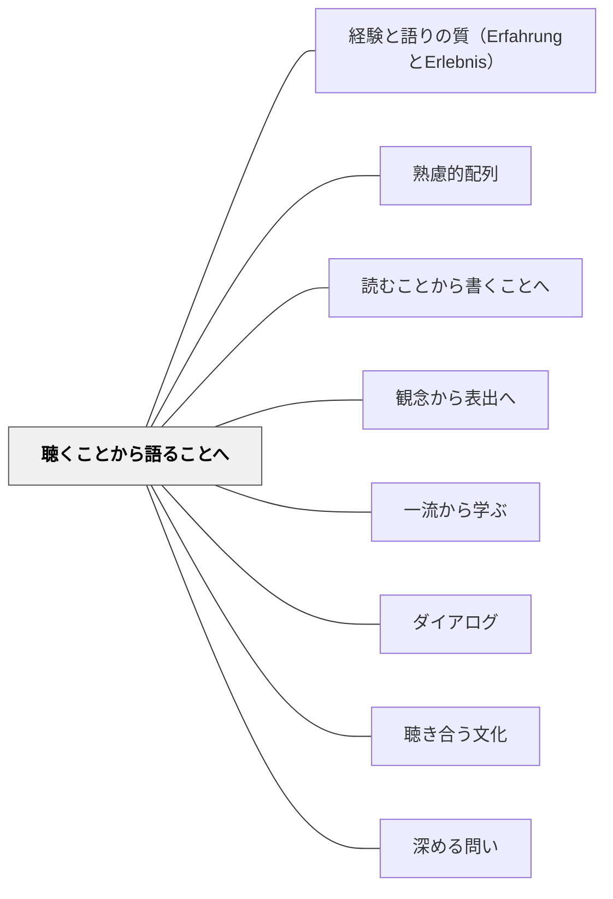

# 聴くことから語ることへ

> 豊かな話し手は、まず豊かな聴き手だった。

## [Pattern Connection]

**ペスタロッチ（1801）ゲルトルート児童教育法 統合——「音から言語へ」の心理学的順序の起源：**

- **本パタンの歴史的起源**：ペスタロッチは「私はこの技術を、自然が音から言葉へ、そして言葉から音声へと徐々に進んでいく順序に連鎖させるという原則を見出した」と明言した。クラッシェンの「インプット仮説」（1980年代）よりはるかに早く、1801年にすでに「聴くことが語ることに先行する」という原則を体系化していた。
- **読書を話すことに従属させる**：ペスタロッチは「読書の指導において、話す能力に従属させる必要性を見出した」とも述べた——読む前に話せること、聴ける耳があることが先決であるという主張は、本パタンの「聴くことから語ることへ」の配列原則と完全に一致する。
- **音の教育の具体的実践**：ペスタロッチは「バ・バ・バ、ダ・ダ・ダ…などの単純な音の暗唱」から始め、音節→単語→文へと積み上げる音の教育を設計した。「文字が目の前に置かれ、読書の練習が始まる前に、音を一般的かつ容易に繰り返す能力が完成していなければならない」——これが「聴くことから語ることへ」の最初の実装例である。
- **母語習得との連続**：ペスタロッチのスペリングブック（音の教材）は「どの家庭でも揺りかごの子どもの耳に届けられ、頻繁に繰り返される」ことを前提に設計された。母語習得における「長期間の聴く時期→発話」という本パタンの背景理解を、200年前に実践として先取りしている。
- **波及するパタン**：[[パタン/スモールステップ]] — 音→音節→単語→文の積み上げ；[[パタン/熟慮的配列]] — 心理学的順序全体の中の言語受容次元；[[文献/ゲルトルート児童教育法（ペスタロッチ）]] — 本統合の出典

---

## 背景（Context）

[[パタン/熟慮的配列]] の言語受容次元。言語習得論（特にクラッシェンの「インプット仮説」）に象徴されるように、十分な受容（聴く・読む）体験が、産出（話す・書く）能力の基盤になる。母語習得でも、赤ちゃんはまず長期間「聴く」時期を経てから発話し始める。

## 問題（Problem）

十分な聴く経験なしにアウトプット（発表・スピーチ・対話）を求めると、学習者は表面的な形式を模倣するが、内容・語彙・表現の深みが生まれない。特に言語を扱うすべての学習領域で現れる問題。

## 力のかたち（Forces）

- アウトプットによってインプットが深まる（アウトプット仮説）という逆の作用がある
- インプットだけでは受動的になりやすい
- 学習者の言語環境・経験によって、受容体験の量は大きく異なる
- 「話せない」ことへの焦りが早期産出を求めさせる

## 解決（Solution）

**まず質と量が豊かな「聴く」体験を保証し、その中で自然に語る言葉が育つのを待つ。語ることへの移行は強制するのではなく、聴く体験から「言いたいこと」が溢れ出てきた状態で行う。**

実践例：
- 読み語り・語り聞かせを豊富に取り入れてから、自分で語る活動へ
- 外国語授業：大量のリスニングとリーディングを先行させてから発話練習
- 対話の授業：上手な対話の録音・動画を繰り返し聞かせてから、自分たちで実践
- 詩の暗唱を体に入れてから、自分の詩を書く・語る

## 結果（Consequences）

- 語る言葉が豊かな語彙・リズム・表現を内側から持つようになる
- 「語りたい」という内発的な動機が生まれやすい
- 言語に対する感度（語感）が育つ

## クラスター図

## Actionable Insight

- 発表・スピーチ・対話の活動の前に、まず「良い語りの録音や動画を聴く」時間を設ける——豊かなモデルの受容体験が語りの質を内側から高める
- 「本の読み語り→学習者が自分で語る」という順序を一単元に取り入れる——聴く体験が十分にあると「言いたい」という動機が自然に溢れ出てくる
- 外国語学習で「大量のリスニング→後から発話」の順を守り、早期に発話を強制しない——十分なインプットが産出の質と意欲の両方を高める

## 出典

- 一つの教育のパタン・ランゲージ（岩井輝久）
- [[文献/ゲルトルート児童教育法（ペスタロッチ）]]

## 関連パタン
- [[パタン/経験と語りの質（ErfahrungとErlebnis）]]
- [[学級経営/学級経営で使えるパタン]]
- [[教科/国語]]
- [[特別支援/特別支援で使えるパタン]]

- [[パタン/熟慮的配列]] — 上位パタン
- [[パタン/読むことから書くことへ]] — 文字言語版の同じ方向
- [[パタン/観念から表出へ]] — 内側の形成が先
- [[パタン/一流から学ぶ]] — 優れた語りを聴くことでモデルを内面化する
- [[パタン/ダイアログ]] — 聴くことから語ることへの移行がダイアログを生む
- [[パタン/聴き合う文化]] — 語ることの土台となる聴き合う文化
- [[パタン/深める問い]] — 聴いた後の問い返しが語りを深める
