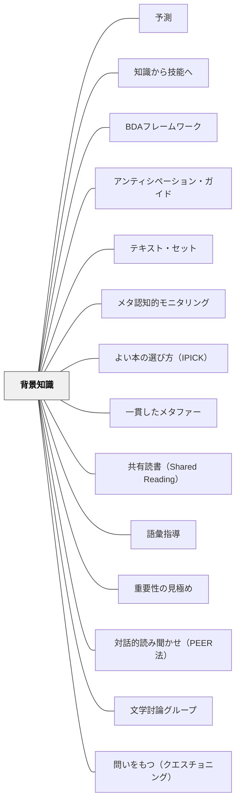

# 背景知識

> 読解は背景知識に大きく依存している。策略（ストラテジー）はすぐに学べる。しかし知識の積み重ねは何年もかかる。— Daniel Willingham（2015）

---

## Pattern Connection

**Buehl（2017）統合（2026-05-15）：**

*Classroom Strategies for Interactive Learning* は背景知識の活性化を「フロントローディング（Frontloading）」として授業設計の中心に置く。

- **補強された点**：Willingham（2015）が「背景知識は読解の最も強力な変数」という理論を提示したのに対して、Buehl はその背景知識を授業の中で**どう扱うか**——「読む前に活性化する・不足している知識を補う」という実践の次元を提供する。「背景知識が大事」から「Before フェーズで何をするか」へと接続する
- **拡張された点**：フロントローディングの概念が加わることで、本パタンの「解決」に「授業の Before フェーズで意図的に知識を整える」という操作的な手段が加わった
- **他のパタンへの波及**：[[パタン/BDAフレームワーク]] — Before フェーズの理論的根拠として機能する。[[パタン/アンティシペーション・ガイド]] — Before フロントローディングの代表的な実践ツール

**Dorn & Soffos（2005）統合（2026-05-15）：**

*Teaching for Deep Comprehension* は背景知識の構築を「テキスト・セット（Text Sets）」という授業内の短期的な設計で実現する方法を提供する。

- **補強された点**：Willingham（2015）の「知識の蓄積は何年もかかる」という指摘を補完するかたちで、Dorn & Soffos は「**この単元・この授業内で必要な背景知識をテキストで短期的に構築する**」という操作を提供する。年単位の長期投資と授業単位の短期構築、両方が必要だという理解が加わった
- **拡張された点**：テキスト・セット（同じトピック・著者・問いで束ねた3〜5冊）を読み進めると、語彙と知識が複利的に積み上がり、後半のテキストはより深く読める——これは Willingham の「繰り返し接触による語彙定着」の授業版実装として機能する
- **他のパタンへの波及**：[[パタン/テキスト・セット]] — 短期的背景知識構築の具体的設計パタン。[[パタン/深い理解（3水準の読解）]] — 背景知識が積み上がることで第3水準（比較・評価・判断）が起動する

**Allen（1999）統合（2026-05-20）**：

*Words, Words, Words* は「語彙は背景知識の核心だ」という命題を語彙指導の実践から照らす。

- **既存パタンとの関連**：Willinghamが「背景知識こそが読解の最も強力な変数」と述べるとき、その背景知識の多くは語彙として蓄積されている。「語彙があること」＝「その概念の背景知識があること」——語彙と背景知識は同一プロセスの表裏だ。Davis（1944/1968）「語彙と読解の関係は確かなものだ」はWillinghamの主張の先行研究として位置づけられる
- **補強された点**：「読書量が語彙成長の最大予測因子」（Anderson et al., 1986）——背景知識を広げる手段として語彙を意図的に設計することの重要性が加わった。1日25分の読書で年間約1,000語の自然習得が起きるという具体的な数値が示された
- **修正・拡張された点**：語彙と背景知識の関係に「語彙指導の質」という変数が加わる。「語彙が少ない子のために定義を覚えさせる」指導は機能しない——背景知識を広げるためには語彙との「意味のある文脈での反復的な出会い」が必要。単語帳では背景知識も語彙も育たない
- **他のパタンへの波及**：[[パタン/語彙指導]] — 語彙指導を背景知識拡充の中心的手段として位置づけるパタン。[[パタン/ワードウォール]] — 背景知識の語彙的側面を可視化する環境デザイン

**Willingham（2015）追補（2026-05-17）：**

OCR全文照合により、既存ページに未収録の重要な知見を補完する。

- **状況モデル（Kintsch, 2012）**：読解は「語彙の積み上げ」でなく「頭の中の場面イメージの構築（状況モデル）」。背景知識がないと状況モデルが作れない。Sulin & Dooling（1974）の実証——「Helen Keller / Carol Harris」の人物名変更だけで同一文章の理解度が変わる——が、背景知識の状況モデルへの影響を示す
- **語彙98%ルール**（Carver, 1994; Schmitt et al., 2011）：快適な読解にはテキスト語彙の**98%を知っていること**が必要。現ページの「語彙・概念が8〜9割」という表現より精密な基準——75語の段落で1〜2語知らないだけで快適さが下がる
- **ストラテジーの頭打ち**（Rosenshine et al., 1994, 1996; Suggate, 2010）：読解ストラテジーの指導は5〜10セッションで効果が頭打ちになり、さらに練習しても増大しない——「ストラテジーは何をすべきかは教えるが、どうやるかは教えられない。なぜならそれは内容知識に依存するから」。背景知識なしにストラテジーは機能しないことの直接的なエビデンス
- **デジタル知識代替不可論（3理由）**：スマートフォンで検索できる時代でも「頭の中の背景知識」が必要な理由——(1) 何が欠けているかわからなければ検索クエリを作れない (2) 状況モデルのギャップは自覚されないことが多い (3) 検索のたびに読書の流れが中断される
- **第4学年スランプとの接続**：背景知識の格差は第4学年スランプ（fourth-grade slump）として顕在化する——就学前〜低学年での知識蓄積の差が3〜4年生の読解力格差として突然現れる

---

## 背景（Context）

著者は読者が知っていることを前提に書く——全部書いたら読書は苦痛になるから。「富士山の山頂は雪に覆われている」という一文は、「富士山が日本の最高峰であること」「山頂は気温が低いこと」を前提としている。この前提を知らない読者には届かない。

Daniel Willingham（2015）*Raising Kids Who Read* は、**背景知識こそが読解力の最も強力な変数**だと主張する。読解ストラテジーは素早く学べて大して練習しなくてよいが、背景知識の蓄積には何年もかかる——だからこそ、この問題は学校教育で最も軽視されている。

E.D.ハーシュ（1987）もまた「文化的リテラシー」として同じ洞察を示している：読める力は「文字が読める力」だけでなく「その文化・分野の知識がある力」だ。

## 問題（Problem）

読解力向上のために「読解ストラテジー（推論する・つながりを作る・質問する）」を教えることが多い。しかし、ストラテジーは知識があってこそ機能する。「何も知らないテキスト」を読むとき、どんなストラテジーも助けにならない。読解力の差が「ストラテジーの差」でなく「知識の差」から来ている場合、ストラテジー指導だけでは届かない。

## 力のかたち（Forces）

- 「第3学年の転換点」：2年生まではデコーディングが読書の壁。3年生以降は背景知識が壁になる
- 理科・社会の授業時間は削られやすいが、これが将来の読解力の基盤を削ることになる
- 語彙の習得は「語彙リストの暗記」でなく「文脈の中での繰り返し出会い」で起きる
- 読み聞かせは自分で読むより難しいテキストに出会えるため、語彙と知識の蓄積に最も効率的

## 解決（Solution）

**読解力の基盤として、意図的に背景知識を広げる経験を設計する。**

---

### 第3学年の転換点を意識する

| 段階 | 読書力の壁 | 主な指導の焦点 |
|---|---|---|
| 就学前〜2年生 | デコーディング（文字を読む） | 音韻認識・フォニックス・流暢性 |
| **3年生〜** | **背景知識（内容を理解する）** | **知識・語彙・多様なジャンルの読書** |

3年生以降の「読めるが理解できない」子の多くは、デコーディングの問題でなく、知識の問題だ。

---

### 背景知識を広げる3つのルート

**① 読み聞かせによる知識のインプット**

子どもは自分で読めるレベルの本しか独立読書では読めないが、読み聞かせなら自分の読書レベルを超えた語彙・概念・世界観に出会える。

- 毎日の読み聞かせにフィクション以外も入れる（伝記・科学・歴史・地理）
- 「面白い話」だけでなく「驚く事実」のある本を選ぶ
- 読みながら「これって何？」という問いに答える

**② コンテンツ豊かな授業（理科・社会）**

理科と社会の授業は「読解力の長期投資」だ。

- 理科で学ぶ「光合成・食物連鎖・物質の状態変化」は、その後の理科文章の読解を支える知識になる
- 社会で学ぶ「歴史・地域・産業・文化」は、新聞・説明文・物語の読解基盤になる
- これらを削って「読書の時間」を増やしても、読解力は上がらない

**③ 「知識の入口」としての本の選書**

読書自体が最も効率的な知識の蓄積。しかし何を読むかが重要。

- 好きなテーマの本を読み始めると、そのテーマの知識が深まり、そのジャンルの文章が読みやすくなる
- 好きなシリーズ・好きな著者・好きなジャンルを探す探索が、知識の蓄積の始まり
- 「知らないことが読めない壁」を「知っていることから橋をかける」順序で選書を支援する

---

### 語彙は知識の入口

語彙は単語帳で覚えるものではなく、文脈の中で出会い続けることで定着する。

- 読み聞かせで出てきた難しい言葉に「ちょっと止まって」説明を加える
- 「この言葉、他のところで見たことある？」と問うことで既有知識とつながる
- 語彙の量は読書量に比例する——読む量が増えれば語彙は増える

---

### 読解ストラテジーとの関係

Willingham の整理：

| 読解の要素 | 習得にかかる時間 | 効果 |
|---|---|---|
| ストラテジー（推論・つながり等） | 短い（すぐ覚えられる） | 限定的（知識がなければ使えない） |
| **背景知識** | **長い（何年もかかる）** | **強力（知識があれば読解は自然に深まる）** |

ストラテジーを「使う道具」とすれば、背景知識は「道具を使う素材」だ。素材なしに道具は機能しない。

→ ストラテジーを教えることは否定しない（[[パタン/読みとつながる]]・[[パタン/推論する（インファリング）]] など）。しかしストラテジーだけ教えても読解力は大きく伸びない、という限界を知っておく。

## 結果（Consequences）

- 理科・社会の授業が「読解力の長期投資」として意味を持ち、削られにくくなる
- 読み聞かせの選書に「ノンフィクション・多様なジャンル」が入り始める
- 3年生以降の「読めるが分からない」子への支援が、語彙・知識のギャップとして見えてくる
- 子どもの知的好奇心と読書が直接つながるようになる

## 関連パタン
- [[パタン/予測（インストラクション）]]
- [[実践/BDA読解授業の設計]]
- [[パタン/知識から技能へ]]
- [[パタン/BDAフレームワーク]]
- [[パタン/アンティシペーション・ガイド]]
- [[パタン/テキスト・セット]]
- [[パタン/メタ認知的モニタリング]]
- [[パタン/よい本の選び方（IPICK）]]
- [[パタン/一貫したメタファー]]
- [[パタン/共有読書（Shared Reading）]]
- [[パタン/語彙指導]]
- [[パタン/重要性の見極め]]
- [[パタン/対話的読み聞かせ（PEER法）]]
- [[パタン/文学討論グループ]]
- [[パタン/問いをもつ（クエスチョニング）]]
- [[パタン/予測（インストラクション）]]

- [[パタン/読み聞かせ]] — 背景知識を広げる最も効率的な手段
- [[パタン/不思議を育てる]] — 好奇心と背景知識の補完関係
- [[パタン/読みとつながる]] — 背景知識があってこそTW（世界とのつながり）が機能する
- [[パタン/推論する（インファリング）]] — 推論は背景知識から生まれる
- [[パタン/精緻化]] — 既有知識と新知識の接続
- [[パタン/マルチモダール]] — 多様な形式での知識のインプット
- [[パタン/読書アイデンティティ]] — 知識が広がると読みたい本も広がる
- [[パタン/シンクアラウド]] — 補完: 背景知識がどのように読解で使われているかを、教師の思考過程として見える化する

## クラスター図

## Actionable Insight

- 明日の読み聞かせに1冊ノンフィクション（科学・歴史・伝記など）を加える——語りの楽しさとともに知識が入り、後の読解の基盤になる
- 理科・社会の授業の最後に「今日覚えた言葉1つ」をノートに書かせる——教科の語彙が読解語彙として蓄積される
- 3年生以降の「読めるが分からない」子に「この話が分かるためには、○○について知っておく必要があるよ」と背景を補う——ストラテジーを教えるより前に知識のギャップを埋める

## 出典
- [[文献/Teaching for Deep Comprehension（Dorn & Soffos）]]
- [[文献/Classroom Strategies for Interactive Learning（Buehl）]]

Willingham, D. T. (2015). *Raising Kids Who Read: What Parents and Teachers Can Do*. Jossey-Bass. → [[文献/Raising Kids Who Read（Willingham）]]
Hirsch, E. D. (1987). *Cultural Literacy: What Every American Needs to Know*. Houghton Mifflin.

> 「読解は背景知識に大きく依存している。策略はすぐに学べる。しかし知識の積み重ねは何年もかかる。」—Willingham
